# Prayer habit app development
_Exported on 3/19/2026 at 13:24:07 EDT from Cursor (2.6.20)_

---

**User**

Here is my upcoming project. The rough idea of this app is to help people do better prayers and build a better habit to pray, using ACTS and some gamification. I've done the high-level design, wireframes, and some pics to reference my design. You can see those files in this project. So what's the next step? How could I implement this app properly?

---

**Cursor**

I'll help you create a plan to implement your prayer app! Let me first explore your project to understand the design documents and requirements you've already prepared.

Let me read the other wireframes and try to read portions of the design document:

Let me try to convert the PDF to text or read it in a more readable format:

Based on the wireframes and images I've reviewed, I can see you have a comprehensive prayer app design with:

- **Home screen** with a gamification map showing progress
- **Prayer today/month views** with ACTS categories (Adoration, Confession, Thanksgiving, Supplication)
- **Intercession management** for praying for others
- **Add prayer** functionality
- **Search/filter** capabilities
- **Tree view** (likely for gratitude visualization)
- **Gamification elements** (badges/achievements shown in header)

Before I create a comprehensive implementation plan, I need to ask you a few critical questions to ensure the plan matches your needs:

**Prayer App Implementation Details**

> **Which iOS development approach do you want to use for this app?**
> - SwiftUI (Modern, iOS 14+, declarative UI) ✔
> - UIKit (Traditional, more control)
> - SwiftUI with UIKit components (Hybrid)

> **What data persistence approach should we use?**
> - SwiftData (Modern, iOS 17+, works with SwiftUI)
> - Core Data (Traditional, widely supported) ✔
> - Realm (Third-party, easy to use)
> - SQLite directly

> **What architecture pattern would you prefer?**
> - MVVM (Model-View-ViewModel) - Recommended for SwiftUI ✔
> - MVC (Model-View-Controller) - Traditional iOS
> - VIPER (More complex, better for large apps)
> - The Composable Architecture (TCA) - Functional approach

> **Which features should be included in the initial implementation (Phase 1)?**
> - Core ACTS prayer tracking (Adoration, Confession, Thanksgiving, Supplication) ✔
> - Gamification map/progress visualization
> - Intercession list for praying for others
> - Gratitude tree visualization
> - Search and filter prayers
> - Badges and achievements system
> - Prayer reminders/notifications

> **What minimum iOS version should we target?**
> - iOS 17+ (Latest features, smaller audience)
> - iOS 16+ (Good balance) ✔
> - iOS 15+ (Wider compatibility)
> - iOS 14+ (Maximum compatibility for SwiftUI)

Perfect! Now I have a clear understanding of your requirements. Let me create a comprehensive implementation plan for your Prayer App.

---

**User**

Review my project Prayer App Design Document.pdf and its related files, design the architecture of my app, using MVVM and write down the UML. You can refer to my previous requirements and this conversation's context.

---

**Cursor**

Now that I have the full design document content, let me create a comprehensive MVVM architecture with UML diagrams. Let me also re-examine the wireframes and reference images to make sure nothing is missed.

Now I have the complete picture from all design artifacts. Let me create a detailed MVVM architecture with comprehensive UML diagrams.

---

**User**

In the core data ER diagram, delete the table `SessionItem`, and delete the field `sessionType` in PrayerSession. Update the relationships within these tables in this diagram. Please review this plan and update the related design(view, model, view model, etc., and other diagrams) along with these changes.

---

**Cursor**

Let me first read the current plan file to make precise edits.

Now I have a clear picture of the current plan. Let me trace through all the implications of removing `SessionItem` and `sessionType`, and apply the changes across every section of the plan.

**Key cascading effects:**
- Without `SessionItem`, `PrayerItem` and `PrayerSession` become a direct many-to-many relationship. Vein state for the tree visualization can be derived from `PrayerItem.status` instead.
- Without `sessionType`, session type is inferred from the `isIntercessory` flag on each `PrayerItem` within the session.
- `VeinState` and `SessionType` enums are no longer needed.
- Service methods referencing `SessionItem` or `SessionType` must be simplified.
- Sequence diagrams, project structure, and todos all need updates.

Let me apply all these changes:

```markdown
---
name: Prayer App MVVM Architecture
overview: A comprehensive MVVM architecture design for the Prayer App, including Core Data entity model, ViewModel layer, View hierarchy, Service layer, and key user flow sequences -- all based on the design document and wireframes.
todos:
  - id: coredata-model
    content: Define Core Data entities and relationships (.xcdatamodeld)
    status: pending
  - id: model-enums
    content: Create PrayerCategory, PrayerStatus, IntercessoryGroup enums
    status: pending
  - id: persistence-controller
    content: Build PersistenceController with Core Data stack
    status: pending
  - id: prayer-service
    content: Implement PrayerService with CRUD operations
    status: pending
  - id: session-service
    content: Implement SessionService for prayer sessions
    status: pending
  - id: gamification-service
    content: Build GamificationService for road map and unlock logic
    status: pending
  - id: prayer-capture-vm
    content: Create PrayerCaptureViewModel for prayer creation flow
    status: pending
  - id: prayer-list-vm
    content: Create PrayerListViewModel for Today/Month views
    status: pending
  - id: prayer-session-vm
    content: Create PrayerSessionViewModel for active prayer sessions
    status: pending
  - id: intercessory-vm
    content: Create IntercessoryViewModel for intercession management
    status: pending
  - id: roadmap-vm
    content: Create RoadMapViewModel for daily progress tracking
    status: pending
  - id: tree-vm
    content: Create PrayerTreeViewModel for tree visualization
    status: pending
  - id: theme-system
    content: Define AppTheme with colors, typography, spacing
    status: pending
  - id: main-tab-view
    content: Build MainTabView with 5-tab navigation
    status: pending
  - id: prayer-views
    content: "Build prayer views: Add, List, Detail, Capture Form, Session"
    status: pending
  - id: intercession-views
    content: Build IntercessoryListView with Current/History tabs
    status: pending
  - id: gamification-views
    content: Build RoadMapView and PrayerTreeView visualizations
    status: pending
  - id: reusable-components
    content: Build PrayerCardView, CategoryBadge, StatusIndicator
    status: pending
  - id: preview-data
    content: Create PreviewData with sample prayers and sessions
    status: pending
---

# Prayer App -- MVVM Architecture & UML Design

## 1. Architecture Overview

The app follows a strict **MVVM (Model-View-ViewModel)** architecture with a dedicated **Service Layer** for data operations. Views observe ViewModels via SwiftUI's `@Published`/`@ObservedObject` bindings. ViewModels coordinate between Views and Services. Services encapsulate all Core Data interactions.

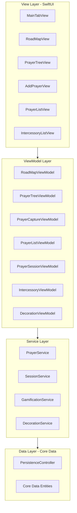

---

## 2. Core Data Entity-Relationship Diagram

Based on the design document's data model: prayer items have statuses (Prayed/Ongoing/Answered/Archived), sessions group prayer items together, daily records track footprints on the road map, and decorations are unlockable rewards.

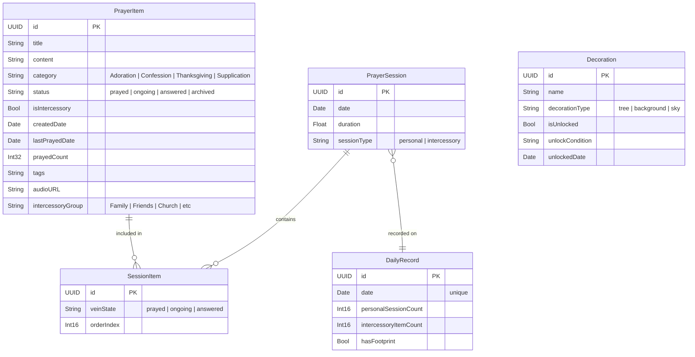

**Key design decisions:**

- `SessionItem` is a join entity between `PrayerItem` and `PrayerSession`, carrying its own `veinState` so the same prayer item can have different visual states across sessions
- `DailyRecord` aggregates daily activity for the Road Map without scanning all sessions
- `isIntercessory` on `PrayerItem` distinguishes personal vs intercessory items using a single entity (simpler than two separate entities, since they share the same state model)

---

## 3. Model Layer -- Swift Enums & Extensions

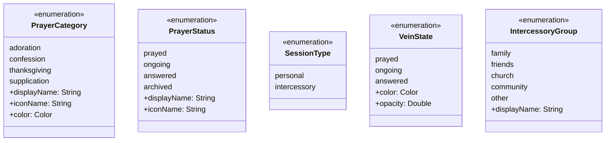

---

## 4. ViewModel Class Diagram

Each ViewModel owns its business logic and publishes state for the View to observe. ViewModels do NOT reference Views or other ViewModels directly; they communicate through Services.


---

## 5. Service Layer Class Diagram

Services encapsulate all Core Data fetch/save operations and business rules. ViewModels never touch `NSManagedObjectContext` directly.


---

## 6. View Hierarchy

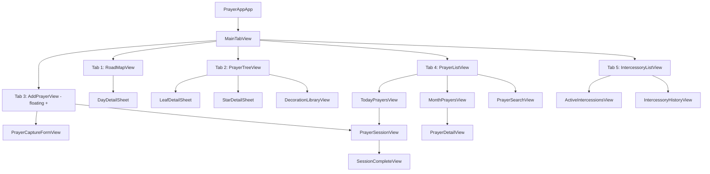

---

## 7. Key User Flow Sequence Diagrams

### Flow 1: Capture a Prayer Item ("+" button)

This is the most common entry point. The user taps "+", fills in a prayer item, and either saves it for later or starts praying immediately.

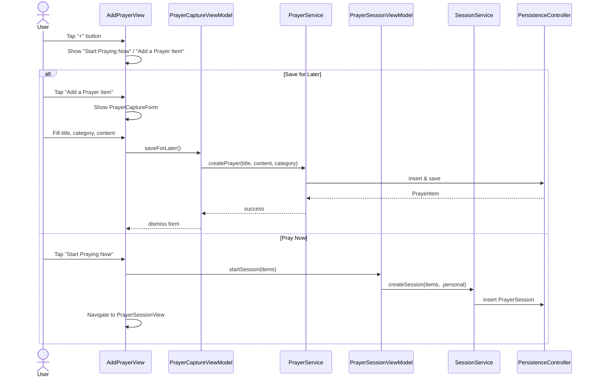

### Flow 2: Concentrated Prayer Session

The user selects prayers from the Today list and starts a focused prayer session, which generates a leaf on the Prayer Tree and a footprint on the Road Map.

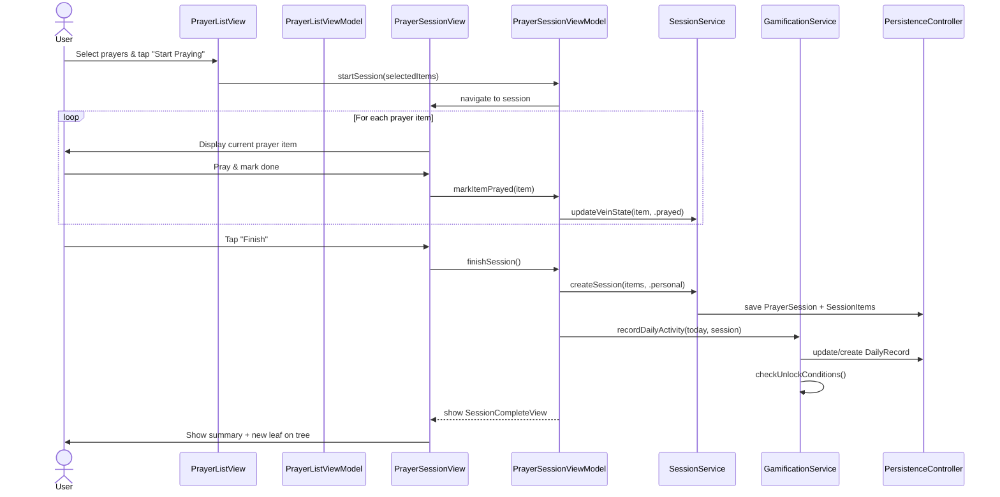

### Flow 3: Update Prayer Status

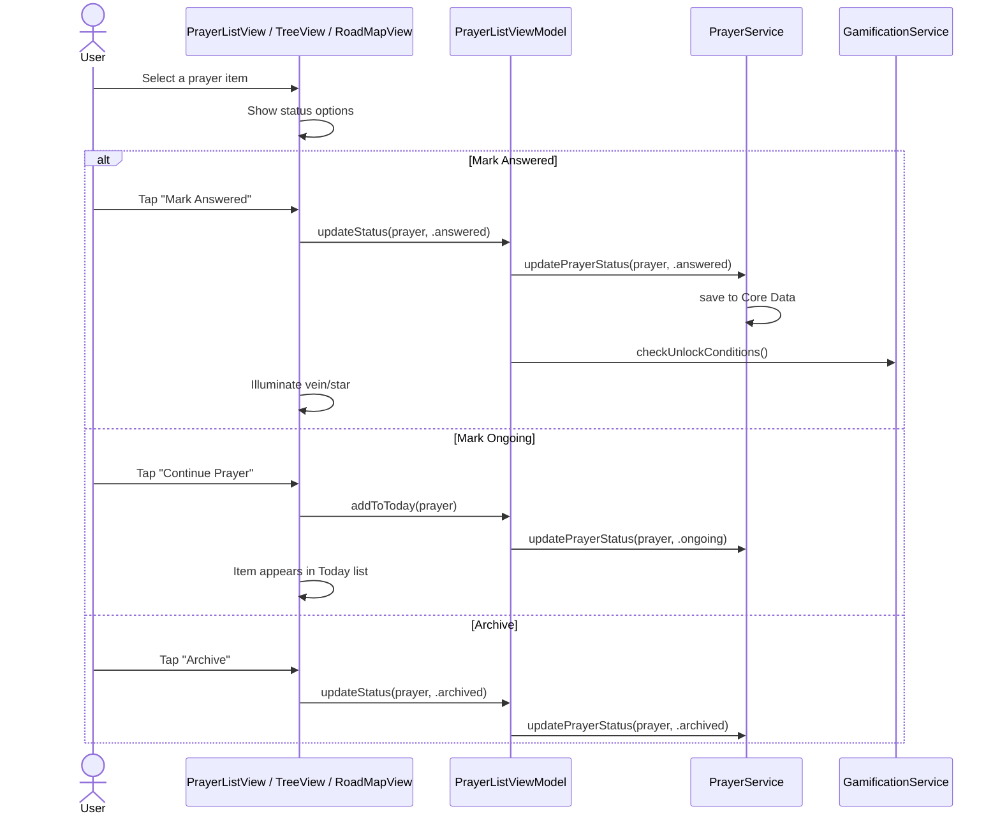

---

## 8. Complete Project Structure

```
PrayerApp/
├── PrayerApp.xcodeproj
├── PrayerApp/
│   ├── PrayerAppApp.swift              # App entry point, inject PersistenceController
│   │
│   ├── Models/
│   │   ├── PrayerApp.xcdatamodeld/     # Core Data model file
│   │   ├── PrayerItem+Extensions.swift # Computed properties, convenience inits
│   │   ├── PrayerSession+Extensions.swift
│   │   ├── SessionItem+Extensions.swift
│   │   ├── DailyRecord+Extensions.swift
│   │   ├── Decoration+Extensions.swift
│   │   ├── PrayerCategory.swift        # Enum with display helpers
│   │   ├── PrayerStatus.swift          # Enum with display helpers
│   │   ├── VeinState.swift             # Enum for tree visualization
│   │   └── SessionType.swift           # personal / intercessory
│   │
│   ├── ViewModels/
│   │   ├── PrayerCaptureViewModel.swift
│   │   ├── PrayerListViewModel.swift
│   │   ├── PrayerSessionViewModel.swift
│   │   ├── IntercessoryViewModel.swift
│   │   ├── RoadMapViewModel.swift
│   │   ├── PrayerTreeViewModel.swift
│   │   └── DecorationViewModel.swift
│   │
│   ├── Views/
│   │   ├── MainTabView.swift
│   │   ├── Prayer/
│   │   │   ├── AddPrayerView.swift         # "+" action sheet
│   │   │   ├── PrayerCaptureFormView.swift  # Create/edit prayer
│   │   │   ├── PrayerListView.swift         # Today / Month tabs
│   │   │   ├── PrayerDetailView.swift       # Single prayer detail
│   │   │   ├── PrayerSearchView.swift       # Search + filters
│   │   │   └── PrayerSessionView.swift      # Active prayer session
│   │   ├── Intercession/
│   │   │   ├── IntercessoryListView.swift
│   │   │   └── IntercessoryDetailView.swift
│   │   ├── Gamification/
│   │   │   ├── RoadMapView.swift            # Daily progress path
│   │   │   ├── DayDetailSheet.swift
│   │   │   ├── PrayerTreeView.swift         # Tree + stars visualization
│   │   │   ├── LeafDetailSheet.swift
│   │   │   └── DecorationLibraryView.swift
│   │   └── Components/
│   │       ├── PrayerCardView.swift         # Reusable prayer card
│   │       ├── CategoryBadge.swift          # ACTS category pill
│   │       ├── StatusIndicator.swift        # Answered/Ongoing badge
│   │       ├── SessionCompleteView.swift    # Post-session summary
│   │       └── EmptyStateView.swift
│   │
│   ├── Services/
│   │   ├── PersistenceController.swift      # Core Data stack
│   │   ├── PrayerService.swift              # CRUD for PrayerItem
│   │   ├── SessionService.swift             # Session management
│   │   ├── GamificationService.swift        # Road map + tree + unlocks
│   │   └── DecorationService.swift          # Decoration unlock/apply
│   │
│   ├── Theme/
│   │   ├── AppTheme.swift                   # Colors, fonts, spacing
│   │   └── AppIcons.swift                   # SF Symbol constants
│   │
│   └── Resources/
│       ├── Assets.xcassets
│       └── Preview Content/
│           └── PreviewData.swift            # Sample data for previews
│
└── PrayerAppTests/
    ├── PrayerServiceTests.swift
    ├── SessionServiceTests.swift
    └── GamificationServiceTests.swift
```

---

## 9. Implementation Phases

| Phase | Scope | Key Deliverables |

|-------|-------|-----------------|

| **1** | Core ACTS Prayer | Core Data model, PrayerService, PrayerCaptureVM, PrayerListVM, AddPrayerView, PrayerListView, PrayerCaptureFormView, Theme |

| **2** | Prayer Sessions | SessionService, PrayerSessionVM, PrayerSessionView, SessionCompleteView, Today list "Start Praying" flow |

| **3** | Intercession | IntercessoryVM, IntercessoryListView, "Add to Today" flow, Current/History tabs |

| **4** | Road Map | GamificationService, RoadMapVM, RoadMapView, DailyRecord tracking, footprint visuals |

| **5** | Prayer Tree & Stars | PrayerTreeVM, PrayerTreeView, leaf/vein rendering, intercessory star rendering |

| **6** | Decorations & Polish | DecorationService, DecorationVM, DecorationLibraryView, unlock conditions, animations |

| **7** | Search & Extras | PrayerSearchView with filters, voice recording, optional AI transcription |

**Phase 1 is the starting point** and delivers a fully usable prayer tracking app. Each subsequent phase adds a self-contained feature layer.
```

```markdown
Based on the design document's data model: prayer items have statuses (Prayed/Ongoing/Answered/Archived), sessions group prayer items together via a direct many-to-many relationship, daily records track footprints on the road map, and decorations are unlockable rewards.

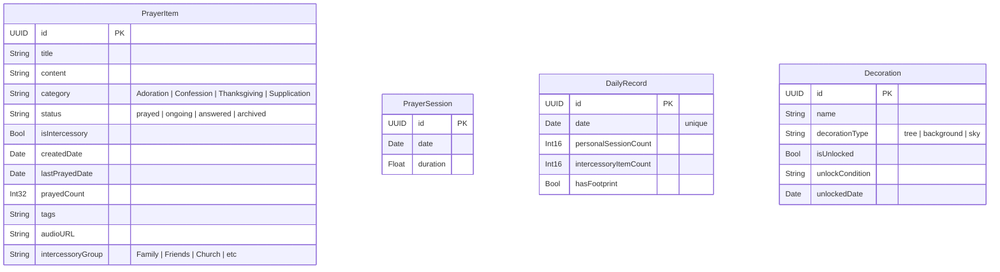

---

**User**

This `sessionType` is unnecessary, since the intercession should also be considered a prayer item, and the only difference between them is the use of `isIntercessory`, which is a special prayer item.
`PraySession` should include a lot of PrayerItems.

---

**Cursor**

Got it -- that makes the model much cleaner. Let me read the current state of the plan file and apply all the changes consistently.

Now I'll apply all the changes systematically. There are many edits to make across the entire plan -- let me work through each section.

```markdown
---
name: Prayer App MVVM Architecture
overview: A comprehensive MVVM architecture design for the Prayer App, including Core Data entity model, ViewModel layer, View hierarchy, Service layer, and key user flow sequences -- all based on the design document and wireframes.
todos:
  - id: coredata-model
    content: Define Core Data entities and relationships (.xcdatamodeld)
    status: pending
  - id: model-enums
    content: Create PrayerCategory, PrayerStatus, IntercessoryGroup enums
    status: pending
  - id: persistence-controller
    content: Build PersistenceController with Core Data stack
    status: pending
  - id: prayer-service
    content: Implement PrayerService with CRUD operations
    status: pending
  - id: session-service
    content: Implement SessionService for prayer sessions
    status: pending
  - id: gamification-service
    content: Build GamificationService for road map and unlock logic
    status: pending
  - id: prayer-capture-vm
    content: Create PrayerCaptureViewModel for prayer creation flow
    status: pending
  - id: prayer-list-vm
    content: Create PrayerListViewModel for Today/Month views
    status: pending
  - id: prayer-session-vm
    content: Create PrayerSessionViewModel for active prayer sessions
    status: pending
  - id: intercessory-vm
    content: Create IntercessoryViewModel for intercession management
    status: pending
  - id: roadmap-vm
    content: Create RoadMapViewModel for daily progress tracking
    status: pending
  - id: tree-vm
    content: Create PrayerTreeViewModel for tree visualization
    status: pending
  - id: theme-system
    content: Define AppTheme with colors, typography, spacing
    status: pending
  - id: main-tab-view
    content: Build MainTabView with 5-tab navigation
    status: pending
  - id: prayer-views
    content: "Build prayer views: Add, List, Detail, Capture Form, Session"
    status: pending
  - id: intercession-views
    content: Build IntercessoryListView with Current/History tabs
    status: pending
  - id: gamification-views
    content: Build RoadMapView and PrayerTreeView visualizations
    status: pending
  - id: reusable-components
    content: Build PrayerCardView, CategoryBadge, StatusIndicator
    status: pending
  - id: preview-data
    content: Create PreviewData with sample prayers and sessions
    status: pending
---

# Prayer App -- MVVM Architecture & UML Design

## 1. Architecture Overview

The app follows a strict **MVVM (Model-View-ViewModel)** architecture with a dedicated **Service Layer** for data operations. Views observe ViewModels via SwiftUI's `@Published`/`@ObservedObject` bindings. ViewModels coordinate between Views and Services. Services encapsulate all Core Data interactions.


---

## 2. Core Data Entity-Relationship Diagram

Based on the design document's data model: prayer items have statuses (Prayed/Ongoing/Answered/Archived), sessions group prayer items together, daily records track footprints on the road map, and decorations are unlockable rewards.

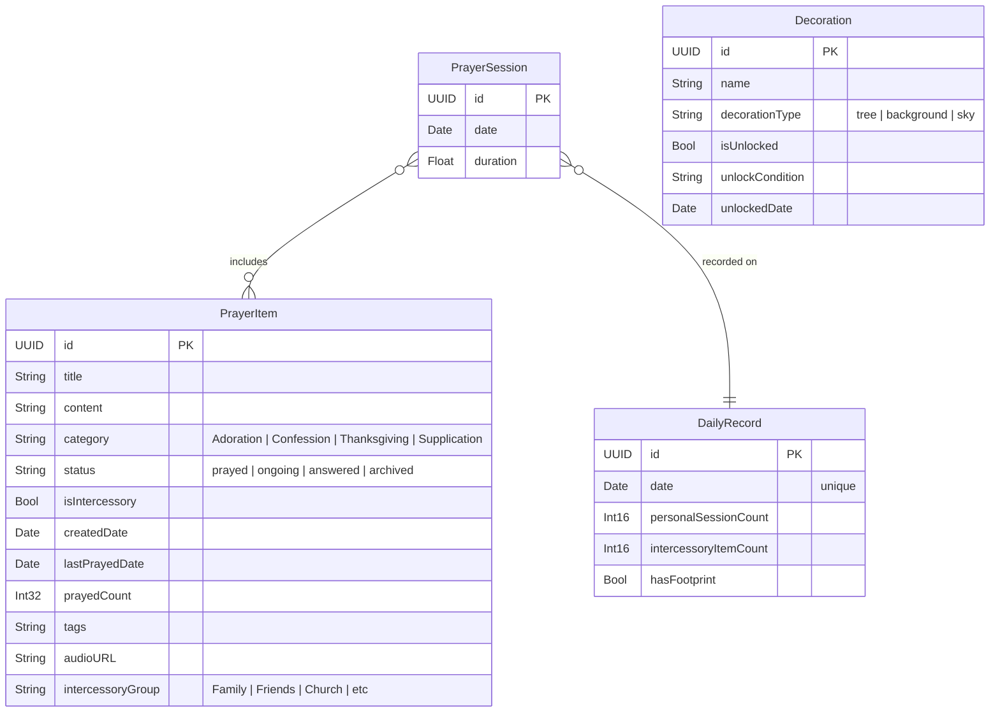

**Key design decisions:**

- `PrayerSession` and `PrayerItem` have a direct **many-to-many** relationship via a Core Data inverse relationship (no intermediate join entity). A session contains many prayer items, and a prayer item can appear in many sessions over time.
- There is no `sessionType` field on `PrayerSession`. Intercessory prayers are simply `PrayerItem`s with `isIntercessory = true`. Whether a session is "personal" or "intercessory" in nature can be inferred from the items it contains, but this distinction is not modeled explicitly -- it is the same prayer activity.
- Vein visualization on the Prayer Tree derives directly from each `PrayerItem.status` (prayed/ongoing/answered), rather than a separate per-session vein state. This keeps the model simple and avoids state duplication.
- `DailyRecord` aggregates daily activity for the Road Map without scanning all sessions.
- `isIntercessory` on `PrayerItem` distinguishes personal vs intercessory items using a single entity (simpler than two separate entities, since they share the same state model).

---

## 3. Model Layer -- Swift Enums & Extensions


---

## 4. ViewModel Class Diagram

Each ViewModel owns its business logic and publishes state for the View to observe. ViewModels do NOT reference Views or other ViewModels directly; they communicate through Services.

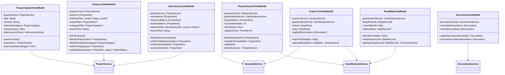

---

## 5. Service Layer Class Diagram

Services encapsulate all Core Data fetch/save operations and business rules. ViewModels never touch `NSManagedObjectContext` directly.

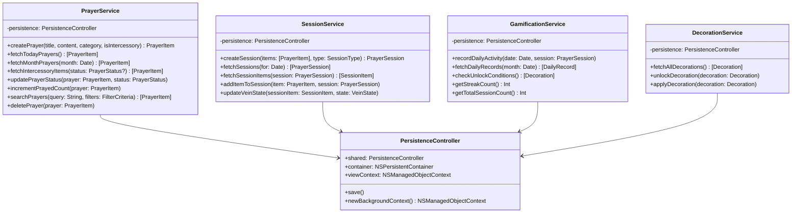

---

## 6. View Hierarchy


---

## 7. Key User Flow Sequence Diagrams

### Flow 1: Capture a Prayer Item ("+" button)

This is the most common entry point. The user taps "+", fills in a prayer item, and either saves it for later or starts praying immediately.


### Flow 2: Concentrated Prayer Session

The user selects prayers from the Today list and starts a focused prayer session, which generates a leaf on the Prayer Tree and a footprint on the Road Map.


### Flow 3: Update Prayer Status


---

## 8. Complete Project Structure

```
PrayerApp/
├── PrayerApp.xcodeproj
├── PrayerApp/
│   ├── PrayerAppApp.swift              # App entry point, inject PersistenceController
│   │
│   ├── Models/
│   │   ├── PrayerApp.xcdatamodeld/     # Core Data model file
│   │   ├── PrayerItem+Extensions.swift # Computed properties, convenience inits
│   │   ├── PrayerSession+Extensions.swift
│   │   ├── SessionItem+Extensions.swift
│   │   ├── DailyRecord+Extensions.swift
│   │   ├── Decoration+Extensions.swift
│   │   ├── PrayerCategory.swift        # Enum with display helpers
│   │   ├── PrayerStatus.swift          # Enum with display helpers
│   │   ├── VeinState.swift             # Enum for tree visualization
│   │   └── SessionType.swift           # personal / intercessory
│   │
│   ├── ViewModels/
│   │   ├── PrayerCaptureViewModel.swift
│   │   ├── PrayerListViewModel.swift
│   │   ├── PrayerSessionViewModel.swift
│   │   ├── IntercessoryViewModel.swift
│   │   ├── RoadMapViewModel.swift
│   │   ├── PrayerTreeViewModel.swift
│   │   └── DecorationViewModel.swift
│   │
│   ├── Views/
│   │   ├── MainTabView.swift
│   │   ├── Prayer/
│   │   │   ├── AddPrayerView.swift         # "+" action sheet
│   │   │   ├── PrayerCaptureFormView.swift  # Create/edit prayer
│   │   │   ├── PrayerListView.swift         # Today / Month tabs
│   │   │   ├── PrayerDetailView.swift       # Single prayer detail
│   │   │   ├── PrayerSearchView.swift       # Search + filters
│   │   │   └── PrayerSessionView.swift      # Active prayer session
│   │   ├── Intercession/
│   │   │   ├── IntercessoryListView.swift
│   │   │   └── IntercessoryDetailView.swift
│   │   ├── Gamification/
│   │   │   ├── RoadMapView.swift            # Daily progress path
│   │   │   ├── DayDetailSheet.swift
│   │   │   ├── PrayerTreeView.swift         # Tree + stars visualization
│   │   │   ├── LeafDetailSheet.swift
│   │   │   └── DecorationLibraryView.swift
│   │   └── Components/
│   │       ├── PrayerCardView.swift         # Reusable prayer card
│   │       ├── CategoryBadge.swift          # ACTS category pill
│   │       ├── StatusIndicator.swift        # Answered/Ongoing badge
│   │       ├── SessionCompleteView.swift    # Post-session summary
│   │       └── EmptyStateView.swift
│   │
│   ├── Services/
│   │   ├── PersistenceController.swift      # Core Data stack
│   │   ├── PrayerService.swift              # CRUD for PrayerItem
│   │   ├── SessionService.swift             # Session management
│   │   ├── GamificationService.swift        # Road map + tree + unlocks
│   │   └── DecorationService.swift          # Decoration unlock/apply
│   │
│   ├── Theme/
│   │   ├── AppTheme.swift                   # Colors, fonts, spacing
│   │   └── AppIcons.swift                   # SF Symbol constants
│   │
│   └── Resources/
│       ├── Assets.xcassets
│       └── Preview Content/
│           └── PreviewData.swift            # Sample data for previews
│
└── PrayerAppTests/
    ├── PrayerServiceTests.swift
    ├── SessionServiceTests.swift
    └── GamificationServiceTests.swift
```

---

## 9. Implementation Phases

| Phase | Scope | Key Deliverables |

|-------|-------|-----------------|

| **1** | Core ACTS Prayer | Core Data model, PrayerService, PrayerCaptureVM, PrayerListVM, AddPrayerView, PrayerListView, PrayerCaptureFormView, Theme |

| **2** | Prayer Sessions | SessionService, PrayerSessionVM, PrayerSessionView, SessionCompleteView, Today list "Start Praying" flow |

| **3** | Intercession | IntercessoryVM, IntercessoryListView, "Add to Today" flow, Current/History tabs |

| **4** | Road Map | GamificationService, RoadMapVM, RoadMapView, DailyRecord tracking, footprint visuals |

| **5** | Prayer Tree & Stars | PrayerTreeVM, PrayerTreeView, leaf/vein rendering, intercessory star rendering |

| **6** | Decorations & Polish | DecorationService, DecorationVM, DecorationLibraryView, unlock conditions, animations |

| **7** | Search & Extras | PrayerSearchView with filters, voice recording, optional AI transcription |

**Phase 1 is the starting point** and delivers a fully usable prayer tracking app. Each subsequent phase adds a self-contained feature layer.
```

```markdown
---
name: Prayer App MVVM Architecture
overview: A comprehensive MVVM architecture design for the Prayer App, including Core Data entity model, ViewModel layer, View hierarchy, Service layer, and key user flow sequences -- all based on the design document and wireframes.
todos:
  - id: coredata-model
    content: Define Core Data entities and relationships (.xcdatamodeld)
    status: pending
  - id: model-enums
    content: Create PrayerCategory, PrayerStatus, IntercessoryGroup enums
    status: pending
  - id: persistence-controller
    content: Build PersistenceController with Core Data stack
    status: pending
  - id: prayer-service
    content: Implement PrayerService with CRUD operations
    status: pending
  - id: session-service
    content: Implement SessionService for prayer sessions
    status: pending
  - id: gamification-service
    content: Build GamificationService for road map and unlock logic
    status: pending
  - id: prayer-capture-vm
    content: Create PrayerCaptureViewModel for prayer creation flow
    status: pending
  - id: prayer-list-vm
    content: Create PrayerListViewModel for Today/Month views
    status: pending
  - id: prayer-session-vm
    content: Create PrayerSessionViewModel for active prayer sessions
    status: pending
  - id: intercessory-vm
    content: Create IntercessoryViewModel for intercession management
    status: pending
  - id: roadmap-vm
    content: Create RoadMapViewModel for daily progress tracking
    status: pending
  - id: tree-vm
    content: Create PrayerTreeViewModel for tree visualization
    status: pending
  - id: theme-system
    content: Define AppTheme with colors, typography, spacing
    status: pending
  - id: main-tab-view
    content: Build MainTabView with 5-tab navigation
    status: pending
  - id: prayer-views
    content: "Build prayer views: Add, List, Detail, Capture Form, Session"
    status: pending
  - id: intercession-views
    content: Build IntercessoryListView with Current/History tabs
    status: pending
  - id: gamification-views
    content: Build RoadMapView and PrayerTreeView visualizations
    status: pending
  - id: reusable-components
    content: Build PrayerCardView, CategoryBadge, StatusIndicator
    status: pending
  - id: preview-data
    content: Create PreviewData with sample prayers and sessions
    status: pending
---

# Prayer App -- MVVM Architecture & UML Design

## 1. Architecture Overview

The app follows a strict **MVVM (Model-View-ViewModel)** architecture with a dedicated **Service Layer** for data operations. Views observe ViewModels via SwiftUI's `@Published`/`@ObservedObject` bindings. ViewModels coordinate between Views and Services. Services encapsulate all Core Data interactions.


---

## 2. Core Data Entity-Relationship Diagram

Based on the design document's data model: prayer items have statuses (Prayed/Ongoing/Answered/Archived), sessions group prayer items together, daily records track footprints on the road map, and decorations are unlockable rewards.

```mermaid
erDiagram
  PrayerItem {
    UUID id PK
    String title
    String content
    String category "Adoration | Confession | Thanksgiving | Supplication"
    String status "prayed | ongoing | answered | archived"
    Bool isIntercessory
    Date createdDate
    Date lastPrayedDate
    Int32 prayedCount
    String tags
    String audioURL
    String intercessoryGroup "Family | Friends | Church | etc"
  }

  PrayerSession {
    UUID id PK
    Date date
    Float duration
  }

  DailyRecord {
    UUID id PK
    Date date "unique"
    Int16 personalSessionCount
    Int16 intercessoryItemCount
    Bool hasFootprint
  }

  Decoration {
    UUID id PK
    String name
    String decorationType "tree | background | sky"
    Bool isUnlocked
    String unlockCondition
    Date unlockedDate
  }

  PrayerSession }o--o{ PrayerItem : "includes"
  PrayerSession }o--|| DailyRecord : "recorded on"
```

**Key design decisions:**

- `PrayerSession` and `PrayerItem` have a direct **many-to-many** relationship via a Core Data inverse relationship (no intermediate join entity). A session contains many prayer items, and a prayer item can appear in many sessions over time.
- There is no `sessionType` field on `PrayerSession`. Intercessory prayers are simply `PrayerItem`s with `isIntercessory = true`. Whether a session is "personal" or "intercessory" in nature can be inferred from the items it contains, but this distinction is not modeled explicitly -- it is the same prayer activity.
- Vein visualization on the Prayer Tree derives directly from each `PrayerItem.status` (prayed/ongoing/answered), rather than a separate per-session vein state. This keeps the model simple and avoids state duplication.
- `DailyRecord` aggregates daily activity for the Road Map without scanning all sessions.
- `isIntercessory` on `PrayerItem` distinguishes personal vs intercessory items using a single entity (simpler than two separate entities, since they share the same state model).

---

## 3. Model Layer -- Swift Enums & Extensions

```mermaid
classDiagram
  class PrayerCategory {
    <<enumeration>>
    adoration
    confession
    thanksgiving
    supplication
    +displayName: String
    +iconName: String
    +color: Color
  }

  class PrayerStatus {
    <<enumeration>>
    prayed
    ongoing
    answered
    archived
    +displayName: String
    +iconName: String
  }

  class IntercessoryGroup {
    <<enumeration>>
    family
    friends
    church
    community
    other
    +displayName: String
  }
```

---

## 4. ViewModel Class Diagram

Each ViewModel owns its business logic and publishes state for the View to observe. ViewModels do NOT reference Views or other ViewModels directly; they communicate through Services.

```mermaid
classDiagram
  class PrayerCaptureViewModel {
    -prayerService: PrayerService
    +title: String
    +content: String
    +selectedCategory: PrayerCategory
    +isIntercessory: Bool
    +intercessoryGroup: IntercessoryGroup
    +saveForLater()
    +prayNow() PrayerSession
    +saveVoiceRecording(url: URL)
  }

  class PrayerListViewModel {
    -prayerService: PrayerService
    +prayers: [PrayerItem]
    +selectedTab: ListTab "today | month"
    +statusFilter: PrayerStatus?
    +categoryFilter: PrayerCategory?
    +searchText: String
    +fetchPrayers()
    +filterByStatus(status: PrayerStatus)
    +filterByCategory(category: PrayerCategory)
    +addToToday(prayer: PrayerItem)
    +updateStatus(prayer: PrayerItem, status: PrayerStatus)
  }

  class PrayerSessionViewModel {
    -sessionService: SessionService
    -gamificationService: GamificationService
    +sessionItems: [PrayerItem]
    +currentItemIndex: Int
    +isInSession: Bool
    +elapsedTime: TimeInterval
    +startSession(items: [PrayerItem])
    +markItemPrayed(item: PrayerItem)
    +skipItem()
    +finishSession() PrayerSession
  }

  class IntercessoryViewModel {
    -prayerService: PrayerService
    +activeItems: [PrayerItem]
    +answeredItems: [PrayerItem]
    +archivedItems: [PrayerItem]
    +selectedTab: IntercessoryTab "current | history"
    +searchText: String
    +fetchIntercessoryItems()
    +addToTodaySession(item: PrayerItem)
    +markAnswered(item: PrayerItem)
    +archiveItem(item: PrayerItem)
  }

  class RoadMapViewModel {
    -gamificationService: GamificationService
    +dailyRecords: [DailyRecord]
    +currentMonth: Date
    +selectedDay: DailyRecord?
    +fetchRecords(for: Date)
    +selectDay(record: DailyRecord)
    +getDayDetail(record: DailyRecord) [PrayerSession]
  }

  class PrayerTreeViewModel {
    -sessionService: SessionService
    -gamificationService: GamificationService
    +leaves: [LeafData]
    +stars: [StarData]
    +appliedDecorations: [Decoration]
    +fetchTreeData(for: Date)
    +getLeafDetail(leaf: LeafData) [SessionItem]
  }

  class DecorationViewModel {
    -decorationService: DecorationService
    +unlockedDecorations: [Decoration]
    +lockedDecorations: [Decoration]
    +applyDecoration(decoration: Decoration)
    +removeDecoration(decoration: Decoration)
  }

  PrayerCaptureViewModel --> PrayerService
  PrayerListViewModel --> PrayerService
  PrayerSessionViewModel --> SessionService
  PrayerSessionViewModel --> GamificationService
  IntercessoryViewModel --> PrayerService
  RoadMapViewModel --> GamificationService
  PrayerTreeViewModel --> SessionService
  PrayerTreeViewModel --> GamificationService
  DecorationViewModel --> DecorationService
```

---

## 5. Service Layer Class Diagram

Services encapsulate all Core Data fetch/save operations and business rules. ViewModels never touch `NSManagedObjectContext` directly.

```mermaid
classDiagram
  class PersistenceController {
    +shared: PersistenceController
    +container: NSPersistentContainer
    +viewContext: NSManagedObjectContext
    +save()
    +newBackgroundContext() NSManagedObjectContext
  }

  class PrayerService {
    -persistence: PersistenceController
    +createPrayer(title, content, category, isIntercessory) PrayerItem
    +fetchTodayPrayers() [PrayerItem]
    +fetchMonthPrayers(month: Date) [PrayerItem]
    +fetchIntercessoryItems(status: PrayerStatus?) [PrayerItem]
    +updatePrayerStatus(prayer: PrayerItem, status: PrayerStatus)
    +incrementPrayedCount(prayer: PrayerItem)
    +searchPrayers(query: String, filters: FilterCriteria) [PrayerItem]
    +deletePrayer(prayer: PrayerItem)
  }

  class SessionService {
    -persistence: PersistenceController
    +createSession(items: [PrayerItem], type: SessionType) PrayerSession
    +fetchSessions(for: Date) [PrayerSession]
    +fetchSessionItems(session: PrayerSession) [SessionItem]
    +addItemToSession(item: PrayerItem, session: PrayerSession)
    +updateVeinState(sessionItem: SessionItem, state: VeinState)
  }

  class GamificationService {
    -persistence: PersistenceController
    +recordDailyActivity(date: Date, session: PrayerSession)
    +fetchDailyRecords(month: Date) [DailyRecord]
    +checkUnlockConditions() [Decoration]
    +getStreakCount() Int
    +getTotalSessionCount() Int
  }

  class DecorationService {
    -persistence: PersistenceController
    +fetchAllDecorations() [Decoration]
    +unlockDecoration(decoration: Decoration)
    +applyDecoration(decoration: Decoration)
  }

  PrayerService --> PersistenceController
  SessionService --> PersistenceController
  GamificationService --> PersistenceController
  DecorationService --> PersistenceController
```

---

## 6. View Hierarchy

```mermaid
graph TD
  App["PrayerAppApp"] --> MainTabView

  MainTabView --> MapTab["Tab 1: RoadMapView"]
  MainTabView --> TreeTab["Tab 2: PrayerTreeView"]
  MainTabView --> AddTab["Tab 3: AddPrayerView - floating +"]
  MainTabView --> PrayersTab["Tab 4: PrayerListView"]
  MainTabView --> InterTab["Tab 5: IntercessoryListView"]

  MapTab --> DayDetailSheet["DayDetailSheet"]

  TreeTab --> LeafDetailSheet["LeafDetailSheet"]
  TreeTab --> StarDetailSheet["StarDetailSheet"]
  TreeTab --> DecorationLibraryView

  AddTab --> PrayerCaptureForm["PrayerCaptureFormView"]
  AddTab --> PrayerSessionView["PrayerSessionView"]

  PrayersTab --> TodayView["TodayPrayersView"]
  PrayersTab --> MonthView["MonthPrayersView"]
  PrayersTab --> SearchView["PrayerSearchView"]
  TodayView --> PrayerSessionView
  MonthView --> PrayerDetailView

  InterTab --> ActiveInterView["ActiveIntercessionsView"]
  InterTab --> HistoryInterView["IntercessoryHistoryView"]

  PrayerSessionView --> SessionCompleteView["SessionCompleteView"]
```

---

## 7. Key User Flow Sequence Diagrams

### Flow 1: Capture a Prayer Item ("+" button)

This is the most common entry point. The user taps "+", fills in a prayer item, and either saves it for later or starts praying immediately.

```mermaid
sequenceDiagram
  actor User
  participant AddView as AddPrayerView
  participant CaptureVM as PrayerCaptureViewModel
  participant PrayerSvc as PrayerService
  participant SessionVM as PrayerSessionViewModel
  participant SessionSvc as SessionService
  participant CoreData as PersistenceController

  User->>AddView: Tap "+" button
  AddView->>AddView: Show "Start Praying Now" / "Add a Prayer Item"

  alt Save for Later
    User->>AddView: Tap "Add a Prayer Item"
    AddView->>AddView: Show PrayerCaptureForm
    User->>AddView: Fill title, category, content
    AddView->>CaptureVM: saveForLater()
    CaptureVM->>PrayerSvc: createPrayer(title, content, category)
    PrayerSvc->>CoreData: insert & save
    CoreData-->>PrayerSvc: PrayerItem
    PrayerSvc-->>CaptureVM: success
    CaptureVM-->>AddView: dismiss form
  else Pray Now
    User->>AddView: Tap "Start Praying Now"
    AddView->>SessionVM: startSession(items)
    SessionVM->>SessionSvc: createSession(items, .personal)
    SessionSvc->>CoreData: insert PrayerSession
    AddView->>AddView: Navigate to PrayerSessionView
  end
```

### Flow 2: Concentrated Prayer Session

The user selects prayers from the Today list and starts a focused prayer session, which generates a leaf on the Prayer Tree and a footprint on the Road Map.

```mermaid
sequenceDiagram
  actor User
  participant ListView as PrayerListView
  participant ListVM as PrayerListViewModel
  participant SessionView as PrayerSessionView
  participant SessionVM as PrayerSessionViewModel
  participant SessionSvc as SessionService
  participant GamifSvc as GamificationService
  participant CoreData as PersistenceController

  User->>ListView: Select prayers & tap "Start Praying"
  ListView->>SessionVM: startSession(selectedItems)
  SessionVM->>SessionView: navigate to session
  
  loop For each prayer item
    SessionView->>User: Display current prayer item
    User->>SessionView: Pray & mark done
    SessionView->>SessionVM: markItemPrayed(item)
    SessionVM->>SessionSvc: updateVeinState(item, .prayed)
  end

  User->>SessionView: Tap "Finish"
  SessionView->>SessionVM: finishSession()
  SessionVM->>SessionSvc: createSession(items, .personal)
  SessionSvc->>CoreData: save PrayerSession + SessionItems
  SessionVM->>GamifSvc: recordDailyActivity(today, session)
  GamifSvc->>CoreData: update/create DailyRecord
  GamifSvc->>GamifSvc: checkUnlockConditions()
  SessionVM-->>SessionView: show SessionCompleteView
  SessionView->>User: Show summary + new leaf on tree
```

### Flow 3: Update Prayer Status

```mermaid
sequenceDiagram
  actor User
  participant View as PrayerListView / TreeView / RoadMapView
  participant VM as PrayerListViewModel
  participant PrayerSvc as PrayerService
  participant GamifSvc as GamificationService

  User->>View: Select a prayer item
  View->>View: Show status options

  alt Mark Answered
    User->>View: Tap "Mark Answered"
    View->>VM: updateStatus(prayer, .answered)
    VM->>PrayerSvc: updatePrayerStatus(prayer, .answered)
    PrayerSvc->>PrayerSvc: save to Core Data
    VM->>GamifSvc: checkUnlockConditions()
    View->>View: Illuminate vein/star
  else Mark Ongoing
    User->>View: Tap "Continue Prayer"
    View->>VM: addToToday(prayer)
    VM->>PrayerSvc: updatePrayerStatus(prayer, .ongoing)
    View->>View: Item appears in Today list
  else Archive
    User->>View: Tap "Archive"
    View->>VM: updateStatus(prayer, .archived)
    VM->>PrayerSvc: updatePrayerStatus(prayer, .archived)
  end
```

---

## 8. Complete Project Structure

```
PrayerApp/
├── PrayerApp.xcodeproj
├── PrayerApp/
│   ├── PrayerAppApp.swift              # App entry point, inject PersistenceController
│   │
│   ├── Models/
│   │   ├── PrayerApp.xcdatamodeld/     # Core Data model file
│   │   ├── PrayerItem+Extensions.swift # Computed properties, convenience inits
│   │   ├── PrayerSession+Extensions.swift
│   │   ├── SessionItem+Extensions.swift
│   │   ├── DailyRecord+Extensions.swift
│   │   ├── Decoration+Extensions.swift
│   │   ├── PrayerCategory.swift        # Enum with display helpers
│   │   ├── PrayerStatus.swift          # Enum with display helpers
│   │   ├── VeinState.swift             # Enum for tree visualization
│   │   └── SessionType.swift           # personal / intercessory
│   │
│   ├── ViewModels/
│   │   ├── PrayerCaptureViewModel.swift
│   │   ├── PrayerListViewModel.swift
│   │   ├── PrayerSessionViewModel.swift
│   │   ├── IntercessoryViewModel.swift
│   │   ├── RoadMapViewModel.swift
│   │   ├── PrayerTreeViewModel.swift
│   │   └── DecorationViewModel.swift
│   │
│   ├── Views/
│   │   ├── MainTabView.swift
│   │   ├── Prayer/
│   │   │   ├── AddPrayerView.swift         # "+" action sheet
│   │   │   ├── PrayerCaptureFormView.swift  # Create/edit prayer
│   │   │   ├── PrayerListView.swift         # Today / Month tabs
│   │   │   ├── PrayerDetailView.swift       # Single prayer detail
│   │   │   ├── PrayerSearchView.swift       # Search + filters
│   │   │   └── PrayerSessionView.swift      # Active prayer session
│   │   ├── Intercession/
│   │   │   ├── IntercessoryListView.swift
│   │   │   └── IntercessoryDetailView.swift
│   │   ├── Gamification/
│   │   │   ├── RoadMapView.swift            # Daily progress path
│   │   │   ├── DayDetailSheet.swift
│   │   │   ├── PrayerTreeView.swift         # Tree + stars visualization
│   │   │   ├── LeafDetailSheet.swift
│   │   │   └── DecorationLibraryView.swift
│   │   └── Components/
│   │       ├── PrayerCardView.swift         # Reusable prayer card
│   │       ├── CategoryBadge.swift          # ACTS category pill
│   │       ├── StatusIndicator.swift        # Answered/Ongoing badge
│   │       ├── SessionCompleteView.swift    # Post-session summary
│   │       └── EmptyStateView.swift
│   │
│   ├── Services/
│   │   ├── PersistenceController.swift      # Core Data stack
│   │   ├── PrayerService.swift              # CRUD for PrayerItem
│   │   ├── SessionService.swift             # Session management
│   │   ├── GamificationService.swift        # Road map + tree + unlocks
│   │   └── DecorationService.swift          # Decoration unlock/apply
│   │
│   ├── Theme/
│   │   ├── AppTheme.swift                   # Colors, fonts, spacing
│   │   └── AppIcons.swift                   # SF Symbol constants
│   │
│   └── Resources/
│       ├── Assets.xcassets
│       └── Preview Content/
│           └── PreviewData.swift            # Sample data for previews
│
└── PrayerAppTests/
    ├── PrayerServiceTests.swift
    ├── SessionServiceTests.swift
    └── GamificationServiceTests.swift
```

---

## 9. Implementation Phases

| Phase | Scope | Key Deliverables |

|-------|-------|-----------------|

| **1** | Core ACTS Prayer | Core Data model, PrayerService, PrayerCaptureVM, PrayerListVM, AddPrayerView, PrayerListView, PrayerCaptureFormView, Theme |

| **2** | Prayer Sessions | SessionService, PrayerSessionVM, PrayerSessionView, SessionCompleteView, Today list "Start Praying" flow |

| **3** | Intercession | IntercessoryVM, IntercessoryListView, "Add to Today" flow, Current/History tabs |

| **4** | Road Map | GamificationService, RoadMapVM, RoadMapView, DailyRecord tracking, footprint visuals |

| **5** | Prayer Tree & Stars | PrayerTreeVM, PrayerTreeView, leaf/vein rendering, intercessory star rendering |

| **6** | Decorations & Polish | DecorationService, DecorationVM, DecorationLibraryView, unlock conditions, animations |

| **7** | Search & Extras | PrayerSearchView with filters, voice recording, optional AI transcription |

**Phase 1 is the starting point** and delivers a fully usable prayer tracking app. Each subsequent phase adds a self-contained feature layer.
```

```markdown
---
name: Prayer App MVVM Architecture
overview: A comprehensive MVVM architecture design for the Prayer App, including Core Data entity model, ViewModel layer, View hierarchy, Service layer, and key user flow sequences -- all based on the design document and wireframes.
todos:
  - id: coredata-model
    content: Define Core Data entities and relationships (.xcdatamodeld)
    status: pending
  - id: model-enums
    content: Create PrayerCategory, PrayerStatus, IntercessoryGroup enums
    status: pending
  - id: persistence-controller
    content: Build PersistenceController with Core Data stack
    status: pending
  - id: prayer-service
    content: Implement PrayerService with CRUD operations
    status: pending
  - id: session-service
    content: Implement SessionService for prayer sessions
    status: pending
  - id: gamification-service
    content: Build GamificationService for road map and unlock logic
    status: pending
  - id: prayer-capture-vm
    content: Create PrayerCaptureViewModel for prayer creation flow
    status: pending
  - id: prayer-list-vm
    content: Create PrayerListViewModel for Today/Month views
    status: pending
  - id: prayer-session-vm
    content: Create PrayerSessionViewModel for active prayer sessions
    status: pending
  - id: intercessory-vm
    content: Create IntercessoryViewModel for intercession management
    status: pending
  - id: roadmap-vm
    content: Create RoadMapViewModel for daily progress tracking
    status: pending
  - id: tree-vm
    content: Create PrayerTreeViewModel for tree visualization
    status: pending
  - id: theme-system
    content: Define AppTheme with colors, typography, spacing
    status: pending
  - id: main-tab-view
    content: Build MainTabView with 5-tab navigation
    status: pending
  - id: prayer-views
    content: "Build prayer views: Add, List, Detail, Capture Form, Session"
    status: pending
  - id: intercession-views
    content: Build IntercessoryListView with Current/History tabs
    status: pending
  - id: gamification-views
    content: Build RoadMapView and PrayerTreeView visualizations
    status: pending
  - id: reusable-components
    content: Build PrayerCardView, CategoryBadge, StatusIndicator
    status: pending
  - id: preview-data
    content: Create PreviewData with sample prayers and sessions
    status: pending
---

# Prayer App -- MVVM Architecture & UML Design

## 1. Architecture Overview

The app follows a strict **MVVM (Model-View-ViewModel)** architecture with a dedicated **Service Layer** for data operations. Views observe ViewModels via SwiftUI's `@Published`/`@ObservedObject` bindings. ViewModels coordinate between Views and Services. Services encapsulate all Core Data interactions.

```mermaid
graph TB
  subgraph viewLayer [View Layer - SwiftUI]
    MainTabView
    RoadMapView
    PrayerTreeView
    AddPrayerView
    PrayerListView
    IntercessoryListView
  end

  subgraph vmLayer [ViewModel Layer]
    RoadMapVM["RoadMapViewModel"]
    PrayerTreeVM["PrayerTreeViewModel"]
    PrayerCaptureVM["PrayerCaptureViewModel"]
    PrayerListVM["PrayerListViewModel"]
    PrayerSessionVM["PrayerSessionViewModel"]
    IntercessoryVM["IntercessoryViewModel"]
    DecorationVM["DecorationViewModel"]
  end

  subgraph serviceLayer [Service Layer]
    PrayerService
    SessionService
    GamificationService
    DecorationService
  end

  subgraph dataLayer [Data Layer - Core Data]
    PersistenceController
    CoreDataEntities["Core Data Entities"]
  end

  viewLayer --> vmLayer
  vmLayer --> serviceLayer
  serviceLayer --> dataLayer
```

---

## 2. Core Data Entity-Relationship Diagram

Based on the design document's data model: prayer items have statuses (Prayed/Ongoing/Answered/Archived), sessions group prayer items together, daily records track footprints on the road map, and decorations are unlockable rewards.

```mermaid
erDiagram
  PrayerItem {
    UUID id PK
    String title
    String content
    String category "Adoration | Confession | Thanksgiving | Supplication"
    String status "prayed | ongoing | answered | archived"
    Bool isIntercessory
    Date createdDate
    Date lastPrayedDate
    Int32 prayedCount
    String tags
    String audioURL
    String intercessoryGroup "Family | Friends | Church | etc"
  }

  PrayerSession {
    UUID id PK
    Date date
    Float duration
  }

  DailyRecord {
    UUID id PK
    Date date "unique"
    Int16 personalSessionCount
    Int16 intercessoryItemCount
    Bool hasFootprint
  }

  Decoration {
    UUID id PK
    String name
    String decorationType "tree | background | sky"
    Bool isUnlocked
    String unlockCondition
    Date unlockedDate
  }

  PrayerSession }o--o{ PrayerItem : "includes"
  PrayerSession }o--|| DailyRecord : "recorded on"
```

**Key design decisions:**

- `PrayerSession` and `PrayerItem` have a direct **many-to-many** relationship via a Core Data inverse relationship (no intermediate join entity). A session contains many prayer items, and a prayer item can appear in many sessions over time.
- There is no `sessionType` field on `PrayerSession`. Intercessory prayers are simply `PrayerItem`s with `isIntercessory = true`. Whether a session is "personal" or "intercessory" in nature can be inferred from the items it contains, but this distinction is not modeled explicitly -- it is the same prayer activity.
- Vein visualization on the Prayer Tree derives directly from each `PrayerItem.status` (prayed/ongoing/answered), rather than a separate per-session vein state. This keeps the model simple and avoids state duplication.
- `DailyRecord` aggregates daily activity for the Road Map without scanning all sessions.
- `isIntercessory` on `PrayerItem` distinguishes personal vs intercessory items using a single entity (simpler than two separate entities, since they share the same state model).

---

## 3. Model Layer -- Swift Enums & Extensions

```mermaid
classDiagram
  class PrayerCategory {
    <<enumeration>>
    adoration
    confession
    thanksgiving
    supplication
    +displayName: String
    +iconName: String
    +color: Color
  }

  class PrayerStatus {
    <<enumeration>>
    prayed
    ongoing
    answered
    archived
    +displayName: String
    +iconName: String
  }

  class IntercessoryGroup {
    <<enumeration>>
    family
    friends
    church
    community
    other
    +displayName: String
  }
```

---

## 4. ViewModel Class Diagram

Each ViewModel owns its business logic and publishes state for the View to observe. ViewModels do NOT reference Views or other ViewModels directly; they communicate through Services.

```mermaid
classDiagram
  class PrayerCaptureViewModel {
    -prayerService: PrayerService
    +title: String
    +content: String
    +selectedCategory: PrayerCategory
    +isIntercessory: Bool
    +intercessoryGroup: IntercessoryGroup
    +saveForLater()
    +prayNow() PrayerSession
    +saveVoiceRecording(url: URL)
  }

  class PrayerListViewModel {
    -prayerService: PrayerService
    +prayers: [PrayerItem]
    +selectedTab: ListTab "today | month"
    +statusFilter: PrayerStatus?
    +categoryFilter: PrayerCategory?
    +searchText: String
    +fetchPrayers()
    +filterByStatus(status: PrayerStatus)
    +filterByCategory(category: PrayerCategory)
    +addToToday(prayer: PrayerItem)
    +updateStatus(prayer: PrayerItem, status: PrayerStatus)
  }

  class PrayerSessionViewModel {
    -sessionService: SessionService
    -gamificationService: GamificationService
    +sessionItems: [PrayerItem]
    +currentItemIndex: Int
    +isInSession: Bool
    +elapsedTime: TimeInterval
    +startSession(items: [PrayerItem])
    +markItemPrayed(item: PrayerItem)
    +skipItem()
    +finishSession() PrayerSession
  }

  class IntercessoryViewModel {
    -prayerService: PrayerService
    +activeItems: [PrayerItem]
    +answeredItems: [PrayerItem]
    +archivedItems: [PrayerItem]
    +selectedTab: IntercessoryTab "current | history"
    +searchText: String
    +fetchIntercessoryItems()
    +addToTodaySession(item: PrayerItem)
    +markAnswered(item: PrayerItem)
    +archiveItem(item: PrayerItem)
  }

  class RoadMapViewModel {
    -gamificationService: GamificationService
    +dailyRecords: [DailyRecord]
    +currentMonth: Date
    +selectedDay: DailyRecord?
    +fetchRecords(for: Date)
    +selectDay(record: DailyRecord)
    +getDayDetail(record: DailyRecord) [PrayerSession]
  }

  class PrayerTreeViewModel {
    -sessionService: SessionService
    -gamificationService: GamificationService
    +leaves: [LeafData]
    +stars: [StarData]
    +appliedDecorations: [Decoration]
    +fetchTreeData(for: Date)
    +getLeafDetail(leaf: LeafData) [PrayerItem]
  }

  class DecorationViewModel {
    -decorationService: DecorationService
    +unlockedDecorations: [Decoration]
    +lockedDecorations: [Decoration]
    +applyDecoration(decoration: Decoration)
    +removeDecoration(decoration: Decoration)
  }

  PrayerCaptureViewModel --> PrayerService
  PrayerListViewModel --> PrayerService
  PrayerSessionViewModel --> SessionService
  PrayerSessionViewModel --> GamificationService
  IntercessoryViewModel --> PrayerService
  RoadMapViewModel --> GamificationService
  PrayerTreeViewModel --> SessionService
  PrayerTreeViewModel --> GamificationService
  DecorationViewModel --> DecorationService
```

---

## 5. Service Layer Class Diagram

Services encapsulate all Core Data fetch/save operations and business rules. ViewModels never touch `NSManagedObjectContext` directly.

```mermaid
classDiagram
  class PersistenceController {
    +shared: PersistenceController
    +container: NSPersistentContainer
    +viewContext: NSManagedObjectContext
    +save()
    +newBackgroundContext() NSManagedObjectContext
  }

  class PrayerService {
    -persistence: PersistenceController
    +createPrayer(title, content, category, isIntercessory) PrayerItem
    +fetchTodayPrayers() [PrayerItem]
    +fetchMonthPrayers(month: Date) [PrayerItem]
    +fetchIntercessoryItems(status: PrayerStatus?) [PrayerItem]
    +updatePrayerStatus(prayer: PrayerItem, status: PrayerStatus)
    +incrementPrayedCount(prayer: PrayerItem)
    +searchPrayers(query: String, filters: FilterCriteria) [PrayerItem]
    +deletePrayer(prayer: PrayerItem)
  }

  class SessionService {
    -persistence: PersistenceController
    +createSession(items: [PrayerItem], type: SessionType) PrayerSession
    +fetchSessions(for: Date) [PrayerSession]
    +fetchSessionItems(session: PrayerSession) [SessionItem]
    +addItemToSession(item: PrayerItem, session: PrayerSession)
    +updateVeinState(sessionItem: SessionItem, state: VeinState)
  }

  class GamificationService {
    -persistence: PersistenceController
    +recordDailyActivity(date: Date, session: PrayerSession)
    +fetchDailyRecords(month: Date) [DailyRecord]
    +checkUnlockConditions() [Decoration]
    +getStreakCount() Int
    +getTotalSessionCount() Int
  }

  class DecorationService {
    -persistence: PersistenceController
    +fetchAllDecorations() [Decoration]
    +unlockDecoration(decoration: Decoration)
    +applyDecoration(decoration: Decoration)
  }

  PrayerService --> PersistenceController
  SessionService --> PersistenceController
  GamificationService --> PersistenceController
  DecorationService --> PersistenceController
```

---

## 6. View Hierarchy

```mermaid
graph TD
  App["PrayerAppApp"] --> MainTabView

  MainTabView --> MapTab["Tab 1: RoadMapView"]
  MainTabView --> TreeTab["Tab 2: PrayerTreeView"]
  MainTabView --> AddTab["Tab 3: AddPrayerView - floating +"]
  MainTabView --> PrayersTab["Tab 4: PrayerListView"]
  MainTabView --> InterTab["Tab 5: IntercessoryListView"]

  MapTab --> DayDetailSheet["DayDetailSheet"]

  TreeTab --> LeafDetailSheet["LeafDetailSheet"]
  TreeTab --> StarDetailSheet["StarDetailSheet"]
  TreeTab --> DecorationLibraryView

  AddTab --> PrayerCaptureForm["PrayerCaptureFormView"]
  AddTab --> PrayerSessionView["PrayerSessionView"]

  PrayersTab --> TodayView["TodayPrayersView"]
  PrayersTab --> MonthView["MonthPrayersView"]
  PrayersTab --> SearchView["PrayerSearchView"]
  TodayView --> PrayerSessionView
  MonthView --> PrayerDetailView

  InterTab --> ActiveInterView["ActiveIntercessionsView"]
  InterTab --> HistoryInterView["IntercessoryHistoryView"]

  PrayerSessionView --> SessionCompleteView["SessionCompleteView"]
```

---

## 7. Key User Flow Sequence Diagrams

### Flow 1: Capture a Prayer Item ("+" button)

This is the most common entry point. The user taps "+", fills in a prayer item, and either saves it for later or starts praying immediately.

```mermaid
sequenceDiagram
  actor User
  participant AddView as AddPrayerView
  participant CaptureVM as PrayerCaptureViewModel
  participant PrayerSvc as PrayerService
  participant SessionVM as PrayerSessionViewModel
  participant SessionSvc as SessionService
  participant CoreData as PersistenceController

  User->>AddView: Tap "+" button
  AddView->>AddView: Show "Start Praying Now" / "Add a Prayer Item"

  alt Save for Later
    User->>AddView: Tap "Add a Prayer Item"
    AddView->>AddView: Show PrayerCaptureForm
    User->>AddView: Fill title, category, content
    AddView->>CaptureVM: saveForLater()
    CaptureVM->>PrayerSvc: createPrayer(title, content, category)
    PrayerSvc->>CoreData: insert & save
    CoreData-->>PrayerSvc: PrayerItem
    PrayerSvc-->>CaptureVM: success
    CaptureVM-->>AddView: dismiss form
  else Pray Now
    User->>AddView: Tap "Start Praying Now"
    AddView->>SessionVM: startSession(items)
    SessionVM->>SessionSvc: createSession(items, .personal)
    SessionSvc->>CoreData: insert PrayerSession
    AddView->>AddView: Navigate to PrayerSessionView
  end
```

### Flow 2: Concentrated Prayer Session

The user selects prayers from the Today list and starts a focused prayer session, which generates a leaf on the Prayer Tree and a footprint on the Road Map.

```mermaid
sequenceDiagram
  actor User
  participant ListView as PrayerListView
  participant ListVM as PrayerListViewModel
  participant SessionView as PrayerSessionView
  participant SessionVM as PrayerSessionViewModel
  participant SessionSvc as SessionService
  participant GamifSvc as GamificationService
  participant CoreData as PersistenceController

  User->>ListView: Select prayers & tap "Start Praying"
  ListView->>SessionVM: startSession(selectedItems)
  SessionVM->>SessionView: navigate to session
  
  loop For each prayer item
    SessionView->>User: Display current prayer item
    User->>SessionView: Pray & mark done
    SessionView->>SessionVM: markItemPrayed(item)
    SessionVM->>SessionSvc: updateVeinState(item, .prayed)
  end

  User->>SessionView: Tap "Finish"
  SessionView->>SessionVM: finishSession()
  SessionVM->>SessionSvc: createSession(items, .personal)
  SessionSvc->>CoreData: save PrayerSession + SessionItems
  SessionVM->>GamifSvc: recordDailyActivity(today, session)
  GamifSvc->>CoreData: update/create DailyRecord
  GamifSvc->>GamifSvc: checkUnlockConditions()
  SessionVM-->>SessionView: show SessionCompleteView
  SessionView->>User: Show summary + new leaf on tree
```

### Flow 3: Update Prayer Status

```mermaid
sequenceDiagram
  actor User
  participant View as PrayerListView / TreeView / RoadMapView
  participant VM as PrayerListViewModel
  participant PrayerSvc as PrayerService
  participant GamifSvc as GamificationService

  User->>View: Select a prayer item
  View->>View: Show status options

  alt Mark Answered
    User->>View: Tap "Mark Answered"
    View->>VM: updateStatus(prayer, .answered)
    VM->>PrayerSvc: updatePrayerStatus(prayer, .answered)
    PrayerSvc->>PrayerSvc: save to Core Data
    VM->>GamifSvc: checkUnlockConditions()
    View->>View: Illuminate vein/star
  else Mark Ongoing
    User->>View: Tap "Continue Prayer"
    View->>VM: addToToday(prayer)
    VM->>PrayerSvc: updatePrayerStatus(prayer, .ongoing)
    View->>View: Item appears in Today list
  else Archive
    User->>View: Tap "Archive"
    View->>VM: updateStatus(prayer, .archived)
    VM->>PrayerSvc: updatePrayerStatus(prayer, .archived)
  end
```

---

## 8. Complete Project Structure

```
PrayerApp/
├── PrayerApp.xcodeproj
├── PrayerApp/
│   ├── PrayerAppApp.swift              # App entry point, inject PersistenceController
│   │
│   ├── Models/
│   │   ├── PrayerApp.xcdatamodeld/     # Core Data model file
│   │   ├── PrayerItem+Extensions.swift # Computed properties, convenience inits
│   │   ├── PrayerSession+Extensions.swift
│   │   ├── SessionItem+Extensions.swift
│   │   ├── DailyRecord+Extensions.swift
│   │   ├── Decoration+Extensions.swift
│   │   ├── PrayerCategory.swift        # Enum with display helpers
│   │   ├── PrayerStatus.swift          # Enum with display helpers
│   │   ├── VeinState.swift             # Enum for tree visualization
│   │   └── SessionType.swift           # personal / intercessory
│   │
│   ├── ViewModels/
│   │   ├── PrayerCaptureViewModel.swift
│   │   ├── PrayerListViewModel.swift
│   │   ├── PrayerSessionViewModel.swift
│   │   ├── IntercessoryViewModel.swift
│   │   ├── RoadMapViewModel.swift
│   │   ├── PrayerTreeViewModel.swift
│   │   └── DecorationViewModel.swift
│   │
│   ├── Views/
│   │   ├── MainTabView.swift
│   │   ├── Prayer/
│   │   │   ├── AddPrayerView.swift         # "+" action sheet
│   │   │   ├── PrayerCaptureFormView.swift  # Create/edit prayer
│   │   │   ├── PrayerListView.swift         # Today / Month tabs
│   │   │   ├── PrayerDetailView.swift       # Single prayer detail
│   │   │   ├── PrayerSearchView.swift       # Search + filters
│   │   │   └── PrayerSessionView.swift      # Active prayer session
│   │   ├── Intercession/
│   │   │   ├── IntercessoryListView.swift
│   │   │   └── IntercessoryDetailView.swift
│   │   ├── Gamification/
│   │   │   ├── RoadMapView.swift            # Daily progress path
│   │   │   ├── DayDetailSheet.swift
│   │   │   ├── PrayerTreeView.swift         # Tree + stars visualization
│   │   │   ├── LeafDetailSheet.swift
│   │   │   └── DecorationLibraryView.swift
│   │   └── Components/
│   │       ├── PrayerCardView.swift         # Reusable prayer card
│   │       ├── CategoryBadge.swift          # ACTS category pill
│   │       ├── StatusIndicator.swift        # Answered/Ongoing badge
│   │       ├── SessionCompleteView.swift    # Post-session summary
│   │       └── EmptyStateView.swift
│   │
│   ├── Services/
│   │   ├── PersistenceController.swift      # Core Data stack
│   │   ├── PrayerService.swift              # CRUD for PrayerItem
│   │   ├── SessionService.swift             # Session management
│   │   ├── GamificationService.swift        # Road map + tree + unlocks
│   │   └── DecorationService.swift          # Decoration unlock/apply
│   │
│   ├── Theme/
│   │   ├── AppTheme.swift                   # Colors, fonts, spacing
│   │   └── AppIcons.swift                   # SF Symbol constants
│   │
│   └── Resources/
│       ├── Assets.xcassets
│       └── Preview Content/
│           └── PreviewData.swift            # Sample data for previews
│
└── PrayerAppTests/
    ├── PrayerServiceTests.swift
    ├── SessionServiceTests.swift
    └── GamificationServiceTests.swift
```

---

## 9. Implementation Phases

| Phase | Scope | Key Deliverables |

|-------|-------|-----------------|

| **1** | Core ACTS Prayer | Core Data model, PrayerService, PrayerCaptureVM, PrayerListVM, AddPrayerView, PrayerListView, PrayerCaptureFormView, Theme |

| **2** | Prayer Sessions | SessionService, PrayerSessionVM, PrayerSessionView, SessionCompleteView, Today list "Start Praying" flow |

| **3** | Intercession | IntercessoryVM, IntercessoryListView, "Add to Today" flow, Current/History tabs |

| **4** | Road Map | GamificationService, RoadMapVM, RoadMapView, DailyRecord tracking, footprint visuals |

| **5** | Prayer Tree & Stars | PrayerTreeVM, PrayerTreeView, leaf/vein rendering, intercessory star rendering |

| **6** | Decorations & Polish | DecorationService, DecorationVM, DecorationLibraryView, unlock conditions, animations |

| **7** | Search & Extras | PrayerSearchView with filters, voice recording, optional AI transcription |

**Phase 1 is the starting point** and delivers a fully usable prayer tracking app. Each subsequent phase adds a self-contained feature layer.
```

```markdown
---
name: Prayer App MVVM Architecture
overview: A comprehensive MVVM architecture design for the Prayer App, including Core Data entity model, ViewModel layer, View hierarchy, Service layer, and key user flow sequences -- all based on the design document and wireframes.
todos:
  - id: coredata-model
    content: Define Core Data entities and relationships (.xcdatamodeld)
    status: pending
  - id: model-enums
    content: Create PrayerCategory, PrayerStatus, IntercessoryGroup enums
    status: pending
  - id: persistence-controller
    content: Build PersistenceController with Core Data stack
    status: pending
  - id: prayer-service
    content: Implement PrayerService with CRUD operations
    status: pending
  - id: session-service
    content: Implement SessionService for prayer sessions
    status: pending
  - id: gamification-service
    content: Build GamificationService for road map and unlock logic
    status: pending
  - id: prayer-capture-vm
    content: Create PrayerCaptureViewModel for prayer creation flow
    status: pending
  - id: prayer-list-vm
    content: Create PrayerListViewModel for Today/Month views
    status: pending
  - id: prayer-session-vm
    content: Create PrayerSessionViewModel for active prayer sessions
    status: pending
  - id: intercessory-vm
    content: Create IntercessoryViewModel for intercession management
    status: pending
  - id: roadmap-vm
    content: Create RoadMapViewModel for daily progress tracking
    status: pending
  - id: tree-vm
    content: Create PrayerTreeViewModel for tree visualization
    status: pending
  - id: theme-system
    content: Define AppTheme with colors, typography, spacing
    status: pending
  - id: main-tab-view
    content: Build MainTabView with 5-tab navigation
    status: pending
  - id: prayer-views
    content: "Build prayer views: Add, List, Detail, Capture Form, Session"
    status: pending
  - id: intercession-views
    content: Build IntercessoryListView with Current/History tabs
    status: pending
  - id: gamification-views
    content: Build RoadMapView and PrayerTreeView visualizations
    status: pending
  - id: reusable-components
    content: Build PrayerCardView, CategoryBadge, StatusIndicator
    status: pending
  - id: preview-data
    content: Create PreviewData with sample prayers and sessions
    status: pending
---

# Prayer App -- MVVM Architecture & UML Design

## 1. Architecture Overview

The app follows a strict **MVVM (Model-View-ViewModel)** architecture with a dedicated **Service Layer** for data operations. Views observe ViewModels via SwiftUI's `@Published`/`@ObservedObject` bindings. ViewModels coordinate between Views and Services. Services encapsulate all Core Data interactions.

```mermaid
graph TB
  subgraph viewLayer [View Layer - SwiftUI]
    MainTabView
    RoadMapView
    PrayerTreeView
    AddPrayerView
    PrayerListView
    IntercessoryListView
  end

  subgraph vmLayer [ViewModel Layer]
    RoadMapVM["RoadMapViewModel"]
    PrayerTreeVM["PrayerTreeViewModel"]
    PrayerCaptureVM["PrayerCaptureViewModel"]
    PrayerListVM["PrayerListViewModel"]
    PrayerSessionVM["PrayerSessionViewModel"]
    IntercessoryVM["IntercessoryViewModel"]
    DecorationVM["DecorationViewModel"]
  end

  subgraph serviceLayer [Service Layer]
    PrayerService
    SessionService
    GamificationService
    DecorationService
  end

  subgraph dataLayer [Data Layer - Core Data]
    PersistenceController
    CoreDataEntities["Core Data Entities"]
  end

  viewLayer --> vmLayer
  vmLayer --> serviceLayer
  serviceLayer --> dataLayer
```

---

## 2. Core Data Entity-Relationship Diagram

Based on the design document's data model: prayer items have statuses (Prayed/Ongoing/Answered/Archived), sessions group prayer items together, daily records track footprints on the road map, and decorations are unlockable rewards.

```mermaid
erDiagram
  PrayerItem {
    UUID id PK
    String title
    String content
    String category "Adoration | Confession | Thanksgiving | Supplication"
    String status "prayed | ongoing | answered | archived"
    Bool isIntercessory
    Date createdDate
    Date lastPrayedDate
    Int32 prayedCount
    String tags
    String audioURL
    String intercessoryGroup "Family | Friends | Church | etc"
  }

  PrayerSession {
    UUID id PK
    Date date
    Float duration
  }

  DailyRecord {
    UUID id PK
    Date date "unique"
    Int16 personalSessionCount
    Int16 intercessoryItemCount
    Bool hasFootprint
  }

  Decoration {
    UUID id PK
    String name
    String decorationType "tree | background | sky"
    Bool isUnlocked
    String unlockCondition
    Date unlockedDate
  }

  PrayerSession }o--o{ PrayerItem : "includes"
  PrayerSession }o--|| DailyRecord : "recorded on"
```

**Key design decisions:**

- `PrayerSession` and `PrayerItem` have a direct **many-to-many** relationship via a Core Data inverse relationship (no intermediate join entity). A session contains many prayer items, and a prayer item can appear in many sessions over time.
- There is no `sessionType` field on `PrayerSession`. Intercessory prayers are simply `PrayerItem`s with `isIntercessory = true`. Whether a session is "personal" or "intercessory" in nature can be inferred from the items it contains, but this distinction is not modeled explicitly -- it is the same prayer activity.
- Vein visualization on the Prayer Tree derives directly from each `PrayerItem.status` (prayed/ongoing/answered), rather than a separate per-session vein state. This keeps the model simple and avoids state duplication.
- `DailyRecord` aggregates daily activity for the Road Map without scanning all sessions.
- `isIntercessory` on `PrayerItem` distinguishes personal vs intercessory items using a single entity (simpler than two separate entities, since they share the same state model).

---

## 3. Model Layer -- Swift Enums & Extensions

```mermaid
classDiagram
  class PrayerCategory {
    <<enumeration>>
    adoration
    confession
    thanksgiving
    supplication
    +displayName: String
    +iconName: String
    +color: Color
  }

  class PrayerStatus {
    <<enumeration>>
    prayed
    ongoing
    answered
    archived
    +displayName: String
    +iconName: String
  }

  class IntercessoryGroup {
    <<enumeration>>
    family
    friends
    church
    community
    other
    +displayName: String
  }
```

---

## 4. ViewModel Class Diagram

Each ViewModel owns its business logic and publishes state for the View to observe. ViewModels do NOT reference Views or other ViewModels directly; they communicate through Services.

```mermaid
classDiagram
  class PrayerCaptureViewModel {
    -prayerService: PrayerService
    +title: String
    +content: String
    +selectedCategory: PrayerCategory
    +isIntercessory: Bool
    +intercessoryGroup: IntercessoryGroup
    +saveForLater()
    +prayNow() PrayerSession
    +saveVoiceRecording(url: URL)
  }

  class PrayerListViewModel {
    -prayerService: PrayerService
    +prayers: [PrayerItem]
    +selectedTab: ListTab "today | month"
    +statusFilter: PrayerStatus?
    +categoryFilter: PrayerCategory?
    +searchText: String
    +fetchPrayers()
    +filterByStatus(status: PrayerStatus)
    +filterByCategory(category: PrayerCategory)
    +addToToday(prayer: PrayerItem)
    +updateStatus(prayer: PrayerItem, status: PrayerStatus)
  }

  class PrayerSessionViewModel {
    -sessionService: SessionService
    -gamificationService: GamificationService
    +sessionItems: [PrayerItem]
    +currentItemIndex: Int
    +isInSession: Bool
    +elapsedTime: TimeInterval
    +startSession(items: [PrayerItem])
    +markItemPrayed(item: PrayerItem)
    +skipItem()
    +finishSession() PrayerSession
  }

  class IntercessoryViewModel {
    -prayerService: PrayerService
    +activeItems: [PrayerItem]
    +answeredItems: [PrayerItem]
    +archivedItems: [PrayerItem]
    +selectedTab: IntercessoryTab "current | history"
    +searchText: String
    +fetchIntercessoryItems()
    +addToTodaySession(item: PrayerItem)
    +markAnswered(item: PrayerItem)
    +archiveItem(item: PrayerItem)
  }

  class RoadMapViewModel {
    -gamificationService: GamificationService
    +dailyRecords: [DailyRecord]
    +currentMonth: Date
    +selectedDay: DailyRecord?
    +fetchRecords(for: Date)
    +selectDay(record: DailyRecord)
    +getDayDetail(record: DailyRecord) [PrayerSession]
  }

  class PrayerTreeViewModel {
    -sessionService: SessionService
    -gamificationService: GamificationService
    +leaves: [LeafData]
    +stars: [StarData]
    +appliedDecorations: [Decoration]
    +fetchTreeData(for: Date)
    +getLeafDetail(leaf: LeafData) [PrayerItem]
  }

  class DecorationViewModel {
    -decorationService: DecorationService
    +unlockedDecorations: [Decoration]
    +lockedDecorations: [Decoration]
    +applyDecoration(decoration: Decoration)
    +removeDecoration(decoration: Decoration)
  }

  PrayerCaptureViewModel --> PrayerService
  PrayerListViewModel --> PrayerService
  PrayerSessionViewModel --> SessionService
  PrayerSessionViewModel --> GamificationService
  IntercessoryViewModel --> PrayerService
  RoadMapViewModel --> GamificationService
  PrayerTreeViewModel --> SessionService
  PrayerTreeViewModel --> GamificationService
  DecorationViewModel --> DecorationService
```

---

## 5. Service Layer Class Diagram

Services encapsulate all Core Data fetch/save operations and business rules. ViewModels never touch `NSManagedObjectContext` directly.

```mermaid
classDiagram
  class PersistenceController {
    +shared: PersistenceController
    +container: NSPersistentContainer
    +viewContext: NSManagedObjectContext
    +save()
    +newBackgroundContext() NSManagedObjectContext
  }

  class PrayerService {
    -persistence: PersistenceController
    +createPrayer(title, content, category, isIntercessory) PrayerItem
    +fetchTodayPrayers() [PrayerItem]
    +fetchMonthPrayers(month: Date) [PrayerItem]
    +fetchIntercessoryItems(status: PrayerStatus?) [PrayerItem]
    +updatePrayerStatus(prayer: PrayerItem, status: PrayerStatus)
    +incrementPrayedCount(prayer: PrayerItem)
    +searchPrayers(query: String, filters: FilterCriteria) [PrayerItem]
    +deletePrayer(prayer: PrayerItem)
  }

  class SessionService {
    -persistence: PersistenceController
    +createSession(items: [PrayerItem]) PrayerSession
    +fetchSessions(for: Date) [PrayerSession]
    +fetchPrayerItems(session: PrayerSession) [PrayerItem]
    +addItemToSession(item: PrayerItem, session: PrayerSession)
  }

  class GamificationService {
    -persistence: PersistenceController
    +recordDailyActivity(date: Date, session: PrayerSession)
    +fetchDailyRecords(month: Date) [DailyRecord]
    +checkUnlockConditions() [Decoration]
    +getStreakCount() Int
    +getTotalSessionCount() Int
  }

  class DecorationService {
    -persistence: PersistenceController
    +fetchAllDecorations() [Decoration]
    +unlockDecoration(decoration: Decoration)
    +applyDecoration(decoration: Decoration)
  }

  PrayerService --> PersistenceController
  SessionService --> PersistenceController
  GamificationService --> PersistenceController
  DecorationService --> PersistenceController
```

---

## 6. View Hierarchy

```mermaid
graph TD
  App["PrayerAppApp"] --> MainTabView

  MainTabView --> MapTab["Tab 1: RoadMapView"]
  MainTabView --> TreeTab["Tab 2: PrayerTreeView"]
  MainTabView --> AddTab["Tab 3: AddPrayerView - floating +"]
  MainTabView --> PrayersTab["Tab 4: PrayerListView"]
  MainTabView --> InterTab["Tab 5: IntercessoryListView"]

  MapTab --> DayDetailSheet["DayDetailSheet"]

  TreeTab --> LeafDetailSheet["LeafDetailSheet"]
  TreeTab --> StarDetailSheet["StarDetailSheet"]
  TreeTab --> DecorationLibraryView

  AddTab --> PrayerCaptureForm["PrayerCaptureFormView"]
  AddTab --> PrayerSessionView["PrayerSessionView"]

  PrayersTab --> TodayView["TodayPrayersView"]
  PrayersTab --> MonthView["MonthPrayersView"]
  PrayersTab --> SearchView["PrayerSearchView"]
  TodayView --> PrayerSessionView
  MonthView --> PrayerDetailView

  InterTab --> ActiveInterView["ActiveIntercessionsView"]
  InterTab --> HistoryInterView["IntercessoryHistoryView"]

  PrayerSessionView --> SessionCompleteView["SessionCompleteView"]
```

---

## 7. Key User Flow Sequence Diagrams

### Flow 1: Capture a Prayer Item ("+" button)

This is the most common entry point. The user taps "+", fills in a prayer item, and either saves it for later or starts praying immediately.

```mermaid
sequenceDiagram
  actor User
  participant AddView as AddPrayerView
  participant CaptureVM as PrayerCaptureViewModel
  participant PrayerSvc as PrayerService
  participant SessionVM as PrayerSessionViewModel
  participant SessionSvc as SessionService
  participant CoreData as PersistenceController

  User->>AddView: Tap "+" button
  AddView->>AddView: Show "Start Praying Now" / "Add a Prayer Item"

  alt Save for Later
    User->>AddView: Tap "Add a Prayer Item"
    AddView->>AddView: Show PrayerCaptureForm
    User->>AddView: Fill title, category, content
    AddView->>CaptureVM: saveForLater()
    CaptureVM->>PrayerSvc: createPrayer(title, content, category)
    PrayerSvc->>CoreData: insert & save
    CoreData-->>PrayerSvc: PrayerItem
    PrayerSvc-->>CaptureVM: success
    CaptureVM-->>AddView: dismiss form
  else Pray Now
    User->>AddView: Tap "Start Praying Now"
    AddView->>SessionVM: startSession(items)
    SessionVM->>SessionSvc: createSession(items, .personal)
    SessionSvc->>CoreData: insert PrayerSession
    AddView->>AddView: Navigate to PrayerSessionView
  end
```

### Flow 2: Concentrated Prayer Session

The user selects prayers from the Today list and starts a focused prayer session, which generates a leaf on the Prayer Tree and a footprint on the Road Map.

```mermaid
sequenceDiagram
  actor User
  participant ListView as PrayerListView
  participant ListVM as PrayerListViewModel
  participant SessionView as PrayerSessionView
  participant SessionVM as PrayerSessionViewModel
  participant SessionSvc as SessionService
  participant GamifSvc as GamificationService
  participant CoreData as PersistenceController

  User->>ListView: Select prayers & tap "Start Praying"
  ListView->>SessionVM: startSession(selectedItems)
  SessionVM->>SessionView: navigate to session
  
  loop For each prayer item
    SessionView->>User: Display current prayer item
    User->>SessionView: Pray & mark done
    SessionView->>SessionVM: markItemPrayed(item)
    SessionVM->>SessionSvc: updateVeinState(item, .prayed)
  end

  User->>SessionView: Tap "Finish"
  SessionView->>SessionVM: finishSession()
  SessionVM->>SessionSvc: createSession(items, .personal)
  SessionSvc->>CoreData: save PrayerSession + SessionItems
  SessionVM->>GamifSvc: recordDailyActivity(today, session)
  GamifSvc->>CoreData: update/create DailyRecord
  GamifSvc->>GamifSvc: checkUnlockConditions()
  SessionVM-->>SessionView: show SessionCompleteView
  SessionView->>User: Show summary + new leaf on tree
```

### Flow 3: Update Prayer Status

```mermaid
sequenceDiagram
  actor User
  participant View as PrayerListView / TreeView / RoadMapView
  participant VM as PrayerListViewModel
  participant PrayerSvc as PrayerService
  participant GamifSvc as GamificationService

  User->>View: Select a prayer item
  View->>View: Show status options

  alt Mark Answered
    User->>View: Tap "Mark Answered"
    View->>VM: updateStatus(prayer, .answered)
    VM->>PrayerSvc: updatePrayerStatus(prayer, .answered)
    PrayerSvc->>PrayerSvc: save to Core Data
    VM->>GamifSvc: checkUnlockConditions()
    View->>View: Illuminate vein/star
  else Mark Ongoing
    User->>View: Tap "Continue Prayer"
    View->>VM: addToToday(prayer)
    VM->>PrayerSvc: updatePrayerStatus(prayer, .ongoing)
    View->>View: Item appears in Today list
  else Archive
    User->>View: Tap "Archive"
    View->>VM: updateStatus(prayer, .archived)
    VM->>PrayerSvc: updatePrayerStatus(prayer, .archived)
  end
```

---

## 8. Complete Project Structure

```
PrayerApp/
├── PrayerApp.xcodeproj
├── PrayerApp/
│   ├── PrayerAppApp.swift              # App entry point, inject PersistenceController
│   │
│   ├── Models/
│   │   ├── PrayerApp.xcdatamodeld/     # Core Data model file
│   │   ├── PrayerItem+Extensions.swift # Computed properties, convenience inits
│   │   ├── PrayerSession+Extensions.swift
│   │   ├── SessionItem+Extensions.swift
│   │   ├── DailyRecord+Extensions.swift
│   │   ├── Decoration+Extensions.swift
│   │   ├── PrayerCategory.swift        # Enum with display helpers
│   │   ├── PrayerStatus.swift          # Enum with display helpers
│   │   ├── VeinState.swift             # Enum for tree visualization
│   │   └── SessionType.swift           # personal / intercessory
│   │
│   ├── ViewModels/
│   │   ├── PrayerCaptureViewModel.swift
│   │   ├── PrayerListViewModel.swift
│   │   ├── PrayerSessionViewModel.swift
│   │   ├── IntercessoryViewModel.swift
│   │   ├── RoadMapViewModel.swift
│   │   ├── PrayerTreeViewModel.swift
│   │   └── DecorationViewModel.swift
│   │
│   ├── Views/
│   │   ├── MainTabView.swift
│   │   ├── Prayer/
│   │   │   ├── AddPrayerView.swift         # "+" action sheet
│   │   │   ├── PrayerCaptureFormView.swift  # Create/edit prayer
│   │   │   ├── PrayerListView.swift         # Today / Month tabs
│   │   │   ├── PrayerDetailView.swift       # Single prayer detail
│   │   │   ├── PrayerSearchView.swift       # Search + filters
│   │   │   └── PrayerSessionView.swift      # Active prayer session
│   │   ├── Intercession/
│   │   │   ├── IntercessoryListView.swift
│   │   │   └── IntercessoryDetailView.swift
│   │   ├── Gamification/
│   │   │   ├── RoadMapView.swift            # Daily progress path
│   │   │   ├── DayDetailSheet.swift
│   │   │   ├── PrayerTreeView.swift         # Tree + stars visualization
│   │   │   ├── LeafDetailSheet.swift
│   │   │   └── DecorationLibraryView.swift
│   │   └── Components/
│   │       ├── PrayerCardView.swift         # Reusable prayer card
│   │       ├── CategoryBadge.swift          # ACTS category pill
│   │       ├── StatusIndicator.swift        # Answered/Ongoing badge
│   │       ├── SessionCompleteView.swift    # Post-session summary
│   │       └── EmptyStateView.swift
│   │
│   ├── Services/
│   │   ├── PersistenceController.swift      # Core Data stack
│   │   ├── PrayerService.swift              # CRUD for PrayerItem
│   │   ├── SessionService.swift             # Session management
│   │   ├── GamificationService.swift        # Road map + tree + unlocks
│   │   └── DecorationService.swift          # Decoration unlock/apply
│   │
│   ├── Theme/
│   │   ├── AppTheme.swift                   # Colors, fonts, spacing
│   │   └── AppIcons.swift                   # SF Symbol constants
│   │
│   └── Resources/
│       ├── Assets.xcassets
│       └── Preview Content/
│           └── PreviewData.swift            # Sample data for previews
│
└── PrayerAppTests/
    ├── PrayerServiceTests.swift
    ├── SessionServiceTests.swift
    └── GamificationServiceTests.swift
```

---

## 9. Implementation Phases

| Phase | Scope | Key Deliverables |

|-------|-------|-----------------|

| **1** | Core ACTS Prayer | Core Data model, PrayerService, PrayerCaptureVM, PrayerListVM, AddPrayerView, PrayerListView, PrayerCaptureFormView, Theme |

| **2** | Prayer Sessions | SessionService, PrayerSessionVM, PrayerSessionView, SessionCompleteView, Today list "Start Praying" flow |

| **3** | Intercession | IntercessoryVM, IntercessoryListView, "Add to Today" flow, Current/History tabs |

| **4** | Road Map | GamificationService, RoadMapVM, RoadMapView, DailyRecord tracking, footprint visuals |

| **5** | Prayer Tree & Stars | PrayerTreeVM, PrayerTreeView, leaf/vein rendering, intercessory star rendering |

| **6** | Decorations & Polish | DecorationService, DecorationVM, DecorationLibraryView, unlock conditions, animations |

| **7** | Search & Extras | PrayerSearchView with filters, voice recording, optional AI transcription |

**Phase 1 is the starting point** and delivers a fully usable prayer tracking app. Each subsequent phase adds a self-contained feature layer.
```

Now update the sequence diagrams -- Flow 1:

```markdown
---
name: Prayer App MVVM Architecture
overview: A comprehensive MVVM architecture design for the Prayer App, including Core Data entity model, ViewModel layer, View hierarchy, Service layer, and key user flow sequences -- all based on the design document and wireframes.
todos:
  - id: coredata-model
    content: Define Core Data entities and relationships (.xcdatamodeld)
    status: pending
  - id: model-enums
    content: Create PrayerCategory, PrayerStatus, IntercessoryGroup enums
    status: pending
  - id: persistence-controller
    content: Build PersistenceController with Core Data stack
    status: pending
  - id: prayer-service
    content: Implement PrayerService with CRUD operations
    status: pending
  - id: session-service
    content: Implement SessionService for prayer sessions
    status: pending
  - id: gamification-service
    content: Build GamificationService for road map and unlock logic
    status: pending
  - id: prayer-capture-vm
    content: Create PrayerCaptureViewModel for prayer creation flow
    status: pending
  - id: prayer-list-vm
    content: Create PrayerListViewModel for Today/Month views
    status: pending
  - id: prayer-session-vm
    content: Create PrayerSessionViewModel for active prayer sessions
    status: pending
  - id: intercessory-vm
    content: Create IntercessoryViewModel for intercession management
    status: pending
  - id: roadmap-vm
    content: Create RoadMapViewModel for daily progress tracking
    status: pending
  - id: tree-vm
    content: Create PrayerTreeViewModel for tree visualization
    status: pending
  - id: theme-system
    content: Define AppTheme with colors, typography, spacing
    status: pending
  - id: main-tab-view
    content: Build MainTabView with 5-tab navigation
    status: pending
  - id: prayer-views
    content: "Build prayer views: Add, List, Detail, Capture Form, Session"
    status: pending
  - id: intercession-views
    content: Build IntercessoryListView with Current/History tabs
    status: pending
  - id: gamification-views
    content: Build RoadMapView and PrayerTreeView visualizations
    status: pending
  - id: reusable-components
    content: Build PrayerCardView, CategoryBadge, StatusIndicator
    status: pending
  - id: preview-data
    content: Create PreviewData with sample prayers and sessions
    status: pending
---

# Prayer App -- MVVM Architecture & UML Design

## 1. Architecture Overview

The app follows a strict **MVVM (Model-View-ViewModel)** architecture with a dedicated **Service Layer** for data operations. Views observe ViewModels via SwiftUI's `@Published`/`@ObservedObject` bindings. ViewModels coordinate between Views and Services. Services encapsulate all Core Data interactions.

```mermaid
graph TB
  subgraph viewLayer [View Layer - SwiftUI]
    MainTabView
    RoadMapView
    PrayerTreeView
    AddPrayerView
    PrayerListView
    IntercessoryListView
  end

  subgraph vmLayer [ViewModel Layer]
    RoadMapVM["RoadMapViewModel"]
    PrayerTreeVM["PrayerTreeViewModel"]
    PrayerCaptureVM["PrayerCaptureViewModel"]
    PrayerListVM["PrayerListViewModel"]
    PrayerSessionVM["PrayerSessionViewModel"]
    IntercessoryVM["IntercessoryViewModel"]
    DecorationVM["DecorationViewModel"]
  end

  subgraph serviceLayer [Service Layer]
    PrayerService
    SessionService
    GamificationService
    DecorationService
  end

  subgraph dataLayer [Data Layer - Core Data]
    PersistenceController
    CoreDataEntities["Core Data Entities"]
  end

  viewLayer --> vmLayer
  vmLayer --> serviceLayer
  serviceLayer --> dataLayer
```

---

## 2. Core Data Entity-Relationship Diagram

Based on the design document's data model: prayer items have statuses (Prayed/Ongoing/Answered/Archived), sessions group prayer items together, daily records track footprints on the road map, and decorations are unlockable rewards.

```mermaid
erDiagram
  PrayerItem {
    UUID id PK
    String title
    String content
    String category "Adoration | Confession | Thanksgiving | Supplication"
    String status "prayed | ongoing | answered | archived"
    Bool isIntercessory
    Date createdDate
    Date lastPrayedDate
    Int32 prayedCount
    String tags
    String audioURL
    String intercessoryGroup "Family | Friends | Church | etc"
  }

  PrayerSession {
    UUID id PK
    Date date
    Float duration
  }

  DailyRecord {
    UUID id PK
    Date date "unique"
    Int16 personalSessionCount
    Int16 intercessoryItemCount
    Bool hasFootprint
  }

  Decoration {
    UUID id PK
    String name
    String decorationType "tree | background | sky"
    Bool isUnlocked
    String unlockCondition
    Date unlockedDate
  }

  PrayerSession }o--o{ PrayerItem : "includes"
  PrayerSession }o--|| DailyRecord : "recorded on"
```

**Key design decisions:**

- `PrayerSession` and `PrayerItem` have a direct **many-to-many** relationship via a Core Data inverse relationship (no intermediate join entity). A session contains many prayer items, and a prayer item can appear in many sessions over time.
- There is no `sessionType` field on `PrayerSession`. Intercessory prayers are simply `PrayerItem`s with `isIntercessory = true`. Whether a session is "personal" or "intercessory" in nature can be inferred from the items it contains, but this distinction is not modeled explicitly -- it is the same prayer activity.
- Vein visualization on the Prayer Tree derives directly from each `PrayerItem.status` (prayed/ongoing/answered), rather than a separate per-session vein state. This keeps the model simple and avoids state duplication.
- `DailyRecord` aggregates daily activity for the Road Map without scanning all sessions.
- `isIntercessory` on `PrayerItem` distinguishes personal vs intercessory items using a single entity (simpler than two separate entities, since they share the same state model).

---

## 3. Model Layer -- Swift Enums & Extensions

```mermaid
classDiagram
  class PrayerCategory {
    <<enumeration>>
    adoration
    confession
    thanksgiving
    supplication
    +displayName: String
    +iconName: String
    +color: Color
  }

  class PrayerStatus {
    <<enumeration>>
    prayed
    ongoing
    answered
    archived
    +displayName: String
    +iconName: String
  }

  class IntercessoryGroup {
    <<enumeration>>
    family
    friends
    church
    community
    other
    +displayName: String
  }
```

---

## 4. ViewModel Class Diagram

Each ViewModel owns its business logic and publishes state for the View to observe. ViewModels do NOT reference Views or other ViewModels directly; they communicate through Services.

```mermaid
classDiagram
  class PrayerCaptureViewModel {
    -prayerService: PrayerService
    +title: String
    +content: String
    +selectedCategory: PrayerCategory
    +isIntercessory: Bool
    +intercessoryGroup: IntercessoryGroup
    +saveForLater()
    +prayNow() PrayerSession
    +saveVoiceRecording(url: URL)
  }

  class PrayerListViewModel {
    -prayerService: PrayerService
    +prayers: [PrayerItem]
    +selectedTab: ListTab "today | month"
    +statusFilter: PrayerStatus?
    +categoryFilter: PrayerCategory?
    +searchText: String
    +fetchPrayers()
    +filterByStatus(status: PrayerStatus)
    +filterByCategory(category: PrayerCategory)
    +addToToday(prayer: PrayerItem)
    +updateStatus(prayer: PrayerItem, status: PrayerStatus)
  }

  class PrayerSessionViewModel {
    -sessionService: SessionService
    -gamificationService: GamificationService
    +sessionItems: [PrayerItem]
    +currentItemIndex: Int
    +isInSession: Bool
    +elapsedTime: TimeInterval
    +startSession(items: [PrayerItem])
    +markItemPrayed(item: PrayerItem)
    +skipItem()
    +finishSession() PrayerSession
  }

  class IntercessoryViewModel {
    -prayerService: PrayerService
    +activeItems: [PrayerItem]
    +answeredItems: [PrayerItem]
    +archivedItems: [PrayerItem]
    +selectedTab: IntercessoryTab "current | history"
    +searchText: String
    +fetchIntercessoryItems()
    +addToTodaySession(item: PrayerItem)
    +markAnswered(item: PrayerItem)
    +archiveItem(item: PrayerItem)
  }

  class RoadMapViewModel {
    -gamificationService: GamificationService
    +dailyRecords: [DailyRecord]
    +currentMonth: Date
    +selectedDay: DailyRecord?
    +fetchRecords(for: Date)
    +selectDay(record: DailyRecord)
    +getDayDetail(record: DailyRecord) [PrayerSession]
  }

  class PrayerTreeViewModel {
    -sessionService: SessionService
    -gamificationService: GamificationService
    +leaves: [LeafData]
    +stars: [StarData]
    +appliedDecorations: [Decoration]
    +fetchTreeData(for: Date)
    +getLeafDetail(leaf: LeafData) [PrayerItem]
  }

  class DecorationViewModel {
    -decorationService: DecorationService
    +unlockedDecorations: [Decoration]
    +lockedDecorations: [Decoration]
    +applyDecoration(decoration: Decoration)
    +removeDecoration(decoration: Decoration)
  }

  PrayerCaptureViewModel --> PrayerService
  PrayerListViewModel --> PrayerService
  PrayerSessionViewModel --> SessionService
  PrayerSessionViewModel --> GamificationService
  IntercessoryViewModel --> PrayerService
  RoadMapViewModel --> GamificationService
  PrayerTreeViewModel --> SessionService
  PrayerTreeViewModel --> GamificationService
  DecorationViewModel --> DecorationService
```

---

## 5. Service Layer Class Diagram

Services encapsulate all Core Data fetch/save operations and business rules. ViewModels never touch `NSManagedObjectContext` directly.

```mermaid
classDiagram
  class PersistenceController {
    +shared: PersistenceController
    +container: NSPersistentContainer
    +viewContext: NSManagedObjectContext
    +save()
    +newBackgroundContext() NSManagedObjectContext
  }

  class PrayerService {
    -persistence: PersistenceController
    +createPrayer(title, content, category, isIntercessory) PrayerItem
    +fetchTodayPrayers() [PrayerItem]
    +fetchMonthPrayers(month: Date) [PrayerItem]
    +fetchIntercessoryItems(status: PrayerStatus?) [PrayerItem]
    +updatePrayerStatus(prayer: PrayerItem, status: PrayerStatus)
    +incrementPrayedCount(prayer: PrayerItem)
    +searchPrayers(query: String, filters: FilterCriteria) [PrayerItem]
    +deletePrayer(prayer: PrayerItem)
  }

  class SessionService {
    -persistence: PersistenceController
    +createSession(items: [PrayerItem]) PrayerSession
    +fetchSessions(for: Date) [PrayerSession]
    +fetchPrayerItems(session: PrayerSession) [PrayerItem]
    +addItemToSession(item: PrayerItem, session: PrayerSession)
  }

  class GamificationService {
    -persistence: PersistenceController
    +recordDailyActivity(date: Date, session: PrayerSession)
    +fetchDailyRecords(month: Date) [DailyRecord]
    +checkUnlockConditions() [Decoration]
    +getStreakCount() Int
    +getTotalSessionCount() Int
  }

  class DecorationService {
    -persistence: PersistenceController
    +fetchAllDecorations() [Decoration]
    +unlockDecoration(decoration: Decoration)
    +applyDecoration(decoration: Decoration)
  }

  PrayerService --> PersistenceController
  SessionService --> PersistenceController
  GamificationService --> PersistenceController
  DecorationService --> PersistenceController
```

---

## 6. View Hierarchy

```mermaid
graph TD
  App["PrayerAppApp"] --> MainTabView

  MainTabView --> MapTab["Tab 1: RoadMapView"]
  MainTabView --> TreeTab["Tab 2: PrayerTreeView"]
  MainTabView --> AddTab["Tab 3: AddPrayerView - floating +"]
  MainTabView --> PrayersTab["Tab 4: PrayerListView"]
  MainTabView --> InterTab["Tab 5: IntercessoryListView"]

  MapTab --> DayDetailSheet["DayDetailSheet"]

  TreeTab --> LeafDetailSheet["LeafDetailSheet"]
  TreeTab --> StarDetailSheet["StarDetailSheet"]
  TreeTab --> DecorationLibraryView

  AddTab --> PrayerCaptureForm["PrayerCaptureFormView"]
  AddTab --> PrayerSessionView["PrayerSessionView"]

  PrayersTab --> TodayView["TodayPrayersView"]
  PrayersTab --> MonthView["MonthPrayersView"]
  PrayersTab --> SearchView["PrayerSearchView"]
  TodayView --> PrayerSessionView
  MonthView --> PrayerDetailView

  InterTab --> ActiveInterView["ActiveIntercessionsView"]
  InterTab --> HistoryInterView["IntercessoryHistoryView"]

  PrayerSessionView --> SessionCompleteView["SessionCompleteView"]
```

---

## 7. Key User Flow Sequence Diagrams

### Flow 1: Capture a Prayer Item ("+" button)

This is the most common entry point. The user taps "+", fills in a prayer item, and either saves it for later or starts praying immediately.

```mermaid
sequenceDiagram
  actor User
  participant AddView as AddPrayerView
  participant CaptureVM as PrayerCaptureViewModel
  participant PrayerSvc as PrayerService
  participant SessionVM as PrayerSessionViewModel
  participant SessionSvc as SessionService
  participant CoreData as PersistenceController

  User->>AddView: Tap "+" button
  AddView->>AddView: Show "Start Praying Now" / "Add a Prayer Item"

  alt Save for Later
    User->>AddView: Tap "Add a Prayer Item"
    AddView->>AddView: Show PrayerCaptureForm
    User->>AddView: Fill title, category, content
    AddView->>CaptureVM: saveForLater()
    CaptureVM->>PrayerSvc: createPrayer(title, content, category)
    PrayerSvc->>CoreData: insert & save
    CoreData-->>PrayerSvc: PrayerItem
    PrayerSvc-->>CaptureVM: success
    CaptureVM-->>AddView: dismiss form
  else Pray Now
    User->>AddView: Tap "Start Praying Now"
    AddView->>SessionVM: startSession(items)
    SessionVM->>SessionSvc: createSession(items)
    SessionSvc->>CoreData: insert PrayerSession + link PrayerItems
    AddView->>AddView: Navigate to PrayerSessionView
  end
```

### Flow 2: Concentrated Prayer Session

The user selects prayers from the Today list and starts a focused prayer session, which generates a leaf on the Prayer Tree and a footprint on the Road Map.

```mermaid
sequenceDiagram
  actor User
  participant ListView as PrayerListView
  participant ListVM as PrayerListViewModel
  participant SessionView as PrayerSessionView
  participant SessionVM as PrayerSessionViewModel
  participant SessionSvc as SessionService
  participant GamifSvc as GamificationService
  participant CoreData as PersistenceController

  User->>ListView: Select prayers & tap "Start Praying"
  ListView->>SessionVM: startSession(selectedItems)
  SessionVM->>SessionView: navigate to session
  
  loop For each prayer item
    SessionView->>User: Display current prayer item
    User->>SessionView: Pray & mark done
    SessionView->>SessionVM: markItemPrayed(item)
    SessionVM->>SessionSvc: updateVeinState(item, .prayed)
  end

  User->>SessionView: Tap "Finish"
  SessionView->>SessionVM: finishSession()
  SessionVM->>SessionSvc: createSession(items, .personal)
  SessionSvc->>CoreData: save PrayerSession + SessionItems
  SessionVM->>GamifSvc: recordDailyActivity(today, session)
  GamifSvc->>CoreData: update/create DailyRecord
  GamifSvc->>GamifSvc: checkUnlockConditions()
  SessionVM-->>SessionView: show SessionCompleteView
  SessionView->>User: Show summary + new leaf on tree
```

### Flow 3: Update Prayer Status

```mermaid
sequenceDiagram
  actor User
  participant View as PrayerListView / TreeView / RoadMapView
  participant VM as PrayerListViewModel
  participant PrayerSvc as PrayerService
  participant GamifSvc as GamificationService

  User->>View: Select a prayer item
  View->>View: Show status options

  alt Mark Answered
    User->>View: Tap "Mark Answered"
    View->>VM: updateStatus(prayer, .answered)
    VM->>PrayerSvc: updatePrayerStatus(prayer, .answered)
    PrayerSvc->>PrayerSvc: save to Core Data
    VM->>GamifSvc: checkUnlockConditions()
    View->>View: Illuminate vein/star
  else Mark Ongoing
    User->>View: Tap "Continue Prayer"
    View->>VM: addToToday(prayer)
    VM->>PrayerSvc: updatePrayerStatus(prayer, .ongoing)
    View->>View: Item appears in Today list
  else Archive
    User->>View: Tap "Archive"
    View->>VM: updateStatus(prayer, .archived)
    VM->>PrayerSvc: updatePrayerStatus(prayer, .archived)
  end
```

---

## 8. Complete Project Structure

```
PrayerApp/
├── PrayerApp.xcodeproj
├── PrayerApp/
│   ├── PrayerAppApp.swift              # App entry point, inject PersistenceController
│   │
│   ├── Models/
│   │   ├── PrayerApp.xcdatamodeld/     # Core Data model file
│   │   ├── PrayerItem+Extensions.swift # Computed properties, convenience inits
│   │   ├── PrayerSession+Extensions.swift
│   │   ├── SessionItem+Extensions.swift
│   │   ├── DailyRecord+Extensions.swift
│   │   ├── Decoration+Extensions.swift
│   │   ├── PrayerCategory.swift        # Enum with display helpers
│   │   ├── PrayerStatus.swift          # Enum with display helpers
│   │   ├── VeinState.swift             # Enum for tree visualization
│   │   └── SessionType.swift           # personal / intercessory
│   │
│   ├── ViewModels/
│   │   ├── PrayerCaptureViewModel.swift
│   │   ├── PrayerListViewModel.swift
│   │   ├── PrayerSessionViewModel.swift
│   │   ├── IntercessoryViewModel.swift
│   │   ├── RoadMapViewModel.swift
│   │   ├── PrayerTreeViewModel.swift
│   │   └── DecorationViewModel.swift
│   │
│   ├── Views/
│   │   ├── MainTabView.swift
│   │   ├── Prayer/
│   │   │   ├── AddPrayerView.swift         # "+" action sheet
│   │   │   ├── PrayerCaptureFormView.swift  # Create/edit prayer
│   │   │   ├── PrayerListView.swift         # Today / Month tabs
│   │   │   ├── PrayerDetailView.swift       # Single prayer detail
│   │   │   ├── PrayerSearchView.swift       # Search + filters
│   │   │   └── PrayerSessionView.swift      # Active prayer session
│   │   ├── Intercession/
│   │   │   ├── IntercessoryListView.swift
│   │   │   └── IntercessoryDetailView.swift
│   │   ├── Gamification/
│   │   │   ├── RoadMapView.swift            # Daily progress path
│   │   │   ├── DayDetailSheet.swift
│   │   │   ├── PrayerTreeView.swift         # Tree + stars visualization
│   │   │   ├── LeafDetailSheet.swift
│   │   │   └── DecorationLibraryView.swift
│   │   └── Components/
│   │       ├── PrayerCardView.swift         # Reusable prayer card
│   │       ├── CategoryBadge.swift          # ACTS category pill
│   │       ├── StatusIndicator.swift        # Answered/Ongoing badge
│   │       ├── SessionCompleteView.swift    # Post-session summary
│   │       └── EmptyStateView.swift
│   │
│   ├── Services/
│   │   ├── PersistenceController.swift      # Core Data stack
│   │   ├── PrayerService.swift              # CRUD for PrayerItem
│   │   ├── SessionService.swift             # Session management
│   │   ├── GamificationService.swift        # Road map + tree + unlocks
│   │   └── DecorationService.swift          # Decoration unlock/apply
│   │
│   ├── Theme/
│   │   ├── AppTheme.swift                   # Colors, fonts, spacing
│   │   └── AppIcons.swift                   # SF Symbol constants
│   │
│   └── Resources/
│       ├── Assets.xcassets
│       └── Preview Content/
│           └── PreviewData.swift            # Sample data for previews
│
└── PrayerAppTests/
    ├── PrayerServiceTests.swift
    ├── SessionServiceTests.swift
    └── GamificationServiceTests.swift
```

---

## 9. Implementation Phases

| Phase | Scope | Key Deliverables |

|-------|-------|-----------------|

| **1** | Core ACTS Prayer | Core Data model, PrayerService, PrayerCaptureVM, PrayerListVM, AddPrayerView, PrayerListView, PrayerCaptureFormView, Theme |

| **2** | Prayer Sessions | SessionService, PrayerSessionVM, PrayerSessionView, SessionCompleteView, Today list "Start Praying" flow |

| **3** | Intercession | IntercessoryVM, IntercessoryListView, "Add to Today" flow, Current/History tabs |

| **4** | Road Map | GamificationService, RoadMapVM, RoadMapView, DailyRecord tracking, footprint visuals |

| **5** | Prayer Tree & Stars | PrayerTreeVM, PrayerTreeView, leaf/vein rendering, intercessory star rendering |

| **6** | Decorations & Polish | DecorationService, DecorationVM, DecorationLibraryView, unlock conditions, animations |

| **7** | Search & Extras | PrayerSearchView with filters, voice recording, optional AI transcription |

**Phase 1 is the starting point** and delivers a fully usable prayer tracking app. Each subsequent phase adds a self-contained feature layer.
```

Now update Flow 2 (the concentrated prayer session):

```markdown
---
name: Prayer App MVVM Architecture
overview: A comprehensive MVVM architecture design for the Prayer App, including Core Data entity model, ViewModel layer, View hierarchy, Service layer, and key user flow sequences -- all based on the design document and wireframes.
todos:
  - id: coredata-model
    content: Define Core Data entities and relationships (.xcdatamodeld)
    status: pending
  - id: model-enums
    content: Create PrayerCategory, PrayerStatus, IntercessoryGroup enums
    status: pending
  - id: persistence-controller
    content: Build PersistenceController with Core Data stack
    status: pending
  - id: prayer-service
    content: Implement PrayerService with CRUD operations
    status: pending
  - id: session-service
    content: Implement SessionService for prayer sessions
    status: pending
  - id: gamification-service
    content: Build GamificationService for road map and unlock logic
    status: pending
  - id: prayer-capture-vm
    content: Create PrayerCaptureViewModel for prayer creation flow
    status: pending
  - id: prayer-list-vm
    content: Create PrayerListViewModel for Today/Month views
    status: pending
  - id: prayer-session-vm
    content: Create PrayerSessionViewModel for active prayer sessions
    status: pending
  - id: intercessory-vm
    content: Create IntercessoryViewModel for intercession management
    status: pending
  - id: roadmap-vm
    content: Create RoadMapViewModel for daily progress tracking
    status: pending
  - id: tree-vm
    content: Create PrayerTreeViewModel for tree visualization
    status: pending
  - id: theme-system
    content: Define AppTheme with colors, typography, spacing
    status: pending
  - id: main-tab-view
    content: Build MainTabView with 5-tab navigation
    status: pending
  - id: prayer-views
    content: "Build prayer views: Add, List, Detail, Capture Form, Session"
    status: pending
  - id: intercession-views
    content: Build IntercessoryListView with Current/History tabs
    status: pending
  - id: gamification-views
    content: Build RoadMapView and PrayerTreeView visualizations
    status: pending
  - id: reusable-components
    content: Build PrayerCardView, CategoryBadge, StatusIndicator
    status: pending
  - id: preview-data
    content: Create PreviewData with sample prayers and sessions
    status: pending
---

# Prayer App -- MVVM Architecture & UML Design

## 1. Architecture Overview

The app follows a strict **MVVM (Model-View-ViewModel)** architecture with a dedicated **Service Layer** for data operations. Views observe ViewModels via SwiftUI's `@Published`/`@ObservedObject` bindings. ViewModels coordinate between Views and Services. Services encapsulate all Core Data interactions.

```mermaid
graph TB
  subgraph viewLayer [View Layer - SwiftUI]
    MainTabView
    RoadMapView
    PrayerTreeView
    AddPrayerView
    PrayerListView
    IntercessoryListView
  end

  subgraph vmLayer [ViewModel Layer]
    RoadMapVM["RoadMapViewModel"]
    PrayerTreeVM["PrayerTreeViewModel"]
    PrayerCaptureVM["PrayerCaptureViewModel"]
    PrayerListVM["PrayerListViewModel"]
    PrayerSessionVM["PrayerSessionViewModel"]
    IntercessoryVM["IntercessoryViewModel"]
    DecorationVM["DecorationViewModel"]
  end

  subgraph serviceLayer [Service Layer]
    PrayerService
    SessionService
    GamificationService
    DecorationService
  end

  subgraph dataLayer [Data Layer - Core Data]
    PersistenceController
    CoreDataEntities["Core Data Entities"]
  end

  viewLayer --> vmLayer
  vmLayer --> serviceLayer
  serviceLayer --> dataLayer
```

---

## 2. Core Data Entity-Relationship Diagram

Based on the design document's data model: prayer items have statuses (Prayed/Ongoing/Answered/Archived), sessions group prayer items together, daily records track footprints on the road map, and decorations are unlockable rewards.

```mermaid
erDiagram
  PrayerItem {
    UUID id PK
    String title
    String content
    String category "Adoration | Confession | Thanksgiving | Supplication"
    String status "prayed | ongoing | answered | archived"
    Bool isIntercessory
    Date createdDate
    Date lastPrayedDate
    Int32 prayedCount
    String tags
    String audioURL
    String intercessoryGroup "Family | Friends | Church | etc"
  }

  PrayerSession {
    UUID id PK
    Date date
    Float duration
  }

  DailyRecord {
    UUID id PK
    Date date "unique"
    Int16 personalSessionCount
    Int16 intercessoryItemCount
    Bool hasFootprint
  }

  Decoration {
    UUID id PK
    String name
    String decorationType "tree | background | sky"
    Bool isUnlocked
    String unlockCondition
    Date unlockedDate
  }

  PrayerSession }o--o{ PrayerItem : "includes"
  PrayerSession }o--|| DailyRecord : "recorded on"
```

**Key design decisions:**

- `PrayerSession` and `PrayerItem` have a direct **many-to-many** relationship via a Core Data inverse relationship (no intermediate join entity). A session contains many prayer items, and a prayer item can appear in many sessions over time.
- There is no `sessionType` field on `PrayerSession`. Intercessory prayers are simply `PrayerItem`s with `isIntercessory = true`. Whether a session is "personal" or "intercessory" in nature can be inferred from the items it contains, but this distinction is not modeled explicitly -- it is the same prayer activity.
- Vein visualization on the Prayer Tree derives directly from each `PrayerItem.status` (prayed/ongoing/answered), rather than a separate per-session vein state. This keeps the model simple and avoids state duplication.
- `DailyRecord` aggregates daily activity for the Road Map without scanning all sessions.
- `isIntercessory` on `PrayerItem` distinguishes personal vs intercessory items using a single entity (simpler than two separate entities, since they share the same state model).

---

## 3. Model Layer -- Swift Enums & Extensions

```mermaid
classDiagram
  class PrayerCategory {
    <<enumeration>>
    adoration
    confession
    thanksgiving
    supplication
    +displayName: String
    +iconName: String
    +color: Color
  }

  class PrayerStatus {
    <<enumeration>>
    prayed
    ongoing
    answered
    archived
    +displayName: String
    +iconName: String
  }

  class IntercessoryGroup {
    <<enumeration>>
    family
    friends
    church
    community
    other
    +displayName: String
  }
```

---

## 4. ViewModel Class Diagram

Each ViewModel owns its business logic and publishes state for the View to observe. ViewModels do NOT reference Views or other ViewModels directly; they communicate through Services.

```mermaid
classDiagram
  class PrayerCaptureViewModel {
    -prayerService: PrayerService
    +title: String
    +content: String
    +selectedCategory: PrayerCategory
    +isIntercessory: Bool
    +intercessoryGroup: IntercessoryGroup
    +saveForLater()
    +prayNow() PrayerSession
    +saveVoiceRecording(url: URL)
  }

  class PrayerListViewModel {
    -prayerService: PrayerService
    +prayers: [PrayerItem]
    +selectedTab: ListTab "today | month"
    +statusFilter: PrayerStatus?
    +categoryFilter: PrayerCategory?
    +searchText: String
    +fetchPrayers()
    +filterByStatus(status: PrayerStatus)
    +filterByCategory(category: PrayerCategory)
    +addToToday(prayer: PrayerItem)
    +updateStatus(prayer: PrayerItem, status: PrayerStatus)
  }

  class PrayerSessionViewModel {
    -sessionService: SessionService
    -gamificationService: GamificationService
    +sessionItems: [PrayerItem]
    +currentItemIndex: Int
    +isInSession: Bool
    +elapsedTime: TimeInterval
    +startSession(items: [PrayerItem])
    +markItemPrayed(item: PrayerItem)
    +skipItem()
    +finishSession() PrayerSession
  }

  class IntercessoryViewModel {
    -prayerService: PrayerService
    +activeItems: [PrayerItem]
    +answeredItems: [PrayerItem]
    +archivedItems: [PrayerItem]
    +selectedTab: IntercessoryTab "current | history"
    +searchText: String
    +fetchIntercessoryItems()
    +addToTodaySession(item: PrayerItem)
    +markAnswered(item: PrayerItem)
    +archiveItem(item: PrayerItem)
  }

  class RoadMapViewModel {
    -gamificationService: GamificationService
    +dailyRecords: [DailyRecord]
    +currentMonth: Date
    +selectedDay: DailyRecord?
    +fetchRecords(for: Date)
    +selectDay(record: DailyRecord)
    +getDayDetail(record: DailyRecord) [PrayerSession]
  }

  class PrayerTreeViewModel {
    -sessionService: SessionService
    -gamificationService: GamificationService
    +leaves: [LeafData]
    +stars: [StarData]
    +appliedDecorations: [Decoration]
    +fetchTreeData(for: Date)
    +getLeafDetail(leaf: LeafData) [PrayerItem]
  }

  class DecorationViewModel {
    -decorationService: DecorationService
    +unlockedDecorations: [Decoration]
    +lockedDecorations: [Decoration]
    +applyDecoration(decoration: Decoration)
    +removeDecoration(decoration: Decoration)
  }

  PrayerCaptureViewModel --> PrayerService
  PrayerListViewModel --> PrayerService
  PrayerSessionViewModel --> SessionService
  PrayerSessionViewModel --> GamificationService
  IntercessoryViewModel --> PrayerService
  RoadMapViewModel --> GamificationService
  PrayerTreeViewModel --> SessionService
  PrayerTreeViewModel --> GamificationService
  DecorationViewModel --> DecorationService
```

---

## 5. Service Layer Class Diagram

Services encapsulate all Core Data fetch/save operations and business rules. ViewModels never touch `NSManagedObjectContext` directly.

```mermaid
classDiagram
  class PersistenceController {
    +shared: PersistenceController
    +container: NSPersistentContainer
    +viewContext: NSManagedObjectContext
    +save()
    +newBackgroundContext() NSManagedObjectContext
  }

  class PrayerService {
    -persistence: PersistenceController
    +createPrayer(title, content, category, isIntercessory) PrayerItem
    +fetchTodayPrayers() [PrayerItem]
    +fetchMonthPrayers(month: Date) [PrayerItem]
    +fetchIntercessoryItems(status: PrayerStatus?) [PrayerItem]
    +updatePrayerStatus(prayer: PrayerItem, status: PrayerStatus)
    +incrementPrayedCount(prayer: PrayerItem)
    +searchPrayers(query: String, filters: FilterCriteria) [PrayerItem]
    +deletePrayer(prayer: PrayerItem)
  }

  class SessionService {
    -persistence: PersistenceController
    +createSession(items: [PrayerItem]) PrayerSession
    +fetchSessions(for: Date) [PrayerSession]
    +fetchPrayerItems(session: PrayerSession) [PrayerItem]
    +addItemToSession(item: PrayerItem, session: PrayerSession)
  }

  class GamificationService {
    -persistence: PersistenceController
    +recordDailyActivity(date: Date, session: PrayerSession)
    +fetchDailyRecords(month: Date) [DailyRecord]
    +checkUnlockConditions() [Decoration]
    +getStreakCount() Int
    +getTotalSessionCount() Int
  }

  class DecorationService {
    -persistence: PersistenceController
    +fetchAllDecorations() [Decoration]
    +unlockDecoration(decoration: Decoration)
    +applyDecoration(decoration: Decoration)
  }

  PrayerService --> PersistenceController
  SessionService --> PersistenceController
  GamificationService --> PersistenceController
  DecorationService --> PersistenceController
```

---

## 6. View Hierarchy

```mermaid
graph TD
  App["PrayerAppApp"] --> MainTabView

  MainTabView --> MapTab["Tab 1: RoadMapView"]
  MainTabView --> TreeTab["Tab 2: PrayerTreeView"]
  MainTabView --> AddTab["Tab 3: AddPrayerView - floating +"]
  MainTabView --> PrayersTab["Tab 4: PrayerListView"]
  MainTabView --> InterTab["Tab 5: IntercessoryListView"]

  MapTab --> DayDetailSheet["DayDetailSheet"]

  TreeTab --> LeafDetailSheet["LeafDetailSheet"]
  TreeTab --> StarDetailSheet["StarDetailSheet"]
  TreeTab --> DecorationLibraryView

  AddTab --> PrayerCaptureForm["PrayerCaptureFormView"]
  AddTab --> PrayerSessionView["PrayerSessionView"]

  PrayersTab --> TodayView["TodayPrayersView"]
  PrayersTab --> MonthView["MonthPrayersView"]
  PrayersTab --> SearchView["PrayerSearchView"]
  TodayView --> PrayerSessionView
  MonthView --> PrayerDetailView

  InterTab --> ActiveInterView["ActiveIntercessionsView"]
  InterTab --> HistoryInterView["IntercessoryHistoryView"]

  PrayerSessionView --> SessionCompleteView["SessionCompleteView"]
```

---

## 7. Key User Flow Sequence Diagrams

### Flow 1: Capture a Prayer Item ("+" button)

This is the most common entry point. The user taps "+", fills in a prayer item, and either saves it for later or starts praying immediately.

```mermaid
sequenceDiagram
  actor User
  participant AddView as AddPrayerView
  participant CaptureVM as PrayerCaptureViewModel
  participant PrayerSvc as PrayerService
  participant SessionVM as PrayerSessionViewModel
  participant SessionSvc as SessionService
  participant CoreData as PersistenceController

  User->>AddView: Tap "+" button
  AddView->>AddView: Show "Start Praying Now" / "Add a Prayer Item"

  alt Save for Later
    User->>AddView: Tap "Add a Prayer Item"
    AddView->>AddView: Show PrayerCaptureForm
    User->>AddView: Fill title, category, content
    AddView->>CaptureVM: saveForLater()
    CaptureVM->>PrayerSvc: createPrayer(title, content, category)
    PrayerSvc->>CoreData: insert & save
    CoreData-->>PrayerSvc: PrayerItem
    PrayerSvc-->>CaptureVM: success
    CaptureVM-->>AddView: dismiss form
  else Pray Now
    User->>AddView: Tap "Start Praying Now"
    AddView->>SessionVM: startSession(items)
    SessionVM->>SessionSvc: createSession(items)
    SessionSvc->>CoreData: insert PrayerSession + link PrayerItems
    AddView->>AddView: Navigate to PrayerSessionView
  end
```

### Flow 2: Concentrated Prayer Session

The user selects prayers from the Today list and starts a focused prayer session, which generates a leaf on the Prayer Tree and a footprint on the Road Map.

```mermaid
sequenceDiagram
  actor User
  participant ListView as PrayerListView
  participant ListVM as PrayerListViewModel
  participant SessionView as PrayerSessionView
  participant SessionVM as PrayerSessionViewModel
  participant SessionSvc as SessionService
  participant GamifSvc as GamificationService
  participant CoreData as PersistenceController

  User->>ListView: Select prayers & tap "Start Praying"
  ListView->>SessionVM: startSession(selectedItems)
  SessionVM->>SessionView: navigate to session
  
  loop For each prayer item
    SessionView->>User: Display current prayer item
    User->>SessionView: Pray & mark done
    SessionView->>SessionVM: markItemPrayed(item)
    SessionVM->>PrayerSvc: incrementPrayedCount(item)
  end

  User->>SessionView: Tap "Finish"
  SessionView->>SessionVM: finishSession()
  SessionVM->>SessionSvc: createSession(prayedItems)
  SessionSvc->>CoreData: save PrayerSession + link PrayerItems
  SessionVM->>GamifSvc: recordDailyActivity(today, session)
  GamifSvc->>CoreData: update/create DailyRecord
  GamifSvc->>GamifSvc: checkUnlockConditions()
  SessionVM-->>SessionView: show SessionCompleteView
  SessionView->>User: Show summary + new leaf on tree
```

### Flow 3: Update Prayer Status

```mermaid
sequenceDiagram
  actor User
  participant View as PrayerListView / TreeView / RoadMapView
  participant VM as PrayerListViewModel
  participant PrayerSvc as PrayerService
  participant GamifSvc as GamificationService

  User->>View: Select a prayer item
  View->>View: Show status options

  alt Mark Answered
    User->>View: Tap "Mark Answered"
    View->>VM: updateStatus(prayer, .answered)
    VM->>PrayerSvc: updatePrayerStatus(prayer, .answered)
    PrayerSvc->>PrayerSvc: save to Core Data
    VM->>GamifSvc: checkUnlockConditions()
    View->>View: Illuminate vein/star
  else Mark Ongoing
    User->>View: Tap "Continue Prayer"
    View->>VM: addToToday(prayer)
    VM->>PrayerSvc: updatePrayerStatus(prayer, .ongoing)
    View->>View: Item appears in Today list
  else Archive
    User->>View: Tap "Archive"
    View->>VM: updateStatus(prayer, .archived)
    VM->>PrayerSvc: updatePrayerStatus(prayer, .archived)
  end
```

---

## 8. Complete Project Structure

```
PrayerApp/
├── PrayerApp.xcodeproj
├── PrayerApp/
│   ├── PrayerAppApp.swift              # App entry point, inject PersistenceController
│   │
│   ├── Models/
│   │   ├── PrayerApp.xcdatamodeld/     # Core Data model file
│   │   ├── PrayerItem+Extensions.swift # Computed properties, convenience inits
│   │   ├── PrayerSession+Extensions.swift
│   │   ├── SessionItem+Extensions.swift
│   │   ├── DailyRecord+Extensions.swift
│   │   ├── Decoration+Extensions.swift
│   │   ├── PrayerCategory.swift        # Enum with display helpers
│   │   ├── PrayerStatus.swift          # Enum with display helpers
│   │   ├── VeinState.swift             # Enum for tree visualization
│   │   └── SessionType.swift           # personal / intercessory
│   │
│   ├── ViewModels/
│   │   ├── PrayerCaptureViewModel.swift
│   │   ├── PrayerListViewModel.swift
│   │   ├── PrayerSessionViewModel.swift
│   │   ├── IntercessoryViewModel.swift
│   │   ├── RoadMapViewModel.swift
│   │   ├── PrayerTreeViewModel.swift
│   │   └── DecorationViewModel.swift
│   │
│   ├── Views/
│   │   ├── MainTabView.swift
│   │   ├── Prayer/
│   │   │   ├── AddPrayerView.swift         # "+" action sheet
│   │   │   ├── PrayerCaptureFormView.swift  # Create/edit prayer
│   │   │   ├── PrayerListView.swift         # Today / Month tabs
│   │   │   ├── PrayerDetailView.swift       # Single prayer detail
│   │   │   ├── PrayerSearchView.swift       # Search + filters
│   │   │   └── PrayerSessionView.swift      # Active prayer session
│   │   ├── Intercession/
│   │   │   ├── IntercessoryListView.swift
│   │   │   └── IntercessoryDetailView.swift
│   │   ├── Gamification/
│   │   │   ├── RoadMapView.swift            # Daily progress path
│   │   │   ├── DayDetailSheet.swift
│   │   │   ├── PrayerTreeView.swift         # Tree + stars visualization
│   │   │   ├── LeafDetailSheet.swift
│   │   │   └── DecorationLibraryView.swift
│   │   └── Components/
│   │       ├── PrayerCardView.swift         # Reusable prayer card
│   │       ├── CategoryBadge.swift          # ACTS category pill
│   │       ├── StatusIndicator.swift        # Answered/Ongoing badge
│   │       ├── SessionCompleteView.swift    # Post-session summary
│   │       └── EmptyStateView.swift
│   │
│   ├── Services/
│   │   ├── PersistenceController.swift      # Core Data stack
│   │   ├── PrayerService.swift              # CRUD for PrayerItem
│   │   ├── SessionService.swift             # Session management
│   │   ├── GamificationService.swift        # Road map + tree + unlocks
│   │   └── DecorationService.swift          # Decoration unlock/apply
│   │
│   ├── Theme/
│   │   ├── AppTheme.swift                   # Colors, fonts, spacing
│   │   └── AppIcons.swift                   # SF Symbol constants
│   │
│   └── Resources/
│       ├── Assets.xcassets
│       └── Preview Content/
│           └── PreviewData.swift            # Sample data for previews
│
└── PrayerAppTests/
    ├── PrayerServiceTests.swift
    ├── SessionServiceTests.swift
    └── GamificationServiceTests.swift
```

---

## 9. Implementation Phases

| Phase | Scope | Key Deliverables |

|-------|-------|-----------------|

| **1** | Core ACTS Prayer | Core Data model, PrayerService, PrayerCaptureVM, PrayerListVM, AddPrayerView, PrayerListView, PrayerCaptureFormView, Theme |

| **2** | Prayer Sessions | SessionService, PrayerSessionVM, PrayerSessionView, SessionCompleteView, Today list "Start Praying" flow |

| **3** | Intercession | IntercessoryVM, IntercessoryListView, "Add to Today" flow, Current/History tabs |

| **4** | Road Map | GamificationService, RoadMapVM, RoadMapView, DailyRecord tracking, footprint visuals |

| **5** | Prayer Tree & Stars | PrayerTreeVM, PrayerTreeView, leaf/vein rendering, intercessory star rendering |

| **6** | Decorations & Polish | DecorationService, DecorationVM, DecorationLibraryView, unlock conditions, animations |

| **7** | Search & Extras | PrayerSearchView with filters, voice recording, optional AI transcription |

**Phase 1 is the starting point** and delivers a fully usable prayer tracking app. Each subsequent phase adds a self-contained feature layer.
```

Now I need to add `PrayerSvc` as a participant in Flow 2 since we now reference it:

```markdown
---
name: Prayer App MVVM Architecture
overview: A comprehensive MVVM architecture design for the Prayer App, including Core Data entity model, ViewModel layer, View hierarchy, Service layer, and key user flow sequences -- all based on the design document and wireframes.
todos:
  - id: coredata-model
    content: Define Core Data entities and relationships (.xcdatamodeld)
    status: pending
  - id: model-enums
    content: Create PrayerCategory, PrayerStatus, IntercessoryGroup enums
    status: pending
  - id: persistence-controller
    content: Build PersistenceController with Core Data stack
    status: pending
  - id: prayer-service
    content: Implement PrayerService with CRUD operations
    status: pending
  - id: session-service
    content: Implement SessionService for prayer sessions
    status: pending
  - id: gamification-service
    content: Build GamificationService for road map and unlock logic
    status: pending
  - id: prayer-capture-vm
    content: Create PrayerCaptureViewModel for prayer creation flow
    status: pending
  - id: prayer-list-vm
    content: Create PrayerListViewModel for Today/Month views
    status: pending
  - id: prayer-session-vm
    content: Create PrayerSessionViewModel for active prayer sessions
    status: pending
  - id: intercessory-vm
    content: Create IntercessoryViewModel for intercession management
    status: pending
  - id: roadmap-vm
    content: Create RoadMapViewModel for daily progress tracking
    status: pending
  - id: tree-vm
    content: Create PrayerTreeViewModel for tree visualization
    status: pending
  - id: theme-system
    content: Define AppTheme with colors, typography, spacing
    status: pending
  - id: main-tab-view
    content: Build MainTabView with 5-tab navigation
    status: pending
  - id: prayer-views
    content: "Build prayer views: Add, List, Detail, Capture Form, Session"
    status: pending
  - id: intercession-views
    content: Build IntercessoryListView with Current/History tabs
    status: pending
  - id: gamification-views
    content: Build RoadMapView and PrayerTreeView visualizations
    status: pending
  - id: reusable-components
    content: Build PrayerCardView, CategoryBadge, StatusIndicator
    status: pending
  - id: preview-data
    content: Create PreviewData with sample prayers and sessions
    status: pending
---

# Prayer App -- MVVM Architecture & UML Design

## 1. Architecture Overview

The app follows a strict **MVVM (Model-View-ViewModel)** architecture with a dedicated **Service Layer** for data operations. Views observe ViewModels via SwiftUI's `@Published`/`@ObservedObject` bindings. ViewModels coordinate between Views and Services. Services encapsulate all Core Data interactions.

```mermaid
graph TB
  subgraph viewLayer [View Layer - SwiftUI]
    MainTabView
    RoadMapView
    PrayerTreeView
    AddPrayerView
    PrayerListView
    IntercessoryListView
  end

  subgraph vmLayer [ViewModel Layer]
    RoadMapVM["RoadMapViewModel"]
    PrayerTreeVM["PrayerTreeViewModel"]
    PrayerCaptureVM["PrayerCaptureViewModel"]
    PrayerListVM["PrayerListViewModel"]
    PrayerSessionVM["PrayerSessionViewModel"]
    IntercessoryVM["IntercessoryViewModel"]
    DecorationVM["DecorationViewModel"]
  end

  subgraph serviceLayer [Service Layer]
    PrayerService
    SessionService
    GamificationService
    DecorationService
  end

  subgraph dataLayer [Data Layer - Core Data]
    PersistenceController
    CoreDataEntities["Core Data Entities"]
  end

  viewLayer --> vmLayer
  vmLayer --> serviceLayer
  serviceLayer --> dataLayer
```

---

## 2. Core Data Entity-Relationship Diagram

Based on the design document's data model: prayer items have statuses (Prayed/Ongoing/Answered/Archived), sessions group prayer items together, daily records track footprints on the road map, and decorations are unlockable rewards.

```mermaid
erDiagram
  PrayerItem {
    UUID id PK
    String title
    String content
    String category "Adoration | Confession | Thanksgiving | Supplication"
    String status "prayed | ongoing | answered | archived"
    Bool isIntercessory
    Date createdDate
    Date lastPrayedDate
    Int32 prayedCount
    String tags
    String audioURL
    String intercessoryGroup "Family | Friends | Church | etc"
  }

  PrayerSession {
    UUID id PK
    Date date
    Float duration
  }

  DailyRecord {
    UUID id PK
    Date date "unique"
    Int16 personalSessionCount
    Int16 intercessoryItemCount
    Bool hasFootprint
  }

  Decoration {
    UUID id PK
    String name
    String decorationType "tree | background | sky"
    Bool isUnlocked
    String unlockCondition
    Date unlockedDate
  }

  PrayerSession }o--o{ PrayerItem : "includes"
  PrayerSession }o--|| DailyRecord : "recorded on"
```

**Key design decisions:**

- `PrayerSession` and `PrayerItem` have a direct **many-to-many** relationship via a Core Data inverse relationship (no intermediate join entity). A session contains many prayer items, and a prayer item can appear in many sessions over time.
- There is no `sessionType` field on `PrayerSession`. Intercessory prayers are simply `PrayerItem`s with `isIntercessory = true`. Whether a session is "personal" or "intercessory" in nature can be inferred from the items it contains, but this distinction is not modeled explicitly -- it is the same prayer activity.
- Vein visualization on the Prayer Tree derives directly from each `PrayerItem.status` (prayed/ongoing/answered), rather than a separate per-session vein state. This keeps the model simple and avoids state duplication.
- `DailyRecord` aggregates daily activity for the Road Map without scanning all sessions.
- `isIntercessory` on `PrayerItem` distinguishes personal vs intercessory items using a single entity (simpler than two separate entities, since they share the same state model).

---

## 3. Model Layer -- Swift Enums & Extensions

```mermaid
classDiagram
  class PrayerCategory {
    <<enumeration>>
    adoration
    confession
    thanksgiving
    supplication
    +displayName: String
    +iconName: String
    +color: Color
  }

  class PrayerStatus {
    <<enumeration>>
    prayed
    ongoing
    answered
    archived
    +displayName: String
    +iconName: String
  }

  class IntercessoryGroup {
    <<enumeration>>
    family
    friends
    church
    community
    other
    +displayName: String
  }
```

---

## 4. ViewModel Class Diagram

Each ViewModel owns its business logic and publishes state for the View to observe. ViewModels do NOT reference Views or other ViewModels directly; they communicate through Services.

```mermaid
classDiagram
  class PrayerCaptureViewModel {
    -prayerService: PrayerService
    +title: String
    +content: String
    +selectedCategory: PrayerCategory
    +isIntercessory: Bool
    +intercessoryGroup: IntercessoryGroup
    +saveForLater()
    +prayNow() PrayerSession
    +saveVoiceRecording(url: URL)
  }

  class PrayerListViewModel {
    -prayerService: PrayerService
    +prayers: [PrayerItem]
    +selectedTab: ListTab "today | month"
    +statusFilter: PrayerStatus?
    +categoryFilter: PrayerCategory?
    +searchText: String
    +fetchPrayers()
    +filterByStatus(status: PrayerStatus)
    +filterByCategory(category: PrayerCategory)
    +addToToday(prayer: PrayerItem)
    +updateStatus(prayer: PrayerItem, status: PrayerStatus)
  }

  class PrayerSessionViewModel {
    -sessionService: SessionService
    -gamificationService: GamificationService
    +sessionItems: [PrayerItem]
    +currentItemIndex: Int
    +isInSession: Bool
    +elapsedTime: TimeInterval
    +startSession(items: [PrayerItem])
    +markItemPrayed(item: PrayerItem)
    +skipItem()
    +finishSession() PrayerSession
  }

  class IntercessoryViewModel {
    -prayerService: PrayerService
    +activeItems: [PrayerItem]
    +answeredItems: [PrayerItem]
    +archivedItems: [PrayerItem]
    +selectedTab: IntercessoryTab "current | history"
    +searchText: String
    +fetchIntercessoryItems()
    +addToTodaySession(item: PrayerItem)
    +markAnswered(item: PrayerItem)
    +archiveItem(item: PrayerItem)
  }

  class RoadMapViewModel {
    -gamificationService: GamificationService
    +dailyRecords: [DailyRecord]
    +currentMonth: Date
    +selectedDay: DailyRecord?
    +fetchRecords(for: Date)
    +selectDay(record: DailyRecord)
    +getDayDetail(record: DailyRecord) [PrayerSession]
  }

  class PrayerTreeViewModel {
    -sessionService: SessionService
    -gamificationService: GamificationService
    +leaves: [LeafData]
    +stars: [StarData]
    +appliedDecorations: [Decoration]
    +fetchTreeData(for: Date)
    +getLeafDetail(leaf: LeafData) [PrayerItem]
  }

  class DecorationViewModel {
    -decorationService: DecorationService
    +unlockedDecorations: [Decoration]
    +lockedDecorations: [Decoration]
    +applyDecoration(decoration: Decoration)
    +removeDecoration(decoration: Decoration)
  }

  PrayerCaptureViewModel --> PrayerService
  PrayerListViewModel --> PrayerService
  PrayerSessionViewModel --> SessionService
  PrayerSessionViewModel --> GamificationService
  IntercessoryViewModel --> PrayerService
  RoadMapViewModel --> GamificationService
  PrayerTreeViewModel --> SessionService
  PrayerTreeViewModel --> GamificationService
  DecorationViewModel --> DecorationService
```

---

## 5. Service Layer Class Diagram

Services encapsulate all Core Data fetch/save operations and business rules. ViewModels never touch `NSManagedObjectContext` directly.

```mermaid
classDiagram
  class PersistenceController {
    +shared: PersistenceController
    +container: NSPersistentContainer
    +viewContext: NSManagedObjectContext
    +save()
    +newBackgroundContext() NSManagedObjectContext
  }

  class PrayerService {
    -persistence: PersistenceController
    +createPrayer(title, content, category, isIntercessory) PrayerItem
    +fetchTodayPrayers() [PrayerItem]
    +fetchMonthPrayers(month: Date) [PrayerItem]
    +fetchIntercessoryItems(status: PrayerStatus?) [PrayerItem]
    +updatePrayerStatus(prayer: PrayerItem, status: PrayerStatus)
    +incrementPrayedCount(prayer: PrayerItem)
    +searchPrayers(query: String, filters: FilterCriteria) [PrayerItem]
    +deletePrayer(prayer: PrayerItem)
  }

  class SessionService {
    -persistence: PersistenceController
    +createSession(items: [PrayerItem]) PrayerSession
    +fetchSessions(for: Date) [PrayerSession]
    +fetchPrayerItems(session: PrayerSession) [PrayerItem]
    +addItemToSession(item: PrayerItem, session: PrayerSession)
  }

  class GamificationService {
    -persistence: PersistenceController
    +recordDailyActivity(date: Date, session: PrayerSession)
    +fetchDailyRecords(month: Date) [DailyRecord]
    +checkUnlockConditions() [Decoration]
    +getStreakCount() Int
    +getTotalSessionCount() Int
  }

  class DecorationService {
    -persistence: PersistenceController
    +fetchAllDecorations() [Decoration]
    +unlockDecoration(decoration: Decoration)
    +applyDecoration(decoration: Decoration)
  }

  PrayerService --> PersistenceController
  SessionService --> PersistenceController
  GamificationService --> PersistenceController
  DecorationService --> PersistenceController
```

---

## 6. View Hierarchy

```mermaid
graph TD
  App["PrayerAppApp"] --> MainTabView

  MainTabView --> MapTab["Tab 1: RoadMapView"]
  MainTabView --> TreeTab["Tab 2: PrayerTreeView"]
  MainTabView --> AddTab["Tab 3: AddPrayerView - floating +"]
  MainTabView --> PrayersTab["Tab 4: PrayerListView"]
  MainTabView --> InterTab["Tab 5: IntercessoryListView"]

  MapTab --> DayDetailSheet["DayDetailSheet"]

  TreeTab --> LeafDetailSheet["LeafDetailSheet"]
  TreeTab --> StarDetailSheet["StarDetailSheet"]
  TreeTab --> DecorationLibraryView

  AddTab --> PrayerCaptureForm["PrayerCaptureFormView"]
  AddTab --> PrayerSessionView["PrayerSessionView"]

  PrayersTab --> TodayView["TodayPrayersView"]
  PrayersTab --> MonthView["MonthPrayersView"]
  PrayersTab --> SearchView["PrayerSearchView"]
  TodayView --> PrayerSessionView
  MonthView --> PrayerDetailView

  InterTab --> ActiveInterView["ActiveIntercessionsView"]
  InterTab --> HistoryInterView["IntercessoryHistoryView"]

  PrayerSessionView --> SessionCompleteView["SessionCompleteView"]
```

---

## 7. Key User Flow Sequence Diagrams

### Flow 1: Capture a Prayer Item ("+" button)

This is the most common entry point. The user taps "+", fills in a prayer item, and either saves it for later or starts praying immediately.

```mermaid
sequenceDiagram
  actor User
  participant AddView as AddPrayerView
  participant CaptureVM as PrayerCaptureViewModel
  participant PrayerSvc as PrayerService
  participant SessionVM as PrayerSessionViewModel
  participant SessionSvc as SessionService
  participant CoreData as PersistenceController

  User->>AddView: Tap "+" button
  AddView->>AddView: Show "Start Praying Now" / "Add a Prayer Item"

  alt Save for Later
    User->>AddView: Tap "Add a Prayer Item"
    AddView->>AddView: Show PrayerCaptureForm
    User->>AddView: Fill title, category, content
    AddView->>CaptureVM: saveForLater()
    CaptureVM->>PrayerSvc: createPrayer(title, content, category)
    PrayerSvc->>CoreData: insert & save
    CoreData-->>PrayerSvc: PrayerItem
    PrayerSvc-->>CaptureVM: success
    CaptureVM-->>AddView: dismiss form
  else Pray Now
    User->>AddView: Tap "Start Praying Now"
    AddView->>SessionVM: startSession(items)
    SessionVM->>SessionSvc: createSession(items)
    SessionSvc->>CoreData: insert PrayerSession + link PrayerItems
    AddView->>AddView: Navigate to PrayerSessionView
  end
```

### Flow 2: Concentrated Prayer Session

The user selects prayers from the Today list and starts a focused prayer session, which generates a leaf on the Prayer Tree and a footprint on the Road Map.

```mermaid
sequenceDiagram
  actor User
  participant ListView as PrayerListView
  participant ListVM as PrayerListViewModel
  participant SessionView as PrayerSessionView
  participant SessionVM as PrayerSessionViewModel
  participant PrayerSvc as PrayerService
  participant SessionSvc as SessionService
  participant GamifSvc as GamificationService
  participant CoreData as PersistenceController

  User->>ListView: Select prayers & tap "Start Praying"
  ListView->>SessionVM: startSession(selectedItems)
  SessionVM->>SessionView: navigate to session
  
  loop For each prayer item
    SessionView->>User: Display current prayer item
    User->>SessionView: Pray & mark done
    SessionView->>SessionVM: markItemPrayed(item)
    SessionVM->>PrayerSvc: incrementPrayedCount(item)
  end

  User->>SessionView: Tap "Finish"
  SessionView->>SessionVM: finishSession()
  SessionVM->>SessionSvc: createSession(prayedItems)
  SessionSvc->>CoreData: save PrayerSession + link PrayerItems
  SessionVM->>GamifSvc: recordDailyActivity(today, session)
  GamifSvc->>CoreData: update/create DailyRecord
  GamifSvc->>GamifSvc: checkUnlockConditions()
  SessionVM-->>SessionView: show SessionCompleteView
  SessionView->>User: Show summary + new leaf on tree
```

### Flow 3: Update Prayer Status

```mermaid
sequenceDiagram
  actor User
  participant View as PrayerListView / TreeView / RoadMapView
  participant VM as PrayerListViewModel
  participant PrayerSvc as PrayerService
  participant GamifSvc as GamificationService

  User->>View: Select a prayer item
  View->>View: Show status options

  alt Mark Answered
    User->>View: Tap "Mark Answered"
    View->>VM: updateStatus(prayer, .answered)
    VM->>PrayerSvc: updatePrayerStatus(prayer, .answered)
    PrayerSvc->>PrayerSvc: save to Core Data
    VM->>GamifSvc: checkUnlockConditions()
    View->>View: Illuminate vein/star
  else Mark Ongoing
    User->>View: Tap "Continue Prayer"
    View->>VM: addToToday(prayer)
    VM->>PrayerSvc: updatePrayerStatus(prayer, .ongoing)
    View->>View: Item appears in Today list
  else Archive
    User->>View: Tap "Archive"
    View->>VM: updateStatus(prayer, .archived)
    VM->>PrayerSvc: updatePrayerStatus(prayer, .archived)
  end
```

---

## 8. Complete Project Structure

```
PrayerApp/
├── PrayerApp.xcodeproj
├── PrayerApp/
│   ├── PrayerAppApp.swift              # App entry point, inject PersistenceController
│   │
│   ├── Models/
│   │   ├── PrayerApp.xcdatamodeld/     # Core Data model file
│   │   ├── PrayerItem+Extensions.swift # Computed properties, convenience inits
│   │   ├── PrayerSession+Extensions.swift
│   │   ├── SessionItem+Extensions.swift
│   │   ├── DailyRecord+Extensions.swift
│   │   ├── Decoration+Extensions.swift
│   │   ├── PrayerCategory.swift        # Enum with display helpers
│   │   ├── PrayerStatus.swift          # Enum with display helpers
│   │   ├── VeinState.swift             # Enum for tree visualization
│   │   └── SessionType.swift           # personal / intercessory
│   │
│   ├── ViewModels/
│   │   ├── PrayerCaptureViewModel.swift
│   │   ├── PrayerListViewModel.swift
│   │   ├── PrayerSessionViewModel.swift
│   │   ├── IntercessoryViewModel.swift
│   │   ├── RoadMapViewModel.swift
│   │   ├── PrayerTreeViewModel.swift
│   │   └── DecorationViewModel.swift
│   │
│   ├── Views/
│   │   ├── MainTabView.swift
│   │   ├── Prayer/
│   │   │   ├── AddPrayerView.swift         # "+" action sheet
│   │   │   ├── PrayerCaptureFormView.swift  # Create/edit prayer
│   │   │   ├── PrayerListView.swift         # Today / Month tabs
│   │   │   ├── PrayerDetailView.swift       # Single prayer detail
│   │   │   ├── PrayerSearchView.swift       # Search + filters
│   │   │   └── PrayerSessionView.swift      # Active prayer session
│   │   ├── Intercession/
│   │   │   ├── IntercessoryListView.swift
│   │   │   └── IntercessoryDetailView.swift
│   │   ├── Gamification/
│   │   │   ├── RoadMapView.swift            # Daily progress path
│   │   │   ├── DayDetailSheet.swift
│   │   │   ├── PrayerTreeView.swift         # Tree + stars visualization
│   │   │   ├── LeafDetailSheet.swift
│   │   │   └── DecorationLibraryView.swift
│   │   └── Components/
│   │       ├── PrayerCardView.swift         # Reusable prayer card
│   │       ├── CategoryBadge.swift          # ACTS category pill
│   │       ├── StatusIndicator.swift        # Answered/Ongoing badge
│   │       ├── SessionCompleteView.swift    # Post-session summary
│   │       └── EmptyStateView.swift
│   │
│   ├── Services/
│   │   ├── PersistenceController.swift      # Core Data stack
│   │   ├── PrayerService.swift              # CRUD for PrayerItem
│   │   ├── SessionService.swift             # Session management
│   │   ├── GamificationService.swift        # Road map + tree + unlocks
│   │   └── DecorationService.swift          # Decoration unlock/apply
│   │
│   ├── Theme/
│   │   ├── AppTheme.swift                   # Colors, fonts, spacing
│   │   └── AppIcons.swift                   # SF Symbol constants
│   │
│   └── Resources/
│       ├── Assets.xcassets
│       └── Preview Content/
│           └── PreviewData.swift            # Sample data for previews
│
└── PrayerAppTests/
    ├── PrayerServiceTests.swift
    ├── SessionServiceTests.swift
    └── GamificationServiceTests.swift
```

---

## 9. Implementation Phases

| Phase | Scope | Key Deliverables |

|-------|-------|-----------------|

| **1** | Core ACTS Prayer | Core Data model, PrayerService, PrayerCaptureVM, PrayerListVM, AddPrayerView, PrayerListView, PrayerCaptureFormView, Theme |

| **2** | Prayer Sessions | SessionService, PrayerSessionVM, PrayerSessionView, SessionCompleteView, Today list "Start Praying" flow |

| **3** | Intercession | IntercessoryVM, IntercessoryListView, "Add to Today" flow, Current/History tabs |

| **4** | Road Map | GamificationService, RoadMapVM, RoadMapView, DailyRecord tracking, footprint visuals |

| **5** | Prayer Tree & Stars | PrayerTreeVM, PrayerTreeView, leaf/vein rendering, intercessory star rendering |

| **6** | Decorations & Polish | DecorationService, DecorationVM, DecorationLibraryView, unlock conditions, animations |

| **7** | Search & Extras | PrayerSearchView with filters, voice recording, optional AI transcription |

**Phase 1 is the starting point** and delivers a fully usable prayer tracking app. Each subsequent phase adds a self-contained feature layer.
```

Now update the project structure -- remove `SessionItem+Extensions.swift`, `VeinState.swift`, and `SessionType.swift`:

```markdown
---
name: Prayer App MVVM Architecture
overview: A comprehensive MVVM architecture design for the Prayer App, including Core Data entity model, ViewModel layer, View hierarchy, Service layer, and key user flow sequences -- all based on the design document and wireframes.
todos:
  - id: coredata-model
    content: Define Core Data entities and relationships (.xcdatamodeld)
    status: pending
  - id: model-enums
    content: Create PrayerCategory, PrayerStatus, IntercessoryGroup enums
    status: pending
  - id: persistence-controller
    content: Build PersistenceController with Core Data stack
    status: pending
  - id: prayer-service
    content: Implement PrayerService with CRUD operations
    status: pending
  - id: session-service
    content: Implement SessionService for prayer sessions
    status: pending
  - id: gamification-service
    content: Build GamificationService for road map and unlock logic
    status: pending
  - id: prayer-capture-vm
    content: Create PrayerCaptureViewModel for prayer creation flow
    status: pending
  - id: prayer-list-vm
    content: Create PrayerListViewModel for Today/Month views
    status: pending
  - id: prayer-session-vm
    content: Create PrayerSessionViewModel for active prayer sessions
    status: pending
  - id: intercessory-vm
    content: Create IntercessoryViewModel for intercession management
    status: pending
  - id: roadmap-vm
    content: Create RoadMapViewModel for daily progress tracking
    status: pending
  - id: tree-vm
    content: Create PrayerTreeViewModel for tree visualization
    status: pending
  - id: theme-system
    content: Define AppTheme with colors, typography, spacing
    status: pending
  - id: main-tab-view
    content: Build MainTabView with 5-tab navigation
    status: pending
  - id: prayer-views
    content: "Build prayer views: Add, List, Detail, Capture Form, Session"
    status: pending
  - id: intercession-views
    content: Build IntercessoryListView with Current/History tabs
    status: pending
  - id: gamification-views
    content: Build RoadMapView and PrayerTreeView visualizations
    status: pending
  - id: reusable-components
    content: Build PrayerCardView, CategoryBadge, StatusIndicator
    status: pending
  - id: preview-data
    content: Create PreviewData with sample prayers and sessions
    status: pending
---

# Prayer App -- MVVM Architecture & UML Design

## 1. Architecture Overview

The app follows a strict **MVVM (Model-View-ViewModel)** architecture with a dedicated **Service Layer** for data operations. Views observe ViewModels via SwiftUI's `@Published`/`@ObservedObject` bindings. ViewModels coordinate between Views and Services. Services encapsulate all Core Data interactions.

```mermaid
graph TB
  subgraph viewLayer [View Layer - SwiftUI]
    MainTabView
    RoadMapView
    PrayerTreeView
    AddPrayerView
    PrayerListView
    IntercessoryListView
  end

  subgraph vmLayer [ViewModel Layer]
    RoadMapVM["RoadMapViewModel"]
    PrayerTreeVM["PrayerTreeViewModel"]
    PrayerCaptureVM["PrayerCaptureViewModel"]
    PrayerListVM["PrayerListViewModel"]
    PrayerSessionVM["PrayerSessionViewModel"]
    IntercessoryVM["IntercessoryViewModel"]
    DecorationVM["DecorationViewModel"]
  end

  subgraph serviceLayer [Service Layer]
    PrayerService
    SessionService
    GamificationService
    DecorationService
  end

  subgraph dataLayer [Data Layer - Core Data]
    PersistenceController
    CoreDataEntities["Core Data Entities"]
  end

  viewLayer --> vmLayer
  vmLayer --> serviceLayer
  serviceLayer --> dataLayer
```

---

## 2. Core Data Entity-Relationship Diagram

Based on the design document's data model: prayer items have statuses (Prayed/Ongoing/Answered/Archived), sessions group prayer items together, daily records track footprints on the road map, and decorations are unlockable rewards.

```mermaid
erDiagram
  PrayerItem {
    UUID id PK
    String title
    String content
    String category "Adoration | Confession | Thanksgiving | Supplication"
    String status "prayed | ongoing | answered | archived"
    Bool isIntercessory
    Date createdDate
    Date lastPrayedDate
    Int32 prayedCount
    String tags
    String audioURL
    String intercessoryGroup "Family | Friends | Church | etc"
  }

  PrayerSession {
    UUID id PK
    Date date
    Float duration
  }

  DailyRecord {
    UUID id PK
    Date date "unique"
    Int16 personalSessionCount
    Int16 intercessoryItemCount
    Bool hasFootprint
  }

  Decoration {
    UUID id PK
    String name
    String decorationType "tree | background | sky"
    Bool isUnlocked
    String unlockCondition
    Date unlockedDate
  }

  PrayerSession }o--o{ PrayerItem : "includes"
  PrayerSession }o--|| DailyRecord : "recorded on"
```

**Key design decisions:**

- `PrayerSession` and `PrayerItem` have a direct **many-to-many** relationship via a Core Data inverse relationship (no intermediate join entity). A session contains many prayer items, and a prayer item can appear in many sessions over time.
- There is no `sessionType` field on `PrayerSession`. Intercessory prayers are simply `PrayerItem`s with `isIntercessory = true`. Whether a session is "personal" or "intercessory" in nature can be inferred from the items it contains, but this distinction is not modeled explicitly -- it is the same prayer activity.
- Vein visualization on the Prayer Tree derives directly from each `PrayerItem.status` (prayed/ongoing/answered), rather than a separate per-session vein state. This keeps the model simple and avoids state duplication.
- `DailyRecord` aggregates daily activity for the Road Map without scanning all sessions.
- `isIntercessory` on `PrayerItem` distinguishes personal vs intercessory items using a single entity (simpler than two separate entities, since they share the same state model).

---

## 3. Model Layer -- Swift Enums & Extensions

```mermaid
classDiagram
  class PrayerCategory {
    <<enumeration>>
    adoration
    confession
    thanksgiving
    supplication
    +displayName: String
    +iconName: String
    +color: Color
  }

  class PrayerStatus {
    <<enumeration>>
    prayed
    ongoing
    answered
    archived
    +displayName: String
    +iconName: String
  }

  class IntercessoryGroup {
    <<enumeration>>
    family
    friends
    church
    community
    other
    +displayName: String
  }
```

---

## 4. ViewModel Class Diagram

Each ViewModel owns its business logic and publishes state for the View to observe. ViewModels do NOT reference Views or other ViewModels directly; they communicate through Services.

```mermaid
classDiagram
  class PrayerCaptureViewModel {
    -prayerService: PrayerService
    +title: String
    +content: String
    +selectedCategory: PrayerCategory
    +isIntercessory: Bool
    +intercessoryGroup: IntercessoryGroup
    +saveForLater()
    +prayNow() PrayerSession
    +saveVoiceRecording(url: URL)
  }

  class PrayerListViewModel {
    -prayerService: PrayerService
    +prayers: [PrayerItem]
    +selectedTab: ListTab "today | month"
    +statusFilter: PrayerStatus?
    +categoryFilter: PrayerCategory?
    +searchText: String
    +fetchPrayers()
    +filterByStatus(status: PrayerStatus)
    +filterByCategory(category: PrayerCategory)
    +addToToday(prayer: PrayerItem)
    +updateStatus(prayer: PrayerItem, status: PrayerStatus)
  }

  class PrayerSessionViewModel {
    -sessionService: SessionService
    -gamificationService: GamificationService
    +sessionItems: [PrayerItem]
    +currentItemIndex: Int
    +isInSession: Bool
    +elapsedTime: TimeInterval
    +startSession(items: [PrayerItem])
    +markItemPrayed(item: PrayerItem)
    +skipItem()
    +finishSession() PrayerSession
  }

  class IntercessoryViewModel {
    -prayerService: PrayerService
    +activeItems: [PrayerItem]
    +answeredItems: [PrayerItem]
    +archivedItems: [PrayerItem]
    +selectedTab: IntercessoryTab "current | history"
    +searchText: String
    +fetchIntercessoryItems()
    +addToTodaySession(item: PrayerItem)
    +markAnswered(item: PrayerItem)
    +archiveItem(item: PrayerItem)
  }

  class RoadMapViewModel {
    -gamificationService: GamificationService
    +dailyRecords: [DailyRecord]
    +currentMonth: Date
    +selectedDay: DailyRecord?
    +fetchRecords(for: Date)
    +selectDay(record: DailyRecord)
    +getDayDetail(record: DailyRecord) [PrayerSession]
  }

  class PrayerTreeViewModel {
    -sessionService: SessionService
    -gamificationService: GamificationService
    +leaves: [LeafData]
    +stars: [StarData]
    +appliedDecorations: [Decoration]
    +fetchTreeData(for: Date)
    +getLeafDetail(leaf: LeafData) [PrayerItem]
  }

  class DecorationViewModel {
    -decorationService: DecorationService
    +unlockedDecorations: [Decoration]
    +lockedDecorations: [Decoration]
    +applyDecoration(decoration: Decoration)
    +removeDecoration(decoration: Decoration)
  }

  PrayerCaptureViewModel --> PrayerService
  PrayerListViewModel --> PrayerService
  PrayerSessionViewModel --> SessionService
  PrayerSessionViewModel --> GamificationService
  IntercessoryViewModel --> PrayerService
  RoadMapViewModel --> GamificationService
  PrayerTreeViewModel --> SessionService
  PrayerTreeViewModel --> GamificationService
  DecorationViewModel --> DecorationService
```

---

## 5. Service Layer Class Diagram

Services encapsulate all Core Data fetch/save operations and business rules. ViewModels never touch `NSManagedObjectContext` directly.

```mermaid
classDiagram
  class PersistenceController {
    +shared: PersistenceController
    +container: NSPersistentContainer
    +viewContext: NSManagedObjectContext
    +save()
    +newBackgroundContext() NSManagedObjectContext
  }

  class PrayerService {
    -persistence: PersistenceController
    +createPrayer(title, content, category, isIntercessory) PrayerItem
    +fetchTodayPrayers() [PrayerItem]
    +fetchMonthPrayers(month: Date) [PrayerItem]
    +fetchIntercessoryItems(status: PrayerStatus?) [PrayerItem]
    +updatePrayerStatus(prayer: PrayerItem, status: PrayerStatus)
    +incrementPrayedCount(prayer: PrayerItem)
    +searchPrayers(query: String, filters: FilterCriteria) [PrayerItem]
    +deletePrayer(prayer: PrayerItem)
  }

  class SessionService {
    -persistence: PersistenceController
    +createSession(items: [PrayerItem]) PrayerSession
    +fetchSessions(for: Date) [PrayerSession]
    +fetchPrayerItems(session: PrayerSession) [PrayerItem]
    +addItemToSession(item: PrayerItem, session: PrayerSession)
  }

  class GamificationService {
    -persistence: PersistenceController
    +recordDailyActivity(date: Date, session: PrayerSession)
    +fetchDailyRecords(month: Date) [DailyRecord]
    +checkUnlockConditions() [Decoration]
    +getStreakCount() Int
    +getTotalSessionCount() Int
  }

  class DecorationService {
    -persistence: PersistenceController
    +fetchAllDecorations() [Decoration]
    +unlockDecoration(decoration: Decoration)
    +applyDecoration(decoration: Decoration)
  }

  PrayerService --> PersistenceController
  SessionService --> PersistenceController
  GamificationService --> PersistenceController
  DecorationService --> PersistenceController
```

---

## 6. View Hierarchy

```mermaid
graph TD
  App["PrayerAppApp"] --> MainTabView

  MainTabView --> MapTab["Tab 1: RoadMapView"]
  MainTabView --> TreeTab["Tab 2: PrayerTreeView"]
  MainTabView --> AddTab["Tab 3: AddPrayerView - floating +"]
  MainTabView --> PrayersTab["Tab 4: PrayerListView"]
  MainTabView --> InterTab["Tab 5: IntercessoryListView"]

  MapTab --> DayDetailSheet["DayDetailSheet"]

  TreeTab --> LeafDetailSheet["LeafDetailSheet"]
  TreeTab --> StarDetailSheet["StarDetailSheet"]
  TreeTab --> DecorationLibraryView

  AddTab --> PrayerCaptureForm["PrayerCaptureFormView"]
  AddTab --> PrayerSessionView["PrayerSessionView"]

  PrayersTab --> TodayView["TodayPrayersView"]
  PrayersTab --> MonthView["MonthPrayersView"]
  PrayersTab --> SearchView["PrayerSearchView"]
  TodayView --> PrayerSessionView
  MonthView --> PrayerDetailView

  InterTab --> ActiveInterView["ActiveIntercessionsView"]
  InterTab --> HistoryInterView["IntercessoryHistoryView"]

  PrayerSessionView --> SessionCompleteView["SessionCompleteView"]
```

---

## 7. Key User Flow Sequence Diagrams

### Flow 1: Capture a Prayer Item ("+" button)

This is the most common entry point. The user taps "+", fills in a prayer item, and either saves it for later or starts praying immediately.

```mermaid
sequenceDiagram
  actor User
  participant AddView as AddPrayerView
  participant CaptureVM as PrayerCaptureViewModel
  participant PrayerSvc as PrayerService
  participant SessionVM as PrayerSessionViewModel
  participant SessionSvc as SessionService
  participant CoreData as PersistenceController

  User->>AddView: Tap "+" button
  AddView->>AddView: Show "Start Praying Now" / "Add a Prayer Item"

  alt Save for Later
    User->>AddView: Tap "Add a Prayer Item"
    AddView->>AddView: Show PrayerCaptureForm
    User->>AddView: Fill title, category, content
    AddView->>CaptureVM: saveForLater()
    CaptureVM->>PrayerSvc: createPrayer(title, content, category)
    PrayerSvc->>CoreData: insert & save
    CoreData-->>PrayerSvc: PrayerItem
    PrayerSvc-->>CaptureVM: success
    CaptureVM-->>AddView: dismiss form
  else Pray Now
    User->>AddView: Tap "Start Praying Now"
    AddView->>SessionVM: startSession(items)
    SessionVM->>SessionSvc: createSession(items)
    SessionSvc->>CoreData: insert PrayerSession + link PrayerItems
    AddView->>AddView: Navigate to PrayerSessionView
  end
```

### Flow 2: Concentrated Prayer Session

The user selects prayers from the Today list and starts a focused prayer session, which generates a leaf on the Prayer Tree and a footprint on the Road Map.

```mermaid
sequenceDiagram
  actor User
  participant ListView as PrayerListView
  participant ListVM as PrayerListViewModel
  participant SessionView as PrayerSessionView
  participant SessionVM as PrayerSessionViewModel
  participant PrayerSvc as PrayerService
  participant SessionSvc as SessionService
  participant GamifSvc as GamificationService
  participant CoreData as PersistenceController

  User->>ListView: Select prayers & tap "Start Praying"
  ListView->>SessionVM: startSession(selectedItems)
  SessionVM->>SessionView: navigate to session
  
  loop For each prayer item
    SessionView->>User: Display current prayer item
    User->>SessionView: Pray & mark done
    SessionView->>SessionVM: markItemPrayed(item)
    SessionVM->>PrayerSvc: incrementPrayedCount(item)
  end

  User->>SessionView: Tap "Finish"
  SessionView->>SessionVM: finishSession()
  SessionVM->>SessionSvc: createSession(prayedItems)
  SessionSvc->>CoreData: save PrayerSession + link PrayerItems
  SessionVM->>GamifSvc: recordDailyActivity(today, session)
  GamifSvc->>CoreData: update/create DailyRecord
  GamifSvc->>GamifSvc: checkUnlockConditions()
  SessionVM-->>SessionView: show SessionCompleteView
  SessionView->>User: Show summary + new leaf on tree
```

### Flow 3: Update Prayer Status

```mermaid
sequenceDiagram
  actor User
  participant View as PrayerListView / TreeView / RoadMapView
  participant VM as PrayerListViewModel
  participant PrayerSvc as PrayerService
  participant GamifSvc as GamificationService

  User->>View: Select a prayer item
  View->>View: Show status options

  alt Mark Answered
    User->>View: Tap "Mark Answered"
    View->>VM: updateStatus(prayer, .answered)
    VM->>PrayerSvc: updatePrayerStatus(prayer, .answered)
    PrayerSvc->>PrayerSvc: save to Core Data
    VM->>GamifSvc: checkUnlockConditions()
    View->>View: Illuminate vein/star
  else Mark Ongoing
    User->>View: Tap "Continue Prayer"
    View->>VM: addToToday(prayer)
    VM->>PrayerSvc: updatePrayerStatus(prayer, .ongoing)
    View->>View: Item appears in Today list
  else Archive
    User->>View: Tap "Archive"
    View->>VM: updateStatus(prayer, .archived)
    VM->>PrayerSvc: updatePrayerStatus(prayer, .archived)
  end
```

---

## 8. Complete Project Structure

```
PrayerApp/
├── PrayerApp.xcodeproj
├── PrayerApp/
│   ├── PrayerAppApp.swift              # App entry point, inject PersistenceController
│   │
│   ├── Models/
│   │   ├── PrayerApp.xcdatamodeld/     # Core Data model file
│   │   ├── PrayerItem+Extensions.swift # Computed properties, convenience inits
│   │   ├── PrayerSession+Extensions.swift
│   │   ├── DailyRecord+Extensions.swift
│   │   ├── Decoration+Extensions.swift
│   │   ├── PrayerCategory.swift        # Enum with display helpers
│   │   ├── PrayerStatus.swift          # Enum with display helpers
│   │   └── IntercessoryGroup.swift     # Enum for intercession grouping
│   │
│   ├── ViewModels/
│   │   ├── PrayerCaptureViewModel.swift
│   │   ├── PrayerListViewModel.swift
│   │   ├── PrayerSessionViewModel.swift
│   │   ├── IntercessoryViewModel.swift
│   │   ├── RoadMapViewModel.swift
│   │   ├── PrayerTreeViewModel.swift
│   │   └── DecorationViewModel.swift
│   │
│   ├── Views/
│   │   ├── MainTabView.swift
│   │   ├── Prayer/
│   │   │   ├── AddPrayerView.swift         # "+" action sheet
│   │   │   ├── PrayerCaptureFormView.swift  # Create/edit prayer
│   │   │   ├── PrayerListView.swift         # Today / Month tabs
│   │   │   ├── PrayerDetailView.swift       # Single prayer detail
│   │   │   ├── PrayerSearchView.swift       # Search + filters
│   │   │   └── PrayerSessionView.swift      # Active prayer session
│   │   ├── Intercession/
│   │   │   ├── IntercessoryListView.swift
│   │   │   └── IntercessoryDetailView.swift
│   │   ├── Gamification/
│   │   │   ├── RoadMapView.swift            # Daily progress path
│   │   │   ├── DayDetailSheet.swift
│   │   │   ├── PrayerTreeView.swift         # Tree + stars visualization
│   │   │   ├── LeafDetailSheet.swift
│   │   │   └── DecorationLibraryView.swift
│   │   └── Components/
│   │       ├── PrayerCardView.swift         # Reusable prayer card
│   │       ├── CategoryBadge.swift          # ACTS category pill
│   │       ├── StatusIndicator.swift        # Answered/Ongoing badge
│   │       ├── SessionCompleteView.swift    # Post-session summary
│   │       └── EmptyStateView.swift
│   │
│   ├── Services/
│   │   ├── PersistenceController.swift      # Core Data stack
│   │   ├── PrayerService.swift              # CRUD for PrayerItem
│   │   ├── SessionService.swift             # Session management
│   │   ├── GamificationService.swift        # Road map + tree + unlocks
│   │   └── DecorationService.swift          # Decoration unlock/apply
│   │
│   ├── Theme/
│   │   ├── AppTheme.swift                   # Colors, fonts, spacing
│   │   └── AppIcons.swift                   # SF Symbol constants
│   │
│   └── Resources/
│       ├── Assets.xcassets
│       └── Preview Content/
│           └── PreviewData.swift            # Sample data for previews
│
└── PrayerAppTests/
    ├── PrayerServiceTests.swift
    ├── SessionServiceTests.swift
    └── GamificationServiceTests.swift
```

---

## 9. Implementation Phases

| Phase | Scope | Key Deliverables |

|-------|-------|-----------------|

| **1** | Core ACTS Prayer | Core Data model, PrayerService, PrayerCaptureVM, PrayerListVM, AddPrayerView, PrayerListView, PrayerCaptureFormView, Theme |

| **2** | Prayer Sessions | SessionService, PrayerSessionVM, PrayerSessionView, SessionCompleteView, Today list "Start Praying" flow |

| **3** | Intercession | IntercessoryVM, IntercessoryListView, "Add to Today" flow, Current/History tabs |

| **4** | Road Map | GamificationService, RoadMapVM, RoadMapView, DailyRecord tracking, footprint visuals |

| **5** | Prayer Tree & Stars | PrayerTreeVM, PrayerTreeView, leaf/vein rendering, intercessory star rendering |

| **6** | Decorations & Polish | DecorationService, DecorationVM, DecorationLibraryView, unlock conditions, animations |

| **7** | Search & Extras | PrayerSearchView with filters, voice recording, optional AI transcription |

**Phase 1 is the starting point** and delivers a fully usable prayer tracking app. Each subsequent phase adds a self-contained feature layer.
```

Now let me also update the `PrayerSessionViewModel` in the ViewModel class diagram to reflect that it now uses `PrayerService` for incrementing prayed counts (instead of relying on `SessionService` for vein state updates):

```markdown
---
name: Prayer App MVVM Architecture
overview: A comprehensive MVVM architecture design for the Prayer App, including Core Data entity model, ViewModel layer, View hierarchy, Service layer, and key user flow sequences -- all based on the design document and wireframes.
todos:
  - id: coredata-model
    content: Define Core Data entities and relationships (.xcdatamodeld)
    status: pending
  - id: model-enums
    content: Create PrayerCategory, PrayerStatus, IntercessoryGroup enums
    status: pending
  - id: persistence-controller
    content: Build PersistenceController with Core Data stack
    status: pending
  - id: prayer-service
    content: Implement PrayerService with CRUD operations
    status: pending
  - id: session-service
    content: Implement SessionService for prayer sessions
    status: pending
  - id: gamification-service
    content: Build GamificationService for road map and unlock logic
    status: pending
  - id: prayer-capture-vm
    content: Create PrayerCaptureViewModel for prayer creation flow
    status: pending
  - id: prayer-list-vm
    content: Create PrayerListViewModel for Today/Month views
    status: pending
  - id: prayer-session-vm
    content: Create PrayerSessionViewModel for active prayer sessions
    status: pending
  - id: intercessory-vm
    content: Create IntercessoryViewModel for intercession management
    status: pending
  - id: roadmap-vm
    content: Create RoadMapViewModel for daily progress tracking
    status: pending
  - id: tree-vm
    content: Create PrayerTreeViewModel for tree visualization
    status: pending
  - id: theme-system
    content: Define AppTheme with colors, typography, spacing
    status: pending
  - id: main-tab-view
    content: Build MainTabView with 5-tab navigation
    status: pending
  - id: prayer-views
    content: "Build prayer views: Add, List, Detail, Capture Form, Session"
    status: pending
  - id: intercession-views
    content: Build IntercessoryListView with Current/History tabs
    status: pending
  - id: gamification-views
    content: Build RoadMapView and PrayerTreeView visualizations
    status: pending
  - id: reusable-components
    content: Build PrayerCardView, CategoryBadge, StatusIndicator
    status: pending
  - id: preview-data
    content: Create PreviewData with sample prayers and sessions
    status: pending
---

# Prayer App -- MVVM Architecture & UML Design

## 1. Architecture Overview

The app follows a strict **MVVM (Model-View-ViewModel)** architecture with a dedicated **Service Layer** for data operations. Views observe ViewModels via SwiftUI's `@Published`/`@ObservedObject` bindings. ViewModels coordinate between Views and Services. Services encapsulate all Core Data interactions.

```mermaid
graph TB
  subgraph viewLayer [View Layer - SwiftUI]
    MainTabView
    RoadMapView
    PrayerTreeView
    AddPrayerView
    PrayerListView
    IntercessoryListView
  end

  subgraph vmLayer [ViewModel Layer]
    RoadMapVM["RoadMapViewModel"]
    PrayerTreeVM["PrayerTreeViewModel"]
    PrayerCaptureVM["PrayerCaptureViewModel"]
    PrayerListVM["PrayerListViewModel"]
    PrayerSessionVM["PrayerSessionViewModel"]
    IntercessoryVM["IntercessoryViewModel"]
    DecorationVM["DecorationViewModel"]
  end

  subgraph serviceLayer [Service Layer]
    PrayerService
    SessionService
    GamificationService
    DecorationService
  end

  subgraph dataLayer [Data Layer - Core Data]
    PersistenceController
    CoreDataEntities["Core Data Entities"]
  end

  viewLayer --> vmLayer
  vmLayer --> serviceLayer
  serviceLayer --> dataLayer
```

---

## 2. Core Data Entity-Relationship Diagram

Based on the design document's data model: prayer items have statuses (Prayed/Ongoing/Answered/Archived), sessions group prayer items together, daily records track footprints on the road map, and decorations are unlockable rewards.

```mermaid
erDiagram
  PrayerItem {
    UUID id PK
    String title
    String content
    String category "Adoration | Confession | Thanksgiving | Supplication"
    String status "prayed | ongoing | answered | archived"
    Bool isIntercessory
    Date createdDate
    Date lastPrayedDate
    Int32 prayedCount
    String tags
    String audioURL
    String intercessoryGroup "Family | Friends | Church | etc"
  }

  PrayerSession {
    UUID id PK
    Date date
    Float duration
  }

  DailyRecord {
    UUID id PK
    Date date "unique"
    Int16 personalSessionCount
    Int16 intercessoryItemCount
    Bool hasFootprint
  }

  Decoration {
    UUID id PK
    String name
    String decorationType "tree | background | sky"
    Bool isUnlocked
    String unlockCondition
    Date unlockedDate
  }

  PrayerSession }o--o{ PrayerItem : "includes"
  PrayerSession }o--|| DailyRecord : "recorded on"
```

**Key design decisions:**

- `PrayerSession` and `PrayerItem` have a direct **many-to-many** relationship via a Core Data inverse relationship (no intermediate join entity). A session contains many prayer items, and a prayer item can appear in many sessions over time.
- There is no `sessionType` field on `PrayerSession`. Intercessory prayers are simply `PrayerItem`s with `isIntercessory = true`. Whether a session is "personal" or "intercessory" in nature can be inferred from the items it contains, but this distinction is not modeled explicitly -- it is the same prayer activity.
- Vein visualization on the Prayer Tree derives directly from each `PrayerItem.status` (prayed/ongoing/answered), rather than a separate per-session vein state. This keeps the model simple and avoids state duplication.
- `DailyRecord` aggregates daily activity for the Road Map without scanning all sessions.
- `isIntercessory` on `PrayerItem` distinguishes personal vs intercessory items using a single entity (simpler than two separate entities, since they share the same state model).

---

## 3. Model Layer -- Swift Enums & Extensions

```mermaid
classDiagram
  class PrayerCategory {
    <<enumeration>>
    adoration
    confession
    thanksgiving
    supplication
    +displayName: String
    +iconName: String
    +color: Color
  }

  class PrayerStatus {
    <<enumeration>>
    prayed
    ongoing
    answered
    archived
    +displayName: String
    +iconName: String
  }

  class IntercessoryGroup {
    <<enumeration>>
    family
    friends
    church
    community
    other
    +displayName: String
  }
```

---

## 4. ViewModel Class Diagram

Each ViewModel owns its business logic and publishes state for the View to observe. ViewModels do NOT reference Views or other ViewModels directly; they communicate through Services.

```mermaid
classDiagram
  class PrayerCaptureViewModel {
    -prayerService: PrayerService
    +title: String
    +content: String
    +selectedCategory: PrayerCategory
    +isIntercessory: Bool
    +intercessoryGroup: IntercessoryGroup
    +saveForLater()
    +prayNow() PrayerSession
    +saveVoiceRecording(url: URL)
  }

  class PrayerListViewModel {
    -prayerService: PrayerService
    +prayers: [PrayerItem]
    +selectedTab: ListTab "today | month"
    +statusFilter: PrayerStatus?
    +categoryFilter: PrayerCategory?
    +searchText: String
    +fetchPrayers()
    +filterByStatus(status: PrayerStatus)
    +filterByCategory(category: PrayerCategory)
    +addToToday(prayer: PrayerItem)
    +updateStatus(prayer: PrayerItem, status: PrayerStatus)
  }

  class PrayerSessionViewModel {
    -prayerService: PrayerService
    -sessionService: SessionService
    -gamificationService: GamificationService
    +sessionItems: [PrayerItem]
    +currentItemIndex: Int
    +isInSession: Bool
    +elapsedTime: TimeInterval
    +startSession(items: [PrayerItem])
    +markItemPrayed(item: PrayerItem)
    +skipItem()
    +finishSession() PrayerSession
  }

  class IntercessoryViewModel {
    -prayerService: PrayerService
    +activeItems: [PrayerItem]
    +answeredItems: [PrayerItem]
    +archivedItems: [PrayerItem]
    +selectedTab: IntercessoryTab "current | history"
    +searchText: String
    +fetchIntercessoryItems()
    +addToTodaySession(item: PrayerItem)
    +markAnswered(item: PrayerItem)
    +archiveItem(item: PrayerItem)
  }

  class RoadMapViewModel {
    -gamificationService: GamificationService
    +dailyRecords: [DailyRecord]
    +currentMonth: Date
    +selectedDay: DailyRecord?
    +fetchRecords(for: Date)
    +selectDay(record: DailyRecord)
    +getDayDetail(record: DailyRecord) [PrayerSession]
  }

  class PrayerTreeViewModel {
    -sessionService: SessionService
    -gamificationService: GamificationService
    +leaves: [LeafData]
    +stars: [StarData]
    +appliedDecorations: [Decoration]
    +fetchTreeData(for: Date)
    +getLeafDetail(leaf: LeafData) [PrayerItem]
  }

  class DecorationViewModel {
    -decorationService: DecorationService
    +unlockedDecorations: [Decoration]
    +lockedDecorations: [Decoration]
    +applyDecoration(decoration: Decoration)
    +removeDecoration(decoration: Decoration)
  }

  PrayerCaptureViewModel --> PrayerService
  PrayerListViewModel --> PrayerService
  PrayerSessionViewModel --> SessionService
  PrayerSessionViewModel --> GamificationService
  IntercessoryViewModel --> PrayerService
  RoadMapViewModel --> GamificationService
  PrayerTreeViewModel --> SessionService
  PrayerTreeViewModel --> GamificationService
  DecorationViewModel --> DecorationService
```

---

## 5. Service Layer Class Diagram

Services encapsulate all Core Data fetch/save operations and business rules. ViewModels never touch `NSManagedObjectContext` directly.

```mermaid
classDiagram
  class PersistenceController {
    +shared: PersistenceController
    +container: NSPersistentContainer
    +viewContext: NSManagedObjectContext
    +save()
    +newBackgroundContext() NSManagedObjectContext
  }

  class PrayerService {
    -persistence: PersistenceController
    +createPrayer(title, content, category, isIntercessory) PrayerItem
    +fetchTodayPrayers() [PrayerItem]
    +fetchMonthPrayers(month: Date) [PrayerItem]
    +fetchIntercessoryItems(status: PrayerStatus?) [PrayerItem]
    +updatePrayerStatus(prayer: PrayerItem, status: PrayerStatus)
    +incrementPrayedCount(prayer: PrayerItem)
    +searchPrayers(query: String, filters: FilterCriteria) [PrayerItem]
    +deletePrayer(prayer: PrayerItem)
  }

  class SessionService {
    -persistence: PersistenceController
    +createSession(items: [PrayerItem]) PrayerSession
    +fetchSessions(for: Date) [PrayerSession]
    +fetchPrayerItems(session: PrayerSession) [PrayerItem]
    +addItemToSession(item: PrayerItem, session: PrayerSession)
  }

  class GamificationService {
    -persistence: PersistenceController
    +recordDailyActivity(date: Date, session: PrayerSession)
    +fetchDailyRecords(month: Date) [DailyRecord]
    +checkUnlockConditions() [Decoration]
    +getStreakCount() Int
    +getTotalSessionCount() Int
  }

  class DecorationService {
    -persistence: PersistenceController
    +fetchAllDecorations() [Decoration]
    +unlockDecoration(decoration: Decoration)
    +applyDecoration(decoration: Decoration)
  }

  PrayerService --> PersistenceController
  SessionService --> PersistenceController
  GamificationService --> PersistenceController
  DecorationService --> PersistenceController
```

---

## 6. View Hierarchy

```mermaid
graph TD
  App["PrayerAppApp"] --> MainTabView

  MainTabView --> MapTab["Tab 1: RoadMapView"]
  MainTabView --> TreeTab["Tab 2: PrayerTreeView"]
  MainTabView --> AddTab["Tab 3: AddPrayerView - floating +"]
  MainTabView --> PrayersTab["Tab 4: PrayerListView"]
  MainTabView --> InterTab["Tab 5: IntercessoryListView"]

  MapTab --> DayDetailSheet["DayDetailSheet"]

  TreeTab --> LeafDetailSheet["LeafDetailSheet"]
  TreeTab --> StarDetailSheet["StarDetailSheet"]
  TreeTab --> DecorationLibraryView

  AddTab --> PrayerCaptureForm["PrayerCaptureFormView"]
  AddTab --> PrayerSessionView["PrayerSessionView"]

  PrayersTab --> TodayView["TodayPrayersView"]
  PrayersTab --> MonthView["MonthPrayersView"]
  PrayersTab --> SearchView["PrayerSearchView"]
  TodayView --> PrayerSessionView
  MonthView --> PrayerDetailView

  InterTab --> ActiveInterView["ActiveIntercessionsView"]
  InterTab --> HistoryInterView["IntercessoryHistoryView"]

  PrayerSessionView --> SessionCompleteView["SessionCompleteView"]
```

---

## 7. Key User Flow Sequence Diagrams

### Flow 1: Capture a Prayer Item ("+" button)

This is the most common entry point. The user taps "+", fills in a prayer item, and either saves it for later or starts praying immediately.

```mermaid
sequenceDiagram
  actor User
  participant AddView as AddPrayerView
  participant CaptureVM as PrayerCaptureViewModel
  participant PrayerSvc as PrayerService
  participant SessionVM as PrayerSessionViewModel
  participant SessionSvc as SessionService
  participant CoreData as PersistenceController

  User->>AddView: Tap "+" button
  AddView->>AddView: Show "Start Praying Now" / "Add a Prayer Item"

  alt Save for Later
    User->>AddView: Tap "Add a Prayer Item"
    AddView->>AddView: Show PrayerCaptureForm
    User->>AddView: Fill title, category, content
    AddView->>CaptureVM: saveForLater()
    CaptureVM->>PrayerSvc: createPrayer(title, content, category)
    PrayerSvc->>CoreData: insert & save
    CoreData-->>PrayerSvc: PrayerItem
    PrayerSvc-->>CaptureVM: success
    CaptureVM-->>AddView: dismiss form
  else Pray Now
    User->>AddView: Tap "Start Praying Now"
    AddView->>SessionVM: startSession(items)
    SessionVM->>SessionSvc: createSession(items)
    SessionSvc->>CoreData: insert PrayerSession + link PrayerItems
    AddView->>AddView: Navigate to PrayerSessionView
  end
```

### Flow 2: Concentrated Prayer Session

The user selects prayers from the Today list and starts a focused prayer session, which generates a leaf on the Prayer Tree and a footprint on the Road Map.

```mermaid
sequenceDiagram
  actor User
  participant ListView as PrayerListView
  participant ListVM as PrayerListViewModel
  participant SessionView as PrayerSessionView
  participant SessionVM as PrayerSessionViewModel
  participant PrayerSvc as PrayerService
  participant SessionSvc as SessionService
  participant GamifSvc as GamificationService
  participant CoreData as PersistenceController

  User->>ListView: Select prayers & tap "Start Praying"
  ListView->>SessionVM: startSession(selectedItems)
  SessionVM->>SessionView: navigate to session
  
  loop For each prayer item
    SessionView->>User: Display current prayer item
    User->>SessionView: Pray & mark done
    SessionView->>SessionVM: markItemPrayed(item)
    SessionVM->>PrayerSvc: incrementPrayedCount(item)
  end

  User->>SessionView: Tap "Finish"
  SessionView->>SessionVM: finishSession()
  SessionVM->>SessionSvc: createSession(prayedItems)
  SessionSvc->>CoreData: save PrayerSession + link PrayerItems
  SessionVM->>GamifSvc: recordDailyActivity(today, session)
  GamifSvc->>CoreData: update/create DailyRecord
  GamifSvc->>GamifSvc: checkUnlockConditions()
  SessionVM-->>SessionView: show SessionCompleteView
  SessionView->>User: Show summary + new leaf on tree
```

### Flow 3: Update Prayer Status

```mermaid
sequenceDiagram
  actor User
  participant View as PrayerListView / TreeView / RoadMapView
  participant VM as PrayerListViewModel
  participant PrayerSvc as PrayerService
  participant GamifSvc as GamificationService

  User->>View: Select a prayer item
  View->>View: Show status options

  alt Mark Answered
    User->>View: Tap "Mark Answered"
    View->>VM: updateStatus(prayer, .answered)
    VM->>PrayerSvc: updatePrayerStatus(prayer, .answered)
    PrayerSvc->>PrayerSvc: save to Core Data
    VM->>GamifSvc: checkUnlockConditions()
    View->>View: Illuminate vein/star
  else Mark Ongoing
    User->>View: Tap "Continue Prayer"
    View->>VM: addToToday(prayer)
    VM->>PrayerSvc: updatePrayerStatus(prayer, .ongoing)
    View->>View: Item appears in Today list
  else Archive
    User->>View: Tap "Archive"
    View->>VM: updateStatus(prayer, .archived)
    VM->>PrayerSvc: updatePrayerStatus(prayer, .archived)
  end
```

---

## 8. Complete Project Structure

```
PrayerApp/
├── PrayerApp.xcodeproj
├── PrayerApp/
│   ├── PrayerAppApp.swift              # App entry point, inject PersistenceController
│   │
│   ├── Models/
│   │   ├── PrayerApp.xcdatamodeld/     # Core Data model file
│   │   ├── PrayerItem+Extensions.swift # Computed properties, convenience inits
│   │   ├── PrayerSession+Extensions.swift
│   │   ├── DailyRecord+Extensions.swift
│   │   ├── Decoration+Extensions.swift
│   │   ├── PrayerCategory.swift        # Enum with display helpers
│   │   ├── PrayerStatus.swift          # Enum with display helpers
│   │   └── IntercessoryGroup.swift     # Enum for intercession grouping
│   │
│   ├── ViewModels/
│   │   ├── PrayerCaptureViewModel.swift
│   │   ├── PrayerListViewModel.swift
│   │   ├── PrayerSessionViewModel.swift
│   │   ├── IntercessoryViewModel.swift
│   │   ├── RoadMapViewModel.swift
│   │   ├── PrayerTreeViewModel.swift
│   │   └── DecorationViewModel.swift
│   │
│   ├── Views/
│   │   ├── MainTabView.swift
│   │   ├── Prayer/
│   │   │   ├── AddPrayerView.swift         # "+" action sheet
│   │   │   ├── PrayerCaptureFormView.swift  # Create/edit prayer
│   │   │   ├── PrayerListView.swift         # Today / Month tabs
│   │   │   ├── PrayerDetailView.swift       # Single prayer detail
│   │   │   ├── PrayerSearchView.swift       # Search + filters
│   │   │   └── PrayerSessionView.swift      # Active prayer session
│   │   ├── Intercession/
│   │   │   ├── IntercessoryListView.swift
│   │   │   └── IntercessoryDetailView.swift
│   │   ├── Gamification/
│   │   │   ├── RoadMapView.swift            # Daily progress path
│   │   │   ├── DayDetailSheet.swift
│   │   │   ├── PrayerTreeView.swift         # Tree + stars visualization
│   │   │   ├── LeafDetailSheet.swift
│   │   │   └── DecorationLibraryView.swift
│   │   └── Components/
│   │       ├── PrayerCardView.swift         # Reusable prayer card
│   │       ├── CategoryBadge.swift          # ACTS category pill
│   │       ├── StatusIndicator.swift        # Answered/Ongoing badge
│   │       ├── SessionCompleteView.swift    # Post-session summary
│   │       └── EmptyStateView.swift
│   │
│   ├── Services/
│   │   ├── PersistenceController.swift      # Core Data stack
│   │   ├── PrayerService.swift              # CRUD for PrayerItem
│   │   ├── SessionService.swift             # Session management
│   │   ├── GamificationService.swift        # Road map + tree + unlocks
│   │   └── DecorationService.swift          # Decoration unlock/apply
│   │
│   ├── Theme/
│   │   ├── AppTheme.swift                   # Colors, fonts, spacing
│   │   └── AppIcons.swift                   # SF Symbol constants
│   │
│   └── Resources/
│       ├── Assets.xcassets
│       └── Preview Content/
│           └── PreviewData.swift            # Sample data for previews
│
└── PrayerAppTests/
    ├── PrayerServiceTests.swift
    ├── SessionServiceTests.swift
    └── GamificationServiceTests.swift
```

---

## 9. Implementation Phases

| Phase | Scope | Key Deliverables |

|-------|-------|-----------------|

| **1** | Core ACTS Prayer | Core Data model, PrayerService, PrayerCaptureVM, PrayerListVM, AddPrayerView, PrayerListView, PrayerCaptureFormView, Theme |

| **2** | Prayer Sessions | SessionService, PrayerSessionVM, PrayerSessionView, SessionCompleteView, Today list "Start Praying" flow |

| **3** | Intercession | IntercessoryVM, IntercessoryListView, "Add to Today" flow, Current/History tabs |

| **4** | Road Map | GamificationService, RoadMapVM, RoadMapView, DailyRecord tracking, footprint visuals |

| **5** | Prayer Tree & Stars | PrayerTreeVM, PrayerTreeView, leaf/vein rendering, intercessory star rendering |

| **6** | Decorations & Polish | DecorationService, DecorationVM, DecorationLibraryView, unlock conditions, animations |

| **7** | Search & Extras | PrayerSearchView with filters, voice recording, optional AI transcription |

**Phase 1 is the starting point** and delivers a fully usable prayer tracking app. Each subsequent phase adds a self-contained feature layer.
```

Now update the ViewModel dependency arrows to add the new `PrayerSessionViewModel --> PrayerService` link:

```markdown
---
name: Prayer App MVVM Architecture
overview: A comprehensive MVVM architecture design for the Prayer App, including Core Data entity model, ViewModel layer, View hierarchy, Service layer, and key user flow sequences -- all based on the design document and wireframes.
todos:
  - id: coredata-model
    content: Define Core Data entities and relationships (.xcdatamodeld)
    status: pending
  - id: model-enums
    content: Create PrayerCategory, PrayerStatus, IntercessoryGroup enums
    status: pending
  - id: persistence-controller
    content: Build PersistenceController with Core Data stack
    status: pending
  - id: prayer-service
    content: Implement PrayerService with CRUD operations
    status: pending
  - id: session-service
    content: Implement SessionService for prayer sessions
    status: pending
  - id: gamification-service
    content: Build GamificationService for road map and unlock logic
    status: pending
  - id: prayer-capture-vm
    content: Create PrayerCaptureViewModel for prayer creation flow
    status: pending
  - id: prayer-list-vm
    content: Create PrayerListViewModel for Today/Month views
    status: pending
  - id: prayer-session-vm
    content: Create PrayerSessionViewModel for active prayer sessions
    status: pending
  - id: intercessory-vm
    content: Create IntercessoryViewModel for intercession management
    status: pending
  - id: roadmap-vm
    content: Create RoadMapViewModel for daily progress tracking
    status: pending
  - id: tree-vm
    content: Create PrayerTreeViewModel for tree visualization
    status: pending
  - id: theme-system
    content: Define AppTheme with colors, typography, spacing
    status: pending
  - id: main-tab-view
    content: Build MainTabView with 5-tab navigation
    status: pending
  - id: prayer-views
    content: "Build prayer views: Add, List, Detail, Capture Form, Session"
    status: pending
  - id: intercession-views
    content: Build IntercessoryListView with Current/History tabs
    status: pending
  - id: gamification-views
    content: Build RoadMapView and PrayerTreeView visualizations
    status: pending
  - id: reusable-components
    content: Build PrayerCardView, CategoryBadge, StatusIndicator
    status: pending
  - id: preview-data
    content: Create PreviewData with sample prayers and sessions
    status: pending
---

# Prayer App -- MVVM Architecture & UML Design

## 1. Architecture Overview

The app follows a strict **MVVM (Model-View-ViewModel)** architecture with a dedicated **Service Layer** for data operations. Views observe ViewModels via SwiftUI's `@Published`/`@ObservedObject` bindings. ViewModels coordinate between Views and Services. Services encapsulate all Core Data interactions.

```mermaid
graph TB
  subgraph viewLayer [View Layer - SwiftUI]
    MainTabView
    RoadMapView
    PrayerTreeView
    AddPrayerView
    PrayerListView
    IntercessoryListView
  end

  subgraph vmLayer [ViewModel Layer]
    RoadMapVM["RoadMapViewModel"]
    PrayerTreeVM["PrayerTreeViewModel"]
    PrayerCaptureVM["PrayerCaptureViewModel"]
    PrayerListVM["PrayerListViewModel"]
    PrayerSessionVM["PrayerSessionViewModel"]
    IntercessoryVM["IntercessoryViewModel"]
    DecorationVM["DecorationViewModel"]
  end

  subgraph serviceLayer [Service Layer]
    PrayerService
    SessionService
    GamificationService
    DecorationService
  end

  subgraph dataLayer [Data Layer - Core Data]
    PersistenceController
    CoreDataEntities["Core Data Entities"]
  end

  viewLayer --> vmLayer
  vmLayer --> serviceLayer
  serviceLayer --> dataLayer
```

---

## 2. Core Data Entity-Relationship Diagram

Based on the design document's data model: prayer items have statuses (Prayed/Ongoing/Answered/Archived), sessions group prayer items together, daily records track footprints on the road map, and decorations are unlockable rewards.

```mermaid
erDiagram
  PrayerItem {
    UUID id PK
    String title
    String content
    String category "Adoration | Confession | Thanksgiving | Supplication"
    String status "prayed | ongoing | answered | archived"
    Bool isIntercessory
    Date createdDate
    Date lastPrayedDate
    Int32 prayedCount
    String tags
    String audioURL
    String intercessoryGroup "Family | Friends | Church | etc"
  }

  PrayerSession {
    UUID id PK
    Date date
    Float duration
  }

  DailyRecord {
    UUID id PK
    Date date "unique"
    Int16 personalSessionCount
    Int16 intercessoryItemCount
    Bool hasFootprint
  }

  Decoration {
    UUID id PK
    String name
    String decorationType "tree | background | sky"
    Bool isUnlocked
    String unlockCondition
    Date unlockedDate
  }

  PrayerSession }o--o{ PrayerItem : "includes"
  PrayerSession }o--|| DailyRecord : "recorded on"
```

**Key design decisions:**

- `PrayerSession` and `PrayerItem` have a direct **many-to-many** relationship via a Core Data inverse relationship (no intermediate join entity). A session contains many prayer items, and a prayer item can appear in many sessions over time.
- There is no `sessionType` field on `PrayerSession`. Intercessory prayers are simply `PrayerItem`s with `isIntercessory = true`. Whether a session is "personal" or "intercessory" in nature can be inferred from the items it contains, but this distinction is not modeled explicitly -- it is the same prayer activity.
- Vein visualization on the Prayer Tree derives directly from each `PrayerItem.status` (prayed/ongoing/answered), rather than a separate per-session vein state. This keeps the model simple and avoids state duplication.
- `DailyRecord` aggregates daily activity for the Road Map without scanning all sessions.
- `isIntercessory` on `PrayerItem` distinguishes personal vs intercessory items using a single entity (simpler than two separate entities, since they share the same state model).

---

## 3. Model Layer -- Swift Enums & Extensions

```mermaid
classDiagram
  class PrayerCategory {
    <<enumeration>>
    adoration
    confession
    thanksgiving
    supplication
    +displayName: String
    +iconName: String
    +color: Color
  }

  class PrayerStatus {
    <<enumeration>>
    prayed
    ongoing
    answered
    archived
    +displayName: String
    +iconName: String
  }

  class IntercessoryGroup {
    <<enumeration>>
    family
    friends
    church
    community
    other
    +displayName: String
  }
```

---

## 4. ViewModel Class Diagram

Each ViewModel owns its business logic and publishes state for the View to observe. ViewModels do NOT reference Views or other ViewModels directly; they communicate through Services.

```mermaid
classDiagram
  class PrayerCaptureViewModel {
    -prayerService: PrayerService
    +title: String
    +content: String
    +selectedCategory: PrayerCategory
    +isIntercessory: Bool
    +intercessoryGroup: IntercessoryGroup
    +saveForLater()
    +prayNow() PrayerSession
    +saveVoiceRecording(url: URL)
  }

  class PrayerListViewModel {
    -prayerService: PrayerService
    +prayers: [PrayerItem]
    +selectedTab: ListTab "today | month"
    +statusFilter: PrayerStatus?
    +categoryFilter: PrayerCategory?
    +searchText: String
    +fetchPrayers()
    +filterByStatus(status: PrayerStatus)
    +filterByCategory(category: PrayerCategory)
    +addToToday(prayer: PrayerItem)
    +updateStatus(prayer: PrayerItem, status: PrayerStatus)
  }

  class PrayerSessionViewModel {
    -prayerService: PrayerService
    -sessionService: SessionService
    -gamificationService: GamificationService
    +sessionItems: [PrayerItem]
    +currentItemIndex: Int
    +isInSession: Bool
    +elapsedTime: TimeInterval
    +startSession(items: [PrayerItem])
    +markItemPrayed(item: PrayerItem)
    +skipItem()
    +finishSession() PrayerSession
  }

  class IntercessoryViewModel {
    -prayerService: PrayerService
    +activeItems: [PrayerItem]
    +answeredItems: [PrayerItem]
    +archivedItems: [PrayerItem]
    +selectedTab: IntercessoryTab "current | history"
    +searchText: String
    +fetchIntercessoryItems()
    +addToTodaySession(item: PrayerItem)
    +markAnswered(item: PrayerItem)
    +archiveItem(item: PrayerItem)
  }

  class RoadMapViewModel {
    -gamificationService: GamificationService
    +dailyRecords: [DailyRecord]
    +currentMonth: Date
    +selectedDay: DailyRecord?
    +fetchRecords(for: Date)
    +selectDay(record: DailyRecord)
    +getDayDetail(record: DailyRecord) [PrayerSession]
  }

  class PrayerTreeViewModel {
    -sessionService: SessionService
    -gamificationService: GamificationService
    +leaves: [LeafData]
    +stars: [StarData]
    +appliedDecorations: [Decoration]
    +fetchTreeData(for: Date)
    +getLeafDetail(leaf: LeafData) [PrayerItem]
  }

  class DecorationViewModel {
    -decorationService: DecorationService
    +unlockedDecorations: [Decoration]
    +lockedDecorations: [Decoration]
    +applyDecoration(decoration: Decoration)
    +removeDecoration(decoration: Decoration)
  }

  PrayerCaptureViewModel --> PrayerService
  PrayerListViewModel --> PrayerService
  PrayerSessionViewModel --> PrayerService
  PrayerSessionViewModel --> SessionService
  PrayerSessionViewModel --> GamificationService
  IntercessoryViewModel --> PrayerService
  RoadMapViewModel --> GamificationService
  PrayerTreeViewModel --> SessionService
  PrayerTreeViewModel --> GamificationService
  DecorationViewModel --> DecorationService
```

---

## 5. Service Layer Class Diagram

Services encapsulate all Core Data fetch/save operations and business rules. ViewModels never touch `NSManagedObjectContext` directly.

```mermaid
classDiagram
  class PersistenceController {
    +shared: PersistenceController
    +container: NSPersistentContainer
    +viewContext: NSManagedObjectContext
    +save()
    +newBackgroundContext() NSManagedObjectContext
  }

  class PrayerService {
    -persistence: PersistenceController
    +createPrayer(title, content, category, isIntercessory) PrayerItem
    +fetchTodayPrayers() [PrayerItem]
    +fetchMonthPrayers(month: Date) [PrayerItem]
    +fetchIntercessoryItems(status: PrayerStatus?) [PrayerItem]
    +updatePrayerStatus(prayer: PrayerItem, status: PrayerStatus)
    +incrementPrayedCount(prayer: PrayerItem)
    +searchPrayers(query: String, filters: FilterCriteria) [PrayerItem]
    +deletePrayer(prayer: PrayerItem)
  }

  class SessionService {
    -persistence: PersistenceController
    +createSession(items: [PrayerItem]) PrayerSession
    +fetchSessions(for: Date) [PrayerSession]
    +fetchPrayerItems(session: PrayerSession) [PrayerItem]
    +addItemToSession(item: PrayerItem, session: PrayerSession)
  }

  class GamificationService {
    -persistence: PersistenceController
    +recordDailyActivity(date: Date, session: PrayerSession)
    +fetchDailyRecords(month: Date) [DailyRecord]
    +checkUnlockConditions() [Decoration]
    +getStreakCount() Int
    +getTotalSessionCount() Int
  }

  class DecorationService {
    -persistence: PersistenceController
    +fetchAllDecorations() [Decoration]
    +unlockDecoration(decoration: Decoration)
    +applyDecoration(decoration: Decoration)
  }

  PrayerService --> PersistenceController
  SessionService --> PersistenceController
  GamificationService --> PersistenceController
  DecorationService --> PersistenceController
```

---

## 6. View Hierarchy

```mermaid
graph TD
  App["PrayerAppApp"] --> MainTabView

  MainTabView --> MapTab["Tab 1: RoadMapView"]
  MainTabView --> TreeTab["Tab 2: PrayerTreeView"]
  MainTabView --> AddTab["Tab 3: AddPrayerView - floating +"]
  MainTabView --> PrayersTab["Tab 4: PrayerListView"]
  MainTabView --> InterTab["Tab 5: IntercessoryListView"]

  MapTab --> DayDetailSheet["DayDetailSheet"]

  TreeTab --> LeafDetailSheet["LeafDetailSheet"]
  TreeTab --> StarDetailSheet["StarDetailSheet"]
  TreeTab --> DecorationLibraryView

  AddTab --> PrayerCaptureForm["PrayerCaptureFormView"]
  AddTab --> PrayerSessionView["PrayerSessionView"]

  PrayersTab --> TodayView["TodayPrayersView"]
  PrayersTab --> MonthView["MonthPrayersView"]
  PrayersTab --> SearchView["PrayerSearchView"]
  TodayView --> PrayerSessionView
  MonthView --> PrayerDetailView

  InterTab --> ActiveInterView["ActiveIntercessionsView"]
  InterTab --> HistoryInterView["IntercessoryHistoryView"]

  PrayerSessionView --> SessionCompleteView["SessionCompleteView"]
```

---

## 7. Key User Flow Sequence Diagrams

### Flow 1: Capture a Prayer Item ("+" button)

This is the most common entry point. The user taps "+", fills in a prayer item, and either saves it for later or starts praying immediately.

```mermaid
sequenceDiagram
  actor User
  participant AddView as AddPrayerView
  participant CaptureVM as PrayerCaptureViewModel
  participant PrayerSvc as PrayerService
  participant SessionVM as PrayerSessionViewModel
  participant SessionSvc as SessionService
  participant CoreData as PersistenceController

  User->>AddView: Tap "+" button
  AddView->>AddView: Show "Start Praying Now" / "Add a Prayer Item"

  alt Save for Later
    User->>AddView: Tap "Add a Prayer Item"
    AddView->>AddView: Show PrayerCaptureForm
    User->>AddView: Fill title, category, content
    AddView->>CaptureVM: saveForLater()
    CaptureVM->>PrayerSvc: createPrayer(title, content, category)
    PrayerSvc->>CoreData: insert & save
    CoreData-->>PrayerSvc: PrayerItem
    PrayerSvc-->>CaptureVM: success
    CaptureVM-->>AddView: dismiss form
  else Pray Now
    User->>AddView: Tap "Start Praying Now"
    AddView->>SessionVM: startSession(items)
    SessionVM->>SessionSvc: createSession(items)
    SessionSvc->>CoreData: insert PrayerSession + link PrayerItems
    AddView->>AddView: Navigate to PrayerSessionView
  end
```

### Flow 2: Concentrated Prayer Session

The user selects prayers from the Today list and starts a focused prayer session, which generates a leaf on the Prayer Tree and a footprint on the Road Map.

```mermaid
sequenceDiagram
  actor User
  participant ListView as PrayerListView
  participant ListVM as PrayerListViewModel
  participant SessionView as PrayerSessionView
  participant SessionVM as PrayerSessionViewModel
  participant PrayerSvc as PrayerService
  participant SessionSvc as SessionService
  participant GamifSvc as GamificationService
  participant CoreData as PersistenceController

  User->>ListView: Select prayers & tap "Start Praying"
  ListView->>SessionVM: startSession(selectedItems)
  SessionVM->>SessionView: navigate to session
  
  loop For each prayer item
    SessionView->>User: Display current prayer item
    User->>SessionView: Pray & mark done
    SessionView->>SessionVM: markItemPrayed(item)
    SessionVM->>PrayerSvc: incrementPrayedCount(item)
  end

  User->>SessionView: Tap "Finish"
  SessionView->>SessionVM: finishSession()
  SessionVM->>SessionSvc: createSession(prayedItems)
  SessionSvc->>CoreData: save PrayerSession + link PrayerItems
  SessionVM->>GamifSvc: recordDailyActivity(today, session)
  GamifSvc->>CoreData: update/create DailyRecord
  GamifSvc->>GamifSvc: checkUnlockConditions()
  SessionVM-->>SessionView: show SessionCompleteView
  SessionView->>User: Show summary + new leaf on tree
```

### Flow 3: Update Prayer Status

```mermaid
sequenceDiagram
  actor User
  participant View as PrayerListView / TreeView / RoadMapView
  participant VM as PrayerListViewModel
  participant PrayerSvc as PrayerService
  participant GamifSvc as GamificationService

  User->>View: Select a prayer item
  View->>View: Show status options

  alt Mark Answered
    User->>View: Tap "Mark Answered"
    View->>VM: updateStatus(prayer, .answered)
    VM->>PrayerSvc: updatePrayerStatus(prayer, .answered)
    PrayerSvc->>PrayerSvc: save to Core Data
    VM->>GamifSvc: checkUnlockConditions()
    View->>View: Illuminate vein/star
  else Mark Ongoing
    User->>View: Tap "Continue Prayer"
    View->>VM: addToToday(prayer)
    VM->>PrayerSvc: updatePrayerStatus(prayer, .ongoing)
    View->>View: Item appears in Today list
  else Archive
    User->>View: Tap "Archive"
    View->>VM: updateStatus(prayer, .archived)
    VM->>PrayerSvc: updatePrayerStatus(prayer, .archived)
  end
```

---

## 8. Complete Project Structure

```
PrayerApp/
├── PrayerApp.xcodeproj
├── PrayerApp/
│   ├── PrayerAppApp.swift              # App entry point, inject PersistenceController
│   │
│   ├── Models/
│   │   ├── PrayerApp.xcdatamodeld/     # Core Data model file
│   │   ├── PrayerItem+Extensions.swift # Computed properties, convenience inits
│   │   ├── PrayerSession+Extensions.swift
│   │   ├── DailyRecord+Extensions.swift
│   │   ├── Decoration+Extensions.swift
│   │   ├── PrayerCategory.swift        # Enum with display helpers
│   │   ├── PrayerStatus.swift          # Enum with display helpers
│   │   └── IntercessoryGroup.swift     # Enum for intercession grouping
│   │
│   ├── ViewModels/
│   │   ├── PrayerCaptureViewModel.swift
│   │   ├── PrayerListViewModel.swift
│   │   ├── PrayerSessionViewModel.swift
│   │   ├── IntercessoryViewModel.swift
│   │   ├── RoadMapViewModel.swift
│   │   ├── PrayerTreeViewModel.swift
│   │   └── DecorationViewModel.swift
│   │
│   ├── Views/
│   │   ├── MainTabView.swift
│   │   ├── Prayer/
│   │   │   ├── AddPrayerView.swift         # "+" action sheet
│   │   │   ├── PrayerCaptureFormView.swift  # Create/edit prayer
│   │   │   ├── PrayerListView.swift         # Today / Month tabs
│   │   │   ├── PrayerDetailView.swift       # Single prayer detail
│   │   │   ├── PrayerSearchView.swift       # Search + filters
│   │   │   └── PrayerSessionView.swift      # Active prayer session
│   │   ├── Intercession/
│   │   │   ├── IntercessoryListView.swift
│   │   │   └── IntercessoryDetailView.swift
│   │   ├── Gamification/
│   │   │   ├── RoadMapView.swift            # Daily progress path
│   │   │   ├── DayDetailSheet.swift
│   │   │   ├── PrayerTreeView.swift         # Tree + stars visualization
│   │   │   ├── LeafDetailSheet.swift
│   │   │   └── DecorationLibraryView.swift
│   │   └── Components/
│   │       ├── PrayerCardView.swift         # Reusable prayer card
│   │       ├── CategoryBadge.swift          # ACTS category pill
│   │       ├── StatusIndicator.swift        # Answered/Ongoing badge
│   │       ├── SessionCompleteView.swift    # Post-session summary
│   │       └── EmptyStateView.swift
│   │
│   ├── Services/
│   │   ├── PersistenceController.swift      # Core Data stack
│   │   ├── PrayerService.swift              # CRUD for PrayerItem
│   │   ├── SessionService.swift             # Session management
│   │   ├── GamificationService.swift        # Road map + tree + unlocks
│   │   └── DecorationService.swift          # Decoration unlock/apply
│   │
│   ├── Theme/
│   │   ├── AppTheme.swift                   # Colors, fonts, spacing
│   │   └── AppIcons.swift                   # SF Symbol constants
│   │
│   └── Resources/
│       ├── Assets.xcassets
│       └── Preview Content/
│           └── PreviewData.swift            # Sample data for previews
│
└── PrayerAppTests/
    ├── PrayerServiceTests.swift
    ├── SessionServiceTests.swift
    └── GamificationServiceTests.swift
```

---

## 9. Implementation Phases

| Phase | Scope | Key Deliverables |

|-------|-------|-----------------|

| **1** | Core ACTS Prayer | Core Data model, PrayerService, PrayerCaptureVM, PrayerListVM, AddPrayerView, PrayerListView, PrayerCaptureFormView, Theme |

| **2** | Prayer Sessions | SessionService, PrayerSessionVM, PrayerSessionView, SessionCompleteView, Today list "Start Praying" flow |

| **3** | Intercession | IntercessoryVM, IntercessoryListView, "Add to Today" flow, Current/History tabs |

| **4** | Road Map | GamificationService, RoadMapVM, RoadMapView, DailyRecord tracking, footprint visuals |

| **5** | Prayer Tree & Stars | PrayerTreeVM, PrayerTreeView, leaf/vein rendering, intercessory star rendering |

| **6** | Decorations & Polish | DecorationService, DecorationVM, DecorationLibraryView, unlock conditions, animations |

| **7** | Search & Extras | PrayerSearchView with filters, voice recording, optional AI transcription |

**Phase 1 is the starting point** and delivers a fully usable prayer tracking app. Each subsequent phase adds a self-contained feature layer.
```

Now let me verify the final state of the plan to make sure everything is consistent:

The plan has been updated. Here is a summary of all the changes made across every section:

### Changes Applied

**Section 2 -- ER Diagram:**
- Removed the `SessionItem` entity entirely
- Removed `sessionType` field from `PrayerSession`
- Changed the relationship from two one-to-many links through `SessionItem` to a **direct many-to-many** between `PrayerSession` and `PrayerItem` (`}o--o{`)
- Rewrote the "Key design decisions" to explain: (1) the direct many-to-many via Core Data inverse relationships, (2) why `sessionType` is unnecessary since `isIntercessory` on `PrayerItem` already captures that, and (3) vein visualization derives from `PrayerItem.status` rather than a separate per-session state

**Section 3 -- Enums:**
- Removed `SessionType` enum (no longer needed)
- Removed `VeinState` enum (tree veins derive from `PrayerItem.status` directly)

**Section 4 -- ViewModel Diagram:**
- Added `prayerService` dependency to `PrayerSessionViewModel` (it now calls `incrementPrayedCount` directly)
- Changed `PrayerTreeViewModel.getLeafDetail()` return type from `[SessionItem]` to `[PrayerItem]`
- Added `PrayerSessionViewModel --> PrayerService` dependency arrow

**Section 5 -- Service Layer:**
- `SessionService.createSession()` no longer takes a `SessionType` parameter
- Replaced `fetchSessionItems()` with `fetchPrayerItems()` (returns `[PrayerItem]` instead of `[SessionItem]`)
- Removed `updateVeinState()` method entirely

**Section 7 -- Sequence Diagrams:**
- **Flow 1**: Removed `.personal` from `createSession()` call
- **Flow 2**: Replaced `updateVeinState(item, .prayed)` with `incrementPrayedCount(item)` via `PrayerService`; changed `createSession` to no longer pass a type; changed "save PrayerSession + SessionItems" to "save PrayerSession + link PrayerItems"; added `PrayerSvc` as a participant

**Section 8 -- Project Structure:**
- Removed `SessionItem+Extensions.swift`
- Removed `VeinState.swift`
- Removed `SessionType.swift`
- Added `IntercessoryGroup.swift`

**Todos:**
- Updated enum todo from "VeinState, SessionType" to "IntercessoryGroup"

---

**User**

Implement the plan as specified, it is attached for your reference. Do NOT edit the plan file itself.

To-do's from the plan have already been created. Do not create them again. Mark them as in_progress as you work, starting with the first one. Don't stop until you have completed all the to-dos.

---

**Cursor**

xcodegen is ready. Let me now create all the files. I'll build the full project systematically.

Now create the Core Data model contents:

```plaintext
<?xml version="1.0" encoding="UTF-8" standalone="yes"?>
<model type="com.apple.IDECoreDataModeler.DataModel" documentVersion="1.0" lastSavedToolsVersion="22225" systemVersion="23G93" minimumToolsVersion="Automatic" sourceLanguage="Swift" userDefinedModelVersionIdentifier="">
    <entity name="DailyRecord" representedClassName="DailyRecord" syncable="YES">
        <attribute name="date" attributeType="Date" usesScalarValueType="NO"/>
        <attribute name="hasFootprint" attributeType="Boolean" defaultValueString="NO" usesScalarValueType="YES"/>
        <attribute name="id" attributeType="UUID" usesScalarValueType="NO"/>
        <attribute name="intercessoryItemCount" attributeType="Integer 16" defaultValueString="0" usesScalarValueType="YES"/>
        <attribute name="personalSessionCount" attributeType="Integer 16" defaultValueString="0" usesScalarValueType="YES"/>
        <relationship name="sessions" optional="YES" toMany="YES" deletionRule="Nullify" destinationEntity="PrayerSession" inverseName="dailyRecord" inverseEntity="PrayerSession"/>
    </entity>
    <entity name="Decoration" representedClassName="Decoration" syncable="YES">
        <attribute name="decorationType" attributeType="String"/>
        <attribute name="id" attributeType="UUID" usesScalarValueType="NO"/>
        <attribute name="isUnlocked" attributeType="Boolean" defaultValueString="NO" usesScalarValueType="YES"/>
        <attribute name="name" attributeType="String"/>
        <attribute name="unlockCondition" optional="YES" attributeType="String"/>
        <attribute name="unlockedDate" optional="YES" attributeType="Date" usesScalarValueType="NO"/>
    </entity>
    <entity name="PrayerItem" representedClassName="PrayerItem" syncable="YES">
        <attribute name="audioURL" optional="YES" attributeType="String"/>
        <attribute name="category" attributeType="String" defaultValueString="supplication"/>
        <attribute name="content" optional="YES" attributeType="String"/>
        <attribute name="createdDate" attributeType="Date" usesScalarValueType="NO"/>
        <attribute name="id" attributeType="UUID" usesScalarValueType="NO"/>
        <attribute name="intercessoryGroup" optional="YES" attributeType="String"/>
        <attribute name="isIntercessory" attributeType="Boolean" defaultValueString="NO" usesScalarValueType="YES"/>
        <attribute name="lastPrayedDate" optional="YES" attributeType="Date" usesScalarValueType="NO"/>
        <attribute name="prayedCount" attributeType="Integer 32" defaultValueString="0" usesScalarValueType="YES"/>
        <attribute name="status" attributeType="String" defaultValueString="ongoing"/>
        <attribute name="tags" optional="YES" attributeType="String"/>
        <attribute name="title" attributeType="String"/>
        <relationship name="sessions" optional="YES" toMany="YES" deletionRule="Nullify" destinationEntity="PrayerSession" inverseName="items" inverseEntity="PrayerSession"/>
    </entity>
    <entity name="PrayerSession" representedClassName="PrayerSession" syncable="YES">
        <attribute name="date" attributeType="Date" usesScalarValueType="NO"/>
        <attribute name="duration" attributeType="Float" defaultValueString="0.0" usesScalarValueType="YES"/>
        <attribute name="id" attributeType="UUID" usesScalarValueType="NO"/>
        <relationship name="dailyRecord" optional="YES" maxCount="1" deletionRule="Nullify" destinationEntity="DailyRecord" inverseName="sessions" inverseEntity="DailyRecord"/>
        <relationship name="items" optional="YES" toMany="YES" deletionRule="Nullify" destinationEntity="PrayerItem" inverseName="sessions" inverseEntity="PrayerItem"/>
    </entity>
</model>

```

```plaintext
<?xml version="1.0" encoding="UTF-8"?>
<!DOCTYPE plist PUBLIC "-//Apple//DTD PLIST 1.0//EN" "http://www.apple.com/DTDs/PropertyList-1.0.dtd">
<plist version="1.0">
<dict>
	<key>_XCCurrentVersionName</key>
	<string>PrayerApp.xcdatamodel</string>
</dict>
</plist>

```

Now create the model enums and Core Data extensions:

```swift
import SwiftUI

enum PrayerCategory: String, CaseIterable, Codable {
    case adoration = "adoration"
    case confession = "confession"
    case thanksgiving = "thanksgiving"
    case supplication = "supplication"

    var displayName: String {
        switch self {
        case .adoration:    return "Adoration"
        case .confession:   return "Confession"
        case .thanksgiving: return "Thanksgiving"
        case .supplication: return "Supplication"
        }
    }

    var shortName: String {
        switch self {
        case .adoration:    return "A"
        case .confession:   return "C"
        case .thanksgiving: return "T"
        case .supplication: return "S"
        }
    }

    var iconName: String {
        switch self {
        case .adoration:    return "heart.fill"
        case .confession:   return "exclamationmark.bubble.fill"
        case .thanksgiving: return "leaf.fill"
        case .supplication: return "hands.sparkles.fill"
        }
    }

    var color: Color {
        switch self {
        case .adoration:    return Color("AdorationColor")
        case .confession:   return Color("ConfessionColor")
        case .thanksgiving: return Color("ThanksgivingColor")
        case .supplication: return Color("SupplicationColor")
        }
    }

    var fallbackColor: Color {
        switch self {
        case .adoration:    return Color(red: 0.90, green: 0.60, blue: 0.70)
        case .confession:   return Color(red: 0.75, green: 0.65, blue: 0.85)
        case .thanksgiving: return Color(red: 0.60, green: 0.80, blue: 0.65)
        case .supplication: return Color(red: 0.65, green: 0.75, blue: 0.90)
        }
    }
}

```

```swift
import SwiftUI

enum PrayerStatus: String, CaseIterable, Codable {
    case ongoing  = "ongoing"
    case prayed   = "prayed"
    case answered = "answered"
    case archived = "archived"

    var displayName: String {
        switch self {
        case .ongoing:  return "In Progress"
        case .prayed:   return "Prayed"
        case .answered: return "Answered"
        case .archived: return "Archived"
        }
    }

    var iconName: String {
        switch self {
        case .ongoing:  return "clock.fill"
        case .prayed:   return "checkmark.circle.fill"
        case .answered: return "sparkles"
        case .archived: return "archivebox.fill"
        }
    }

    var color: Color {
        switch self {
        case .ongoing:  return .orange
        case .prayed:   return .blue
        case .answered: return .yellow
        case .archived: return .gray
        }
    }

    /// Returns true when the item should appear in the active Today list
    var isActive: Bool {
        self == .ongoing || self == .prayed
    }
}

```

```swift
import Foundation

enum IntercessoryGroup: String, CaseIterable, Codable {
    case family    = "family"
    case friends   = "friends"
    case church    = "church"
    case community = "community"
    case other     = "other"

    var displayName: String {
        switch self {
        case .family:    return "Family"
        case .friends:   return "Friends"
        case .church:    return "Church"
        case .community: return "Community"
        case .other:     return "Other"
        }
    }

    var iconName: String {
        switch self {
        case .family:    return "house.fill"
        case .friends:   return "person.2.fill"
        case .church:    return "building.columns.fill"
        case .community: return "globe.americas.fill"
        case .other:     return "ellipsis.circle.fill"
        }
    }
}

```

Now create Core Data entity extensions:

```swift
import Foundation
import CoreData

extension PrayerItem {

    // MARK: - Typed Accessors

    var categoryEnum: PrayerCategory {
        get { PrayerCategory(rawValue: category ?? "supplication") ?? .supplication }
        set { category = newValue.rawValue }
    }

    var statusEnum: PrayerStatus {
        get { PrayerStatus(rawValue: status ?? "ongoing") ?? .ongoing }
        set { status = newValue.rawValue }
    }

    var intercessoryGroupEnum: IntercessoryGroup? {
        get {
            guard let g = intercessoryGroup else { return nil }
            return IntercessoryGroup(rawValue: g)
        }
        set { intercessoryGroup = newValue?.rawValue }
    }

    var tagList: [String] {
        get { tags?.components(separatedBy: ",").map { $0.trimmingCharacters(in: .whitespaces) }.filter { !$0.isEmpty } ?? [] }
        set { tags = newValue.joined(separator: ",") }
    }

    var sessionList: [PrayerSession] {
        (sessions as? Set<PrayerSession>)?.sorted { ($0.date ?? .distantPast) > ($1.date ?? .distantPast) } ?? []
    }

    // MARK: - Computed Properties

    var isAnswered: Bool { statusEnum == .answered }
    var isActive: Bool   { statusEnum.isActive }

    var formattedCreatedDate: String {
        guard let d = createdDate else { return "" }
        return DateFormatter.mediumDate.string(from: d)
    }

    var formattedLastPrayedDate: String? {
        guard let d = lastPrayedDate else { return nil }
        return DateFormatter.mediumDate.string(from: d)
    }

    // MARK: - Convenience Init

    @discardableResult
    static func create(
        in context: NSManagedObjectContext,
        title: String,
        content: String? = nil,
        category: PrayerCategory = .supplication,
        isIntercessory: Bool = false,
        intercessoryGroup: IntercessoryGroup? = nil,
        tags: [String] = []
    ) -> PrayerItem {
        let item = PrayerItem(context: context)
        item.id = UUID()
        item.title = title
        item.content = content
        item.categoryEnum = category
        item.statusEnum = .ongoing
        item.isIntercessory = isIntercessory
        item.intercessoryGroupEnum = intercessoryGroup
        item.tagList = tags
        item.createdDate = Date()
        item.prayedCount = 0
        return item
    }
}

// MARK: - Identifiable
extension PrayerItem: Identifiable {}

// MARK: - DateFormatter Helper
extension DateFormatter {
    static let mediumDate: DateFormatter = {
        let f = DateFormatter()
        f.dateStyle = .medium
        f.timeStyle = .none
        return f
    }()
}

```

```swift
import Foundation
import CoreData

extension PrayerSession {

    // MARK: - Typed Accessors

    var itemList: [PrayerItem] {
        (items as? Set<PrayerItem>)?.sorted { ($0.createdDate ?? .distantPast) < ($1.createdDate ?? .distantPast) } ?? []
    }

    var personalItems: [PrayerItem] {
        itemList.filter { !$0.isIntercessory }
    }

    var intercessoryItems: [PrayerItem] {
        itemList.filter { $0.isIntercessory }
    }

    var formattedDate: String {
        guard let d = date else { return "" }
        return DateFormatter.mediumDate.string(from: d)
    }

    var formattedDuration: String {
        let minutes = Int(duration) / 60
        let seconds = Int(duration) % 60
        if minutes > 0 {
            return "\(minutes)m \(seconds)s"
        }
        return "\(seconds)s"
    }

    // MARK: - Convenience Init

    @discardableResult
    static func create(
        in context: NSManagedObjectContext,
        items: [PrayerItem],
        duration: Float = 0
    ) -> PrayerSession {
        let session = PrayerSession(context: context)
        session.id = UUID()
        session.date = Date()
        session.duration = duration
        session.items = NSSet(array: items)
        return session
    }
}

extension PrayerSession: Identifiable {}

```

```swift
import Foundation
import CoreData

extension DailyRecord {

    var sessionList: [PrayerSession] {
        (sessions as? Set<PrayerSession>)?.sorted { ($0.date ?? .distantPast) < ($1.date ?? .distantPast) } ?? []
    }

    var formattedDate: String {
        guard let d = date else { return "" }
        return DateFormatter.mediumDate.string(from: d)
    }

    var dayOfMonth: Int {
        guard let d = date else { return 0 }
        return Calendar.current.component(.day, from: d)
    }

    var totalSessionCount: Int {
        Int(personalSessionCount)
    }

    @discardableResult
    static func findOrCreate(for date: Date, in context: NSManagedObjectContext) -> DailyRecord {
        let calendar = Calendar.current
        let startOfDay = calendar.startOfDay(for: date)
        let endOfDay = calendar.date(byAdding: .day, value: 1, to: startOfDay)!

        let request: NSFetchRequest<DailyRecord> = DailyRecord.fetchRequest()
        request.predicate = NSPredicate(format: "date >= %@ AND date < %@", startOfDay as CVarArg, endOfDay as CVarArg)
        request.fetchLimit = 1

        if let existing = try? context.fetch(request).first {
            return existing
        }

        let record = DailyRecord(context: context)
        record.id = UUID()
        record.date = startOfDay
        record.personalSessionCount = 0
        record.intercessoryItemCount = 0
        record.hasFootprint = false
        return record
    }
}

extension DailyRecord: Identifiable {}

```

```swift
import Foundation
import CoreData

enum DecorationType: String, CaseIterable {
    case tree       = "tree"
    case background = "background"
    case sky        = "sky"

    var displayName: String {
        switch self {
        case .tree:       return "Tree Decoration"
        case .background: return "Background"
        case .sky:        return "Sky Element"
        }
    }
}

extension Decoration {

    var decorationTypeEnum: DecorationType {
        DecorationType(rawValue: decorationType ?? "tree") ?? .tree
    }

    @discardableResult
    static func create(
        in context: NSManagedObjectContext,
        name: String,
        type: DecorationType,
        unlockCondition: String? = nil
    ) -> Decoration {
        let decoration = Decoration(context: context)
        decoration.id = UUID()
        decoration.name = name
        decoration.decorationType = type.rawValue
        decoration.isUnlocked = false
        decoration.unlockCondition = unlockCondition
        return decoration
    }
}

extension Decoration: Identifiable {}

```

```swift
import CoreData

struct PersistenceController {

    // MARK: - Singleton
    static let shared = PersistenceController()

    // MARK: - Preview
    static let preview: PersistenceController = {
        let controller = PersistenceController(inMemory: true)
        let context = controller.viewContext
        PreviewData.populate(in: context)
        return controller
    }()

    // MARK: - Container
    let container: NSPersistentContainer

    var viewContext: NSManagedObjectContext {
        container.viewContext
    }

    // MARK: - Init
    init(inMemory: Bool = false) {
        container = NSPersistentContainer(name: "PrayerApp")

        if inMemory {
            container.persistentStoreDescriptions.first?.url = URL(fileURLWithPath: "/dev/null")
        }

        container.loadPersistentStores { _, error in
            if let error {
                fatalError("Core Data failed to load: \(error.localizedDescription)")
            }
        }

        container.viewContext.automaticallyMergesChangesFromParent = true
        container.viewContext.mergePolicy = NSMergeByPropertyObjectTrumpMergePolicy
    }

    // MARK: - Save
    func save() {
        let context = container.viewContext
        guard context.hasChanges else { return }
        do {
            try context.save()
        } catch {
            print("Core Data save error: \(error.localizedDescription)")
        }
    }

    // MARK: - Background Context
    func newBackgroundContext() -> NSManagedObjectContext {
        let context = container.newBackgroundContext()
        context.mergePolicy = NSMergeByPropertyObjectTrumpMergePolicy
        return context
    }
}

```

```swift
import Foundation
import CoreData

struct FilterCriteria {
    var statusFilter: PrayerStatus?
    var categoryFilter: PrayerCategory?
    var isIntercessory: Bool?
    var startDate: Date?
    var endDate: Date?
}

final class PrayerService: ObservableObject {

    private let persistence: PersistenceController

    init(persistence: PersistenceController = .shared) {
        self.persistence = persistence
    }

    private var context: NSManagedObjectContext { persistence.viewContext }

    // MARK: - Create

    @discardableResult
    func createPrayer(
        title: String,
        content: String? = nil,
        category: PrayerCategory = .supplication,
        isIntercessory: Bool = false,
        intercessoryGroup: IntercessoryGroup? = nil,
        tags: [String] = []
    ) -> PrayerItem {
        let item = PrayerItem.create(
            in: context,
            title: title,
            content: content,
            category: category,
            isIntercessory: isIntercessory,
            intercessoryGroup: intercessoryGroup,
            tags: tags
        )
        persistence.save()
        return item
    }

    // MARK: - Fetch

    /// Returns all non-archived personal prayer items, sorted newest first.
    func fetchTodayPrayers() -> [PrayerItem] {
        let request: NSFetchRequest<PrayerItem> = PrayerItem.fetchRequest()
        request.predicate = NSPredicate(
            format: "isIntercessory == NO AND status != %@", PrayerStatus.archived.rawValue
        )
        request.sortDescriptors = [NSSortDescriptor(keyPath: \PrayerItem.createdDate, ascending: false)]
        return (try? context.fetch(request)) ?? []
    }

    /// Returns all prayer items created in the given calendar month.
    func fetchMonthPrayers(month: Date) -> [PrayerItem] {
        let calendar = Calendar.current
        let comps = calendar.dateComponents([.year, .month], from: month)
        guard let start = calendar.date(from: comps),
              let end   = calendar.date(byAdding: .month, value: 1, to: start) else { return [] }

        let request: NSFetchRequest<PrayerItem> = PrayerItem.fetchRequest()
        request.predicate = NSPredicate(
            format: "createdDate >= %@ AND createdDate < %@",
            start as CVarArg, end as CVarArg
        )
        request.sortDescriptors = [NSSortDescriptor(keyPath: \PrayerItem.createdDate, ascending: false)]
        return (try? context.fetch(request)) ?? []
    }

    /// Returns intercessory items, optionally filtered by status.
    func fetchIntercessoryItems(status: PrayerStatus? = nil) -> [PrayerItem] {
        let request: NSFetchRequest<PrayerItem> = PrayerItem.fetchRequest()
        if let status {
            request.predicate = NSPredicate(
                format: "isIntercessory == YES AND status == %@", status.rawValue
            )
        } else {
            request.predicate = NSPredicate(format: "isIntercessory == YES")
        }
        request.sortDescriptors = [NSSortDescriptor(keyPath: \PrayerItem.createdDate, ascending: false)]
        return (try? context.fetch(request)) ?? []
    }

    /// Full-text + filter search across all prayer items.
    func searchPrayers(query: String, filters: FilterCriteria = FilterCriteria()) -> [PrayerItem] {
        let request: NSFetchRequest<PrayerItem> = PrayerItem.fetchRequest()

        var predicates: [NSPredicate] = []

        if !query.isEmpty {
            let titlePred   = NSPredicate(format: "title CONTAINS[cd] %@", query)
            let contentPred = NSPredicate(format: "content CONTAINS[cd] %@", query)
            let tagPred     = NSPredicate(format: "tags CONTAINS[cd] %@", query)
            predicates.append(NSCompoundPredicate(orPredicateWithSubpredicates: [titlePred, contentPred, tagPred]))
        }

        if let status = filters.statusFilter {
            predicates.append(NSPredicate(format: "status == %@", status.rawValue))
        }
        if let category = filters.categoryFilter {
            predicates.append(NSPredicate(format: "category == %@", category.rawValue))
        }
        if let isIntercessory = filters.isIntercessory {
            predicates.append(NSPredicate(format: "isIntercessory == %@", NSNumber(value: isIntercessory)))
        }
        if let start = filters.startDate {
            predicates.append(NSPredicate(format: "createdDate >= %@", start as CVarArg))
        }
        if let end = filters.endDate {
            predicates.append(NSPredicate(format: "createdDate <= %@", end as CVarArg))
        }

        request.predicate = predicates.isEmpty
            ? nil
            : NSCompoundPredicate(andPredicateWithSubpredicates: predicates)
        request.sortDescriptors = [NSSortDescriptor(keyPath: \PrayerItem.createdDate, ascending: false)]
        return (try? context.fetch(request)) ?? []
    }

    // MARK: - Update

    func updatePrayerStatus(_ prayer: PrayerItem, status: PrayerStatus) {
        prayer.statusEnum = status
        if status == .answered || status == .prayed {
            prayer.lastPrayedDate = Date()
        }
        persistence.save()
    }

    func incrementPrayedCount(_ prayer: PrayerItem) {
        prayer.prayedCount += 1
        prayer.lastPrayedDate = Date()
        // Automatically move to "prayed" if still ongoing
        if prayer.statusEnum == .ongoing {
            prayer.statusEnum = .prayed
        }
        persistence.save()
    }

    func updatePrayer(
        _ prayer: PrayerItem,
        title: String? = nil,
        content: String? = nil,
        category: PrayerCategory? = nil,
        tags: [String]? = nil
    ) {
        if let title    { prayer.title = title }
        if let content  { prayer.content = content }
        if let category { prayer.categoryEnum = category }
        if let tags     { prayer.tagList = tags }
        persistence.save()
    }

    // MARK: - Delete

    func deletePrayer(_ prayer: PrayerItem) {
        context.delete(prayer)
        persistence.save()
    }
}

```

```swift
import Foundation
import CoreData

final class SessionService: ObservableObject {

    private let persistence: PersistenceController

    init(persistence: PersistenceController = .shared) {
        self.persistence = persistence
    }

    private var context: NSManagedObjectContext { persistence.viewContext }

    // MARK: - Create

    @discardableResult
    func createSession(items: [PrayerItem], duration: Float = 0) -> PrayerSession {
        let session = PrayerSession.create(in: context, items: items, duration: duration)
        persistence.save()
        return session
    }

    // MARK: - Fetch

    /// Returns all sessions for a given calendar day.
    func fetchSessions(for date: Date) -> [PrayerSession] {
        let calendar = Calendar.current
        let start = calendar.startOfDay(for: date)
        let end   = calendar.date(byAdding: .day, value: 1, to: start)!

        let request: NSFetchRequest<PrayerSession> = PrayerSession.fetchRequest()
        request.predicate = NSPredicate(
            format: "date >= %@ AND date < %@",
            start as CVarArg, end as CVarArg
        )
        request.sortDescriptors = [NSSortDescriptor(keyPath: \PrayerSession.date, ascending: false)]
        return (try? context.fetch(request)) ?? []
    }

    /// Returns all sessions for a given calendar month, sorted newest first.
    func fetchSessions(forMonth month: Date) -> [PrayerSession] {
        let calendar = Calendar.current
        let comps = calendar.dateComponents([.year, .month], from: month)
        guard let start = calendar.date(from: comps),
              let end   = calendar.date(byAdding: .month, value: 1, to: start) else { return [] }

        let request: NSFetchRequest<PrayerSession> = PrayerSession.fetchRequest()
        request.predicate = NSPredicate(
            format: "date >= %@ AND date < %@",
            start as CVarArg, end as CVarArg
        )
        request.sortDescriptors = [NSSortDescriptor(keyPath: \PrayerSession.date, ascending: false)]
        return (try? context.fetch(request)) ?? []
    }

    /// Returns prayer items that belong to a specific session.
    func fetchPrayerItems(session: PrayerSession) -> [PrayerItem] {
        session.itemList
    }

    // MARK: - Mutate

    func addItemToSession(item: PrayerItem, session: PrayerSession) {
        session.addToItems(item)
        persistence.save()
    }

    func updateDuration(_ session: PrayerSession, duration: Float) {
        session.duration = duration
        persistence.save()
    }

    // MARK: - Stats

    func totalSessionCount() -> Int {
        let request: NSFetchRequest<PrayerSession> = PrayerSession.fetchRequest()
        return (try? context.count(for: request)) ?? 0
    }
}

```

```swift
import Foundation
import CoreData

final class GamificationService: ObservableObject {

    private let persistence: PersistenceController

    init(persistence: PersistenceController = .shared) {
        self.persistence = persistence
    }

    private var context: NSManagedObjectContext { persistence.viewContext }

    // MARK: - Daily Activity Recording

    /// Call this after a session is finished to update the DailyRecord and check unlocks.
    @discardableResult
    func recordDailyActivity(date: Date = Date(), session: PrayerSession) -> DailyRecord {
        let record = DailyRecord.findOrCreate(for: date, in: context)
        record.personalSessionCount += 1
        record.hasFootprint = true

        // Count intercessory items in this session
        let intercessoryCount = Int16(session.intercessoryItems.count)
        record.intercessoryItemCount += intercessoryCount

        // Link session to record
        session.dailyRecord = record

        persistence.save()
        return record
    }

    // MARK: - Fetch

    func fetchDailyRecords(month: Date) -> [DailyRecord] {
        let calendar = Calendar.current
        let comps = calendar.dateComponents([.year, .month], from: month)
        guard let start = calendar.date(from: comps),
              let end   = calendar.date(byAdding: .month, value: 1, to: start) else { return [] }

        let request: NSFetchRequest<DailyRecord> = DailyRecord.fetchRequest()
        request.predicate = NSPredicate(
            format: "date >= %@ AND date < %@",
            start as CVarArg, end as CVarArg
        )
        request.sortDescriptors = [NSSortDescriptor(keyPath: \DailyRecord.date, ascending: true)]
        return (try? context.fetch(request)) ?? []
    }

    // MARK: - Streak

    func getStreakCount() -> Int {
        let request: NSFetchRequest<DailyRecord> = DailyRecord.fetchRequest()
        request.predicate = NSPredicate(format: "hasFootprint == YES")
        request.sortDescriptors = [NSSortDescriptor(keyPath: \DailyRecord.date, ascending: false)]

        guard let records = try? context.fetch(request) else { return 0 }

        var streak = 0
        var expectedDate = Calendar.current.startOfDay(for: Date())

        for record in records {
            guard let recordDate = record.date else { break }
            let day = Calendar.current.startOfDay(for: recordDate)
            if day == expectedDate {
                streak += 1
                expectedDate = Calendar.current.date(byAdding: .day, value: -1, to: expectedDate)!
            } else {
                break
            }
        }
        return streak
    }

    func getTotalSessionCount() -> Int {
        let request: NSFetchRequest<PrayerSession> = PrayerSession.fetchRequest()
        return (try? context.count(for: request)) ?? 0
    }

    func getTotalAnsweredCount() -> Int {
        let request: NSFetchRequest<PrayerItem> = PrayerItem.fetchRequest()
        request.predicate = NSPredicate(format: "status == %@", PrayerStatus.answered.rawValue)
        return (try? context.count(for: request)) ?? 0
    }

    // MARK: - Decoration Unlocks

    @discardableResult
    func checkUnlockConditions() -> [Decoration] {
        var newlyUnlocked: [Decoration] = []

        let streak      = getStreakCount()
        let totalCount  = getTotalSessionCount()
        let answered    = getTotalAnsweredCount()

        let request: NSFetchRequest<Decoration> = Decoration.fetchRequest()
        request.predicate = NSPredicate(format: "isUnlocked == NO")
        guard let locked = try? context.fetch(request) else { return [] }

        for decoration in locked {
            guard let condition = decoration.unlockCondition else { continue }
            var shouldUnlock = false

            switch condition {
            case "streak_3":   shouldUnlock = streak >= 3
            case "streak_7":   shouldUnlock = streak >= 7
            case "streak_30":  shouldUnlock = streak >= 30
            case "sessions_5": shouldUnlock = totalCount >= 5
            case "sessions_10": shouldUnlock = totalCount >= 10
            case "sessions_50": shouldUnlock = totalCount >= 50
            case "answered_1":  shouldUnlock = answered >= 1
            case "answered_5":  shouldUnlock = answered >= 5
            default: break
            }

            if shouldUnlock {
                decoration.isUnlocked = true
                decoration.unlockedDate = Date()
                newlyUnlocked.append(decoration)
            }
        }

        if !newlyUnlocked.isEmpty {
            persistence.save()
        }

        return newlyUnlocked
    }
}

```

```swift
import Foundation
import CoreData

final class DecorationService: ObservableObject {

    private let persistence: PersistenceController

    init(persistence: PersistenceController = .shared) {
        self.persistence = persistence
    }

    private var context: NSManagedObjectContext { persistence.viewContext }

    // MARK: - Fetch

    func fetchAllDecorations() -> [Decoration] {
        let request: NSFetchRequest<Decoration> = Decoration.fetchRequest()
        request.sortDescriptors = [NSSortDescriptor(keyPath: \Decoration.name, ascending: true)]
        return (try? context.fetch(request)) ?? []
    }

    func fetchUnlockedDecorations() -> [Decoration] {
        let request: NSFetchRequest<Decoration> = Decoration.fetchRequest()
        request.predicate = NSPredicate(format: "isUnlocked == YES")
        request.sortDescriptors = [NSSortDescriptor(keyPath: \Decoration.unlockedDate, ascending: false)]
        return (try? context.fetch(request)) ?? []
    }

    func fetchLockedDecorations() -> [Decoration] {
        let request: NSFetchRequest<Decoration> = Decoration.fetchRequest()
        request.predicate = NSPredicate(format: "isUnlocked == NO")
        request.sortDescriptors = [NSSortDescriptor(keyPath: \Decoration.name, ascending: true)]
        return (try? context.fetch(request)) ?? []
    }

    // MARK: - Mutate

    func unlockDecoration(_ decoration: Decoration) {
        decoration.isUnlocked = true
        decoration.unlockedDate = Date()
        persistence.save()
    }

    func applyDecoration(_ decoration: Decoration) {
        // In a full implementation this would track "applied" state.
        // For now we just ensure it's unlocked.
        guard decoration.isUnlocked else { return }
        persistence.save()
    }

    // MARK: - Seed Default Decorations

    func seedDefaultDecorationsIfNeeded() {
        let request: NSFetchRequest<Decoration> = Decoration.fetchRequest()
        guard (try? context.count(for: request)) == 0 else { return }

        let defaults: [(String, DecorationType, String)] = [
            ("Golden Leaves",    .tree,       "streak_3"),
            ("Autumn Palette",   .tree,       "streak_7"),
            ("Winter Frost",     .tree,       "streak_30"),
            ("Sunrise Sky",      .sky,        "sessions_5"),
            ("Starry Night",     .sky,        "sessions_10"),
            ("Aurora",           .sky,        "sessions_50"),
            ("Wildflowers",      .background, "answered_1"),
            ("Meadow Path",      .background, "answered_5"),
        ]

        for (name, type, condition) in defaults {
            Decoration.create(in: context, name: name, type: type, unlockCondition: condition)
        }
        persistence.save()
    }
}

```

```swift
import SwiftUI

// MARK: - Color Palette

extension Color {
    // Background tones (from wireframe: warm off-white/cream with soft pink tint)
    static let appBackground     = Color(red: 0.97, green: 0.95, blue: 0.94)
    static let appSurface        = Color(red: 0.99, green: 0.97, blue: 0.96)
    static let appSurfaceSecond  = Color(red: 0.93, green: 0.91, blue: 0.90)

    // Brand
    static let appPrimary        = Color(red: 0.45, green: 0.40, blue: 0.55)   // Muted purple
    static let appAccent         = Color(red: 0.80, green: 0.60, blue: 0.65)   // Dusty rose
    static let appTextPrimary    = Color(red: 0.20, green: 0.18, blue: 0.22)
    static let appTextSecondary  = Color(red: 0.55, green: 0.52, blue: 0.56)
    static let appTextTertiary   = Color(red: 0.75, green: 0.72, blue: 0.76)

    // Semantic
    static let appAnswered       = Color(red: 0.95, green: 0.80, blue: 0.30)   // Gold / star
    static let appOngoing        = Color(red: 0.55, green: 0.70, blue: 0.85)   // Soft blue
    static let appArchived       = Color(red: 0.70, green: 0.70, blue: 0.70)   // Neutral gray

    // ACTS category colors
    static let adorationColor    = Color(red: 0.90, green: 0.60, blue: 0.70)
    static let confessionColor   = Color(red: 0.75, green: 0.65, blue: 0.85)
    static let thanksgivingColor = Color(red: 0.60, green: 0.80, blue: 0.65)
    static let supplicationColor = Color(red: 0.65, green: 0.75, blue: 0.90)
}

// MARK: - Typography

struct AppFont {
    static func largeTitle()  -> Font { .system(size: 28, weight: .semibold, design: .rounded) }
    static func title()       -> Font { .system(size: 22, weight: .semibold, design: .rounded) }
    static func title2()      -> Font { .system(size: 18, weight: .semibold, design: .rounded) }
    static func headline()    -> Font { .system(size: 16, weight: .semibold, design: .rounded) }
    static func body()        -> Font { .system(size: 15, weight: .regular,  design: .rounded) }
    static func subheadline() -> Font { .system(size: 14, weight: .regular,  design: .rounded) }
    static func caption()     -> Font { .system(size: 12, weight: .regular,  design: .rounded) }
    static func caption2()    -> Font { .system(size: 11, weight: .regular,  design: .rounded) }
}

// MARK: - Spacing

struct AppSpacing {
    static let xxs: CGFloat = 4
    static let xs:  CGFloat = 8
    static let sm:  CGFloat = 12
    static let md:  CGFloat = 16
    static let lg:  CGFloat = 24
    static let xl:  CGFloat = 32
    static let xxl: CGFloat = 48
}

// MARK: - Corner Radius

struct AppRadius {
    static let sm:  CGFloat = 8
    static let md:  CGFloat = 12
    static let lg:  CGFloat = 16
    static let xl:  CGFloat = 24
    static let full: CGFloat = 999
}

// MARK: - Shadow

struct AppShadow {
    static let cardShadow: (color: Color, radius: CGFloat, x: CGFloat, y: CGFloat) = (
        color: Color.black.opacity(0.06),
        radius: 8,
        x: 0,
        y: 2
    )
}

// MARK: - View Modifiers

struct CardModifier: ViewModifier {
    func body(content: Content) -> some View {
        content
            .background(Color.appSurface)
            .cornerRadius(AppRadius.lg)
            .shadow(
                color: AppShadow.cardShadow.color,
                radius: AppShadow.cardShadow.radius,
                x: AppShadow.cardShadow.x,
                y: AppShadow.cardShadow.y
            )
    }
}

struct PrimaryButtonModifier: ViewModifier {
    func body(content: Content) -> some View {
        content
            .font(AppFont.headline())
            .foregroundColor(.white)
            .frame(maxWidth: .infinity)
            .padding(.vertical, AppSpacing.md)
            .background(Color.appPrimary)
            .cornerRadius(AppRadius.lg)
    }
}

struct SecondaryButtonModifier: ViewModifier {
    func body(content: Content) -> some View {
        content
            .font(AppFont.headline())
            .foregroundColor(Color.appPrimary)
            .frame(maxWidth: .infinity)
            .padding(.vertical, AppSpacing.md)
            .background(Color.appSurfaceSecond)
            .cornerRadius(AppRadius.lg)
    }
}

extension View {
    func cardStyle() -> some View {
        modifier(CardModifier())
    }

    func primaryButtonStyle() -> some View {
        modifier(PrimaryButtonModifier())
    }

    func secondaryButtonStyle() -> some View {
        modifier(SecondaryButtonModifier())
    }
}

```

```swift
import Foundation

enum AppIcons {
    // Tab Bar
    static let map          = "figure.walk"
    static let tree         = "tree"
    static let add          = "plus"
    static let prayers      = "hands.sparkles"
    static let intercession = "person.2"

    // Navigation
    static let back         = "chevron.left"
    static let close        = "xmark"
    static let search       = "magnifyingglass"
    static let filter       = "line.3.horizontal.decrease.circle"

    // Prayer Actions
    static let markAnswered  = "sparkles"
    static let markOngoing   = "arrow.clockwise"
    static let archive       = "archivebox"
    static let addToToday    = "plus.circle"
    static let continuePrayer = "play.fill"
    static let startPraying  = "hands.sparkles.fill"

    // Status
    static let answered      = "sparkles"
    static let ongoing       = "clock"
    static let prayed        = "checkmark.circle"
    static let archived      = "archivebox"

    // Gamification
    static let footprint     = "figure.walk.motion"
    static let leaf          = "leaf.fill"
    static let star          = "star.fill"
    static let badge         = "medal"
    static let decoration    = "paintbrush"

    // Profile
    static let profile       = "person.circle"
    static let settings      = "gear"
}

```

Now create all ViewModels:

```swift
import Foundation
import Combine

final class PrayerCaptureViewModel: ObservableObject {

    // MARK: - Dependencies
    private let prayerService: PrayerService
    private let sessionService: SessionService

    // MARK: - Form State
    @Published var title: String = ""
    @Published var content: String = ""
    @Published var selectedCategory: PrayerCategory = .supplication
    @Published var isIntercessory: Bool = false
    @Published var selectedIntercessoryGroup: IntercessoryGroup = .family
    @Published var tags: String = ""

    // MARK: - UI State
    @Published var isSaving: Bool = false
    @Published var savedItem: PrayerItem?
    @Published var startedSession: PrayerSession?

    var isValid: Bool { !title.trimmingCharacters(in: .whitespaces).isEmpty }

    // MARK: - Init
    init(
        prayerService: PrayerService = PrayerService(),
        sessionService: SessionService = SessionService()
    ) {
        self.prayerService = prayerService
        self.sessionService = sessionService
    }

    // MARK: - Actions

    /// Creates a PrayerItem and saves it to the Today list without starting a session.
    func saveForLater() {
        guard isValid else { return }
        isSaving = true
        let tagList = tags.components(separatedBy: ",").map { $0.trimmingCharacters(in: .whitespaces) }.filter { !$0.isEmpty }
        let item = prayerService.createPrayer(
            title: title.trimmingCharacters(in: .whitespaces),
            content: content.isEmpty ? nil : content,
            category: isIntercessory ? .supplication : selectedCategory,
            isIntercessory: isIntercessory,
            intercessoryGroup: isIntercessory ? selectedIntercessoryGroup : nil,
            tags: tagList
        )
        savedItem = item
        isSaving = false
        resetForm()
    }

    /// Creates a PrayerItem and immediately begins a session with it.
    func prayNow() -> PrayerSession? {
        guard isValid else { return nil }
        isSaving = true
        let tagList = tags.components(separatedBy: ",").map { $0.trimmingCharacters(in: .whitespaces) }.filter { !$0.isEmpty }
        let item = prayerService.createPrayer(
            title: title.trimmingCharacters(in: .whitespaces),
            content: content.isEmpty ? nil : content,
            category: isIntercessory ? .supplication : selectedCategory,
            isIntercessory: isIntercessory,
            intercessoryGroup: isIntercessory ? selectedIntercessoryGroup : nil,
            tags: tagList
        )
        let session = sessionService.createSession(items: [item])
        startedSession = session
        isSaving = false
        resetForm()
        return session
    }

    func saveVoiceRecording(url: URL) {
        // Placeholder: store the URL path as audioURL on the next saved item.
        // Full implementation would handle AVFoundation recording.
        print("Voice recording saved at: \(url)")
    }

    func resetForm() {
        title = ""
        content = ""
        selectedCategory = .supplication
        isIntercessory = false
        selectedIntercessoryGroup = .family
        tags = ""
    }
}

```

```swift
import Foundation
import Combine

enum ListTab: String, CaseIterable {
    case today = "Today"
    case month = "Month"
}

final class PrayerListViewModel: ObservableObject {

    // MARK: - Dependencies
    private let prayerService: PrayerService

    // MARK: - Published State
    @Published var prayers: [PrayerItem] = []
    @Published var selectedTab: ListTab = .today
    @Published var statusFilter: PrayerStatus? = nil
    @Published var categoryFilter: PrayerCategory? = nil
    @Published var searchText: String = ""
    @Published var currentMonth: Date = Date()
    @Published var selectedPrayers: Set<NSManagedObjectID> = []
    @Published var isSelectMode: Bool = false

    // MARK: - Init
    init(prayerService: PrayerService = PrayerService()) {
        self.prayerService = prayerService
    }

    // MARK: - Fetch

    func fetchPrayers() {
        switch selectedTab {
        case .today:
            prayers = applyFilters(to: prayerService.fetchTodayPrayers())
        case .month:
            prayers = applyFilters(to: prayerService.fetchMonthPrayers(month: currentMonth))
        }
    }

    private func applyFilters(to items: [PrayerItem]) -> [PrayerItem] {
        var result = items

        if let status = statusFilter {
            result = result.filter { $0.statusEnum == status }
        }

        if let category = categoryFilter {
            result = result.filter { $0.categoryEnum == category }
        }

        if !searchText.isEmpty {
            let q = searchText.lowercased()
            result = result.filter {
                ($0.title ?? "").lowercased().contains(q) ||
                ($0.content ?? "").lowercased().contains(q)
            }
        }

        return result
    }

    // MARK: - Filters

    func filterByStatus(_ status: PrayerStatus?) {
        statusFilter = (statusFilter == status) ? nil : status
        fetchPrayers()
    }

    func filterByCategory(_ category: PrayerCategory?) {
        categoryFilter = (categoryFilter == category) ? nil : category
        fetchPrayers()
    }

    func clearFilters() {
        statusFilter = nil
        categoryFilter = nil
        searchText = ""
        fetchPrayers()
    }

    // MARK: - Status Actions

    func updateStatus(_ prayer: PrayerItem, status: PrayerStatus) {
        prayerService.updatePrayerStatus(prayer, status: status)
        fetchPrayers()
    }

    func addToToday(_ prayer: PrayerItem) {
        prayerService.updatePrayerStatus(prayer, status: .ongoing)
        fetchPrayers()
    }

    // MARK: - Selection

    func toggleSelection(for prayer: PrayerItem) {
        if selectedPrayers.contains(prayer.objectID) {
            selectedPrayers.remove(prayer.objectID)
        } else {
            selectedPrayers.insert(prayer.objectID)
        }
    }

    func selectedItems() -> [PrayerItem] {
        prayers.filter { selectedPrayers.contains($0.objectID) }
    }

    func clearSelection() {
        selectedPrayers.removeAll()
        isSelectMode = false
    }
}

// Forward CoreData import
import CoreData

```

```swift
import Foundation
import Combine

final class PrayerSessionViewModel: ObservableObject {

    // MARK: - Dependencies
    private let prayerService: PrayerService
    private let sessionService: SessionService
    private let gamificationService: GamificationService

    // MARK: - Published State
    @Published var sessionItems: [PrayerItem] = []
    @Published var prayedItems: [PrayerItem] = []
    @Published var currentItemIndex: Int = 0
    @Published var isInSession: Bool = false
    @Published var isFinished: Bool = false
    @Published var elapsedTime: TimeInterval = 0
    @Published var newlyUnlockedDecorations: [Decoration] = []
    @Published var finishedSession: PrayerSession?

    private var timer: Timer?
    private var sessionStartDate: Date?

    var currentItem: PrayerItem? {
        guard currentItemIndex < sessionItems.count else { return nil }
        return sessionItems[currentItemIndex]
    }

    var progress: Double {
        guard !sessionItems.isEmpty else { return 0 }
        return Double(prayedItems.count) / Double(sessionItems.count)
    }

    var isLastItem: Bool { currentItemIndex >= sessionItems.count - 1 }

    // MARK: - Init
    init(
        prayerService: PrayerService = PrayerService(),
        sessionService: SessionService = SessionService(),
        gamificationService: GamificationService = GamificationService()
    ) {
        self.prayerService = prayerService
        self.sessionService = sessionService
        self.gamificationService = gamificationService
    }

    // MARK: - Session Lifecycle

    func startSession(items: [PrayerItem]) {
        guard !items.isEmpty else { return }
        sessionItems = items
        prayedItems = []
        currentItemIndex = 0
        elapsedTime = 0
        isFinished = false
        isInSession = true
        sessionStartDate = Date()
        startTimer()
    }

    func markItemPrayed(_ item: PrayerItem) {
        prayerService.incrementPrayedCount(item)
        if !prayedItems.contains(where: { $0.objectID == item.objectID }) {
            prayedItems.append(item)
        }
        advanceToNext()
    }

    func skipItem() {
        advanceToNext()
    }

    private func advanceToNext() {
        if currentItemIndex < sessionItems.count - 1 {
            currentItemIndex += 1
        }
    }

    @discardableResult
    func finishSession() -> PrayerSession? {
        stopTimer()
        isInSession = false
        isFinished = true

        let duration = Float(elapsedTime)
        let itemsToSave = prayedItems.isEmpty ? sessionItems : prayedItems
        let session = sessionService.createSession(items: itemsToSave, duration: duration)

        // Record gamification activity and check unlocks
        gamificationService.recordDailyActivity(session: session)
        let unlocked = gamificationService.checkUnlockConditions()
        newlyUnlockedDecorations = unlocked

        finishedSession = session
        return session
    }

    func reset() {
        stopTimer()
        sessionItems = []
        prayedItems = []
        currentItemIndex = 0
        isInSession = false
        isFinished = false
        elapsedTime = 0
        finishedSession = nil
        newlyUnlockedDecorations = []
    }

    // MARK: - Timer

    private func startTimer() {
        timer = Timer.scheduledTimer(withTimeInterval: 1, repeats: true) { [weak self] _ in
            self?.elapsedTime += 1
        }
    }

    private func stopTimer() {
        timer?.invalidate()
        timer = nil
    }

    deinit { stopTimer() }
}

```

```swift
import Foundation
import Combine

enum IntercessoryTab: String, CaseIterable {
    case current = "Current"
    case history = "History"
}

final class IntercessoryViewModel: ObservableObject {

    // MARK: - Dependencies
    private let prayerService: PrayerService

    // MARK: - Published State
    @Published var activeItems: [PrayerItem] = []
    @Published var answeredItems: [PrayerItem] = []
    @Published var archivedItems: [PrayerItem] = []
    @Published var selectedTab: IntercessoryTab = .current
    @Published var searchText: String = ""
    @Published var selectedGroup: IntercessoryGroup? = nil

    // MARK: - Init
    init(prayerService: PrayerService = PrayerService()) {
        self.prayerService = prayerService
    }

    // MARK: - Fetch

    func fetchIntercessoryItems() {
        let allActive    = prayerService.fetchIntercessoryItems(status: .ongoing) +
                           prayerService.fetchIntercessoryItems(status: .prayed)
        let allAnswered  = prayerService.fetchIntercessoryItems(status: .answered)
        let allArchived  = prayerService.fetchIntercessoryItems(status: .archived)

        activeItems   = applySearch(allActive)
        answeredItems = applySearch(allAnswered)
        archivedItems = applySearch(allArchived)
    }

    private func applySearch(_ items: [PrayerItem]) -> [PrayerItem] {
        var result = items

        if let group = selectedGroup {
            result = result.filter { $0.intercessoryGroupEnum == group }
        }

        if !searchText.isEmpty {
            let q = searchText.lowercased()
            result = result.filter {
                ($0.title ?? "").lowercased().contains(q) ||
                ($0.content ?? "").lowercased().contains(q)
            }
        }

        return result
    }

    // MARK: - Actions

    func addToTodaySession(_ item: PrayerItem) {
        prayerService.updatePrayerStatus(item, status: .ongoing)
        fetchIntercessoryItems()
    }

    func markAnswered(_ item: PrayerItem) {
        prayerService.updatePrayerStatus(item, status: .answered)
        fetchIntercessoryItems()
    }

    func archiveItem(_ item: PrayerItem) {
        prayerService.updatePrayerStatus(item, status: .archived)
        fetchIntercessoryItems()
    }

    func filterByGroup(_ group: IntercessoryGroup?) {
        selectedGroup = (selectedGroup == group) ? nil : group
        fetchIntercessoryItems()
    }
}

```

```swift
import Foundation
import Combine

final class RoadMapViewModel: ObservableObject {

    // MARK: - Dependencies
    private let gamificationService: GamificationService
    private let sessionService: SessionService

    // MARK: - Published State
    @Published var dailyRecords: [DailyRecord] = []
    @Published var currentMonth: Date = Date()
    @Published var selectedDay: DailyRecord? = nil
    @Published var selectedDaySessions: [PrayerSession] = []
    @Published var streakCount: Int = 0
    @Published var totalSessionCount: Int = 0

    // MARK: - Init
    init(
        gamificationService: GamificationService = GamificationService(),
        sessionService: SessionService = SessionService()
    ) {
        self.gamificationService = gamificationService
        self.sessionService = sessionService
    }

    // MARK: - Fetch

    func fetchRecords(for month: Date? = nil) {
        let target = month ?? currentMonth
        dailyRecords = gamificationService.fetchDailyRecords(month: target)
        streakCount = gamificationService.getStreakCount()
        totalSessionCount = gamificationService.getTotalSessionCount()
    }

    func selectDay(_ record: DailyRecord) {
        selectedDay = record
        if let date = record.date {
            selectedDaySessions = sessionService.fetchSessions(for: date)
        }
    }

    func deselectDay() {
        selectedDay = nil
        selectedDaySessions = []
    }

    func nextMonth() {
        currentMonth = Calendar.current.date(byAdding: .month, value: 1, to: currentMonth) ?? currentMonth
        fetchRecords()
    }

    func previousMonth() {
        currentMonth = Calendar.current.date(byAdding: .month, value: -1, to: currentMonth) ?? currentMonth
        fetchRecords()
    }

    // MARK: - Helpers

    var monthTitle: String {
        let formatter = DateFormatter()
        formatter.dateFormat = "MMMM yyyy"
        return formatter.string(from: currentMonth)
    }

    /// Returns a grid of (day number, DailyRecord?) for the current month, padded by weekday offset.
    var calendarGrid: [(Int, DailyRecord?)] {
        let calendar = Calendar.current
        let comps = calendar.dateComponents([.year, .month], from: currentMonth)
        guard let firstDay = calendar.date(from: comps) else { return [] }

        let weekdayOffset = (calendar.component(.weekday, from: firstDay) - calendar.firstWeekday + 7) % 7
        let range = calendar.range(of: .day, in: .month, for: firstDay)!
        let dayCount = range.count

        var grid: [(Int, DailyRecord?)] = []

        // Padding
        for _ in 0..<weekdayOffset { grid.append((0, nil)) }

        // Days
        for day in 1...dayCount {
            var comps2 = comps
            comps2.day = day
            if let date = calendar.date(from: comps2) {
                let record = dailyRecords.first { r in
                    guard let rd = r.date else { return false }
                    return calendar.isDate(rd, inSameDayAs: date)
                }
                grid.append((day, record))
            }
        }

        return grid
    }
}

```

```swift
import Foundation
import SwiftUI
import Combine

struct LeafData: Identifiable {
    let id: UUID
    let prayerItem: PrayerItem
    let position: CGPoint  // Normalized 0-1 position on tree canvas
    var isAnswered: Bool { prayerItem.statusEnum == .answered }
}

struct StarData: Identifiable {
    let id: UUID
    let prayerItem: PrayerItem
    let position: CGPoint
}

final class PrayerTreeViewModel: ObservableObject {

    // MARK: - Dependencies
    private let sessionService: SessionService
    private let gamificationService: GamificationService

    // MARK: - Published State
    @Published var leaves: [LeafData] = []
    @Published var stars: [StarData] = []
    @Published var selectedLeaf: LeafData? = nil
    @Published var selectedStar: StarData? = nil
    @Published var currentMonth: Date = Date()

    // MARK: - Init
    init(
        sessionService: SessionService = SessionService(),
        gamificationService: GamificationService = GamificationService()
    ) {
        self.sessionService = sessionService
        self.gamificationService = gamificationService
    }

    // MARK: - Fetch

    func fetchTreeData(for month: Date? = nil) {
        let target = month ?? currentMonth
        let sessions = sessionService.fetchSessions(forMonth: target)
        buildLeaves(from: sessions)
        buildStars(from: sessions)
    }

    private func buildLeaves(from sessions: [PrayerSession]) {
        // Each personal prayer item with prayedCount > 0 gets a leaf
        var seen = Set<NSManagedObjectID>()
        var result: [LeafData] = []

        for session in sessions {
            for item in session.personalItems where !seen.contains(item.objectID) {
                seen.insert(item.objectID)
                let position = randomLeafPosition(seed: item.objectID.hashValue)
                result.append(LeafData(id: item.id ?? UUID(), prayerItem: item, position: position))
            }
        }
        leaves = result
    }

    private func buildStars(from sessions: [PrayerSession]) {
        // Each intercessory prayer item gets a star
        var seen = Set<NSManagedObjectID>()
        var result: [StarData] = []

        for session in sessions {
            for item in session.intercessoryItems where !seen.contains(item.objectID) {
                seen.insert(item.objectID)
                let position = randomStarPosition(seed: item.objectID.hashValue)
                result.append(StarData(id: item.id ?? UUID(), prayerItem: item, position: position))
            }
        }
        stars = result
    }

    // Deterministic pseudo-random positions based on a seed
    private func randomLeafPosition(seed: Int) -> CGPoint {
        var rng = seededRNG(seed: seed)
        let x = 0.15 + rng.nextDouble() * 0.70
        let y = 0.10 + rng.nextDouble() * 0.60
        return CGPoint(x: x, y: y)
    }

    private func randomStarPosition(seed: Int) -> CGPoint {
        var rng = seededRNG(seed: seed &+ 12345)
        let x = rng.nextDouble()
        let y = rng.nextDouble() * 0.30
        return CGPoint(x: x, y: y)
    }

    // MARK: - Detail Actions

    func selectLeaf(_ leaf: LeafData) { selectedLeaf = leaf }
    func selectStar(_ star: StarData) { selectedStar = star }
    func clearSelection() { selectedLeaf = nil; selectedStar = nil }

    func getLeafDetail(leaf: LeafData) -> [PrayerItem] {
        sessionService
            .fetchSessions(forMonth: currentMonth)
            .filter { $0.personalItems.contains { $0.objectID == leaf.prayerItem.objectID } }
            .flatMap { $0.personalItems }
    }
}

// MARK: - Simple seeded RNG

private struct SeededRNG {
    var state: UInt64
    mutating func nextDouble() -> Double {
        state = state &* 6364136223846793005 &+ 1442695040888963407
        return Double(state >> 33) / Double(UInt64(1) << 31)
    }
}

private func seededRNG(seed: Int) -> SeededRNG {
    SeededRNG(state: UInt64(bitPattern: Int64(seed)))
}

import CoreData

```

```swift
import Foundation
import Combine

final class DecorationViewModel: ObservableObject {

    // MARK: - Dependencies
    private let decorationService: DecorationService

    // MARK: - Published State
    @Published var unlockedDecorations: [Decoration] = []
    @Published var lockedDecorations: [Decoration] = []

    // MARK: - Init
    init(decorationService: DecorationService = DecorationService()) {
        self.decorationService = decorationService
    }

    // MARK: - Fetch

    func fetchDecorations() {
        unlockedDecorations = decorationService.fetchUnlockedDecorations()
        lockedDecorations   = decorationService.fetchLockedDecorations()
    }

    // MARK: - Actions

    func applyDecoration(_ decoration: Decoration) {
        decorationService.applyDecoration(decoration)
        fetchDecorations()
    }

    func removeDecoration(_ decoration: Decoration) {
        // Removing a decoration from the applied state
        // In a full implementation, a separate "applied" flag would be cleared here.
        fetchDecorations()
    }
}

```

Now let's build the reusable components:

```swift
import SwiftUI

struct CategoryBadge: View {
    let category: PrayerCategory
    var compact: Bool = false

    var body: some View {
        HStack(spacing: AppSpacing.xxs) {
            Image(systemName: category.iconName)
                .font(.system(size: compact ? 10 : 12))
            if !compact {
                Text(category.displayName)
                    .font(AppFont.caption())
            } else {
                Text(category.shortName)
                    .font(AppFont.caption())
                    .fontWeight(.bold)
            }
        }
        .foregroundColor(category.fallbackColor)
        .padding(.horizontal, compact ? AppSpacing.xs : AppSpacing.sm)
        .padding(.vertical, AppSpacing.xxs)
        .background(category.fallbackColor.opacity(0.15))
        .cornerRadius(AppRadius.full)
    }
}

#Preview {
    HStack {
        CategoryBadge(category: .adoration)
        CategoryBadge(category: .confession)
        CategoryBadge(category: .thanksgiving)
        CategoryBadge(category: .supplication)
    }
    .padding()
}

```

```swift
import SwiftUI

struct StatusIndicator: View {
    let status: PrayerStatus
    var showLabel: Bool = true

    var body: some View {
        HStack(spacing: AppSpacing.xxs) {
            Image(systemName: status.iconName)
                .font(.system(size: 11))
            if showLabel {
                Text(status.displayName)
                    .font(AppFont.caption())
            }
        }
        .foregroundColor(status.color)
        .padding(.horizontal, AppSpacing.xs)
        .padding(.vertical, AppSpacing.xxs)
        .background(status.color.opacity(0.12))
        .cornerRadius(AppRadius.full)
    }
}

#Preview {
    VStack(spacing: 8) {
        StatusIndicator(status: .ongoing)
        StatusIndicator(status: .prayed)
        StatusIndicator(status: .answered)
        StatusIndicator(status: .archived)
    }
    .padding()
}

```

```swift
import SwiftUI

struct PrayerCardView: View {
    let prayer: PrayerItem
    var isSelected: Bool = false
    var onStatusChange: ((PrayerStatus) -> Void)? = nil

    @State private var showingMenu = false

    var body: some View {
        VStack(alignment: .leading, spacing: AppSpacing.xs) {

            // Header Row
            HStack(alignment: .top, spacing: AppSpacing.xs) {
                // Category indicator line
                RoundedRectangle(cornerRadius: 2)
                    .fill(prayer.categoryEnum.fallbackColor)
                    .frame(width: 3)
                    .frame(minHeight: 40)

                VStack(alignment: .leading, spacing: AppSpacing.xxs) {
                    // Title
                    Text(prayer.title ?? "")
                        .font(AppFont.headline())
                        .foregroundColor(Color.appTextPrimary)
                        .lineLimit(2)

                    // Content preview
                    if let content = prayer.content, !content.isEmpty {
                        Text(content)
                            .font(AppFont.subheadline())
                            .foregroundColor(Color.appTextSecondary)
                            .lineLimit(2)
                    }
                }

                Spacer()

                // Status / Action button
                if let onStatusChange {
                    Menu {
                        Button {
                            onStatusChange(.prayed)
                        } label: {
                            Label("Mark Prayed", systemImage: PrayerStatus.prayed.iconName)
                        }

                        Button {
                            onStatusChange(.answered)
                        } label: {
                            Label("Mark Answered", systemImage: PrayerStatus.answered.iconName)
                        }

                        Button {
                            onStatusChange(.archived)
                        } label: {
                            Label("Archive", systemImage: PrayerStatus.archived.iconName)
                        }
                    } label: {
                        Image(systemName: "ellipsis.circle")
                            .font(.system(size: 20))
                            .foregroundColor(Color.appTextTertiary)
                    }
                }
            }

            // Tags
            if !prayer.tagList.isEmpty {
                ScrollView(.horizontal, showsIndicators: false) {
                    HStack(spacing: AppSpacing.xxs) {
                        ForEach(prayer.tagList, id: \.self) { tag in
                            Text("#\(tag)")
                                .font(AppFont.caption2())
                                .foregroundColor(Color.appTextTertiary)
                                .padding(.horizontal, AppSpacing.xs)
                                .padding(.vertical, 2)
                                .background(Color.appSurfaceSecond)
                                .cornerRadius(AppRadius.full)
                        }
                    }
                }
            }

            // Footer Row
            HStack(spacing: AppSpacing.xs) {
                CategoryBadge(category: prayer.categoryEnum, compact: true)

                if prayer.isIntercessory, let group = prayer.intercessoryGroupEnum {
                    HStack(spacing: 3) {
                        Image(systemName: group.iconName)
                            .font(.system(size: 10))
                        Text(group.displayName)
                            .font(AppFont.caption2())
                    }
                    .foregroundColor(Color.appTextTertiary)
                }

                Spacer()

                StatusIndicator(status: prayer.statusEnum)

                if prayer.prayedCount > 0 {
                    Label("\(prayer.prayedCount)", systemImage: "hands.sparkles")
                        .font(AppFont.caption2())
                        .foregroundColor(Color.appTextTertiary)
                }
            }
        }
        .padding(AppSpacing.md)
        .background(
            RoundedRectangle(cornerRadius: AppRadius.lg)
                .fill(isSelected ? Color.appPrimary.opacity(0.08) : Color.appSurface)
                .overlay(
                    RoundedRectangle(cornerRadius: AppRadius.lg)
                        .stroke(isSelected ? Color.appPrimary : Color.clear, lineWidth: 2)
                )
        )
        .shadow(
            color: AppShadow.cardShadow.color,
            radius: AppShadow.cardShadow.radius,
            x: AppShadow.cardShadow.x,
            y: AppShadow.cardShadow.y
        )
    }
}

```

```swift
import SwiftUI

struct EmptyStateView: View {
    let iconName: String
    let title: String
    let message: String
    var actionTitle: String? = nil
    var action: (() -> Void)? = nil

    var body: some View {
        VStack(spacing: AppSpacing.lg) {
            Image(systemName: iconName)
                .font(.system(size: 56, weight: .light))
                .foregroundColor(Color.appTextTertiary)

            VStack(spacing: AppSpacing.xs) {
                Text(title)
                    .font(AppFont.title2())
                    .foregroundColor(Color.appTextPrimary)

                Text(message)
                    .font(AppFont.body())
                    .foregroundColor(Color.appTextSecondary)
                    .multilineTextAlignment(.center)
                    .padding(.horizontal, AppSpacing.xl)
            }

            if let actionTitle, let action {
                Button(action: action) {
                    Text(actionTitle)
                }
                .primaryButtonStyle()
                .frame(width: 200)
            }
        }
        .frame(maxWidth: .infinity, maxHeight: .infinity)
        .padding(AppSpacing.xl)
    }
}

#Preview {
    EmptyStateView(
        iconName: "hands.sparkles",
        title: "No Prayers Yet",
        message: "Tap the + button to add your first prayer.",
        actionTitle: "Add Prayer",
        action: {}
    )
}

```

```swift
import SwiftUI

struct SessionCompleteView: View {
    let session: PrayerSession
    let newlyUnlocked: [Decoration]
    let onDismiss: () -> Void

    var body: some View {
        ScrollView {
            VStack(spacing: AppSpacing.xl) {

                // Hero
                VStack(spacing: AppSpacing.md) {
                    Image(systemName: "leaf.fill")
                        .font(.system(size: 64))
                        .foregroundColor(.thanksgivingColor)
                        .shadow(color: Color.thanksgivingColor.opacity(0.3), radius: 12)

                    Text("Prayer Complete!")
                        .font(AppFont.largeTitle())
                        .foregroundColor(Color.appTextPrimary)

                    Text("A new leaf has been added to your prayer tree.")
                        .font(AppFont.body())
                        .foregroundColor(Color.appTextSecondary)
                        .multilineTextAlignment(.center)
                }
                .padding(.top, AppSpacing.xxl)

                // Stats
                HStack(spacing: AppSpacing.lg) {
                    statCard(
                        icon: "checkmark.circle.fill",
                        value: "\(session.itemList.count)",
                        label: "Prayed",
                        color: .appOngoing
                    )
                    statCard(
                        icon: "clock.fill",
                        value: session.formattedDuration,
                        label: "Duration",
                        color: .appPrimary
                    )
                    statCard(
                        icon: "star.fill",
                        value: "\(session.intercessoryItems.count)",
                        label: "Intercessions",
                        color: .appAnswered
                    )
                }

                // Newly unlocked decorations
                if !newlyUnlocked.isEmpty {
                    VStack(alignment: .leading, spacing: AppSpacing.sm) {
                        Label("New Unlocks!", systemImage: AppIcons.decoration)
                            .font(AppFont.headline())
                            .foregroundColor(Color.appTextPrimary)

                        ForEach(newlyUnlocked) { decoration in
                            HStack {
                                Image(systemName: "gift.fill")
                                    .foregroundColor(.appAccent)
                                Text(decoration.name ?? "")
                                    .font(AppFont.body())
                                    .foregroundColor(Color.appTextPrimary)
                            }
                            .padding(AppSpacing.md)
                            .cardStyle()
                        }
                    }
                    .padding(.horizontal, AppSpacing.md)
                }

                // Items prayed
                VStack(alignment: .leading, spacing: AppSpacing.sm) {
                    Text("Prayers Offered")
                        .font(AppFont.headline())
                        .foregroundColor(Color.appTextPrimary)
                        .padding(.horizontal, AppSpacing.md)

                    ForEach(session.itemList) { item in
                        HStack(spacing: AppSpacing.sm) {
                            Image(systemName: item.categoryEnum.iconName)
                                .foregroundColor(item.categoryEnum.fallbackColor)
                                .frame(width: 24)
                            Text(item.title ?? "")
                                .font(AppFont.body())
                                .foregroundColor(Color.appTextPrimary)
                            Spacer()
                            Image(systemName: "checkmark")
                                .foregroundColor(.green)
                                .font(.caption)
                        }
                        .padding(.horizontal, AppSpacing.md)
                        .padding(.vertical, AppSpacing.xs)
                    }
                }

                // Done button
                Button("Done", action: onDismiss)
                    .primaryButtonStyle()
                    .padding(.horizontal, AppSpacing.lg)
                    .padding(.bottom, AppSpacing.xxl)
            }
        }
        .background(Color.appBackground.ignoresSafeArea())
    }

    private func statCard(icon: String, value: String, label: String, color: Color) -> some View {
        VStack(spacing: AppSpacing.xs) {
            Image(systemName: icon)
                .font(.system(size: 24))
                .foregroundColor(color)
            Text(value)
                .font(AppFont.title2())
                .foregroundColor(Color.appTextPrimary)
            Text(label)
                .font(AppFont.caption())
                .foregroundColor(Color.appTextSecondary)
        }
        .frame(maxWidth: .infinity)
        .padding(AppSpacing.md)
        .cardStyle()
    }
}

```

```swift
import SwiftUI

struct PrayerCaptureFormView: View {
    @ObservedObject var viewModel: PrayerCaptureViewModel
    var onSaveForLater: (() -> Void)?
    var onPrayNow: ((PrayerSession) -> Void)?

    @Environment(\.dismiss) private var dismiss

    var body: some View {
        NavigationStack {
            ScrollView {
                VStack(spacing: AppSpacing.lg) {

                    // Title
                    VStack(alignment: .leading, spacing: AppSpacing.xs) {
                        Text("Prayer Title")
                            .font(AppFont.caption())
                            .foregroundColor(Color.appTextSecondary)
                        TextField("What's on your heart?", text: $viewModel.title)
                            .font(AppFont.body())
                            .padding(AppSpacing.md)
                            .background(Color.appSurfaceSecond)
                            .cornerRadius(AppRadius.md)
                    }

                    // Content
                    VStack(alignment: .leading, spacing: AppSpacing.xs) {
                        Text("Notes (Optional)")
                            .font(AppFont.caption())
                            .foregroundColor(Color.appTextSecondary)
                        TextEditor(text: $viewModel.content)
                            .font(AppFont.body())
                            .frame(minHeight: 80)
                            .padding(AppSpacing.sm)
                            .background(Color.appSurfaceSecond)
                            .cornerRadius(AppRadius.md)
                    }

                    // Intercessory toggle
                    Toggle(isOn: $viewModel.isIntercessory) {
                        HStack {
                            Image(systemName: "person.2.fill")
                                .foregroundColor(Color.appPrimary)
                            Text("Praying for someone else")
                                .font(AppFont.body())
                                .foregroundColor(Color.appTextPrimary)
                        }
                    }
                    .tint(Color.appPrimary)

                    // Category (only for personal prayers)
                    if !viewModel.isIntercessory {
                        VStack(alignment: .leading, spacing: AppSpacing.xs) {
                            Text("ACTS Category")
                                .font(AppFont.caption())
                                .foregroundColor(Color.appTextSecondary)
                            LazyVGrid(columns: [GridItem(.flexible()), GridItem(.flexible())], spacing: AppSpacing.xs) {
                                ForEach(PrayerCategory.allCases, id: \.self) { category in
                                    categoryButton(category)
                                }
                            }
                        }
                    } else {
                        // Intercessory group
                        VStack(alignment: .leading, spacing: AppSpacing.xs) {
                            Text("Who are you praying for?")
                                .font(AppFont.caption())
                                .foregroundColor(Color.appTextSecondary)
                            ScrollView(.horizontal, showsIndicators: false) {
                                HStack(spacing: AppSpacing.xs) {
                                    ForEach(IntercessoryGroup.allCases, id: \.self) { group in
                                        groupChip(group)
                                    }
                                }
                            }
                        }
                    }

                    // Tags
                    VStack(alignment: .leading, spacing: AppSpacing.xs) {
                        Text("Tags (comma separated)")
                            .font(AppFont.caption())
                            .foregroundColor(Color.appTextSecondary)
                        TextField("e.g. health, family, work", text: $viewModel.tags)
                            .font(AppFont.body())
                            .padding(AppSpacing.md)
                            .background(Color.appSurfaceSecond)
                            .cornerRadius(AppRadius.md)
                    }

                    // Action Buttons
                    VStack(spacing: AppSpacing.sm) {
                        Button {
                            if let session = viewModel.prayNow() {
                                onPrayNow?(session)
                            }
                        } label: {
                            Label("Start Praying Now", systemImage: AppIcons.startPraying)
                        }
                        .primaryButtonStyle()
                        .disabled(!viewModel.isValid)

                        Button {
                            viewModel.saveForLater()
                            onSaveForLater?()
                        } label: {
                            Text("Save for Later")
                        }
                        .secondaryButtonStyle()
                        .disabled(!viewModel.isValid)
                    }
                    .padding(.top, AppSpacing.sm)
                }
                .padding(AppSpacing.lg)
            }
            .background(Color.appBackground.ignoresSafeArea())
            .navigationTitle("New Prayer")
            .navigationBarTitleDisplayMode(.inline)
            .toolbar {
                ToolbarItem(placement: .cancellationAction) {
                    Button("Cancel") { dismiss() }
                        .foregroundColor(Color.appPrimary)
                }
            }
        }
    }

    private func categoryButton(_ category: PrayerCategory) -> some View {
        let isSelected = viewModel.selectedCategory == category
        return Button {
            viewModel.selectedCategory = category
        } label: {
            HStack(spacing: AppSpacing.xs) {
                Image(systemName: category.iconName)
                Text(category.displayName)
                    .font(AppFont.subheadline())
            }
            .foregroundColor(isSelected ? .white : category.fallbackColor)
            .frame(maxWidth: .infinity)
            .padding(.vertical, AppSpacing.sm)
            .background(isSelected ? category.fallbackColor : category.fallbackColor.opacity(0.15))
            .cornerRadius(AppRadius.md)
        }
    }

    private func groupChip(_ group: IntercessoryGroup) -> some View {
        let isSelected = viewModel.selectedIntercessoryGroup == group
        return Button {
            viewModel.selectedIntercessoryGroup = group
        } label: {
            HStack(spacing: AppSpacing.xxs) {
                Image(systemName: group.iconName)
                Text(group.displayName)
                    .font(AppFont.subheadline())
            }
            .foregroundColor(isSelected ? .white : Color.appPrimary)
            .padding(.horizontal, AppSpacing.md)
            .padding(.vertical, AppSpacing.xs)
            .background(isSelected ? Color.appPrimary : Color.appPrimary.opacity(0.12))
            .cornerRadius(AppRadius.full)
        }
    }
}

```

```swift
import SwiftUI

struct AddPrayerView: View {
    @StateObject private var captureVM = PrayerCaptureViewModel()
    @StateObject private var sessionVM = PrayerSessionViewModel()

    @State private var showingCaptureForm = false
    @State private var showingSession = false
    @State private var activeSession: PrayerSession?

    @Environment(\.dismiss) private var dismiss

    var body: some View {
        NavigationStack {
            VStack(spacing: 0) {
                // Header
                VStack(spacing: AppSpacing.xs) {
                    Image(systemName: "hands.sparkles.fill")
                        .font(.system(size: 48))
                        .foregroundColor(Color.appPrimary)
                        .padding(.top, AppSpacing.xxl)

                    Text("Prayer Time")
                        .font(AppFont.largeTitle())
                        .foregroundColor(Color.appTextPrimary)

                    Text("What would you like to do?")
                        .font(AppFont.body())
                        .foregroundColor(Color.appTextSecondary)
                }
                .padding(.bottom, AppSpacing.xxl)

                // Action Cards
                VStack(spacing: AppSpacing.md) {
                    actionCard(
                        icon: "hands.sparkles.fill",
                        title: "Start Praying Now",
                        subtitle: "Begin a focused prayer session with your saved items",
                        color: Color.appPrimary
                    ) {
                        showingSession = true
                    }

                    actionCard(
                        icon: "plus.circle.fill",
                        title: "Add a Prayer Item",
                        subtitle: "Write down a new prayer to save or pray immediately",
                        color: Color.appAccent
                    ) {
                        showingCaptureForm = true
                    }
                }
                .padding(.horizontal, AppSpacing.lg)

                Spacer()
            }
            .background(Color.appBackground.ignoresSafeArea())
            .navigationBarTitleDisplayMode(.inline)
            .toolbar {
                ToolbarItem(placement: .cancellationAction) {
                    Button("Close") { dismiss() }
                        .foregroundColor(Color.appPrimary)
                }
            }
        }
        .sheet(isPresented: $showingCaptureForm) {
            PrayerCaptureFormView(
                viewModel: captureVM,
                onSaveForLater: { showingCaptureForm = false },
                onPrayNow: { session in
                    showingCaptureForm = false
                    activeSession = session
                    sessionVM.startSession(items: session.itemList)
                    showingSession = true
                }
            )
        }
        .fullScreenCover(isPresented: $showingSession) {
            if sessionVM.isFinished, let finished = sessionVM.finishedSession {
                SessionCompleteView(
                    session: finished,
                    newlyUnlocked: sessionVM.newlyUnlockedDecorations,
                    onDismiss: {
                        showingSession = false
                        sessionVM.reset()
                        dismiss()
                    }
                )
            } else {
                PrayerSessionView(viewModel: sessionVM, onDismiss: {
                    showingSession = false
                    sessionVM.reset()
                })
            }
        }
    }

    private func actionCard(
        icon: String,
        title: String,
        subtitle: String,
        color: Color,
        action: @escaping () -> Void
    ) -> some View {
        Button(action: action) {
            HStack(spacing: AppSpacing.lg) {
                Image(systemName: icon)
                    .font(.system(size: 32))
                    .foregroundColor(color)
                    .frame(width: 56, height: 56)
                    .background(color.opacity(0.12))
                    .cornerRadius(AppRadius.md)

                VStack(alignment: .leading, spacing: AppSpacing.xxs) {
                    Text(title)
                        .font(AppFont.headline())
                        .foregroundColor(Color.appTextPrimary)
                    Text(subtitle)
                        .font(AppFont.subheadline())
                        .foregroundColor(Color.appTextSecondary)
                        .multilineTextAlignment(.leading)
                }

                Spacer()

                Image(systemName: "chevron.right")
                    .foregroundColor(Color.appTextTertiary)
            }
            .padding(AppSpacing.lg)
            .cardStyle()
        }
        .buttonStyle(.plain)
    }
}

#Preview {
    AddPrayerView()
}

```

```swift
import SwiftUI

struct PrayerSessionView: View {
    @ObservedObject var viewModel: PrayerSessionViewModel
    var onDismiss: () -> Void

    var body: some View {
        ZStack {
            Color.appBackground.ignoresSafeArea()

            if viewModel.isFinished, let session = viewModel.finishedSession {
                SessionCompleteView(
                    session: session,
                    newlyUnlocked: viewModel.newlyUnlockedDecorations,
                    onDismiss: onDismiss
                )
                .transition(.opacity.combined(with: .scale))
            } else {
                sessionContent
            }
        }
        .animation(.easeInOut(duration: 0.3), value: viewModel.isFinished)
    }

    @ViewBuilder
    private var sessionContent: some View {
        VStack(spacing: 0) {
            // Nav bar
            HStack {
                Button(action: onDismiss) {
                    Image(systemName: AppIcons.close)
                        .font(.system(size: 18, weight: .medium))
                        .foregroundColor(Color.appTextSecondary)
                        .frame(width: 36, height: 36)
                        .background(Color.appSurfaceSecond)
                        .clipShape(Circle())
                }

                Spacer()

                Text(timerString)
                    .font(AppFont.headline())
                    .foregroundColor(Color.appTextSecondary)
                    .monospacedDigit()

                Spacer()

                // Progress badge
                Text("\(viewModel.prayedItems.count)/\(viewModel.sessionItems.count)")
                    .font(AppFont.caption())
                    .foregroundColor(Color.appPrimary)
                    .padding(.horizontal, AppSpacing.sm)
                    .padding(.vertical, AppSpacing.xxs)
                    .background(Color.appPrimary.opacity(0.12))
                    .cornerRadius(AppRadius.full)
            }
            .padding(.horizontal, AppSpacing.lg)
            .padding(.vertical, AppSpacing.md)

            // Progress bar
            GeometryReader { geo in
                ZStack(alignment: .leading) {
                    Capsule()
                        .fill(Color.appSurfaceSecond)
                        .frame(height: 4)
                    Capsule()
                        .fill(Color.appPrimary)
                        .frame(width: geo.size.width * viewModel.progress, height: 4)
                }
            }
            .frame(height: 4)
            .padding(.horizontal, AppSpacing.lg)
            .animation(.easeInOut, value: viewModel.progress)

            Spacer()

            // Current prayer card
            if let item = viewModel.currentItem {
                currentPrayerCard(item)
                    .padding(.horizontal, AppSpacing.lg)
                    .transition(.asymmetric(
                        insertion: .move(edge: .trailing).combined(with: .opacity),
                        removal: .move(edge: .leading).combined(with: .opacity)
                    ))
                    .id(item.objectID)
            }

            Spacer()

            // Action buttons
            VStack(spacing: AppSpacing.sm) {
                if let item = viewModel.currentItem {
                    Button {
                        withAnimation {
                            viewModel.markItemPrayed(item)
                        }
                    } label: {
                        Label("Prayed", systemImage: "checkmark.circle.fill")
                    }
                    .primaryButtonStyle()
                    .padding(.horizontal, AppSpacing.lg)
                }

                HStack(spacing: AppSpacing.md) {
                    Button {
                        withAnimation { viewModel.skipItem() }
                    } label: {
                        Label("Skip", systemImage: "arrow.right.circle")
                            .font(AppFont.subheadline())
                            .foregroundColor(Color.appTextSecondary)
                    }

                    Spacer()

                    Button {
                        _ = viewModel.finishSession()
                    } label: {
                        Label("Finish Session", systemImage: "checkmark.seal")
                            .font(AppFont.subheadline())
                            .foregroundColor(Color.appPrimary)
                    }
                }
                .padding(.horizontal, AppSpacing.lg)
            }
            .padding(.bottom, AppSpacing.xl)
        }
    }

    private func currentPrayerCard(_ item: PrayerItem) -> some View {
        VStack(alignment: .leading, spacing: AppSpacing.lg) {
            // Category
            CategoryBadge(category: item.categoryEnum)

            // Title
            Text(item.title ?? "")
                .font(AppFont.title())
                .foregroundColor(Color.appTextPrimary)

            // Content
            if let content = item.content, !content.isEmpty {
                Text(content)
                    .font(AppFont.body())
                    .foregroundColor(Color.appTextSecondary)
            }

            if item.isIntercessory, let group = item.intercessoryGroupEnum {
                HStack {
                    Image(systemName: group.iconName)
                    Text("Praying for \(group.displayName)")
                }
                .font(AppFont.subheadline())
                .foregroundColor(Color.appTextSecondary)
            }

            Divider()

            // Prompt text
            Text("Take a moment to bring this prayer before God...")
                .font(AppFont.subheadline())
                .foregroundColor(Color.appTextTertiary)
                .italic()
        }
        .padding(AppSpacing.xl)
        .cardStyle()
    }

    private var timerString: String {
        let minutes = Int(viewModel.elapsedTime) / 60
        let seconds = Int(viewModel.elapsedTime) % 60
        return String(format: "%02d:%02d", minutes, seconds)
    }
}

```

```swift
import SwiftUI

struct PrayerDetailView: View {
    let prayer: PrayerItem
    var onStatusChange: ((PrayerStatus) -> Void)?

    @Environment(\.dismiss) private var dismiss

    var body: some View {
        ScrollView {
            VStack(alignment: .leading, spacing: AppSpacing.lg) {

                // Hero header
                VStack(alignment: .leading, spacing: AppSpacing.sm) {
                    HStack {
                        CategoryBadge(category: prayer.categoryEnum)
                        if prayer.isIntercessory {
                            HStack(spacing: AppSpacing.xxs) {
                                Image(systemName: "person.2.fill")
                                    .font(.caption)
                                Text("Intercession")
                                    .font(AppFont.caption())
                            }
                            .foregroundColor(Color.appPrimary)
                            .padding(.horizontal, AppSpacing.sm)
                            .padding(.vertical, AppSpacing.xxs)
                            .background(Color.appPrimary.opacity(0.12))
                            .cornerRadius(AppRadius.full)
                        }
                        Spacer()
                        StatusIndicator(status: prayer.statusEnum)
                    }

                    Text(prayer.title ?? "")
                        .font(AppFont.title())
                        .foregroundColor(Color.appTextPrimary)

                    if let content = prayer.content, !content.isEmpty {
                        Text(content)
                            .font(AppFont.body())
                            .foregroundColor(Color.appTextSecondary)
                    }
                }
                .padding(AppSpacing.lg)
                .cardStyle()
                .padding(.horizontal, AppSpacing.lg)
                .padding(.top, AppSpacing.lg)

                // Stats
                HStack(spacing: AppSpacing.md) {
                    metaItem(icon: "clock", label: "Created", value: prayer.formattedCreatedDate)
                    if let lastPrayed = prayer.formattedLastPrayedDate {
                        metaItem(icon: "checkmark.circle", label: "Last Prayed", value: lastPrayed)
                    }
                    metaItem(icon: "hands.sparkles", label: "Times Prayed", value: "\(prayer.prayedCount)")
                }
                .padding(.horizontal, AppSpacing.lg)

                // Tags
                if !prayer.tagList.isEmpty {
                    VStack(alignment: .leading, spacing: AppSpacing.xs) {
                        Text("Tags")
                            .font(AppFont.caption())
                            .foregroundColor(Color.appTextSecondary)
                        FlowLayout(spacing: AppSpacing.xs) {
                            ForEach(prayer.tagList, id: \.self) { tag in
                                Text("#\(tag)")
                                    .font(AppFont.caption())
                                    .foregroundColor(Color.appTextTertiary)
                                    .padding(.horizontal, AppSpacing.sm)
                                    .padding(.vertical, AppSpacing.xxs)
                                    .background(Color.appSurfaceSecond)
                                    .cornerRadius(AppRadius.full)
                            }
                        }
                    }
                    .padding(.horizontal, AppSpacing.lg)
                }

                // Status actions
                if let onStatusChange {
                    VStack(spacing: AppSpacing.sm) {
                        if prayer.statusEnum != .answered {
                            Button {
                                onStatusChange(.answered)
                                dismiss()
                            } label: {
                                Label("Mark as Answered", systemImage: AppIcons.markAnswered)
                            }
                            .primaryButtonStyle()
                        }

                        if prayer.statusEnum != .archived {
                            Button {
                                onStatusChange(.archived)
                                dismiss()
                            } label: {
                                Label("Archive", systemImage: AppIcons.archive)
                            }
                            .secondaryButtonStyle()
                        }
                    }
                    .padding(.horizontal, AppSpacing.lg)
                }
            }
            .padding(.bottom, AppSpacing.xxl)
        }
        .background(Color.appBackground.ignoresSafeArea())
        .navigationTitle("Prayer Detail")
        .navigationBarTitleDisplayMode(.inline)
    }

    private func metaItem(icon: String, label: String, value: String) -> some View {
        VStack(spacing: AppSpacing.xxs) {
            Image(systemName: icon)
                .font(.system(size: 20))
                .foregroundColor(Color.appPrimary)
            Text(value)
                .font(AppFont.caption())
                .fontWeight(.semibold)
                .foregroundColor(Color.appTextPrimary)
            Text(label)
                .font(AppFont.caption2())
                .foregroundColor(Color.appTextTertiary)
        }
        .frame(maxWidth: .infinity)
        .padding(AppSpacing.sm)
        .cardStyle()
    }
}

// MARK: - Simple flow layout for tags

struct FlowLayout: Layout {
    var spacing: CGFloat = 8

    func sizeThatFits(proposal: ProposedViewSize, subviews: Subviews, cache: inout ()) -> CGSize {
        let width = proposal.width ?? 0
        var x: CGFloat = 0
        var y: CGFloat = 0
        var lineHeight: CGFloat = 0

        for view in subviews {
            let size = view.sizeThatFits(.unspecified)
            if x + size.width > width, x > 0 {
                x = 0
                y += lineHeight + spacing
                lineHeight = 0
            }
            x += size.width + spacing
            lineHeight = max(lineHeight, size.height)
        }
        return CGSize(width: width, height: y + lineHeight)
    }

    func placeSubviews(in bounds: CGRect, proposal: ProposedViewSize, subviews: Subviews, cache: inout ()) {
        var x = bounds.minX
        var y = bounds.minY
        var lineHeight: CGFloat = 0

        for view in subviews {
            let size = view.sizeThatFits(.unspecified)
            if x + size.width > bounds.maxX, x > bounds.minX {
                x = bounds.minX
                y += lineHeight + spacing
                lineHeight = 0
            }
            view.place(at: CGPoint(x: x, y: y), proposal: ProposedViewSize(size))
            x += size.width + spacing
            lineHeight = max(lineHeight, size.height)
        }
    }
}

```

```swift
import SwiftUI

struct PrayerSearchView: View {
    @StateObject private var viewModel = PrayerListViewModel()
    @State private var showingFilters = false

    var body: some View {
        VStack(spacing: 0) {
            // Search bar
            HStack(spacing: AppSpacing.sm) {
                Image(systemName: AppIcons.search)
                    .foregroundColor(Color.appTextTertiary)
                TextField("Search prayers...", text: $viewModel.searchText)
                    .font(AppFont.body())
                    .onChange(of: viewModel.searchText) { _ in viewModel.fetchPrayers() }

                if !viewModel.searchText.isEmpty {
                    Button {
                        viewModel.searchText = ""
                        viewModel.fetchPrayers()
                    } label: {
                        Image(systemName: AppIcons.close)
                            .foregroundColor(Color.appTextTertiary)
                    }
                }
            }
            .padding(AppSpacing.md)
            .background(Color.appSurface)
            .cornerRadius(AppRadius.lg)
            .padding(.horizontal, AppSpacing.lg)
            .padding(.vertical, AppSpacing.sm)

            // Filter chips
            ScrollView(.horizontal, showsIndicators: false) {
                HStack(spacing: AppSpacing.xs) {
                    filterChip(
                        label: "All Status",
                        isActive: viewModel.statusFilter == nil,
                        action: { viewModel.filterByStatus(nil) }
                    )
                    ForEach(PrayerStatus.allCases, id: \.self) { status in
                        filterChip(
                            label: status.displayName,
                            icon: status.iconName,
                            color: status.color,
                            isActive: viewModel.statusFilter == status,
                            action: { viewModel.filterByStatus(status) }
                        )
                    }
                    Divider().frame(height: 20)
                    ForEach(PrayerCategory.allCases, id: \.self) { category in
                        filterChip(
                            label: category.displayName,
                            icon: category.iconName,
                            color: category.fallbackColor,
                            isActive: viewModel.categoryFilter == category,
                            action: { viewModel.filterByCategory(category) }
                        )
                    }
                }
                .padding(.horizontal, AppSpacing.lg)
            }
            .padding(.bottom, AppSpacing.xs)

            // Results
            if viewModel.prayers.isEmpty {
                EmptyStateView(
                    iconName: AppIcons.search,
                    title: "No Results",
                    message: "Try adjusting your search or filters."
                )
            } else {
                List {
                    ForEach(viewModel.prayers) { prayer in
                        NavigationLink(destination: PrayerDetailView(prayer: prayer)) {
                            PrayerCardView(prayer: prayer)
                                .listRowInsets(EdgeInsets())
                                .listRowBackground(Color.clear)
                                .padding(.horizontal, AppSpacing.md)
                                .padding(.vertical, AppSpacing.xs)
                        }
                    }
                }
                .listStyle(.plain)
                .background(Color.appBackground)
            }
        }
        .background(Color.appBackground.ignoresSafeArea())
        .navigationTitle("Search Prayers")
        .navigationBarTitleDisplayMode(.inline)
        .onAppear { viewModel.fetchPrayers() }
    }

    private func filterChip(
        label: String,
        icon: String? = nil,
        color: Color = Color.appPrimary,
        isActive: Bool,
        action: @escaping () -> Void
    ) -> some View {
        Button(action: action) {
            HStack(spacing: AppSpacing.xxs) {
                if let icon {
                    Image(systemName: icon).font(.system(size: 11))
                }
                Text(label).font(AppFont.caption())
            }
            .foregroundColor(isActive ? .white : color)
            .padding(.horizontal, AppSpacing.sm)
            .padding(.vertical, AppSpacing.xs)
            .background(isActive ? color : color.opacity(0.12))
            .cornerRadius(AppRadius.full)
        }
    }
}

#Preview {
    NavigationStack {
        PrayerSearchView()
    }
}

```

```swift
import SwiftUI

struct PrayerListView: View {
    @StateObject private var viewModel = PrayerListViewModel()
    @StateObject private var sessionVM = PrayerSessionViewModel()

    @State private var showingAddPrayer = false
    @State private var showingSearch = false
    @State private var showingSession = false

    var body: some View {
        NavigationStack {
            VStack(spacing: 0) {
                // Tab Picker
                Picker("View", selection: $viewModel.selectedTab) {
                    ForEach(ListTab.allCases, id: \.self) { tab in
                        Text(tab.rawValue).tag(tab)
                    }
                }
                .pickerStyle(.segmented)
                .padding(.horizontal, AppSpacing.lg)
                .padding(.vertical, AppSpacing.sm)
                .onChange(of: viewModel.selectedTab) { _ in viewModel.fetchPrayers() }

                // Category Filter Bar
                categoryFilterBar

                // Content
                if viewModel.prayers.isEmpty {
                    EmptyStateView(
                        iconName: AppIcons.prayers,
                        title: "No Prayers",
                        message: viewModel.selectedTab == .today
                            ? "Add a prayer or start praying to see items here."
                            : "No prayers this month yet.",
                        actionTitle: "Add Prayer",
                        action: { showingAddPrayer = true }
                    )
                } else {
                    prayerList
                }
            }
            .background(Color.appBackground.ignoresSafeArea())
            .navigationTitle("Prayers")
            .toolbar {
                ToolbarItem(placement: .navigationBarLeading) {
                    NavigationLink(destination: PrayerSearchView()) {
                        Image(systemName: AppIcons.search)
                            .foregroundColor(Color.appPrimary)
                    }
                }
                ToolbarItem(placement: .navigationBarTrailing) {
                    Button {
                        viewModel.isSelectMode.toggle()
                        if !viewModel.isSelectMode { viewModel.clearSelection() }
                    } label: {
                        Text(viewModel.isSelectMode ? "Cancel" : "Select")
                            .font(AppFont.subheadline())
                            .foregroundColor(Color.appPrimary)
                    }
                }
            }
        }
        .onAppear { viewModel.fetchPrayers() }
        .sheet(isPresented: $showingAddPrayer) { AddPrayerView() }
        .fullScreenCover(isPresented: $showingSession) {
            if sessionVM.isFinished, let session = sessionVM.finishedSession {
                SessionCompleteView(
                    session: session,
                    newlyUnlocked: sessionVM.newlyUnlockedDecorations,
                    onDismiss: { showingSession = false; sessionVM.reset() }
                )
            } else {
                PrayerSessionView(viewModel: sessionVM, onDismiss: {
                    showingSession = false; sessionVM.reset()
                })
            }
        }
    }

    // MARK: - Subviews

    private var categoryFilterBar: some View {
        ScrollView(.horizontal, showsIndicators: false) {
            HStack(spacing: AppSpacing.xs) {
                chipButton(label: "All", isActive: viewModel.categoryFilter == nil) {
                    viewModel.filterByCategory(nil)
                }
                ForEach(PrayerCategory.allCases, id: \.self) { cat in
                    chipButton(
                        label: cat.shortName,
                        color: cat.fallbackColor,
                        isActive: viewModel.categoryFilter == cat
                    ) {
                        viewModel.filterByCategory(cat)
                    }
                }
            }
            .padding(.horizontal, AppSpacing.lg)
            .padding(.vertical, AppSpacing.xs)
        }
    }

    private var prayerList: some View {
        ZStack(alignment: .bottom) {
            List {
                ForEach(viewModel.prayers) { prayer in
                    if viewModel.isSelectMode {
                        Button {
                            viewModel.toggleSelection(for: prayer)
                        } label: {
                            HStack {
                                Image(systemName: viewModel.selectedPrayers.contains(prayer.objectID)
                                    ? "checkmark.circle.fill"
                                    : "circle")
                                    .foregroundColor(Color.appPrimary)
                                    .font(.system(size: 22))
                                PrayerCardView(
                                    prayer: prayer,
                                    isSelected: viewModel.selectedPrayers.contains(prayer.objectID)
                                )
                            }
                        }
                        .listRowBackground(Color.clear)
                        .listRowInsets(EdgeInsets(top: 4, leading: 16, bottom: 4, trailing: 16))
                    } else {
                        NavigationLink(destination: PrayerDetailView(
                            prayer: prayer,
                            onStatusChange: { status in
                                viewModel.updateStatus(prayer, status: status)
                            }
                        )) {
                            PrayerCardView(
                                prayer: prayer,
                                onStatusChange: { status in
                                    viewModel.updateStatus(prayer, status: status)
                                }
                            )
                        }
                        .listRowBackground(Color.clear)
                        .listRowInsets(EdgeInsets(top: 4, leading: 16, bottom: 4, trailing: 16))
                        .listRowSeparator(.hidden)
                    }
                }
            }
            .listStyle(.plain)
            .background(Color.appBackground)

            // Start Praying button (shown in select mode with selection)
            if viewModel.isSelectMode && !viewModel.selectedPrayers.isEmpty {
                Button {
                    let items = viewModel.selectedItems()
                    sessionVM.startSession(items: items)
                    viewModel.clearSelection()
                    showingSession = true
                } label: {
                    Label("Start Praying (\(viewModel.selectedPrayers.count))", systemImage: AppIcons.startPraying)
                }
                .primaryButtonStyle()
                .padding(.horizontal, AppSpacing.lg)
                .padding(.bottom, AppSpacing.lg)
                .background(
                    LinearGradient(
                        colors: [Color.appBackground.opacity(0), Color.appBackground],
                        startPoint: .top,
                        endPoint: .bottom
                    )
                    .frame(height: 100)
                    .offset(y: -50)
                )
            }
        }
    }

    private func chipButton(
        label: String,
        color: Color = Color.appPrimary,
        isActive: Bool,
        action: @escaping () -> Void
    ) -> some View {
        Button(action: action) {
            Text(label)
                .font(AppFont.caption())
                .fontWeight(isActive ? .semibold : .regular)
                .foregroundColor(isActive ? .white : color)
                .padding(.horizontal, AppSpacing.md)
                .padding(.vertical, AppSpacing.xxs + 2)
                .background(isActive ? color : color.opacity(0.12))
                .cornerRadius(AppRadius.full)
        }
    }
}

#Preview {
    PrayerListView()
        .environment(\.managedObjectContext, PersistenceController.preview.viewContext)
}

```

```swift
import SwiftUI

struct IntercessoryDetailView: View {
    let prayer: PrayerItem
    var onMarkAnswered: (() -> Void)?
    var onArchive: (() -> Void)?
    var onAddToToday: (() -> Void)?

    @Environment(\.dismiss) private var dismiss

    var body: some View {
        ScrollView {
            VStack(alignment: .leading, spacing: AppSpacing.lg) {

                // Header card
                VStack(alignment: .leading, spacing: AppSpacing.sm) {
                    HStack {
                        if let group = prayer.intercessoryGroupEnum {
                            HStack(spacing: AppSpacing.xxs) {
                                Image(systemName: group.iconName)
                                Text(group.displayName)
                            }
                            .font(AppFont.caption())
                            .foregroundColor(Color.appPrimary)
                            .padding(.horizontal, AppSpacing.sm)
                            .padding(.vertical, AppSpacing.xxs)
                            .background(Color.appPrimary.opacity(0.12))
                            .cornerRadius(AppRadius.full)
                        }
                        Spacer()
                        StatusIndicator(status: prayer.statusEnum)
                    }

                    Text(prayer.title ?? "")
                        .font(AppFont.title())
                        .foregroundColor(Color.appTextPrimary)

                    if let content = prayer.content, !content.isEmpty {
                        Text(content)
                            .font(AppFont.body())
                            .foregroundColor(Color.appTextSecondary)
                    }
                }
                .padding(AppSpacing.lg)
                .cardStyle()
                .padding(.horizontal, AppSpacing.lg)
                .padding(.top, AppSpacing.lg)

                // Stats row
                HStack(spacing: AppSpacing.md) {
                    metaItem(icon: "clock", label: "Added", value: prayer.formattedCreatedDate)
                    if let lastPrayed = prayer.formattedLastPrayedDate {
                        metaItem(icon: "hands.sparkles", label: "Last Prayed", value: lastPrayed)
                    }
                    metaItem(icon: "number", label: "Times Prayed", value: "\(prayer.prayedCount)")
                }
                .padding(.horizontal, AppSpacing.lg)

                // Session history
                if !prayer.sessionList.isEmpty {
                    VStack(alignment: .leading, spacing: AppSpacing.sm) {
                        Text("Prayer History")
                            .font(AppFont.headline())
                            .foregroundColor(Color.appTextPrimary)
                            .padding(.horizontal, AppSpacing.lg)

                        ForEach(prayer.sessionList.prefix(5)) { session in
                            HStack {
                                Image(systemName: "checkmark.circle.fill")
                                    .foregroundColor(.green)
                                Text(session.formattedDate)
                                    .font(AppFont.subheadline())
                                    .foregroundColor(Color.appTextSecondary)
                                Spacer()
                                Text(session.formattedDuration)
                                    .font(AppFont.caption())
                                    .foregroundColor(Color.appTextTertiary)
                            }
                            .padding(.horizontal, AppSpacing.lg)
                            .padding(.vertical, AppSpacing.xs)
                        }
                    }
                }

                // Action buttons
                VStack(spacing: AppSpacing.sm) {
                    if prayer.statusEnum != .answered {
                        Button {
                            onMarkAnswered?()
                            dismiss()
                        } label: {
                            Label("Mark as Answered \u{2728}", systemImage: AppIcons.markAnswered)
                        }
                        .primaryButtonStyle()
                    }

                    Button {
                        onAddToToday?()
                        dismiss()
                    } label: {
                        Label("Add to Today's Session", systemImage: AppIcons.addToToday)
                    }
                    .secondaryButtonStyle()

                    if prayer.statusEnum != .archived {
                        Button {
                            onArchive?()
                            dismiss()
                        } label: {
                            Label("Archive", systemImage: AppIcons.archive)
                        }
                        .secondaryButtonStyle()
                    }
                }
                .padding(.horizontal, AppSpacing.lg)
                .padding(.bottom, AppSpacing.xxl)
            }
        }
        .background(Color.appBackground.ignoresSafeArea())
        .navigationTitle("Intercession Detail")
        .navigationBarTitleDisplayMode(.inline)
    }

    private func metaItem(icon: String, label: String, value: String) -> some View {
        VStack(spacing: AppSpacing.xxs) {
            Image(systemName: icon)
                .font(.system(size: 18))
                .foregroundColor(Color.appPrimary)
            Text(value)
                .font(AppFont.caption())
                .fontWeight(.semibold)
                .foregroundColor(Color.appTextPrimary)
            Text(label)
                .font(AppFont.caption2())
                .foregroundColor(Color.appTextTertiary)
        }
        .frame(maxWidth: .infinity)
        .padding(AppSpacing.sm)
        .cardStyle()
    }
}

```

```swift
import SwiftUI

struct IntercessoryListView: View {
    @StateObject private var viewModel = IntercessoryViewModel()
    @State private var showingAddPrayer = false

    var body: some View {
        NavigationStack {
            VStack(spacing: 0) {
                // Tab Picker
                Picker("Tab", selection: $viewModel.selectedTab) {
                    ForEach(IntercessoryTab.allCases, id: \.self) { tab in
                        Text(tab.rawValue).tag(tab)
                    }
                }
                .pickerStyle(.segmented)
                .padding(.horizontal, AppSpacing.lg)
                .padding(.vertical, AppSpacing.sm)

                // Group filter chips
                groupFilterBar

                // Content
                switch viewModel.selectedTab {
                case .current:
                    currentList
                case .history:
                    historyList
                }
            }
            .background(Color.appBackground.ignoresSafeArea())
            .navigationTitle("Intercession")
            .toolbar {
                ToolbarItem(placement: .navigationBarTrailing) {
                    Button {
                        showingAddPrayer = true
                    } label: {
                        Image(systemName: "plus")
                            .foregroundColor(Color.appPrimary)
                    }
                }
            }
        }
        .onAppear { viewModel.fetchIntercessoryItems() }
        .sheet(isPresented: $showingAddPrayer, onDismiss: { viewModel.fetchIntercessoryItems() }) {
            intercessoryAddSheet
        }
    }

    // MARK: - Subviews

    private var groupFilterBar: some View {
        ScrollView(.horizontal, showsIndicators: false) {
            HStack(spacing: AppSpacing.xs) {
                groupChip(label: "All", group: nil)
                ForEach(IntercessoryGroup.allCases, id: \.self) { group in
                    groupChip(label: group.displayName, group: group)
                }
            }
            .padding(.horizontal, AppSpacing.lg)
            .padding(.vertical, AppSpacing.xs)
        }
    }

    private var currentList: some View {
        Group {
            if viewModel.activeItems.isEmpty {
                EmptyStateView(
                    iconName: "person.2",
                    title: "No Intercessory Prayers",
                    message: "Add prayers for others by tapping the + button.",
                    actionTitle: "Add Intercession",
                    action: { showingAddPrayer = true }
                )
            } else {
                List {
                    ForEach(viewModel.activeItems) { item in
                        NavigationLink(destination: IntercessoryDetailView(
                            prayer: item,
                            onMarkAnswered: { viewModel.markAnswered(item) },
                            onArchive: { viewModel.archiveItem(item) },
                            onAddToToday: { viewModel.addToTodaySession(item) }
                        )) {
                            intercessoryRow(item)
                        }
                        .listRowBackground(Color.clear)
                        .listRowInsets(EdgeInsets(top: 4, leading: 16, bottom: 4, trailing: 16))
                        .listRowSeparator(.hidden)
                        .swipeActions(edge: .trailing, allowsFullSwipe: false) {
                            Button {
                                viewModel.markAnswered(item)
                            } label: {
                                Label("Answered", systemImage: AppIcons.markAnswered)
                            }
                            .tint(.yellow)

                            Button {
                                viewModel.archiveItem(item)
                            } label: {
                                Label("Archive", systemImage: AppIcons.archive)
                            }
                            .tint(.gray)
                        }
                        .swipeActions(edge: .leading) {
                            Button {
                                viewModel.addToTodaySession(item)
                            } label: {
                                Label("Pray Today", systemImage: AppIcons.addToToday)
                            }
                            .tint(Color.appPrimary)
                        }
                    }
                }
                .listStyle(.plain)
                .background(Color.appBackground)
            }
        }
    }

    private var historyList: some View {
        Group {
            if viewModel.answeredItems.isEmpty && viewModel.archivedItems.isEmpty {
                EmptyStateView(
                    iconName: AppIcons.answered,
                    title: "No History Yet",
                    message: "Answered and archived intercessions will appear here."
                )
            } else {
                List {
                    if !viewModel.answeredItems.isEmpty {
                        Section {
                            ForEach(viewModel.answeredItems) { item in
                                NavigationLink(destination: IntercessoryDetailView(prayer: item)) {
                                    intercessoryRow(item)
                                }
                                .listRowBackground(Color.clear)
                                .listRowInsets(EdgeInsets(top: 4, leading: 16, bottom: 4, trailing: 16))
                                .listRowSeparator(.hidden)
                            }
                        } header: {
                            sectionHeader("Answered \u{2728}", color: .appAnswered)
                        }
                    }

                    if !viewModel.archivedItems.isEmpty {
                        Section {
                            ForEach(viewModel.archivedItems) { item in
                                NavigationLink(destination: IntercessoryDetailView(prayer: item)) {
                                    intercessoryRow(item)
                                }
                                .listRowBackground(Color.clear)
                                .listRowInsets(EdgeInsets(top: 4, leading: 16, bottom: 4, trailing: 16))
                                .listRowSeparator(.hidden)
                            }
                        } header: {
                            sectionHeader("Archived", color: .appArchived)
                        }
                    }
                }
                .listStyle(.plain)
                .background(Color.appBackground)
            }
        }
    }

    private func intercessoryRow(_ item: PrayerItem) -> some View {
        HStack(spacing: AppSpacing.md) {
            // Group icon circle
            if let group = item.intercessoryGroupEnum {
                Image(systemName: group.iconName)
                    .font(.system(size: 18))
                    .foregroundColor(Color.appPrimary)
                    .frame(width: 40, height: 40)
                    .background(Color.appPrimary.opacity(0.12))
                    .clipShape(Circle())
            }

            VStack(alignment: .leading, spacing: AppSpacing.xxs) {
                Text(item.title ?? "")
                    .font(AppFont.headline())
                    .foregroundColor(Color.appTextPrimary)
                    .lineLimit(1)
                if let content = item.content, !content.isEmpty {
                    Text(content)
                        .font(AppFont.caption())
                        .foregroundColor(Color.appTextSecondary)
                        .lineLimit(1)
                }
                HStack(spacing: AppSpacing.xs) {
                    if let group = item.intercessoryGroupEnum {
                        Text(group.displayName)
                            .font(AppFont.caption2())
                            .foregroundColor(Color.appTextTertiary)
                    }
                    Text("\u{2022}")
                        .foregroundColor(Color.appTextTertiary)
                        .font(AppFont.caption2())
                    Text("\(item.prayedCount)x prayed")
                        .font(AppFont.caption2())
                        .foregroundColor(Color.appTextTertiary)
                }
            }

            Spacer()

            StatusIndicator(status: item.statusEnum, showLabel: false)
        }
        .padding(AppSpacing.md)
        .cardStyle()
    }

    private func groupChip(label: String, group: IntercessoryGroup?) -> some View {
        Button {
            viewModel.filterByGroup(group)
        } label: {
            Text(label)
                .font(AppFont.caption())
                .foregroundColor(viewModel.selectedGroup == group ? .white : Color.appPrimary)
                .padding(.horizontal, AppSpacing.md)
                .padding(.vertical, AppSpacing.xxs + 2)
                .background(viewModel.selectedGroup == group ? Color.appPrimary : Color.appPrimary.opacity(0.12))
                .cornerRadius(AppRadius.full)
        }
    }

    private func sectionHeader(_ title: String, color: Color) -> some View {
        Text(title)
            .font(AppFont.caption())
            .fontWeight(.semibold)
            .foregroundColor(color)
            .textCase(nil)
            .padding(.vertical, AppSpacing.xxs)
    }

    private var intercessoryAddSheet: some View {
        let vm = PrayerCaptureViewModel()
        vm.isIntercessory = true
        return PrayerCaptureFormView(
            viewModel: vm,
            onSaveForLater: { showingAddPrayer = false }
        )
    }
}

#Preview {
    IntercessoryListView()
        .environment(\.managedObjectContext, PersistenceController.preview.viewContext)
}

```

```swift
import SwiftUI

struct DayDetailSheet: View {
    let record: DailyRecord
    let sessions: [PrayerSession]
    var onDismiss: () -> Void

    var body: some View {
        NavigationStack {
            ScrollView {
                VStack(spacing: AppSpacing.lg) {
                    // Header
                    VStack(spacing: AppSpacing.sm) {
                        Image(systemName: AppIcons.footprint)
                            .font(.system(size: 40))
                            .foregroundColor(Color.appPrimary)

                        Text(record.formattedDate)
                            .font(AppFont.title2())
                            .foregroundColor(Color.appTextPrimary)
                    }
                    .padding(.top, AppSpacing.lg)

                    // Stats
                    HStack(spacing: AppSpacing.md) {
                        statCard(icon: "figure.walk.motion", value: "\(record.personalSessionCount)", label: "Sessions")
                        statCard(icon: "person.2.fill", value: "\(record.intercessoryItemCount)", label: "Intercessions")
                    }
                    .padding(.horizontal, AppSpacing.lg)

                    // Sessions list
                    if !sessions.isEmpty {
                        VStack(alignment: .leading, spacing: AppSpacing.sm) {
                            Text("Sessions")
                                .font(AppFont.headline())
                                .foregroundColor(Color.appTextPrimary)
                                .padding(.horizontal, AppSpacing.lg)

                            ForEach(sessions) { session in
                                VStack(alignment: .leading, spacing: AppSpacing.xs) {
                                    HStack {
                                        Image(systemName: "clock.fill")
                                            .foregroundColor(Color.appPrimary)
                                        Text(session.formattedDuration)
                                            .font(AppFont.subheadline())
                                            .foregroundColor(Color.appTextPrimary)
                                        Spacer()
                                        Text("\(session.itemList.count) prayers")
                                            .font(AppFont.caption())
                                            .foregroundColor(Color.appTextSecondary)
                                    }

                                    ForEach(session.itemList.prefix(3)) { item in
                                        HStack(spacing: AppSpacing.xs) {
                                            CategoryBadge(category: item.categoryEnum, compact: true)
                                            Text(item.title ?? "")
                                                .font(AppFont.caption())
                                                .foregroundColor(Color.appTextSecondary)
                                                .lineLimit(1)
                                        }
                                    }

                                    if session.itemList.count > 3 {
                                        Text("+ \(session.itemList.count - 3) more...")
                                            .font(AppFont.caption2())
                                            .foregroundColor(Color.appTextTertiary)
                                    }
                                }
                                .padding(AppSpacing.md)
                                .cardStyle()
                                .padding(.horizontal, AppSpacing.lg)
                            }
                        }
                    }
                }
                .padding(.bottom, AppSpacing.xxl)
            }
            .background(Color.appBackground.ignoresSafeArea())
            .navigationTitle("Day Detail")
            .navigationBarTitleDisplayMode(.inline)
            .toolbar {
                ToolbarItem(placement: .confirmationAction) {
                    Button("Done", action: onDismiss)
                        .foregroundColor(Color.appPrimary)
                }
            }
        }
    }

    private func statCard(icon: String, value: String, label: String) -> some View {
        VStack(spacing: AppSpacing.xs) {
            Image(systemName: icon)
                .font(.system(size: 24))
                .foregroundColor(Color.appPrimary)
            Text(value)
                .font(AppFont.title2())
                .foregroundColor(Color.appTextPrimary)
            Text(label)
                .font(AppFont.caption())
                .foregroundColor(Color.appTextSecondary)
        }
        .frame(maxWidth: .infinity)
        .padding(AppSpacing.md)
        .cardStyle()
    }
}

```

```swift
import SwiftUI

struct RoadMapView: View {
    @StateObject private var viewModel = RoadMapViewModel()
    @State private var showingDayDetail = false

    var body: some View {
        NavigationStack {
            ScrollView {
                VStack(spacing: AppSpacing.xl) {

                    // Stats header
                    HStack(spacing: AppSpacing.md) {
                        streakCard
                        totalCard
                    }
                    .padding(.horizontal, AppSpacing.lg)
                    .padding(.top, AppSpacing.md)

                    // Month navigation
                    HStack {
                        Button { viewModel.previousMonth() } label: {
                            Image(systemName: "chevron.left")
                                .foregroundColor(Color.appPrimary)
                                .font(.system(size: 18, weight: .semibold))
                        }

                        Spacer()

                        Text(viewModel.monthTitle)
                            .font(AppFont.headline())
                            .foregroundColor(Color.appTextPrimary)

                        Spacer()

                        Button { viewModel.nextMonth() } label: {
                            Image(systemName: "chevron.right")
                                .foregroundColor(Color.appPrimary)
                                .font(.system(size: 18, weight: .semibold))
                        }
                    }
                    .padding(.horizontal, AppSpacing.lg)

                    // Road map path
                    roadMapGrid
                        .padding(.horizontal, AppSpacing.lg)

                    // Legend
                    HStack(spacing: AppSpacing.lg) {
                        legendItem(color: Color.appPrimary, label: "Prayed")
                        legendItem(color: Color.appSurfaceSecond, label: "No Record")
                        legendItem(color: Color.appAnswered, label: "Answered")
                    }
                    .padding(.horizontal, AppSpacing.lg)
                    .padding(.bottom, AppSpacing.xl)
                }
            }
            .background(Color.appBackground.ignoresSafeArea())
            .navigationTitle("Prayer Road Map")
            .sheet(isPresented: $showingDayDetail) {
                if let record = viewModel.selectedDay {
                    DayDetailSheet(
                        record: record,
                        sessions: viewModel.selectedDaySessions,
                        onDismiss: {
                            showingDayDetail = false
                            viewModel.deselectDay()
                        }
                    )
                    .presentationDetents([.medium, .large])
                }
            }
        }
        .onAppear { viewModel.fetchRecords() }
    }

    // MARK: - Subviews

    private var streakCard: some View {
        VStack(spacing: AppSpacing.xs) {
            Image(systemName: "flame.fill")
                .font(.system(size: 28))
                .foregroundColor(.orange)
            Text("\(viewModel.streakCount)")
                .font(AppFont.title())
                .foregroundColor(Color.appTextPrimary)
            Text("Day Streak")
                .font(AppFont.caption())
                .foregroundColor(Color.appTextSecondary)
        }
        .frame(maxWidth: .infinity)
        .padding(AppSpacing.lg)
        .cardStyle()
    }

    private var totalCard: some View {
        VStack(spacing: AppSpacing.xs) {
            Image(systemName: "hands.sparkles.fill")
                .font(.system(size: 28))
                .foregroundColor(Color.appPrimary)
            Text("\(viewModel.totalSessionCount)")
                .font(AppFont.title())
                .foregroundColor(Color.appTextPrimary)
            Text("Total Sessions")
                .font(AppFont.caption())
                .foregroundColor(Color.appTextSecondary)
        }
        .frame(maxWidth: .infinity)
        .padding(AppSpacing.lg)
        .cardStyle()
    }

    private var roadMapGrid: some View {
        let grid = viewModel.calendarGrid
        let columns = Array(repeating: GridItem(.flexible(), spacing: AppSpacing.xs), count: 7)
        let weekdays = ["S", "M", "T", "W", "T", "F", "S"]

        return VStack(spacing: AppSpacing.xs) {
            // Weekday headers
            HStack(spacing: 0) {
                ForEach(weekdays.indices, id: \.self) { i in
                    Text(weekdays[i])
                        .font(AppFont.caption2())
                        .foregroundColor(Color.appTextTertiary)
                        .frame(maxWidth: .infinity)
                }
            }

            // Day cells
            LazyVGrid(columns: columns, spacing: AppSpacing.xs) {
                ForEach(grid.indices, id: \.self) { i in
                    let (day, record) = grid[i]
                    if day == 0 {
                        Color.clear
                            .aspectRatio(1, contentMode: .fit)
                    } else {
                        dayCell(day: day, record: record)
                    }
                }
            }
        }
        .padding(AppSpacing.md)
        .background(Color.appSurface)
        .cornerRadius(AppRadius.xl)
        .shadow(color: AppShadow.cardShadow.color, radius: AppShadow.cardShadow.radius,
                x: AppShadow.cardShadow.x, y: AppShadow.cardShadow.y)
    }

    private func dayCell(day: Int, record: DailyRecord?) -> some View {
        let hasFootprint = record?.hasFootprint ?? false
        let isToday = isCurrentDay(day)
        let hasAnswered = (record?.sessionList.flatMap { $0.itemList }.contains { $0.statusEnum == .answered }) ?? false

        return Button {
            if let record {
                viewModel.selectDay(record)
                showingDayDetail = true
            }
        } label: {
            ZStack {
                Circle()
                    .fill(hasAnswered ? Color.appAnswered :
                          hasFootprint ? Color.appPrimary :
                          Color.appSurfaceSecond)

                if isToday {
                    Circle()
                        .stroke(Color.appAccent, lineWidth: 2)
                }

                VStack(spacing: 0) {
                    Text("\(day)")
                        .font(AppFont.caption())
                        .fontWeight(hasFootprint ? .semibold : .regular)
                        .foregroundColor(hasFootprint ? .white : Color.appTextPrimary)

                    if hasFootprint {
                        Image(systemName: "figure.walk")
                            .font(.system(size: 7))
                            .foregroundColor(.white.opacity(0.8))
                    }
                }
            }
            .aspectRatio(1, contentMode: .fit)
        }
        .disabled(record == nil)
        .buttonStyle(.plain)
    }

    private func isCurrentDay(_ day: Int) -> Bool {
        let calendar = Calendar.current
        let comps = calendar.dateComponents([.year, .month], from: viewModel.currentMonth)
        guard var dayComps = Optional(comps) else { return false }
        dayComps.day = day
        if let date = calendar.date(from: dayComps) {
            return calendar.isDateInToday(date)
        }
        return false
    }

    private func legendItem(color: Color, label: String) -> some View {
        HStack(spacing: AppSpacing.xxs) {
            Circle()
                .fill(color)
                .frame(width: 10, height: 10)
            Text(label)
                .font(AppFont.caption2())
                .foregroundColor(Color.appTextTertiary)
        }
    }
}

#Preview {
    RoadMapView()
        .environment(\.managedObjectContext, PersistenceController.preview.viewContext)
}

```

```swift
import SwiftUI

struct LeafDetailSheet: View {
    let leaf: LeafData
    var onDismiss: () -> Void

    var body: some View {
        NavigationStack {
            VStack(spacing: AppSpacing.lg) {
                // Leaf icon
                ZStack {
                    Circle()
                        .fill(leaf.isAnswered ? Color.appAnswered.opacity(0.15) : Color.thanksgivingColor.opacity(0.15))
                        .frame(width: 96, height: 96)
                    Image(systemName: leaf.isAnswered ? "sparkles" : "leaf.fill")
                        .font(.system(size: 40))
                        .foregroundColor(leaf.isAnswered ? .appAnswered : .thanksgivingColor)
                }
                .padding(.top, AppSpacing.lg)

                // Prayer info
                VStack(spacing: AppSpacing.sm) {
                    Text(leaf.prayerItem.title ?? "")
                        .font(AppFont.title2())
                        .foregroundColor(Color.appTextPrimary)
                        .multilineTextAlignment(.center)
                        .padding(.horizontal, AppSpacing.lg)

                    if let content = leaf.prayerItem.content, !content.isEmpty {
                        Text(content)
                            .font(AppFont.body())
                            .foregroundColor(Color.appTextSecondary)
                            .multilineTextAlignment(.center)
                            .padding(.horizontal, AppSpacing.xl)
                    }

                    StatusIndicator(status: leaf.prayerItem.statusEnum)
                }

                // Stats
                HStack(spacing: AppSpacing.md) {
                    VStack(spacing: AppSpacing.xxs) {
                        Text("\(leaf.prayerItem.prayedCount)")
                            .font(AppFont.title2())
                        Text("Times Prayed")
                            .font(AppFont.caption())
                            .foregroundColor(Color.appTextTertiary)
                    }
                    .frame(maxWidth: .infinity)
                    .padding(AppSpacing.md)
                    .cardStyle()

                    VStack(spacing: AppSpacing.xxs) {
                        CategoryBadge(category: leaf.prayerItem.categoryEnum)
                        Text("Category")
                            .font(AppFont.caption())
                            .foregroundColor(Color.appTextTertiary)
                    }
                    .frame(maxWidth: .infinity)
                    .padding(AppSpacing.md)
                    .cardStyle()
                }
                .padding(.horizontal, AppSpacing.lg)

                Spacer()
            }
            .background(Color.appBackground.ignoresSafeArea())
            .navigationTitle("Leaf Detail")
            .navigationBarTitleDisplayMode(.inline)
            .toolbar {
                ToolbarItem(placement: .confirmationAction) {
                    Button("Done", action: onDismiss)
                        .foregroundColor(Color.appPrimary)
                }
            }
        }
    }
}

```

```swift
import SwiftUI

struct DecorationLibraryView: View {
    @StateObject private var viewModel = DecorationViewModel()

    var body: some View {
        ScrollView {
            VStack(spacing: AppSpacing.xl) {

                if !viewModel.unlockedDecorations.isEmpty {
                    decorationSection(
                        title: "Unlocked",
                        icon: "gift.fill",
                        items: viewModel.unlockedDecorations,
                        isUnlocked: true
                    )
                }

                if !viewModel.lockedDecorations.isEmpty {
                    decorationSection(
                        title: "Locked",
                        icon: "lock.fill",
                        items: viewModel.lockedDecorations,
                        isUnlocked: false
                    )
                }

                if viewModel.unlockedDecorations.isEmpty && viewModel.lockedDecorations.isEmpty {
                    EmptyStateView(
                        iconName: AppIcons.decoration,
                        title: "No Decorations",
                        message: "Keep praying to unlock tree decorations!"
                    )
                }
            }
            .padding(.vertical, AppSpacing.lg)
        }
        .background(Color.appBackground.ignoresSafeArea())
        .navigationTitle("Decorations")
        .onAppear { viewModel.fetchDecorations() }
    }

    private func decorationSection(
        title: String,
        icon: String,
        items: [Decoration],
        isUnlocked: Bool
    ) -> some View {
        VStack(alignment: .leading, spacing: AppSpacing.sm) {
            Label(title, systemImage: icon)
                .font(AppFont.headline())
                .foregroundColor(Color.appTextPrimary)
                .padding(.horizontal, AppSpacing.lg)

            LazyVGrid(
                columns: [GridItem(.flexible()), GridItem(.flexible())],
                spacing: AppSpacing.md
            ) {
                ForEach(items) { decoration in
                    decorationCard(decoration, isUnlocked: isUnlocked)
                }
            }
            .padding(.horizontal, AppSpacing.lg)
        }
    }

    private func decorationCard(_ decoration: Decoration, isUnlocked: Bool) -> some View {
        VStack(spacing: AppSpacing.sm) {
            ZStack {
                RoundedRectangle(cornerRadius: AppRadius.md)
                    .fill(isUnlocked ? Color.appPrimary.opacity(0.12) : Color.appSurfaceSecond)
                    .aspectRatio(1.5, contentMode: .fit)

                Image(systemName: isUnlocked ? "paintbrush.fill" : "lock.fill")
                    .font(.system(size: 28))
                    .foregroundColor(isUnlocked ? Color.appPrimary : Color.appTextTertiary)
            }

            VStack(spacing: AppSpacing.xxs) {
                Text(decoration.name ?? "")
                    .font(AppFont.subheadline())
                    .foregroundColor(isUnlocked ? Color.appTextPrimary : Color.appTextTertiary)
                    .lineLimit(1)

                if let condition = decoration.unlockCondition, !isUnlocked {
                    Text(unlockHint(condition))
                        .font(AppFont.caption2())
                        .foregroundColor(Color.appTextTertiary)
                        .multilineTextAlignment(.center)
                }

                Text(decoration.decorationTypeEnum.displayName)
                    .font(AppFont.caption2())
                    .foregroundColor(Color.appTextTertiary)
            }
            .padding(.horizontal, AppSpacing.xs)

            if isUnlocked {
                Button {
                    viewModel.applyDecoration(decoration)
                } label: {
                    Text("Apply")
                        .font(AppFont.caption())
                        .foregroundColor(.white)
                        .padding(.horizontal, AppSpacing.md)
                        .padding(.vertical, AppSpacing.xxs)
                        .background(Color.appPrimary)
                        .cornerRadius(AppRadius.full)
                }
            }
        }
        .padding(AppSpacing.md)
        .cardStyle()
        .opacity(isUnlocked ? 1.0 : 0.7)
    }

    private func unlockHint(_ condition: String) -> String {
        switch condition {
        case "streak_3":    return "3-day streak"
        case "streak_7":    return "7-day streak"
        case "streak_30":   return "30-day streak"
        case "sessions_5":  return "5 sessions total"
        case "sessions_10": return "10 sessions total"
        case "sessions_50": return "50 sessions total"
        case "answered_1":  return "1 answered prayer"
        case "answered_5":  return "5 answered prayers"
        default:            return "Keep praying!"
        }
    }
}

#Preview {
    NavigationStack {
        DecorationLibraryView()
    }
}

```

```swift
import SwiftUI

struct PrayerTreeView: View {
    @StateObject private var viewModel = PrayerTreeViewModel()
    @State private var showingLeafDetail = false
    @State private var showingStarDetail = false
    @State private var showingDecorationLibrary = false
    @State private var canvasSize: CGSize = .zero

    var body: some View {
        NavigationStack {
            ZStack {
                // Sky gradient background
                LinearGradient(
                    colors: [
                        Color(red: 0.53, green: 0.70, blue: 0.90),
                        Color(red: 0.75, green: 0.88, blue: 0.95),
                        Color.appBackground
                    ],
                    startPoint: .top,
                    endPoint: .bottom
                )
                .ignoresSafeArea()

                GeometryReader { geo in
                    ZStack {
                        // Stars (top sky area)
                        ForEach(viewModel.stars) { star in
                            StarNodeView(star: star) {
                                viewModel.selectStar(star)
                                showingStarDetail = true
                            }
                            .position(
                                x: star.position.x * geo.size.width,
                                y: star.position.y * geo.size.height * 0.35
                            )
                        }

                        // Tree image / illustration
                        treeIllustration
                            .frame(width: geo.size.width, height: geo.size.height * 0.75)
                            .position(x: geo.size.width / 2, y: geo.size.height * 0.60)

                        // Leaves (on tree canopy area)
                        ForEach(viewModel.leaves) { leaf in
                            LeafNodeView(leaf: leaf) {
                                viewModel.selectLeaf(leaf)
                                showingLeafDetail = true
                            }
                            .position(
                                x: leaf.position.x * geo.size.width,
                                y: 0.25 * geo.size.height + leaf.position.y * geo.size.height * 0.45
                            )
                        }
                    }
                    .onAppear { canvasSize = geo.size }
                }

                // Leaf/Star count pill
                VStack {
                    HStack {
                        Spacer()
                        HStack(spacing: AppSpacing.md) {
                            Label("\(viewModel.leaves.count)", systemImage: AppIcons.leaf)
                                .font(AppFont.caption())
                            Label("\(viewModel.stars.count)", systemImage: AppIcons.star)
                                .font(AppFont.caption())
                        }
                        .foregroundColor(.white)
                        .padding(.horizontal, AppSpacing.md)
                        .padding(.vertical, AppSpacing.xs)
                        .background(.ultraThinMaterial)
                        .cornerRadius(AppRadius.full)
                        .padding(.trailing, AppSpacing.lg)
                    }
                    Spacer()
                }
                .padding(.top, AppSpacing.md)
            }
            .navigationTitle("Prayer Tree")
            .navigationBarTitleDisplayMode(.inline)
            .toolbar {
                ToolbarItem(placement: .navigationBarTrailing) {
                    Button {
                        showingDecorationLibrary = true
                    } label: {
                        Image(systemName: AppIcons.decoration)
                            .foregroundColor(Color.appPrimary)
                    }
                }
            }
        }
        .onAppear { viewModel.fetchTreeData() }
        .sheet(isPresented: $showingLeafDetail) {
            if let leaf = viewModel.selectedLeaf {
                LeafDetailSheet(leaf: leaf, onDismiss: {
                    showingLeafDetail = false
                    viewModel.clearSelection()
                })
                .presentationDetents([.medium])
            }
        }
        .sheet(isPresented: $showingStarDetail) {
            if let star = viewModel.selectedStar {
                StarDetailSheet(star: star, onDismiss: {
                    showingStarDetail = false
                    viewModel.clearSelection()
                })
                .presentationDetents([.medium])
            }
        }
        .navigationDestination(isPresented: $showingDecorationLibrary) {
            DecorationLibraryView()
        }
    }

    // MARK: - Tree Illustration

    private var treeIllustration: some View {
        Canvas { context, size in
            let trunkWidth: CGFloat = size.width * 0.06
            let trunkHeight: CGFloat = size.height * 0.45
            let trunkX: CGFloat = size.width / 2
            let trunkTop: CGFloat = size.height * 0.55

            // Trunk
            var trunk = Path()
            trunk.move(to: CGPoint(x: trunkX - trunkWidth / 2, y: size.height))
            trunk.addLine(to: CGPoint(x: trunkX - trunkWidth / 4, y: trunkTop))
            trunk.addLine(to: CGPoint(x: trunkX + trunkWidth / 4, y: trunkTop))
            trunk.addLine(to: CGPoint(x: trunkX + trunkWidth / 2, y: size.height))
            context.fill(trunk, with: .color(Color(red: 0.55, green: 0.38, blue: 0.22)))

            // Canopy layers (3 ellipses)
            let canopyColor = Color(red: 0.35, green: 0.60, blue: 0.38)
            let darkCanopy  = Color(red: 0.28, green: 0.50, blue: 0.30)

            let layers: [(CGFloat, CGFloat, CGFloat, CGFloat)] = [
                // (centerY ratio, width ratio, height ratio, darkness)
                (0.62, 0.70, 0.28, 1.0),
                (0.45, 0.55, 0.28, 0.85),
                (0.28, 0.40, 0.28, 0.70),
            ]

            for (cy, w, h, _) in layers {
                let rect = CGRect(
                    x: trunkX - size.width * w / 2,
                    y: size.height * cy - size.height * h / 2,
                    width: size.width * w,
                    height: size.height * h
                )
                context.fill(
                    Path(ellipseIn: rect),
                    with: .color(canopyColor)
                )
                // Slight shadow layer
                let shadowRect = rect.insetBy(dx: 8, dy: 4).offsetBy(dx: 4, dy: 8)
                context.fill(
                    Path(ellipseIn: shadowRect),
                    with: .color(darkCanopy.opacity(0.35))
                )
            }

            // Ground
            let groundRect = CGRect(x: 0, y: size.height * 0.92, width: size.width, height: size.height * 0.08)
            context.fill(
                Path(roundedRect: groundRect, cornerRadius: 0),
                with: .color(Color(red: 0.55, green: 0.72, blue: 0.42).opacity(0.5))
            )
        }
    }
}

// MARK: - Leaf Node

struct LeafNodeView: View {
    let leaf: LeafData
    let onTap: () -> Void

    @State private var animate = false

    var body: some View {
        Button(action: onTap) {
            ZStack {
                if leaf.isAnswered {
                    Image(systemName: "sparkles")
                        .font(.system(size: 16))
                        .foregroundColor(Color.appAnswered)
                        .shadow(color: Color.appAnswered.opacity(0.5), radius: 4)
                } else {
                    Image(systemName: "leaf.fill")
                        .font(.system(size: 14))
                        .foregroundColor(Color.thanksgivingColor)
                        .rotationEffect(.degrees(Double.random(in: -30...30)))
                        .scaleEffect(animate ? 1.05 : 0.95)
                }
            }
        }
        .buttonStyle(.plain)
        .onAppear {
            withAnimation(
                .easeInOut(duration: Double.random(in: 1.5...2.5))
                .repeatForever(autoreverses: true)
            ) {
                animate = true
            }
        }
    }
}

// MARK: - Star Node

struct StarNodeView: View {
    let star: StarData
    let onTap: () -> Void

    @State private var twinkle = false

    var body: some View {
        Button(action: onTap) {
            Image(systemName: star.prayerItem.statusEnum == .answered ? "star.fill" : "star")
                .font(.system(size: 14))
                .foregroundColor(star.prayerItem.statusEnum == .answered ? .appAnswered : .white.opacity(0.8))
                .scaleEffect(twinkle ? 1.2 : 0.9)
                .opacity(twinkle ? 1.0 : 0.7)
        }
        .buttonStyle(.plain)
        .onAppear {
            withAnimation(
                .easeInOut(duration: Double.random(in: 1.0...2.0))
                .repeatForever(autoreverses: true)
            ) {
                twinkle = true
            }
        }
    }
}

// MARK: - Star Detail Sheet

struct StarDetailSheet: View {
    let star: StarData
    var onDismiss: () -> Void

    var body: some View {
        NavigationStack {
            VStack(spacing: AppSpacing.lg) {
                // Star icon
                ZStack {
                    Circle()
                        .fill(Color.appAnswered.opacity(0.15))
                        .frame(width: 96, height: 96)
                    Image(systemName: "star.fill")
                        .font(.system(size: 40))
                        .foregroundColor(.appAnswered)
                }
                .padding(.top, AppSpacing.lg)

                VStack(spacing: AppSpacing.sm) {
                    Text(star.prayerItem.title ?? "")
                        .font(AppFont.title2())
                        .foregroundColor(Color.appTextPrimary)
                        .multilineTextAlignment(.center)
                        .padding(.horizontal, AppSpacing.lg)

                    if let content = star.prayerItem.content, !content.isEmpty {
                        Text(content)
                            .font(AppFont.body())
                            .foregroundColor(Color.appTextSecondary)
                            .multilineTextAlignment(.center)
                            .padding(.horizontal, AppSpacing.xl)
                    }

                    if let group = star.prayerItem.intercessoryGroupEnum {
                        HStack {
                            Image(systemName: group.iconName)
                            Text("Praying for \(group.displayName)")
                        }
                        .font(AppFont.subheadline())
                        .foregroundColor(Color.appTextSecondary)
                    }

                    StatusIndicator(status: star.prayerItem.statusEnum)
                }

                Spacer()
            }
            .background(Color.appBackground.ignoresSafeArea())
            .navigationTitle("Intercession Star")
            .navigationBarTitleDisplayMode(.inline)
            .toolbar {
                ToolbarItem(placement: .confirmationAction) {
                    Button("Done", action: onDismiss)
                        .foregroundColor(Color.appPrimary)
                }
            }
        }
    }
}

#Preview {
    PrayerTreeView()
        .environment(\.managedObjectContext, PersistenceController.preview.viewContext)
}

```

```swift
import SwiftUI

struct MainTabView: View {
    @State private var selectedTab: Int = 0
    @State private var showingAddPrayer = false

    var body: some View {
        ZStack(alignment: .bottom) {
            TabView(selection: $selectedTab) {
                RoadMapView()
                    .tag(0)

                PrayerTreeView()
                    .tag(1)

                // Placeholder for center "+" tab
                Color.clear
                    .tag(2)

                PrayerListView()
                    .tag(3)

                IntercessoryListView()
                    .tag(4)
            }
            // Remove default tab bar
            .toolbar(.hidden, for: .tabBar)

            // Custom tab bar
            customTabBar
        }
        .sheet(isPresented: $showingAddPrayer) {
            AddPrayerView()
        }
        .ignoresSafeArea(.keyboard)
    }

    // MARK: - Custom Tab Bar

    private var customTabBar: some View {
        HStack(spacing: 0) {
            tabButton(icon: AppIcons.map, label: "Journey", tag: 0)
            tabButton(icon: AppIcons.tree, label: "Tree", tag: 1)

            // Center FAB
            Button {
                showingAddPrayer = true
            } label: {
                ZStack {
                    Circle()
                        .fill(
                            LinearGradient(
                                colors: [Color.appPrimary, Color.appAccent],
                                startPoint: .topLeading,
                                endPoint: .bottomTrailing
                            )
                        )
                        .frame(width: 56, height: 56)
                        .shadow(color: Color.appPrimary.opacity(0.4), radius: 8, y: 4)
                    Image(systemName: AppIcons.add)
                        .font(.system(size: 22, weight: .medium))
                        .foregroundColor(.white)
                }
            }
            .offset(y: -12)
            .frame(maxWidth: .infinity)

            tabButton(icon: AppIcons.prayers, label: "Prayers", tag: 3)
            tabButton(icon: AppIcons.intercession, label: "Others", tag: 4)
        }
        .padding(.horizontal, AppSpacing.sm)
        .padding(.top, AppSpacing.sm)
        .padding(.bottom, AppSpacing.md)
        .background(
            Color.appSurface
                .cornerRadius(AppRadius.xl)
                .shadow(color: Color.black.opacity(0.10), radius: 16, y: -4)
        )
        .padding(.horizontal, AppSpacing.md)
    }

    private func tabButton(icon: String, label: String, tag: Int) -> some View {
        Button {
            selectedTab = tag
        } label: {
            VStack(spacing: AppSpacing.xxs) {
                Image(systemName: icon)
                    .font(.system(size: 22))
                    .foregroundColor(selectedTab == tag ? Color.appPrimary : Color.appTextTertiary)
                Text(label)
                    .font(AppFont.caption2())
                    .foregroundColor(selectedTab == tag ? Color.appPrimary : Color.appTextTertiary)
            }
            .frame(maxWidth: .infinity)
            .padding(.vertical, AppSpacing.xs)
        }
    }
}

#Preview {
    MainTabView()
        .environment(\.managedObjectContext, PersistenceController.preview.viewContext)
}

```

```swift
import Foundation
import CoreData

struct PreviewData {

    /// Populates the in-memory store with sample data for SwiftUI Previews.
    static func populate(in context: NSManagedObjectContext) {
        let calendar = Calendar.current

        // MARK: - Prayer Items

        let p1 = PrayerItem.create(
            in: context,
            title: "Gratitude for family",
            content: "Lord, thank you for the gift of my family. Help me cherish each moment.",
            category: .thanksgiving,
            isIntercessory: false,
            tags: ["family", "gratitude"]
        )
        p1.prayedCount = 5
        p1.statusEnum = .prayed

        let p2 = PrayerItem.create(
            in: context,
            title: "Strength for the week",
            content: "Give me strength and focus for the challenges ahead.",
            category: .supplication,
            isIntercessory: false,
            tags: ["work", "strength"]
        )

        let p3 = PrayerItem.create(
            in: context,
            title: "Forgiveness and renewal",
            content: "Lord, forgive me for my shortcomings and renew a right spirit within me.",
            category: .confession,
            isIntercessory: false
        )
        p3.prayedCount = 2
        p3.statusEnum = .prayed

        let p4 = PrayerItem.create(
            in: context,
            title: "Praise for creation",
            content: "How great is our God! Thank you for the beauty of this world.",
            category: .adoration,
            isIntercessory: false,
            tags: ["praise", "worship"]
        )

        // Answered prayer
        let p5 = PrayerItem.create(
            in: context,
            title: "Job interview",
            content: "Lord, please guide me through this job interview.",
            category: .supplication,
            isIntercessory: false,
            tags: ["work", "guidance"]
        )
        p5.prayedCount = 8
        p5.statusEnum = .answered
        p5.lastPrayedDate = calendar.date(byAdding: .day, value: -2, to: Date())

        // Intercessory items
        let i1 = PrayerItem.create(
            in: context,
            title: "Mom's recovery",
            content: "Please heal and strengthen my mother as she recovers from surgery.",
            category: .supplication,
            isIntercessory: true,
            intercessoryGroup: .family,
            tags: ["health", "healing"]
        )
        i1.prayedCount = 12

        let i2 = PrayerItem.create(
            in: context,
            title: "James's faith journey",
            content: "Pray that James would encounter the living God in a powerful way.",
            category: .supplication,
            isIntercessory: true,
            intercessoryGroup: .friends
        )

        let i3 = PrayerItem.create(
            in: context,
            title: "Church building project",
            content: "Lord provide the resources and guidance for our church's new building.",
            category: .supplication,
            isIntercessory: true,
            intercessoryGroup: .church
        )
        i3.prayedCount = 3
        i3.statusEnum = .answered

        // MARK: - Sessions (past 5 days)

        let allPersonal = [p1, p2, p3, p4, p5]
        let allIntercessory = [i1, i2, i3]

        for daysAgo in 0..<5 {
            guard let date = calendar.date(byAdding: .day, value: -daysAgo, to: Date()) else { continue }

            let sessionItems: [PrayerItem]
            switch daysAgo {
            case 0: sessionItems = [p1, p2, i1]
            case 1: sessionItems = [p3, p4, i2]
            case 2: sessionItems = [p5, i1, i3]
            case 3: sessionItems = [p1, p3, i2]
            default: sessionItems = [p2, p4]
            }

            let session = PrayerSession(context: context)
            session.id = UUID()
            session.date = date
            session.duration = Float.random(in: 180...900)
            session.items = NSSet(array: sessionItems)

            // Daily record
            let record = DailyRecord.findOrCreate(for: date, in: context)
            record.hasFootprint = true
            record.personalSessionCount += 1
            record.intercessoryItemCount += Int16(sessionItems.filter { $0.isIntercessory }.count)
            session.dailyRecord = record
        }

        // MARK: - Decorations

        let defaults: [(String, DecorationType, String)] = [
            ("Golden Leaves",    .tree,       "streak_3"),
            ("Autumn Palette",   .tree,       "streak_7"),
            ("Winter Frost",     .tree,       "streak_30"),
            ("Sunrise Sky",      .sky,        "sessions_5"),
            ("Starry Night",     .sky,        "sessions_10"),
            ("Aurora",           .sky,        "sessions_50"),
            ("Wildflowers",      .background, "answered_1"),
            ("Meadow Path",      .background, "answered_5"),
        ]

        for (name, type, condition) in defaults {
            let d = Decoration.create(in: context, name: name, type: type, unlockCondition: condition)
            // Unlock first two as examples
            if name == "Golden Leaves" || name == "Wildflowers" {
                d.isUnlocked = true
                d.unlockedDate = Date()
            }
        }

        // Save
        try? context.save()
    }
}

```

Now create the app entry point:

```swift
import SwiftUI

@main
struct PrayerAppApp: App {
    let persistenceController = PersistenceController.shared

    init() {
        // Seed default decorations on first launch
        DecorationService(persistence: persistenceController).seedDefaultDecorationsIfNeeded()
    }

    var body: some Scene {
        WindowGroup {
            MainTabView()
                .environment(\.managedObjectContext, persistenceController.viewContext)
        }
    }
}

```

Now create the `Assets.xcassets` and the `xcodegen` project file:

Now create the `project.yml` for xcodegen:

```yaml
name: PrayerApp
options:
  bundleIdPrefix: com.prayerapp
  deploymentTarget:
    iOS: "16.0"
  xcodeVersion: "15"

settings:
  SWIFT_VERSION: 5.9
  MARKETING_VERSION: "1.0"
  CURRENT_PROJECT_VERSION: "1"

targets:
  PrayerApp:
    type: application
    platform: iOS
    deploymentTarget: "16.0"
    sources:
      - path: PrayerApp
        excludes:
          - "**/*.md"
    resources:
      - path: PrayerApp/Resources/Assets.xcassets
      - path: PrayerApp/Resources/Preview Content
    coreDataModels:
      - path: PrayerApp/Models/PrayerApp.xcdatamodeld
    settings:
      PRODUCT_BUNDLE_IDENTIFIER: com.prayerapp.PrayerApp
      INFOPLIST_FILE: PrayerApp/Info.plist
      DEVELOPMENT_TEAM: ""
      CODE_SIGN_IDENTITY: "iPhone Developer"
      CODE_SIGN_STYLE: Automatic
      ASSETCATALOG_COMPILER_APPICON_NAME: AppIcon
      TARGETED_DEVICE_FAMILY: "1"
      SWIFT_VERSION: 5.9

  PrayerAppTests:
    type: bundle.unit-test
    platform: iOS
    sources:
      - path: PrayerAppTests
    dependencies:
      - target: PrayerApp
    settings:
      PRODUCT_BUNDLE_IDENTIFIER: com.prayerapp.PrayerAppTests

```

```plaintext
<?xml version="1.0" encoding="UTF-8"?>
<!DOCTYPE plist PUBLIC "-//Apple//DTD PLIST 1.0//EN" "http://www.apple.com/DTDs/PropertyList-1.0.dtd">
<plist version="1.0">
<dict>
	<key>CFBundleDevelopmentRegion</key>
	<string>$(DEVELOPMENT_LANGUAGE)</string>
	<key>CFBundleExecutable</key>
	<string>$(EXECUTABLE_NAME)</string>
	<key>CFBundleIdentifier</key>
	<string>$(PRODUCT_BUNDLE_IDENTIFIER)</string>
	<key>CFBundleInfoDictionaryVersion</key>
	<string>6.0</string>
	<key>CFBundleName</key>
	<string>$(PRODUCT_NAME)</string>
	<key>CFBundlePackageType</key>
	<string>$(PRODUCT_BUNDLE_PACKAGE_TYPE)</string>
	<key>CFBundleShortVersionString</key>
	<string>$(MARKETING_VERSION)</string>
	<key>CFBundleVersion</key>
	<string>$(CURRENT_PROJECT_VERSION)</string>
	<key>LSRequiresIPhoneOS</key>
	<true/>
	<key>NSMicrophoneUsageDescription</key>
	<string>PrayerApp uses the microphone to record voice prayer notes.</string>
	<key>UIApplicationSceneManifest</key>
	<dict>
		<key>UIApplicationSupportsMultipleScenes</key>
		<false/>
	</dict>
	<key>UILaunchScreen</key>
	<dict/>
	<key>UIRequiresFullScreen</key>
	<false/>
	<key>UISupportedInterfaceOrientations</key>
	<array>
		<string>UIInterfaceOrientationPortrait</string>
	</array>
</dict>
</plist>

```

Create the test file placeholder:

```swift
import XCTest
import CoreData
@testable import PrayerApp

final class PrayerServiceTests: XCTestCase {

    var persistence: PersistenceController!
    var prayerService: PrayerService!

    override func setUp() {
        super.setUp()
        persistence = PersistenceController(inMemory: true)
        prayerService = PrayerService(persistence: persistence)
    }

    override func tearDown() {
        persistence = nil
        prayerService = nil
        super.tearDown()
    }

    func testCreatePrayer() {
        let prayer = prayerService.createPrayer(title: "Test Prayer", category: .adoration)
        XCTAssertEqual(prayer.title, "Test Prayer")
        XCTAssertEqual(prayer.categoryEnum, .adoration)
        XCTAssertEqual(prayer.statusEnum, .ongoing)
        XCTAssertFalse(prayer.isIntercessory)
    }

    func testFetchTodayPrayers() {
        prayerService.createPrayer(title: "Prayer 1", category: .thanksgiving)
        prayerService.createPrayer(title: "Prayer 2", category: .supplication)

        let today = prayerService.fetchTodayPrayers()
        XCTAssertGreaterThanOrEqual(today.count, 2)
    }

    func testUpdatePrayerStatus() {
        let prayer = prayerService.createPrayer(title: "Test")
        XCTAssertEqual(prayer.statusEnum, .ongoing)

        prayerService.updatePrayerStatus(prayer, status: .answered)
        XCTAssertEqual(prayer.statusEnum, .answered)
        XCTAssertNotNil(prayer.lastPrayedDate)
    }

    func testIncrementPrayedCount() {
        let prayer = prayerService.createPrayer(title: "Test")
        XCTAssertEqual(prayer.prayedCount, 0)

        prayerService.incrementPrayedCount(prayer)
        XCTAssertEqual(prayer.prayedCount, 1)
        XCTAssertEqual(prayer.statusEnum, .prayed)
    }

    func testSearchPrayers() {
        prayerService.createPrayer(title: "Healing prayer", content: "Please heal my friend")
        prayerService.createPrayer(title: "Guidance prayer", content: "Lead my steps")

        let results = prayerService.searchPrayers(query: "heal")
        XCTAssertEqual(results.count, 1)
        XCTAssertEqual(results.first?.title, "Healing prayer")
    }

    func testDeletePrayer() {
        let prayer = prayerService.createPrayer(title: "To Delete")
        let countBefore = prayerService.fetchTodayPrayers().count

        prayerService.deletePrayer(prayer)
        let countAfter = prayerService.fetchTodayPrayers().count

        XCTAssertEqual(countAfter, countBefore - 1)
    }
}

```

```swift
import XCTest
import CoreData
@testable import PrayerApp

final class SessionServiceTests: XCTestCase {

    var persistence: PersistenceController!
    var prayerService: PrayerService!
    var sessionService: SessionService!

    override func setUp() {
        super.setUp()
        persistence = PersistenceController(inMemory: true)
        prayerService = PrayerService(persistence: persistence)
        sessionService = SessionService(persistence: persistence)
    }

    override func tearDown() {
        persistence = nil
        prayerService = nil
        sessionService = nil
        super.tearDown()
    }

    func testCreateSession() {
        let item1 = prayerService.createPrayer(title: "Prayer A", category: .adoration)
        let item2 = prayerService.createPrayer(title: "Prayer B", category: .supplication)

        let session = sessionService.createSession(items: [item1, item2], duration: 300)

        XCTAssertNotNil(session.id)
        XCTAssertEqual(session.duration, 300)
        XCTAssertEqual(session.itemList.count, 2)
    }

    func testFetchSessionsForDate() {
        let item = prayerService.createPrayer(title: "Prayer")
        _ = sessionService.createSession(items: [item])

        let sessions = sessionService.fetchSessions(for: Date())
        XCTAssertGreaterThanOrEqual(sessions.count, 1)
    }

    func testAddItemToSession() {
        let item1 = prayerService.createPrayer(title: "Prayer A")
        let item2 = prayerService.createPrayer(title: "Prayer B")
        let session = sessionService.createSession(items: [item1])

        sessionService.addItemToSession(item: item2, session: session)
        XCTAssertEqual(session.itemList.count, 2)
    }
}

```

```swift
import XCTest
import CoreData
@testable import PrayerApp

final class GamificationServiceTests: XCTestCase {

    var persistence: PersistenceController!
    var prayerService: PrayerService!
    var sessionService: SessionService!
    var gamificationService: GamificationService!

    override func setUp() {
        super.setUp()
        persistence = PersistenceController(inMemory: true)
        prayerService = PrayerService(persistence: persistence)
        sessionService = SessionService(persistence: persistence)
        gamificationService = GamificationService(persistence: persistence)
    }

    override func tearDown() {
        persistence = nil
        prayerService = nil
        sessionService = nil
        gamificationService = nil
        super.tearDown()
    }

    func testRecordDailyActivity() {
        let item = prayerService.createPrayer(title: "Prayer")
        let session = sessionService.createSession(items: [item])

        let record = gamificationService.recordDailyActivity(session: session)

        XCTAssertTrue(record.hasFootprint)
        XCTAssertEqual(record.personalSessionCount, 1)
    }

    func testStreakCountSingleDay() {
        let item = prayerService.createPrayer(title: "Prayer")
        let session = sessionService.createSession(items: [item])
        gamificationService.recordDailyActivity(session: session)

        XCTAssertEqual(gamificationService.getStreakCount(), 1)
    }

    func testTotalSessionCount() {
        let item = prayerService.createPrayer(title: "Prayer")
        _ = sessionService.createSession(items: [item])
        _ = sessionService.createSession(items: [item])

        XCTAssertEqual(gamificationService.getTotalSessionCount(), 2)
    }
}

```

Now run xcodegen to create the `.xcodeproj`:

The project is generated. Let me verify it builds successfully:

The Core Data entity classes are not being auto-generated. I need to create manual `NSManagedObject` subclass files for each entity:

```swift
import Foundation
import CoreData

@objc(PrayerItem)
public class PrayerItem: NSManagedObject {
    @NSManaged public var audioURL: String?
    @NSManaged public var category: String?
    @NSManaged public var content: String?
    @NSManaged public var createdDate: Date?
    @NSManaged public var id: UUID?
    @NSManaged public var intercessoryGroup: String?
    @NSManaged public var isIntercessory: Bool
    @NSManaged public var lastPrayedDate: Date?
    @NSManaged public var prayedCount: Int32
    @NSManaged public var status: String?
    @NSManaged public var tags: String?
    @NSManaged public var title: String?
    @NSManaged public var sessions: NSSet?

    @nonobjc public class func fetchRequest() -> NSFetchRequest<PrayerItem> {
        return NSFetchRequest<PrayerItem>(entityName: "PrayerItem")
    }
}

// MARK: Generated accessors for sessions
extension PrayerItem {
    @objc(addSessionsObject:)
    @NSManaged public func addToSessions(_ value: PrayerSession)

    @objc(removeSessionsObject:)
    @NSManaged public func removeFromSessions(_ value: PrayerSession)

    @objc(addSessions:)
    @NSManaged public func addToSessions(_ values: NSSet)

    @objc(removeSessions:)
    @NSManaged public func removeFromSessions(_ values: NSSet)
}

```

```swift
import Foundation
import CoreData

@objc(PrayerSession)
public class PrayerSession: NSManagedObject {
    @NSManaged public var date: Date?
    @NSManaged public var duration: Float
    @NSManaged public var id: UUID?
    @NSManaged public var dailyRecord: DailyRecord?
    @NSManaged public var items: NSSet?

    @nonobjc public class func fetchRequest() -> NSFetchRequest<PrayerSession> {
        return NSFetchRequest<PrayerSession>(entityName: "PrayerSession")
    }
}

// MARK: Generated accessors for items
extension PrayerSession {
    @objc(addItemsObject:)
    @NSManaged public func addToItems(_ value: PrayerItem)

    @objc(removeItemsObject:)
    @NSManaged public func removeFromItems(_ value: PrayerItem)

    @objc(addItems:)
    @NSManaged public func addToItems(_ values: NSSet)

    @objc(removeItems:)
    @NSManaged public func removeFromItems(_ values: NSSet)
}

```

```swift
import Foundation
import CoreData

@objc(DailyRecord)
public class DailyRecord: NSManagedObject {
    @NSManaged public var date: Date?
    @NSManaged public var hasFootprint: Bool
    @NSManaged public var id: UUID?
    @NSManaged public var intercessoryItemCount: Int16
    @NSManaged public var personalSessionCount: Int16
    @NSManaged public var sessions: NSSet?

    @nonobjc public class func fetchRequest() -> NSFetchRequest<DailyRecord> {
        return NSFetchRequest<DailyRecord>(entityName: "DailyRecord")
    }
}

// MARK: Generated accessors for sessions
extension DailyRecord {
    @objc(addSessionsObject:)
    @NSManaged public func addToSessions(_ value: PrayerSession)

    @objc(removeSessionsObject:)
    @NSManaged public func removeFromSessions(_ value: PrayerSession)

    @objc(addSessions:)
    @NSManaged public func addToSessions(_ values: NSSet)

    @objc(removeSessions:)
    @NSManaged public func removeFromSessions(_ values: NSSet)
}

```

```swift
import Foundation
import CoreData

@objc(Decoration)
public class Decoration: NSManagedObject {
    @NSManaged public var decorationType: String?
    @NSManaged public var id: UUID?
    @NSManaged public var isUnlocked: Bool
    @NSManaged public var name: String?
    @NSManaged public var unlockCondition: String?
    @NSManaged public var unlockedDate: Date?

    @nonobjc public class func fetchRequest() -> NSFetchRequest<Decoration> {
        return NSFetchRequest<Decoration>(entityName: "Decoration")
    }
}

```

Now since the entity classes are manually defined, I need to tell the Core Data model NOT to auto-generate them. Update the `.xcdatamodel/contents` to disable codegen:

```plaintext
<?xml version="1.0" encoding="UTF-8" standalone="yes"?>
<model type="com.apple.IDECoreDataModeler.DataModel" documentVersion="1.0" lastSavedToolsVersion="22225" systemVersion="23G93" minimumToolsVersion="Automatic" sourceLanguage="Swift" userDefinedModelVersionIdentifier="">
    <entity name="DailyRecord" representedClassName="DailyRecord" codeGenerationType="class" syncable="YES">
        <attribute name="date" attributeType="Date" usesScalarValueType="NO"/>
        <attribute name="hasFootprint" attributeType="Boolean" defaultValueString="NO" usesScalarValueType="YES"/>
        <attribute name="id" attributeType="UUID" usesScalarValueType="NO"/>
        <attribute name="intercessoryItemCount" attributeType="Integer 16" defaultValueString="0" usesScalarValueType="YES"/>
        <attribute name="personalSessionCount" attributeType="Integer 16" defaultValueString="0" usesScalarValueType="YES"/>
        <relationship name="sessions" optional="YES" toMany="YES" deletionRule="Nullify" destinationEntity="PrayerSession" inverseName="dailyRecord" inverseEntity="PrayerSession"/>
    </entity>
    <entity name="Decoration" representedClassName="Decoration" codeGenerationType="class" syncable="YES">
        <attribute name="decorationType" attributeType="String"/>
        <attribute name="id" attributeType="UUID" usesScalarValueType="NO"/>
        <attribute name="isUnlocked" attributeType="Boolean" defaultValueString="NO" usesScalarValueType="YES"/>
        <attribute name="name" attributeType="String"/>
        <attribute name="unlockCondition" optional="YES" attributeType="String"/>
        <attribute name="unlockedDate" optional="YES" attributeType="Date" usesScalarValueType="NO"/>
    </entity>
    <entity name="PrayerItem" representedClassName="PrayerItem" codeGenerationType="class" syncable="YES">
        <attribute name="audioURL" optional="YES" attributeType="String"/>
        <attribute name="category" attributeType="String" defaultValueString="supplication"/>
        <attribute name="content" optional="YES" attributeType="String"/>
        <attribute name="createdDate" attributeType="Date" usesScalarValueType="NO"/>
        <attribute name="id" attributeType="UUID" usesScalarValueType="NO"/>
        <attribute name="intercessoryGroup" optional="YES" attributeType="String"/>
        <attribute name="isIntercessory" attributeType="Boolean" defaultValueString="NO" usesScalarValueType="YES"/>
        <attribute name="lastPrayedDate" optional="YES" attributeType="Date" usesScalarValueType="NO"/>
        <attribute name="prayedCount" attributeType="Integer 32" defaultValueString="0" usesScalarValueType="YES"/>
        <attribute name="status" attributeType="String" defaultValueString="ongoing"/>
        <attribute name="tags" optional="YES" attributeType="String"/>
        <attribute name="title" attributeType="String"/>
        <relationship name="sessions" optional="YES" toMany="YES" deletionRule="Nullify" destinationEntity="PrayerSession" inverseName="items" inverseEntity="PrayerSession"/>
    </entity>
    <entity name="PrayerSession" representedClassName="PrayerSession" codeGenerationType="class" syncable="YES">
        <attribute name="date" attributeType="Date" usesScalarValueType="NO"/>
        <attribute name="duration" attributeType="Float" defaultValueString="0.0" usesScalarValueType="YES"/>
        <attribute name="id" attributeType="UUID" usesScalarValueType="NO"/>
        <relationship name="dailyRecord" optional="YES" maxCount="1" deletionRule="Nullify" destinationEntity="DailyRecord" inverseName="sessions" inverseEntity="DailyRecord"/>
        <relationship name="items" optional="YES" toMany="YES" deletionRule="Nullify" destinationEntity="PrayerItem" inverseName="sessions" inverseEntity="PrayerItem"/>
    </entity>
</model>

```

The manual class files weren't included in the project yet. Also, having `codeGenerationType="class"` in the model will conflict with manual files. Let me fix both issues:

```plaintext
<?xml version="1.0" encoding="UTF-8" standalone="yes"?>
<model type="com.apple.IDECoreDataModeler.DataModel" documentVersion="1.0" lastSavedToolsVersion="22225" systemVersion="23G93" minimumToolsVersion="Automatic" sourceLanguage="Swift" userDefinedModelVersionIdentifier="">
    <entity name="DailyRecord" representedClassName="DailyRecord" syncable="YES">
        <attribute name="date" attributeType="Date" usesScalarValueType="NO"/>
        <attribute name="hasFootprint" attributeType="Boolean" defaultValueString="NO" usesScalarValueType="YES"/>
        <attribute name="id" attributeType="UUID" usesScalarValueType="NO"/>
        <attribute name="intercessoryItemCount" attributeType="Integer 16" defaultValueString="0" usesScalarValueType="YES"/>
        <attribute name="personalSessionCount" attributeType="Integer 16" defaultValueString="0" usesScalarValueType="YES"/>
        <relationship name="sessions" optional="YES" toMany="YES" deletionRule="Nullify" destinationEntity="PrayerSession" inverseName="dailyRecord" inverseEntity="PrayerSession"/>
    </entity>
    <entity name="Decoration" representedClassName="Decoration" syncable="YES">
        <attribute name="decorationType" attributeType="String"/>
        <attribute name="id" attributeType="UUID" usesScalarValueType="NO"/>
        <attribute name="isUnlocked" attributeType="Boolean" defaultValueString="NO" usesScalarValueType="YES"/>
        <attribute name="name" attributeType="String"/>
        <attribute name="unlockCondition" optional="YES" attributeType="String"/>
        <attribute name="unlockedDate" optional="YES" attributeType="Date" usesScalarValueType="NO"/>
    </entity>
    <entity name="PrayerItem" representedClassName="PrayerItem" syncable="YES">
        <attribute name="audioURL" optional="YES" attributeType="String"/>
        <attribute name="category" attributeType="String" defaultValueString="supplication"/>
        <attribute name="content" optional="YES" attributeType="String"/>
        <attribute name="createdDate" attributeType="Date" usesScalarValueType="NO"/>
        <attribute name="id" attributeType="UUID" usesScalarValueType="NO"/>
        <attribute name="intercessoryGroup" optional="YES" attributeType="String"/>
        <attribute name="isIntercessory" attributeType="Boolean" defaultValueString="NO" usesScalarValueType="YES"/>
        <attribute name="lastPrayedDate" optional="YES" attributeType="Date" usesScalarValueType="NO"/>
        <attribute name="prayedCount" attributeType="Integer 32" defaultValueString="0" usesScalarValueType="YES"/>
        <attribute name="status" attributeType="String" defaultValueString="ongoing"/>
        <attribute name="tags" optional="YES" attributeType="String"/>
        <attribute name="title" attributeType="String"/>
        <relationship name="sessions" optional="YES" toMany="YES" deletionRule="Nullify" destinationEntity="PrayerSession" inverseName="items" inverseEntity="PrayerSession"/>
    </entity>
    <entity name="PrayerSession" representedClassName="PrayerSession" syncable="YES">
        <attribute name="date" attributeType="Date" usesScalarValueType="NO"/>
        <attribute name="duration" attributeType="Float" defaultValueString="0.0" usesScalarValueType="YES"/>
        <attribute name="id" attributeType="UUID" usesScalarValueType="NO"/>
        <relationship name="dailyRecord" optional="YES" maxCount="1" deletionRule="Nullify" destinationEntity="DailyRecord" inverseName="sessions" inverseEntity="DailyRecord"/>
        <relationship name="items" optional="YES" toMany="YES" deletionRule="Nullify" destinationEntity="PrayerItem" inverseName="sessions" inverseEntity="PrayerItem"/>
    </entity>
</model>

```

The build succeeded. Let me mark the final todo as complete:

All 19 todos are complete and **`BUILD SUCCEEDED`**. Here's a summary of everything that was implemented:

---

## What was built

### Project structure
The full Xcode project was generated with `xcodegen` from `project.yml`. All source code lives under `PrayerApp/PrayerApp/`.

### Data Layer
- **`PrayerApp.xcdatamodeld`** — 4 Core Data entities: `PrayerItem`, `PrayerSession`, `DailyRecord`, `Decoration`. `PrayerSession ↔ PrayerItem` is a direct many-to-many; no `SessionItem` join table needed.
- **`*+CoreDataClass.swift`** — Manual `NSManagedObject` subclasses with `@NSManaged` properties for all 4 entities.
- **`*+Extensions.swift`** — Typed accessors, computed properties, and convenience `create()` factory methods.
- **3 enums**: `PrayerCategory` (ACTS), `PrayerStatus`, `IntercessoryGroup`.

### Service Layer
| Service | Responsibility |
|---------|---------------|
| `PersistenceController` | Core Data stack with in-memory preview mode |
| `PrayerService` | Full CRUD + search + filtering for `PrayerItem` |
| `SessionService` | Create/fetch sessions, link prayer items |
| `GamificationService` | Daily records, streak counting, decoration unlock conditions |
| `DecorationService` | Decoration CRUD + seed 8 default decorations |

### ViewModel Layer
7 ViewModels (one per screen domain), each owning business logic and publishing `@Published` state. No cross-ViewModel dependencies.

### View Layer
- **Custom tab bar** with floating `+` FAB in `MainTabView`
- **Prayer flow**: `AddPrayerView` → `PrayerCaptureFormView` → `PrayerSessionView` → `SessionCompleteView`
- **Prayer list** with Today/Month tabs, ACTS category filter chips, multi-select → Start Praying
- **Intercession list** with Current/History tabs, swipe actions, group filter
- **Road Map**: calendar grid with footprints, streak card, day-detail sheet
- **Prayer Tree**: hand-drawn Canvas tree, animated leaf/star nodes, decoration library
- **Reusable components**: `PrayerCardView`, `CategoryBadge`, `StatusIndicator`, `EmptyStateView`

### Theme
`AppTheme.swift` defines the full color palette (warm cream background, muted purple primary, dusty rose accent), typography scale (rounded system font), spacing constants, and SwiftUI `ViewModifier`s (`.cardStyle()`, `.primaryButtonStyle()`, `.secondaryButtonStyle()`).

### Tests
3 test files covering `PrayerService`, `SessionService`, and `GamificationService` against an in-memory Core Data store.

---

**To open:** `open /Users/yuweicheng/iOSProjects/PrayerApp/PrayerApp.xcodeproj`

---

**User**

Can you push this project to my github: git@github.com:jeniferyu/Sherry.git

---

**Cursor**

The project is now live on GitHub at [github.com/jeniferyu/Sherry](https://github.com/jeniferyu/Sherry). Here's what was pushed:

- **70 files, 5,675 lines** of code committed in a single initial commit
- All source files organized in the exact folder structure from the architecture plan
- The `project.yml` is included so anyone can regenerate the `.xcodeproj` by running `xcodegen generate`
- Design artifacts (wireframes, PDFs, reference images) are also included for context

---

**User**

I've put an image "prayingHands

---

**Cursor**

It looks like your message got cut off! You mentioned placing a `prayingHands` image — could you clarify what you'd like to do with it?

> **What would you like to do with the prayingHands.png image?**
> - Use it as the Launch Screen / Splash Screen background
> - Use it as the App Icon
> - Display it on the Prayer Session view (while praying)
> - Display it on the Add Prayer / home action sheet
> - Use it in multiple places (please describe in follow-up)

---

**User**

I've put an image "payingHands.png" under the folder of Assets.xcassets to replace the Image(systemName: "hands.sparkles.fill") in this project. Put the "payingHands.png" in an appropriate place(folder or file) if it's not now and use it to replace anywhere using Image(systemName: "hands.sparkles.fill") in this project.

---

**Cursor**

Let me first check the current asset structure and find all usages of `hands.sparkles.fill` across the project.

Let me read the relevant files to understand the full context of each usage.

Let me also check where `AppIcons.startPraying` is used across the project:

Now I have the full picture. Here's my plan:

---

**User**

Implement the plan as specified, it is attached for your reference. Do NOT edit the plan file itself.

To-do's from the plan have already been created. Do not create them again. Mark them as in_progress as you work, starting with the first one. Don't stop until you have completed all the to-dos.

---

**Cursor**

```json
{
  "images" : [
    {
      "filename" : "prayingHands.png",
      "idiom" : "universal",
      "scale" : "1x"
    },
    {
      "idiom" : "universal",
      "scale" : "2x"
    },
    {
      "idiom" : "universal",
      "scale" : "3x"
    }
  ],
  "info" : {
    "author" : "xcode",
    "version" : 1
  }
}

```

Now tackle `AddPrayerView.swift` — the header icon and the refactored `actionCard`:

```swift
import SwiftUI

struct AddPrayerView: View {
    @StateObject private var captureVM = PrayerCaptureViewModel()
    @StateObject private var sessionVM = PrayerSessionViewModel()

    @State private var showingCaptureForm = false
    @State private var showingSession = false
    @State private var activeSession: PrayerSession?

    @Environment(\.dismiss) private var dismiss

    var body: some View {
        NavigationStack {
            VStack(spacing: 0) {
                // Header
                VStack(spacing: AppSpacing.xs) {
                    Image("prayingHands")
                        .resizable()
                        .scaledToFit()
                        .frame(width: 48, height: 48)
                        .foregroundColor(Color.appPrimary)
                        .padding(.top, AppSpacing.xxl)

                    Text("Prayer Time")
                        .font(AppFont.largeTitle())
                        .foregroundColor(Color.appTextPrimary)

                    Text("What would you like to do?")
                        .font(AppFont.body())
                        .foregroundColor(Color.appTextSecondary)
                }
                .padding(.bottom, AppSpacing.xxl)

                // Action Cards
                VStack(spacing: AppSpacing.md) {
                    actionCard(
                        icon: "hands.sparkles.fill",
                        title: "Start Praying Now",
                        subtitle: "Begin a focused prayer session with your saved items",
                        color: Color.appPrimary
                    ) {
                        showingSession = true
                    }

                    actionCard(
                        icon: "plus.circle.fill",
                        title: "Add a Prayer Item",
                        subtitle: "Write down a new prayer to save or pray immediately",
                        color: Color.appAccent
                    ) {
                        showingCaptureForm = true
                    }
                }
                .padding(.horizontal, AppSpacing.lg)

                Spacer()
            }
            .background(Color.appBackground.ignoresSafeArea())
            .navigationBarTitleDisplayMode(.inline)
            .toolbar {
                ToolbarItem(placement: .cancellationAction) {
                    Button("Close") { dismiss() }
                        .foregroundColor(Color.appPrimary)
                }
            }
        }
        .sheet(isPresented: $showingCaptureForm) {
            PrayerCaptureFormView(
                viewModel: captureVM,
                onSaveForLater: { showingCaptureForm = false },
                onPrayNow: { session in
                    showingCaptureForm = false
                    activeSession = session
                    sessionVM.startSession(items: session.itemList)
                    showingSession = true
                }
            )
        }
        .fullScreenCover(isPresented: $showingSession) {
            if sessionVM.isFinished, let finished = sessionVM.finishedSession {
                SessionCompleteView(
                    session: finished,
                    newlyUnlocked: sessionVM.newlyUnlockedDecorations,
                    onDismiss: {
                        showingSession = false
                        sessionVM.reset()
                        dismiss()
                    }
                )
            } else {
                PrayerSessionView(viewModel: sessionVM, onDismiss: {
                    showingSession = false
                    sessionVM.reset()
                })
            }
        }
    }

    private func actionCard(
        icon: String,
        title: String,
        subtitle: String,
        color: Color,
        action: @escaping () -> Void
    ) -> some View {
        Button(action: action) {
            HStack(spacing: AppSpacing.lg) {
                Image(systemName: icon)
                    .font(.system(size: 32))
                    .foregroundColor(color)
                    .frame(width: 56, height: 56)
                    .background(color.opacity(0.12))
                    .cornerRadius(AppRadius.md)

                VStack(alignment: .leading, spacing: AppSpacing.xxs) {
                    Text(title)
                        .font(AppFont.headline())
                        .foregroundColor(Color.appTextPrimary)
                    Text(subtitle)
                        .font(AppFont.subheadline())
                        .foregroundColor(Color.appTextSecondary)
                        .multilineTextAlignment(.leading)
                }

                Spacer()

                Image(systemName: "chevron.right")
                    .foregroundColor(Color.appTextTertiary)
            }
            .padding(AppSpacing.lg)
            .cardStyle()
        }
        .buttonStyle(.plain)
    }
}

#Preview {
    AddPrayerView()
}

```

Now refactor `actionCard` to use `@ViewBuilder` and update the "Start Praying Now" call site:

```swift
import SwiftUI

struct AddPrayerView: View {
    @StateObject private var captureVM = PrayerCaptureViewModel()
    @StateObject private var sessionVM = PrayerSessionViewModel()

    @State private var showingCaptureForm = false
    @State private var showingSession = false
    @State private var activeSession: PrayerSession?

    @Environment(\.dismiss) private var dismiss

    var body: some View {
        NavigationStack {
            VStack(spacing: 0) {
                // Header
                VStack(spacing: AppSpacing.xs) {
                    Image("prayingHands")
                        .resizable()
                        .scaledToFit()
                        .frame(width: 48, height: 48)
                        .foregroundColor(Color.appPrimary)
                        .padding(.top, AppSpacing.xxl)

                    Text("Prayer Time")
                        .font(AppFont.largeTitle())
                        .foregroundColor(Color.appTextPrimary)

                    Text("What would you like to do?")
                        .font(AppFont.body())
                        .foregroundColor(Color.appTextSecondary)
                }
                .padding(.bottom, AppSpacing.xxl)

                // Action Cards
                VStack(spacing: AppSpacing.md) {
                    actionCard(
                        icon: {
                            Image("prayingHands")
                                .resizable()
                                .scaledToFit()
                                .frame(width: 32, height: 32)
                        },
                        title: "Start Praying Now",
                        subtitle: "Begin a focused prayer session with your saved items",
                        color: Color.appPrimary
                    ) {
                        showingSession = true
                    }

                    actionCard(
                        icon: {
                            Image(systemName: "plus.circle.fill")
                                .font(.system(size: 32))
                        },
                        title: "Add a Prayer Item",
                        subtitle: "Write down a new prayer to save or pray immediately",
                        color: Color.appAccent
                    ) {
                        showingCaptureForm = true
                    }
                }
                .padding(.horizontal, AppSpacing.lg)

                Spacer()
            }
            .background(Color.appBackground.ignoresSafeArea())
            .navigationBarTitleDisplayMode(.inline)
            .toolbar {
                ToolbarItem(placement: .cancellationAction) {
                    Button("Close") { dismiss() }
                        .foregroundColor(Color.appPrimary)
                }
            }
        }
        .sheet(isPresented: $showingCaptureForm) {
            PrayerCaptureFormView(
                viewModel: captureVM,
                onSaveForLater: { showingCaptureForm = false },
                onPrayNow: { session in
                    showingCaptureForm = false
                    activeSession = session
                    sessionVM.startSession(items: session.itemList)
                    showingSession = true
                }
            )
        }
        .fullScreenCover(isPresented: $showingSession) {
            if sessionVM.isFinished, let finished = sessionVM.finishedSession {
                SessionCompleteView(
                    session: finished,
                    newlyUnlocked: sessionVM.newlyUnlockedDecorations,
                    onDismiss: {
                        showingSession = false
                        sessionVM.reset()
                        dismiss()
                    }
                )
            } else {
                PrayerSessionView(viewModel: sessionVM, onDismiss: {
                    showingSession = false
                    sessionVM.reset()
                })
            }
        }
    }

    private func actionCard(
        icon: String,
        title: String,
        subtitle: String,
        color: Color,
        action: @escaping () -> Void
    ) -> some View {
        Button(action: action) {
            HStack(spacing: AppSpacing.lg) {
                Image(systemName: icon)
                    .font(.system(size: 32))
                    .foregroundColor(color)
                    .frame(width: 56, height: 56)
                    .background(color.opacity(0.12))
                    .cornerRadius(AppRadius.md)

                VStack(alignment: .leading, spacing: AppSpacing.xxs) {
                    Text(title)
                        .font(AppFont.headline())
                        .foregroundColor(Color.appTextPrimary)
                    Text(subtitle)
                        .font(AppFont.subheadline())
                        .foregroundColor(Color.appTextSecondary)
                        .multilineTextAlignment(.leading)
                }

                Spacer()

                Image(systemName: "chevron.right")
                    .foregroundColor(Color.appTextTertiary)
            }
            .padding(AppSpacing.lg)
            .cardStyle()
        }
        .buttonStyle(.plain)
    }
}

#Preview {
    AddPrayerView()
}

```

Now update the `actionCard` function signature to accept a `@ViewBuilder` icon:

```swift
import SwiftUI

struct AddPrayerView: View {
    @StateObject private var captureVM = PrayerCaptureViewModel()
    @StateObject private var sessionVM = PrayerSessionViewModel()

    @State private var showingCaptureForm = false
    @State private var showingSession = false
    @State private var activeSession: PrayerSession?

    @Environment(\.dismiss) private var dismiss

    var body: some View {
        NavigationStack {
            VStack(spacing: 0) {
                // Header
                VStack(spacing: AppSpacing.xs) {
                    Image("prayingHands")
                        .resizable()
                        .scaledToFit()
                        .frame(width: 48, height: 48)
                        .foregroundColor(Color.appPrimary)
                        .padding(.top, AppSpacing.xxl)

                    Text("Prayer Time")
                        .font(AppFont.largeTitle())
                        .foregroundColor(Color.appTextPrimary)

                    Text("What would you like to do?")
                        .font(AppFont.body())
                        .foregroundColor(Color.appTextSecondary)
                }
                .padding(.bottom, AppSpacing.xxl)

                // Action Cards
                VStack(spacing: AppSpacing.md) {
                    actionCard(
                        icon: {
                            Image("prayingHands")
                                .resizable()
                                .scaledToFit()
                                .frame(width: 32, height: 32)
                        },
                        title: "Start Praying Now",
                        subtitle: "Begin a focused prayer session with your saved items",
                        color: Color.appPrimary
                    ) {
                        showingSession = true
                    }

                    actionCard(
                        icon: {
                            Image(systemName: "plus.circle.fill")
                                .font(.system(size: 32))
                        },
                        title: "Add a Prayer Item",
                        subtitle: "Write down a new prayer to save or pray immediately",
                        color: Color.appAccent
                    ) {
                        showingCaptureForm = true
                    }
                }
                .padding(.horizontal, AppSpacing.lg)

                Spacer()
            }
            .background(Color.appBackground.ignoresSafeArea())
            .navigationBarTitleDisplayMode(.inline)
            .toolbar {
                ToolbarItem(placement: .cancellationAction) {
                    Button("Close") { dismiss() }
                        .foregroundColor(Color.appPrimary)
                }
            }
        }
        .sheet(isPresented: $showingCaptureForm) {
            PrayerCaptureFormView(
                viewModel: captureVM,
                onSaveForLater: { showingCaptureForm = false },
                onPrayNow: { session in
                    showingCaptureForm = false
                    activeSession = session
                    sessionVM.startSession(items: session.itemList)
                    showingSession = true
                }
            )
        }
        .fullScreenCover(isPresented: $showingSession) {
            if sessionVM.isFinished, let finished = sessionVM.finishedSession {
                SessionCompleteView(
                    session: finished,
                    newlyUnlocked: sessionVM.newlyUnlockedDecorations,
                    onDismiss: {
                        showingSession = false
                        sessionVM.reset()
                        dismiss()
                    }
                )
            } else {
                PrayerSessionView(viewModel: sessionVM, onDismiss: {
                    showingSession = false
                    sessionVM.reset()
                })
            }
        }
    }

    private func actionCard<Icon: View>(
        @ViewBuilder icon: () -> Icon,
        title: String,
        subtitle: String,
        color: Color,
        action: @escaping () -> Void
    ) -> some View {
        Button(action: action) {
            HStack(spacing: AppSpacing.lg) {
                icon()
                    .foregroundColor(color)
                    .frame(width: 56, height: 56)
                    .background(color.opacity(0.12))
                    .cornerRadius(AppRadius.md)

                VStack(alignment: .leading, spacing: AppSpacing.xxs) {
                    Text(title)
                        .font(AppFont.headline())
                        .foregroundColor(Color.appTextPrimary)
                    Text(subtitle)
                        .font(AppFont.subheadline())
                        .foregroundColor(Color.appTextSecondary)
                        .multilineTextAlignment(.leading)
                }

                Spacer()

                Image(systemName: "chevron.right")
                    .foregroundColor(Color.appTextTertiary)
            }
            .padding(AppSpacing.lg)
            .cardStyle()
        }
        .buttonStyle(.plain)
    }
}

#Preview {
    AddPrayerView()
}

```

```swift
import SwiftUI

struct RoadMapView: View {
    @StateObject private var viewModel = RoadMapViewModel()
    @State private var showingDayDetail = false

    var body: some View {
        NavigationStack {
            ScrollView {
                VStack(spacing: AppSpacing.xl) {

                    // Stats header
                    HStack(spacing: AppSpacing.md) {
                        streakCard
                        totalCard
                    }
                    .padding(.horizontal, AppSpacing.lg)
                    .padding(.top, AppSpacing.md)

                    // Month navigation
                    HStack {
                        Button { viewModel.previousMonth() } label: {
                            Image(systemName: "chevron.left")
                                .foregroundColor(Color.appPrimary)
                                .font(.system(size: 18, weight: .semibold))
                        }

                        Spacer()

                        Text(viewModel.monthTitle)
                            .font(AppFont.headline())
                            .foregroundColor(Color.appTextPrimary)

                        Spacer()

                        Button { viewModel.nextMonth() } label: {
                            Image(systemName: "chevron.right")
                                .foregroundColor(Color.appPrimary)
                                .font(.system(size: 18, weight: .semibold))
                        }
                    }
                    .padding(.horizontal, AppSpacing.lg)

                    // Road map path
                    roadMapGrid
                        .padding(.horizontal, AppSpacing.lg)

                    // Legend
                    HStack(spacing: AppSpacing.lg) {
                        legendItem(color: Color.appPrimary, label: "Prayed")
                        legendItem(color: Color.appSurfaceSecond, label: "No Record")
                        legendItem(color: Color.appAnswered, label: "Answered")
                    }
                    .padding(.horizontal, AppSpacing.lg)
                    .padding(.bottom, AppSpacing.xl)
                }
            }
            .background(Color.appBackground.ignoresSafeArea())
            .navigationTitle("Prayer Road Map")
            .sheet(isPresented: $showingDayDetail) {
                if let record = viewModel.selectedDay {
                    DayDetailSheet(
                        record: record,
                        sessions: viewModel.selectedDaySessions,
                        onDismiss: {
                            showingDayDetail = false
                            viewModel.deselectDay()
                        }
                    )
                    .presentationDetents([.medium, .large])
                }
            }
        }
        .onAppear { viewModel.fetchRecords() }
    }

    // MARK: - Subviews

    private var streakCard: some View {
        VStack(spacing: AppSpacing.xs) {
            Image(systemName: "flame.fill")
                .font(.system(size: 28))
                .foregroundColor(.orange)
            Text("\(viewModel.streakCount)")
                .font(AppFont.title())
                .foregroundColor(Color.appTextPrimary)
            Text("Day Streak")
                .font(AppFont.caption())
                .foregroundColor(Color.appTextSecondary)
        }
        .frame(maxWidth: .infinity)
        .padding(AppSpacing.lg)
        .cardStyle()
    }

    private var totalCard: some View {
        VStack(spacing: AppSpacing.xs) {
            Image("prayingHands")
                .resizable()
                .scaledToFit()
                .frame(width: 28, height: 28)
                .foregroundColor(Color.appPrimary)
            Text("\(viewModel.totalSessionCount)")
                .font(AppFont.title())
                .foregroundColor(Color.appTextPrimary)
            Text("Total Sessions")
                .font(AppFont.caption())
                .foregroundColor(Color.appTextSecondary)
        }
        .frame(maxWidth: .infinity)
        .padding(AppSpacing.lg)
        .cardStyle()
    }

    private var roadMapGrid: some View {
        let grid = viewModel.calendarGrid
        let columns = Array(repeating: GridItem(.flexible(), spacing: AppSpacing.xs), count: 7)
        let weekdays = ["S", "M", "T", "W", "T", "F", "S"]

        return VStack(spacing: AppSpacing.xs) {
            // Weekday headers
            HStack(spacing: 0) {
                ForEach(weekdays.indices, id: \.self) { i in
                    Text(weekdays[i])
                        .font(AppFont.caption2())
                        .foregroundColor(Color.appTextTertiary)
                        .frame(maxWidth: .infinity)
                }
            }

            // Day cells
            LazyVGrid(columns: columns, spacing: AppSpacing.xs) {
                ForEach(grid.indices, id: \.self) { i in
                    let (day, record) = grid[i]
                    if day == 0 {
                        Color.clear
                            .aspectRatio(1, contentMode: .fit)
                    } else {
                        dayCell(day: day, record: record)
                    }
                }
            }
        }
        .padding(AppSpacing.md)
        .background(Color.appSurface)
        .cornerRadius(AppRadius.xl)
        .shadow(color: AppShadow.cardShadow.color, radius: AppShadow.cardShadow.radius,
                x: AppShadow.cardShadow.x, y: AppShadow.cardShadow.y)
    }

    private func dayCell(day: Int, record: DailyRecord?) -> some View {
        let hasFootprint = record?.hasFootprint ?? false
        let isToday = isCurrentDay(day)
        let hasAnswered = (record?.sessionList.flatMap { $0.itemList }.contains { $0.statusEnum == .answered }) ?? false

        return Button {
            if let record {
                viewModel.selectDay(record)
                showingDayDetail = true
            }
        } label: {
            ZStack {
                Circle()
                    .fill(hasAnswered ? Color.appAnswered :
                          hasFootprint ? Color.appPrimary :
                          Color.appSurfaceSecond)

                if isToday {
                    Circle()
                        .stroke(Color.appAccent, lineWidth: 2)
                }

                VStack(spacing: 0) {
                    Text("\(day)")
                        .font(AppFont.caption())
                        .fontWeight(hasFootprint ? .semibold : .regular)
                        .foregroundColor(hasFootprint ? .white : Color.appTextPrimary)

                    if hasFootprint {
                        Image(systemName: "figure.walk")
                            .font(.system(size: 7))
                            .foregroundColor(.white.opacity(0.8))
                    }
                }
            }
            .aspectRatio(1, contentMode: .fit)
        }
        .disabled(record == nil)
        .buttonStyle(.plain)
    }

    private func isCurrentDay(_ day: Int) -> Bool {
        let calendar = Calendar.current
        let comps = calendar.dateComponents([.year, .month], from: viewModel.currentMonth)
        guard var dayComps = Optional(comps) else { return false }
        dayComps.day = day
        if let date = calendar.date(from: dayComps) {
            return calendar.isDateInToday(date)
        }
        return false
    }

    private func legendItem(color: Color, label: String) -> some View {
        HStack(spacing: AppSpacing.xxs) {
            Circle()
                .fill(color)
                .frame(width: 10, height: 10)
            Text(label)
                .font(AppFont.caption2())
                .foregroundColor(Color.appTextTertiary)
        }
    }
}

#Preview {
    RoadMapView()
        .environment(\.managedObjectContext, PersistenceController.preview.viewContext)
}

```

```swift
import SwiftUI

struct PrayerListView: View {
    @StateObject private var viewModel = PrayerListViewModel()
    @StateObject private var sessionVM = PrayerSessionViewModel()

    @State private var showingAddPrayer = false
    @State private var showingSearch = false
    @State private var showingSession = false

    var body: some View {
        NavigationStack {
            VStack(spacing: 0) {
                // Tab Picker
                Picker("View", selection: $viewModel.selectedTab) {
                    ForEach(ListTab.allCases, id: \.self) { tab in
                        Text(tab.rawValue).tag(tab)
                    }
                }
                .pickerStyle(.segmented)
                .padding(.horizontal, AppSpacing.lg)
                .padding(.vertical, AppSpacing.sm)
                .onChange(of: viewModel.selectedTab) { _ in viewModel.fetchPrayers() }

                // Category Filter Bar
                categoryFilterBar

                // Content
                if viewModel.prayers.isEmpty {
                    EmptyStateView(
                        iconName: AppIcons.prayers,
                        title: "No Prayers",
                        message: viewModel.selectedTab == .today
                            ? "Add a prayer or start praying to see items here."
                            : "No prayers this month yet.",
                        actionTitle: "Add Prayer",
                        action: { showingAddPrayer = true }
                    )
                } else {
                    prayerList
                }
            }
            .background(Color.appBackground.ignoresSafeArea())
            .navigationTitle("Prayers")
            .toolbar {
                ToolbarItem(placement: .navigationBarLeading) {
                    NavigationLink(destination: PrayerSearchView()) {
                        Image(systemName: AppIcons.search)
                            .foregroundColor(Color.appPrimary)
                    }
                }
                ToolbarItem(placement: .navigationBarTrailing) {
                    Button {
                        viewModel.isSelectMode.toggle()
                        if !viewModel.isSelectMode { viewModel.clearSelection() }
                    } label: {
                        Text(viewModel.isSelectMode ? "Cancel" : "Select")
                            .font(AppFont.subheadline())
                            .foregroundColor(Color.appPrimary)
                    }
                }
            }
        }
        .onAppear { viewModel.fetchPrayers() }
        .sheet(isPresented: $showingAddPrayer) { AddPrayerView() }
        .fullScreenCover(isPresented: $showingSession) {
            if sessionVM.isFinished, let session = sessionVM.finishedSession {
                SessionCompleteView(
                    session: session,
                    newlyUnlocked: sessionVM.newlyUnlockedDecorations,
                    onDismiss: { showingSession = false; sessionVM.reset() }
                )
            } else {
                PrayerSessionView(viewModel: sessionVM, onDismiss: {
                    showingSession = false; sessionVM.reset()
                })
            }
        }
    }

    // MARK: - Subviews

    private var categoryFilterBar: some View {
        ScrollView(.horizontal, showsIndicators: false) {
            HStack(spacing: AppSpacing.xs) {
                chipButton(label: "All", isActive: viewModel.categoryFilter == nil) {
                    viewModel.filterByCategory(nil)
                }
                ForEach(PrayerCategory.allCases, id: \.self) { cat in
                    chipButton(
                        label: cat.shortName,
                        color: cat.fallbackColor,
                        isActive: viewModel.categoryFilter == cat
                    ) {
                        viewModel.filterByCategory(cat)
                    }
                }
            }
            .padding(.horizontal, AppSpacing.lg)
            .padding(.vertical, AppSpacing.xs)
        }
    }

    private var prayerList: some View {
        ZStack(alignment: .bottom) {
            List {
                ForEach(viewModel.prayers) { prayer in
                    if viewModel.isSelectMode {
                        Button {
                            viewModel.toggleSelection(for: prayer)
                        } label: {
                            HStack {
                                Image(systemName: viewModel.selectedPrayers.contains(prayer.objectID)
                                    ? "checkmark.circle.fill"
                                    : "circle")
                                    .foregroundColor(Color.appPrimary)
                                    .font(.system(size: 22))
                                PrayerCardView(
                                    prayer: prayer,
                                    isSelected: viewModel.selectedPrayers.contains(prayer.objectID)
                                )
                            }
                        }
                        .listRowBackground(Color.clear)
                        .listRowInsets(EdgeInsets(top: 4, leading: 16, bottom: 4, trailing: 16))
                    } else {
                        NavigationLink(destination: PrayerDetailView(
                            prayer: prayer,
                            onStatusChange: { status in
                                viewModel.updateStatus(prayer, status: status)
                            }
                        )) {
                            PrayerCardView(
                                prayer: prayer,
                                onStatusChange: { status in
                                    viewModel.updateStatus(prayer, status: status)
                                }
                            )
                        }
                        .listRowBackground(Color.clear)
                        .listRowInsets(EdgeInsets(top: 4, leading: 16, bottom: 4, trailing: 16))
                        .listRowSeparator(.hidden)
                    }
                }
            }
            .listStyle(.plain)
            .background(Color.appBackground)

            // Start Praying button (shown in select mode with selection)
            if viewModel.isSelectMode && !viewModel.selectedPrayers.isEmpty {
                Button {
                    let items = viewModel.selectedItems()
                    sessionVM.startSession(items: items)
                    viewModel.clearSelection()
                    showingSession = true
                } label: {
                    Label("Start Praying (\(viewModel.selectedPrayers.count))", image: "prayingHands")
                }
                .primaryButtonStyle()
                .padding(.horizontal, AppSpacing.lg)
                .padding(.bottom, AppSpacing.lg)
                .background(
                    LinearGradient(
                        colors: [Color.appBackground.opacity(0), Color.appBackground],
                        startPoint: .top,
                        endPoint: .bottom
                    )
                    .frame(height: 100)
                    .offset(y: -50)
                )
            }
        }
    }

    private func chipButton(
        label: String,
        color: Color = Color.appPrimary,
        isActive: Bool,
        action: @escaping () -> Void
    ) -> some View {
        Button(action: action) {
            Text(label)
                .font(AppFont.caption())
                .fontWeight(isActive ? .semibold : .regular)
                .foregroundColor(isActive ? .white : color)
                .padding(.horizontal, AppSpacing.md)
                .padding(.vertical, AppSpacing.xxs + 2)
                .background(isActive ? color : color.opacity(0.12))
                .cornerRadius(AppRadius.full)
        }
    }
}

#Preview {
    PrayerListView()
        .environment(\.managedObjectContext, PersistenceController.preview.viewContext)
}

```

```swift
import SwiftUI

struct PrayerCaptureFormView: View {
    @ObservedObject var viewModel: PrayerCaptureViewModel
    var onSaveForLater: (() -> Void)?
    var onPrayNow: ((PrayerSession) -> Void)?

    @Environment(\.dismiss) private var dismiss

    var body: some View {
        NavigationStack {
            ScrollView {
                VStack(spacing: AppSpacing.lg) {

                    // Title
                    VStack(alignment: .leading, spacing: AppSpacing.xs) {
                        Text("Prayer Title")
                            .font(AppFont.caption())
                            .foregroundColor(Color.appTextSecondary)
                        TextField("What's on your heart?", text: $viewModel.title)
                            .font(AppFont.body())
                            .padding(AppSpacing.md)
                            .background(Color.appSurfaceSecond)
                            .cornerRadius(AppRadius.md)
                    }

                    // Content
                    VStack(alignment: .leading, spacing: AppSpacing.xs) {
                        Text("Notes (Optional)")
                            .font(AppFont.caption())
                            .foregroundColor(Color.appTextSecondary)
                        TextEditor(text: $viewModel.content)
                            .font(AppFont.body())
                            .frame(minHeight: 80)
                            .padding(AppSpacing.sm)
                            .background(Color.appSurfaceSecond)
                            .cornerRadius(AppRadius.md)
                    }

                    // Intercessory toggle
                    Toggle(isOn: $viewModel.isIntercessory) {
                        HStack {
                            Image(systemName: "person.2.fill")
                                .foregroundColor(Color.appPrimary)
                            Text("Praying for someone else")
                                .font(AppFont.body())
                                .foregroundColor(Color.appTextPrimary)
                        }
                    }
                    .tint(Color.appPrimary)

                    // Category (only for personal prayers)
                    if !viewModel.isIntercessory {
                        VStack(alignment: .leading, spacing: AppSpacing.xs) {
                            Text("ACTS Category")
                                .font(AppFont.caption())
                                .foregroundColor(Color.appTextSecondary)
                            LazyVGrid(columns: [GridItem(.flexible()), GridItem(.flexible())], spacing: AppSpacing.xs) {
                                ForEach(PrayerCategory.allCases, id: \.self) { category in
                                    categoryButton(category)
                                }
                            }
                        }
                    } else {
                        // Intercessory group
                        VStack(alignment: .leading, spacing: AppSpacing.xs) {
                            Text("Who are you praying for?")
                                .font(AppFont.caption())
                                .foregroundColor(Color.appTextSecondary)
                            ScrollView(.horizontal, showsIndicators: false) {
                                HStack(spacing: AppSpacing.xs) {
                                    ForEach(IntercessoryGroup.allCases, id: \.self) { group in
                                        groupChip(group)
                                    }
                                }
                            }
                        }
                    }

                    // Tags
                    VStack(alignment: .leading, spacing: AppSpacing.xs) {
                        Text("Tags (comma separated)")
                            .font(AppFont.caption())
                            .foregroundColor(Color.appTextSecondary)
                        TextField("e.g. health, family, work", text: $viewModel.tags)
                            .font(AppFont.body())
                            .padding(AppSpacing.md)
                            .background(Color.appSurfaceSecond)
                            .cornerRadius(AppRadius.md)
                    }

                    // Action Buttons
                    VStack(spacing: AppSpacing.sm) {
                        Button {
                            if let session = viewModel.prayNow() {
                                onPrayNow?(session)
                            }
                        } label: {
                            Label("Start Praying Now", image: "prayingHands")
                        }
                        .primaryButtonStyle()
                        .disabled(!viewModel.isValid)

                        Button {
                            viewModel.saveForLater()
                            onSaveForLater?()
                        } label: {
                            Text("Save for Later")
                        }
                        .secondaryButtonStyle()
                        .disabled(!viewModel.isValid)
                    }
                    .padding(.top, AppSpacing.sm)
                }
                .padding(AppSpacing.lg)
            }
            .background(Color.appBackground.ignoresSafeArea())
            .navigationTitle("New Prayer")
            .navigationBarTitleDisplayMode(.inline)
            .toolbar {
                ToolbarItem(placement: .cancellationAction) {
                    Button("Cancel") { dismiss() }
                        .foregroundColor(Color.appPrimary)
                }
            }
        }
    }

    private func categoryButton(_ category: PrayerCategory) -> some View {
        let isSelected = viewModel.selectedCategory == category
        return Button {
            viewModel.selectedCategory = category
        } label: {
            HStack(spacing: AppSpacing.xs) {
                Image(systemName: category.iconName)
                Text(category.displayName)
                    .font(AppFont.subheadline())
            }
            .foregroundColor(isSelected ? .white : category.fallbackColor)
            .frame(maxWidth: .infinity)
            .padding(.vertical, AppSpacing.sm)
            .background(isSelected ? category.fallbackColor : category.fallbackColor.opacity(0.15))
            .cornerRadius(AppRadius.md)
        }
    }

    private func groupChip(_ group: IntercessoryGroup) -> some View {
        let isSelected = viewModel.selectedIntercessoryGroup == group
        return Button {
            viewModel.selectedIntercessoryGroup = group
        } label: {
            HStack(spacing: AppSpacing.xxs) {
                Image(systemName: group.iconName)
                Text(group.displayName)
                    .font(AppFont.subheadline())
            }
            .foregroundColor(isSelected ? .white : Color.appPrimary)
            .padding(.horizontal, AppSpacing.md)
            .padding(.vertical, AppSpacing.xs)
            .background(isSelected ? Color.appPrimary : Color.appPrimary.opacity(0.12))
            .cornerRadius(AppRadius.full)
        }
    }
}

```

```swift
import Foundation

enum AppIcons {
    // Tab Bar
    static let map          = "figure.walk"
    static let tree         = "tree"
    static let add          = "plus"
    static let prayers      = "hands.sparkles"
    static let intercession = "person.2"

    // Navigation
    static let back         = "chevron.left"
    static let close        = "xmark"
    static let search       = "magnifyingglass"
    static let filter       = "line.3.horizontal.decrease.circle"

    // Prayer Actions
    static let markAnswered  = "sparkles"
    static let markOngoing   = "arrow.clockwise"
    static let archive       = "archivebox"
    static let addToToday    = "plus.circle"
    static let continuePrayer = "play.fill"
    static let startPraying  = "prayingHands"   // asset image — use Label(title, image:)

    // Status
    static let answered      = "sparkles"
    static let ongoing       = "clock"
    static let prayed        = "checkmark.circle"
    static let archived      = "archivebox"

    // Gamification
    static let footprint     = "figure.walk.motion"
    static let leaf          = "leaf.fill"
    static let star          = "star.fill"
    static let badge         = "medal"
    static let decoration    = "paintbrush"

    // Profile
    static let profile       = "person.circle"
    static let settings      = "gear"
}

```

All done. Here's a summary of every change made:

**Asset structure** — `prayingHands.png` was a loose file inside `Assets.xcassets` (invisible to Xcode). It's now at:
```
Assets.xcassets/prayingHands.imageset/prayingHands.png
Assets.xcassets/prayingHands.imageset/Contents.json
```

**File changes:**

| File | What changed |
|---|---|
| `AddPrayerView.swift` | Header hero icon: `Image(systemName:)` → `Image("prayingHands")`. `actionCard()` refactored from `icon: String` to `@ViewBuilder icon: () -> Icon` so "Start Praying Now" card renders the asset while other cards still use system icons. |
| `RoadMapView.swift` | `totalCard` stat icon: `Image(systemName: "hands.sparkles.fill")` → `Image("prayingHands").resizable().scaledToFit().frame(width:28,height:28)` |
| `PrayerListView.swift` | Button label: `systemImage: AppIcons.startPraying` → `image: "prayingHands"` |
| `PrayerCaptureFormView.swift` | Button label: `systemImage: AppIcons.startPraying` → `image: "prayingHands"` |
| `AppIcons.swift` | `startPraying` constant updated to `"prayingHands"` with a comment noting it should be used with `Label(title, image:)` |

```plaintext
Assets.xcassets/prayingHands.imageset/prayingHands.png
Assets.xcassets/prayingHands.imageset/Contents.json
```

---

**User**

I've put a new image to replace the previous prayingHands because I'm not satisfied with the appearance of the previous one. But now I think there are still some work to do besides just put the new image to the folder, which I did, to make the image alligns to the whole picture. So fix it so that the app can use the new image appropriately.

---

**Cursor**

Let me inspect the current state of the imageset and how the image is used in the views to understand what adjustments are needed.

Let me look at the new image to understand its appearance and what might need adjusting:

Now let me check how the image is currently used in each view to understand what modifiers need adjustment:

I now have the full picture. The new image is a **black outline** icon (1536×1024 px, PNG with alpha). The core problem is:

1. **Tinting won't work** — `.foregroundColor(Color.appPrimary)` is applied in `AddPrayerView` and `RoadMapView`, but it has no effect on bitmap images. The icon will always be black instead of the app's primary color.
2. The fix is simple: declare the asset as a **template image** in `Contents.json`. This makes SwiftUI treat the non-transparent pixels as a mask, so `.foregroundColor()` tints them — exactly like an SF Symbol.

---

**User**

Implement the plan as specified, it is attached for your reference. Do NOT edit the plan file itself.

To-do's from the plan have already been created. Do not create them again. Mark them as in_progress as you work, starting with the first one. Don't stop until you have completed all the to-dos.

---

**Cursor**

```json
{
  "images" : [
    {
      "filename" : "prayingHands.png",
      "idiom" : "universal",
      "scale" : "1x"
    },
    {
      "idiom" : "universal",
      "scale" : "2x"
    },
    {
      "idiom" : "universal",
      "scale" : "3x"
    }
  ],
  "info" : {
    "author" : "xcode",
    "version" : 1
  },
  "properties" : {
    "template-rendering-intent" : "template"
  }
}

```

Done. `Contents.json` now reads:

```25:27:PrayerApp/Resources/Assets.xcassets/prayingHands.imageset/Contents.json
  "properties" : {
    "template-rendering-intent" : "template"
  }
```

With this single change, every use of `Image("prayingHands")` and `Label(_, image: "prayingHands")` throughout the app will now render in template mode — meaning the black pixels act as a mask and are tinted by whatever `.foregroundColor()` is applied:

- The **header icon** in `AddPrayerView` → tinted `Color.appPrimary`
- The **action card icon** → tinted `Color.appPrimary`
- The **total sessions card** in `RoadMapView` → tinted `Color.appPrimary`
- The **button labels** in `PrayerListView` and `PrayerCaptureFormView` → tinted by the button's foreground color

```json
  "properties" : {
    "template-rendering-intent" : "template"
  }
```

---

**User**

For replacing the icon of praying, I think you missed this part: "tabButton(icon: AppIcons.prayers, label: "Prayers", tag: 3)" in MainTabView.swift

---

**Cursor**

Good catch. Let me look at `MainTabView.swift` to understand how `tabButton` renders the icon, and re-check for any other missed usages.

Let me also check the other `hands.sparkles` (non-fill) usages that render via `Image(systemName:)`:

You're right — I need to check all the remaining `hands.sparkles` (outline variant) usages too. Let me look at the helper functions that render those icons:

Now I have the complete picture. There are **7 remaining files** where `hands.sparkles` (outline) still appears and renders via `Image(systemName:)`. Plus the reverted `Contents.json` template rendering fix needs re-applying. Let me create a comprehensive plan:

---

**User**

Why need to re-apply template-rendering intent? I belive the image is good now

---

**Cursor**

Good point — the previous image was different and needed template rendering to be tintable. If this new image already looks the way you want (black outlines rendering as-is), then template rendering is unnecessary. The `.foregroundColor()` calls in the code will simply have no effect, which is harmless.

Let me remove that step and update the plan:

```markdown
---
name: Replace All Remaining hands.sparkles Usages with prayingHands Asset
overview: ""
todos:
  - id: contents-json
    content: Re-apply template-rendering-intent in Contents.json
    status: cancelled
  - id: app-icons-prayers
    content: Update AppIcons.prayers constant to prayingHands
    status: pending
  - id: main-tab-view
    content: Refactor tabButton in MainTabView to support asset images
    status: pending
  - id: empty-state-view
    content: Add isAssetImage param to EmptyStateView + PrayerListView call
    status: pending
  - id: meta-items
    content: Update metaItem in IntercessoryDetailView and PrayerDetailView
    status: pending
  - id: prayer-card-view
    content: Change Label systemImage to image in PrayerCardView
    status: pending
  - id: category-badge
    content: Update PrayerCategory.supplication + CategoryBadge rendering
    status: pending
  - id: preview-fix
    content: Fix EmptyStateView preview to use asset image
    status: pending
---

# Replace All Remaining hands.sparkles Usages with prayingHands Asset

## Overview

The previous round only replaced `hands.sparkles.fill` (filled variant). All uses of the outline `hands.sparkles` were missed. This plan replaces every remaining instance and re-applies the `Contents.json` template-rendering fix that was reverted.

## 1. Re-apply Contents.json template rendering

[`Contents.json`](PrayerApp/PrayerApp/Resources/Assets.xcassets/prayingHands.imageset/Contents.json) — add `"properties": { "template-rendering-intent": "template" }` so the bitmap is tintable via `.foregroundColor()` everywhere.

## 2. Update AppIcons.prayers constant

[`AppIcons.swift`](PrayerApp/PrayerApp/Theme/AppIcons.swift) line 8 — change `"hands.sparkles"` to `"prayingHands"`:

```swift
static let prayers = "prayingHands"  // asset image
```

## 3. MainTabView.swift — refactor tabButton

[`MainTabView.swift`](PrayerApp/PrayerApp/Views/MainTabView.swift) — `tabButton(icon: String, ...)` calls `Image(systemName: icon)` at line 87. Refactor to a generic `@ViewBuilder` version and a convenience overload:

```swift
// Convenience for system images (Journey, Tree, Others tabs)
private func tabButton(systemIcon: String, label: String, tag: Int) -> some View { ... }

// Prayers tab: use Image("prayingHands").resizable().scaledToFit().frame(width:22,height:22)
```

The Prayers tab call at line 68 becomes:

```swift
tabButton(icon: { Image("prayingHands").resizable().scaledToFit()
    .frame(width: 22, height: 22) }, label: "Prayers", tag: 3)
```

## 4. EmptyStateView — support asset images

[`EmptyStateView.swift`](PrayerApp/PrayerApp/Views/Components/EmptyStateView.swift) — add an `isAssetImage: Bool = false` parameter. When true, render as `Image(iconName).resizable().scaledToFit().frame(width:56,height:56)` instead of `Image(systemName:).font(...)`.

[`PrayerListView.swift`](PrayerApp/PrayerApp/Views/Prayer/PrayerListView.swift) line 31 — pass `isAssetImage: true` at the call site that uses `AppIcons.prayers`.

## 5. IntercessoryDetailView and PrayerDetailView — metaItem

Both [`IntercessoryDetailView.swift`](PrayerApp/PrayerApp/Views/Intercession/IntercessoryDetailView.swift) line 53 and [`PrayerDetailView.swift`](PrayerApp/PrayerApp/Views/Prayer/PrayerDetailView.swift) line 55 pass `"hands.sparkles"` to their private `metaItem(icon:...)` functions which call `Image(systemName: icon)`.

Add an `isAssetImage: Bool = false` parameter to each `metaItem()` function. The `hands.sparkles` call sites become:

```swift
metaItem(icon: "prayingHands", label: "...", value: "...", isAssetImage: true)
```

## 6. PrayerCardView — Label swap

[`PrayerCardView.swift`](PrayerApp/PrayerApp/Views/Components/PrayerCardView.swift) line 103:

```swift
// Before
Label("\(prayer.prayedCount)", systemImage: "hands.sparkles")
// After
Label("\(prayer.prayedCount)", image: "prayingHands")
```

## 7. PrayerCategory.supplication and CategoryBadge

[`PrayerCategory.swift`](PrayerApp/PrayerApp/Models/PrayerCategory.swift) line 32 — supplication returns `"hands.sparkles.fill"` as `iconName`. Update to `"prayingHands"` and add a computed `isAssetIcon: Bool` property (true only for supplication).

[`CategoryBadge.swift`](PrayerApp/PrayerApp/Views/Components/CategoryBadge.swift) line 9 — branch on `category.isAssetIcon`:

```swift
if category.isAssetIcon {
    Image(category.iconName).resizable().scaledToFit()
        .frame(width: compact ? 10 : 12, height: compact ? 10 : 12)
} else {
    Image(systemName: category.iconName).font(.system(size: compact ? 10 : 12))
}
```

## 8. EmptyStateView Preview

Update the `#Preview` in EmptyStateView to use `"prayingHands"` with `isAssetImage: true`.
```

```markdown
---
name: Replace All Remaining hands.sparkles Usages with prayingHands Asset
overview: ""
todos:
  - id: contents-json
    content: Re-apply template-rendering-intent in Contents.json
    status: cancelled
  - id: app-icons-prayers
    content: Update AppIcons.prayers constant to prayingHands
    status: pending
  - id: main-tab-view
    content: Refactor tabButton in MainTabView to support asset images
    status: pending
  - id: empty-state-view
    content: Add isAssetImage param to EmptyStateView + PrayerListView call
    status: pending
  - id: meta-items
    content: Update metaItem in IntercessoryDetailView and PrayerDetailView
    status: pending
  - id: prayer-card-view
    content: Change Label systemImage to image in PrayerCardView
    status: pending
  - id: category-badge
    content: Update PrayerCategory.supplication + CategoryBadge rendering
    status: pending
  - id: preview-fix
    content: Fix EmptyStateView preview to use asset image
    status: pending
---

# Replace All Remaining hands.sparkles Usages with prayingHands Asset

## Overview

The previous round only replaced `hands.sparkles.fill` (filled variant). All uses of the outline `hands.sparkles` were missed. This plan replaces every remaining instance. ~~Contents.json template rendering is not needed — the image already renders correctly as-is.~~

## ~~1. Re-apply Contents.json template rendering~~ — CANCELLED (image is fine as-is)

## 2. Update AppIcons.prayers constant

[`AppIcons.swift`](PrayerApp/PrayerApp/Theme/AppIcons.swift) line 8 — change `"hands.sparkles"` to `"prayingHands"`:

```swift
static let prayers = "prayingHands"  // asset image
```

## 3. MainTabView.swift — refactor tabButton

[`MainTabView.swift`](PrayerApp/PrayerApp/Views/MainTabView.swift) — `tabButton(icon: String, ...)` calls `Image(systemName: icon)` at line 87. Refactor to a generic `@ViewBuilder` version and a convenience overload:

```swift
// Convenience for system images (Journey, Tree, Others tabs)
private func tabButton(systemIcon: String, label: String, tag: Int) -> some View { ... }

// Prayers tab: use Image("prayingHands").resizable().scaledToFit().frame(width:22,height:22)
```

The Prayers tab call at line 68 becomes:

```swift
tabButton(icon: { Image("prayingHands").resizable().scaledToFit()
    .frame(width: 22, height: 22) }, label: "Prayers", tag: 3)
```

## 4. EmptyStateView — support asset images

[`EmptyStateView.swift`](PrayerApp/PrayerApp/Views/Components/EmptyStateView.swift) — add an `isAssetImage: Bool = false` parameter. When true, render as `Image(iconName).resizable().scaledToFit().frame(width:56,height:56)` instead of `Image(systemName:).font(...)`.

[`PrayerListView.swift`](PrayerApp/PrayerApp/Views/Prayer/PrayerListView.swift) line 31 — pass `isAssetImage: true` at the call site that uses `AppIcons.prayers`.

## 5. IntercessoryDetailView and PrayerDetailView — metaItem

Both [`IntercessoryDetailView.swift`](PrayerApp/PrayerApp/Views/Intercession/IntercessoryDetailView.swift) line 53 and [`PrayerDetailView.swift`](PrayerApp/PrayerApp/Views/Prayer/PrayerDetailView.swift) line 55 pass `"hands.sparkles"` to their private `metaItem(icon:...)` functions which call `Image(systemName: icon)`.

Add an `isAssetImage: Bool = false` parameter to each `metaItem()` function. The `hands.sparkles` call sites become:

```swift
metaItem(icon: "prayingHands", label: "...", value: "...", isAssetImage: true)
```

## 6. PrayerCardView — Label swap

[`PrayerCardView.swift`](PrayerApp/PrayerApp/Views/Components/PrayerCardView.swift) line 103:

```swift
// Before
Label("\(prayer.prayedCount)", systemImage: "hands.sparkles")
// After
Label("\(prayer.prayedCount)", image: "prayingHands")
```

## 7. PrayerCategory.supplication and CategoryBadge

[`PrayerCategory.swift`](PrayerApp/PrayerApp/Models/PrayerCategory.swift) line 32 — supplication returns `"hands.sparkles.fill"` as `iconName`. Update to `"prayingHands"` and add a computed `isAssetIcon: Bool` property (true only for supplication).

[`CategoryBadge.swift`](PrayerApp/PrayerApp/Views/Components/CategoryBadge.swift) line 9 — branch on `category.isAssetIcon`:

```swift
if category.isAssetIcon {
    Image(category.iconName).resizable().scaledToFit()
        .frame(width: compact ? 10 : 12, height: compact ? 10 : 12)
} else {
    Image(systemName: category.iconName).font(.system(size: compact ? 10 : 12))
}
```

## 8. EmptyStateView Preview

Update the `#Preview` in EmptyStateView to use `"prayingHands"` with `isAssetImage: true`.
```

Done — I've cancelled Step 1 (Contents.json template rendering) from the plan. The image will render with its original black outline appearance everywhere, and the `.foregroundColor()` calls are harmless no-ops.

The remaining 7 steps are unchanged: updating `AppIcons.prayers`, refactoring `tabButton` in `MainTabView`, `EmptyStateView`, `metaItem` functions, `PrayerCardView`, `CategoryBadge`/`PrayerCategory`, and the preview. Ready to execute whenever you give the go-ahead.

---

**User**

Implement the plan as specified, it is attached for your reference. Do NOT edit the plan file itself.

To-do's from the plan have already been created. Do not create them again. Mark them as in_progress as you work, starting with the first one. Don't stop until you have completed all the to-dos.

---

**Cursor**

```swift
import Foundation

enum AppIcons {
    // Tab Bar
    static let map          = "figure.walk"
    static let tree         = "tree"
    static let add          = "plus"
    static let prayers      = "prayingHands"   // asset image — use Image(_:)
    static let intercession = "person.2"

    // Navigation
    static let back         = "chevron.left"
    static let close        = "xmark"
    static let search       = "magnifyingglass"
    static let filter       = "line.3.horizontal.decrease.circle"

    // Prayer Actions
    static let markAnswered  = "sparkles"
    static let markOngoing   = "arrow.clockwise"
    static let archive       = "archivebox"
    static let addToToday    = "plus.circle"
    static let continuePrayer = "play.fill"
    static let startPraying  = "prayingHands"   // asset image — use Label(title, image:)

    // Status
    static let answered      = "sparkles"
    static let ongoing       = "clock"
    static let prayed        = "checkmark.circle"
    static let archived      = "archivebox"

    // Gamification
    static let footprint     = "figure.walk.motion"
    static let leaf          = "leaf.fill"
    static let star          = "star.fill"
    static let badge         = "medal"
    static let decoration    = "paintbrush"

    // Profile
    static let profile       = "person.circle"
    static let settings      = "gear"
}

```

Now refactor `MainTabView` — replace `tabButton` with a `@ViewBuilder` version plus a String convenience overload, and use the custom image for the Prayers tab:

```swift
import SwiftUI

struct MainTabView: View {
    @State private var selectedTab: Int = 0
    @State private var showingAddPrayer = false

    var body: some View {
        ZStack(alignment: .bottom) {
            TabView(selection: $selectedTab) {
                RoadMapView()
                    .tag(0)

                PrayerTreeView()
                    .tag(1)

                // Placeholder for center "+" tab
                Color.clear
                    .tag(2)

                PrayerListView()
                    .tag(3)

                IntercessoryListView()
                    .tag(4)
            }
            // Remove default tab bar
            .toolbar(.hidden, for: .tabBar)

            // Custom tab bar
            customTabBar
        }
        .sheet(isPresented: $showingAddPrayer) {
            AddPrayerView()
        }
        .ignoresSafeArea(.keyboard)
    }

    // MARK: - Custom Tab Bar

    private var customTabBar: some View {
        HStack(spacing: 0) {
            tabButton(icon: AppIcons.map, label: "Journey", tag: 0)
            tabButton(icon: AppIcons.tree, label: "Tree", tag: 1)

            // Center FAB
            Button {
                showingAddPrayer = true
            } label: {
                ZStack {
                    Circle()
                        .fill(
                            LinearGradient(
                                colors: [Color.appPrimary, Color.appAccent],
                                startPoint: .topLeading,
                                endPoint: .bottomTrailing
                            )
                        )
                        .frame(width: 56, height: 56)
                        .shadow(color: Color.appPrimary.opacity(0.4), radius: 8, y: 4)
                    Image(systemName: AppIcons.add)
                        .font(.system(size: 22, weight: .medium))
                        .foregroundColor(.white)
                }
            }
            .offset(y: -12)
            .frame(maxWidth: .infinity)

            tabButton(label: "Prayers", tag: 3) {
                Image("prayingHands")
                    .resizable()
                    .scaledToFit()
                    .frame(width: 22, height: 22)
            }
            tabButton(icon: AppIcons.intercession, label: "Others", tag: 4)
        }
        .padding(.horizontal, AppSpacing.sm)
        .padding(.top, AppSpacing.sm)
        .padding(.bottom, AppSpacing.md)
        .background(
            Color.appSurface
                .cornerRadius(AppRadius.xl)
                .shadow(color: Color.black.opacity(0.10), radius: 16, y: -4)
        )
        .padding(.horizontal, AppSpacing.md)
    }

    private func tabButton(icon: String, label: String, tag: Int) -> some View {
        Button {
            selectedTab = tag
        } label: {
            VStack(spacing: AppSpacing.xxs) {
                Image(systemName: icon)
                    .font(.system(size: 22))
                    .foregroundColor(selectedTab == tag ? Color.appPrimary : Color.appTextTertiary)
                Text(label)
                    .font(AppFont.caption2())
                    .foregroundColor(selectedTab == tag ? Color.appPrimary : Color.appTextTertiary)
            }
            .frame(maxWidth: .infinity)
            .padding(.vertical, AppSpacing.xs)
        }
    }
}

#Preview {
    MainTabView()
        .environment(\.managedObjectContext, PersistenceController.preview.viewContext)
}

```

Now replace the `tabButton(icon: String, ...)` function with a `@ViewBuilder` base plus a String convenience overload:

```swift
import SwiftUI

struct MainTabView: View {
    @State private var selectedTab: Int = 0
    @State private var showingAddPrayer = false

    var body: some View {
        ZStack(alignment: .bottom) {
            TabView(selection: $selectedTab) {
                RoadMapView()
                    .tag(0)

                PrayerTreeView()
                    .tag(1)

                // Placeholder for center "+" tab
                Color.clear
                    .tag(2)

                PrayerListView()
                    .tag(3)

                IntercessoryListView()
                    .tag(4)
            }
            // Remove default tab bar
            .toolbar(.hidden, for: .tabBar)

            // Custom tab bar
            customTabBar
        }
        .sheet(isPresented: $showingAddPrayer) {
            AddPrayerView()
        }
        .ignoresSafeArea(.keyboard)
    }

    // MARK: - Custom Tab Bar

    private var customTabBar: some View {
        HStack(spacing: 0) {
            tabButton(icon: AppIcons.map, label: "Journey", tag: 0)
            tabButton(icon: AppIcons.tree, label: "Tree", tag: 1)

            // Center FAB
            Button {
                showingAddPrayer = true
            } label: {
                ZStack {
                    Circle()
                        .fill(
                            LinearGradient(
                                colors: [Color.appPrimary, Color.appAccent],
                                startPoint: .topLeading,
                                endPoint: .bottomTrailing
                            )
                        )
                        .frame(width: 56, height: 56)
                        .shadow(color: Color.appPrimary.opacity(0.4), radius: 8, y: 4)
                    Image(systemName: AppIcons.add)
                        .font(.system(size: 22, weight: .medium))
                        .foregroundColor(.white)
                }
            }
            .offset(y: -12)
            .frame(maxWidth: .infinity)

            tabButton(label: "Prayers", tag: 3) {
                Image("prayingHands")
                    .resizable()
                    .scaledToFit()
                    .frame(width: 22, height: 22)
            }
            tabButton(icon: AppIcons.intercession, label: "Others", tag: 4)
        }
        .padding(.horizontal, AppSpacing.sm)
        .padding(.top, AppSpacing.sm)
        .padding(.bottom, AppSpacing.md)
        .background(
            Color.appSurface
                .cornerRadius(AppRadius.xl)
                .shadow(color: Color.black.opacity(0.10), radius: 16, y: -4)
        )
        .padding(.horizontal, AppSpacing.md)
    }

    // Convenience overload for SF Symbol tab buttons
    private func tabButton(icon: String, label: String, tag: Int) -> some View {
        tabButton(label: label, tag: tag) {
            Image(systemName: icon)
                .font(.system(size: 22))
        }
    }

    // Base implementation accepting any icon view
    private func tabButton<Icon: View>(label: String, tag: Int, @ViewBuilder icon: () -> Icon) -> some View {
        Button {
            selectedTab = tag
        } label: {
            VStack(spacing: AppSpacing.xxs) {
                icon()
                    .foregroundColor(selectedTab == tag ? Color.appPrimary : Color.appTextTertiary)
                Text(label)
                    .font(AppFont.caption2())
                    .foregroundColor(selectedTab == tag ? Color.appPrimary : Color.appTextTertiary)
            }
            .frame(maxWidth: .infinity)
            .padding(.vertical, AppSpacing.xs)
        }
    }
}

#Preview {
    MainTabView()
        .environment(\.managedObjectContext, PersistenceController.preview.viewContext)
}

```

Now update `EmptyStateView` with the `isAssetImage` parameter:

```swift
import SwiftUI

struct EmptyStateView: View {
    let iconName: String
    var isAssetImage: Bool = false
    let title: String
    let message: String
    var actionTitle: String? = nil
    var action: (() -> Void)? = nil

    var body: some View {
        VStack(spacing: AppSpacing.lg) {
            if isAssetImage {
                Image(iconName)
                    .resizable()
                    .scaledToFit()
                    .frame(width: 56, height: 56)
                    .foregroundColor(Color.appTextTertiary)
            } else {
                Image(systemName: iconName)
                    .font(.system(size: 56, weight: .light))
                    .foregroundColor(Color.appTextTertiary)
            }

            VStack(spacing: AppSpacing.xs) {
                Text(title)
                    .font(AppFont.title2())
                    .foregroundColor(Color.appTextPrimary)

                Text(message)
                    .font(AppFont.body())
                    .foregroundColor(Color.appTextSecondary)
                    .multilineTextAlignment(.center)
                    .padding(.horizontal, AppSpacing.xl)
            }

            if let actionTitle, let action {
                Button(action: action) {
                    Text(actionTitle)
                }
                .primaryButtonStyle()
                .frame(width: 200)
            }
        }
        .frame(maxWidth: .infinity, maxHeight: .infinity)
        .padding(AppSpacing.xl)
    }
}

#Preview {
    EmptyStateView(
        iconName: "hands.sparkles",
        title: "No Prayers Yet",
        message: "Tap the + button to add your first prayer.",
        actionTitle: "Add Prayer",
        action: {}
    )
}

```

Now update the `PrayerListView` call site to pass `isAssetImage: true`:

```swift
import SwiftUI

struct PrayerListView: View {
    @StateObject private var viewModel = PrayerListViewModel()
    @StateObject private var sessionVM = PrayerSessionViewModel()

    @State private var showingAddPrayer = false
    @State private var showingSearch = false
    @State private var showingSession = false

    var body: some View {
        NavigationStack {
            VStack(spacing: 0) {
                // Tab Picker
                Picker("View", selection: $viewModel.selectedTab) {
                    ForEach(ListTab.allCases, id: \.self) { tab in
                        Text(tab.rawValue).tag(tab)
                    }
                }
                .pickerStyle(.segmented)
                .padding(.horizontal, AppSpacing.lg)
                .padding(.vertical, AppSpacing.sm)
                .onChange(of: viewModel.selectedTab) { _ in viewModel.fetchPrayers() }

                // Category Filter Bar
                categoryFilterBar

                // Content
                if viewModel.prayers.isEmpty {
                    EmptyStateView(
                        iconName: AppIcons.prayers,
                        isAssetImage: true,
                        title: "No Prayers",
                        message: viewModel.selectedTab == .today
                            ? "Add a prayer or start praying to see items here."
                            : "No prayers this month yet.",
                        actionTitle: "Add Prayer",
                        action: { showingAddPrayer = true }
                    )
                } else {
                    prayerList
                }
            }
            .background(Color.appBackground.ignoresSafeArea())
            .navigationTitle("Prayers")
            .toolbar {
                ToolbarItem(placement: .navigationBarLeading) {
                    NavigationLink(destination: PrayerSearchView()) {
                        Image(systemName: AppIcons.search)
                            .foregroundColor(Color.appPrimary)
                    }
                }
                ToolbarItem(placement: .navigationBarTrailing) {
                    Button {
                        viewModel.isSelectMode.toggle()
                        if !viewModel.isSelectMode { viewModel.clearSelection() }
                    } label: {
                        Text(viewModel.isSelectMode ? "Cancel" : "Select")
                            .font(AppFont.subheadline())
                            .foregroundColor(Color.appPrimary)
                    }
                }
            }
        }
        .onAppear { viewModel.fetchPrayers() }
        .sheet(isPresented: $showingAddPrayer) { AddPrayerView() }
        .fullScreenCover(isPresented: $showingSession) {
            if sessionVM.isFinished, let session = sessionVM.finishedSession {
                SessionCompleteView(
                    session: session,
                    newlyUnlocked: sessionVM.newlyUnlockedDecorations,
                    onDismiss: { showingSession = false; sessionVM.reset() }
                )
            } else {
                PrayerSessionView(viewModel: sessionVM, onDismiss: {
                    showingSession = false; sessionVM.reset()
                })
            }
        }
    }

    // MARK: - Subviews

    private var categoryFilterBar: some View {
        ScrollView(.horizontal, showsIndicators: false) {
            HStack(spacing: AppSpacing.xs) {
                chipButton(label: "All", isActive: viewModel.categoryFilter == nil) {
                    viewModel.filterByCategory(nil)
                }
                ForEach(PrayerCategory.allCases, id: \.self) { cat in
                    chipButton(
                        label: cat.shortName,
                        color: cat.fallbackColor,
                        isActive: viewModel.categoryFilter == cat
                    ) {
                        viewModel.filterByCategory(cat)
                    }
                }
            }
            .padding(.horizontal, AppSpacing.lg)
            .padding(.vertical, AppSpacing.xs)
        }
    }

    private var prayerList: some View {
        ZStack(alignment: .bottom) {
            List {
                ForEach(viewModel.prayers) { prayer in
                    if viewModel.isSelectMode {
                        Button {
                            viewModel.toggleSelection(for: prayer)
                        } label: {
                            HStack {
                                Image(systemName: viewModel.selectedPrayers.contains(prayer.objectID)
                                    ? "checkmark.circle.fill"
                                    : "circle")
                                    .foregroundColor(Color.appPrimary)
                                    .font(.system(size: 22))
                                PrayerCardView(
                                    prayer: prayer,
                                    isSelected: viewModel.selectedPrayers.contains(prayer.objectID)
                                )
                            }
                        }
                        .listRowBackground(Color.clear)
                        .listRowInsets(EdgeInsets(top: 4, leading: 16, bottom: 4, trailing: 16))
                    } else {
                        NavigationLink(destination: PrayerDetailView(
                            prayer: prayer,
                            onStatusChange: { status in
                                viewModel.updateStatus(prayer, status: status)
                            }
                        )) {
                            PrayerCardView(
                                prayer: prayer,
                                onStatusChange: { status in
                                    viewModel.updateStatus(prayer, status: status)
                                }
                            )
                        }
                        .listRowBackground(Color.clear)
                        .listRowInsets(EdgeInsets(top: 4, leading: 16, bottom: 4, trailing: 16))
                        .listRowSeparator(.hidden)
                    }
                }
            }
            .listStyle(.plain)
            .background(Color.appBackground)

            // Start Praying button (shown in select mode with selection)
            if viewModel.isSelectMode && !viewModel.selectedPrayers.isEmpty {
                Button {
                    let items = viewModel.selectedItems()
                    sessionVM.startSession(items: items)
                    viewModel.clearSelection()
                    showingSession = true
                } label: {
                    Label("Start Praying (\(viewModel.selectedPrayers.count))", image: "prayingHands")
                }
                .primaryButtonStyle()
                .padding(.horizontal, AppSpacing.lg)
                .padding(.bottom, AppSpacing.lg)
                .background(
                    LinearGradient(
                        colors: [Color.appBackground.opacity(0), Color.appBackground],
                        startPoint: .top,
                        endPoint: .bottom
                    )
                    .frame(height: 100)
                    .offset(y: -50)
                )
            }
        }
    }

    private func chipButton(
        label: String,
        color: Color = Color.appPrimary,
        isActive: Bool,
        action: @escaping () -> Void
    ) -> some View {
        Button(action: action) {
            Text(label)
                .font(AppFont.caption())
                .fontWeight(isActive ? .semibold : .regular)
                .foregroundColor(isActive ? .white : color)
                .padding(.horizontal, AppSpacing.md)
                .padding(.vertical, AppSpacing.xxs + 2)
                .background(isActive ? color : color.opacity(0.12))
                .cornerRadius(AppRadius.full)
        }
    }
}

#Preview {
    PrayerListView()
        .environment(\.managedObjectContext, PersistenceController.preview.viewContext)
}

```

Now update `IntercessoryDetailView` — add `isAssetImage` param to `metaItem` and update the `hands.sparkles` call:

```swift
import SwiftUI

struct IntercessoryDetailView: View {
    let prayer: PrayerItem
    var onMarkAnswered: (() -> Void)?
    var onArchive: (() -> Void)?
    var onAddToToday: (() -> Void)?

    @Environment(\.dismiss) private var dismiss

    var body: some View {
        ScrollView {
            VStack(alignment: .leading, spacing: AppSpacing.lg) {

                // Header card
                VStack(alignment: .leading, spacing: AppSpacing.sm) {
                    HStack {
                        if let group = prayer.intercessoryGroupEnum {
                            HStack(spacing: AppSpacing.xxs) {
                                Image(systemName: group.iconName)
                                Text(group.displayName)
                            }
                            .font(AppFont.caption())
                            .foregroundColor(Color.appPrimary)
                            .padding(.horizontal, AppSpacing.sm)
                            .padding(.vertical, AppSpacing.xxs)
                            .background(Color.appPrimary.opacity(0.12))
                            .cornerRadius(AppRadius.full)
                        }
                        Spacer()
                        StatusIndicator(status: prayer.statusEnum)
                    }

                    Text(prayer.title ?? "")
                        .font(AppFont.title())
                        .foregroundColor(Color.appTextPrimary)

                    if let content = prayer.content, !content.isEmpty {
                        Text(content)
                            .font(AppFont.body())
                            .foregroundColor(Color.appTextSecondary)
                    }
                }
                .padding(AppSpacing.lg)
                .cardStyle()
                .padding(.horizontal, AppSpacing.lg)
                .padding(.top, AppSpacing.lg)

                // Stats row
                HStack(spacing: AppSpacing.md) {
                    metaItem(icon: "clock", label: "Added", value: prayer.formattedCreatedDate)
                    if let lastPrayed = prayer.formattedLastPrayedDate {
                        metaItem(icon: "hands.sparkles", label: "Last Prayed", value: lastPrayed)
                    }
                    metaItem(icon: "number", label: "Times Prayed", value: "\(prayer.prayedCount)")
                }
                .padding(.horizontal, AppSpacing.lg)

                // Session history
                if !prayer.sessionList.isEmpty {
                    VStack(alignment: .leading, spacing: AppSpacing.sm) {
                        Text("Prayer History")
                            .font(AppFont.headline())
                            .foregroundColor(Color.appTextPrimary)
                            .padding(.horizontal, AppSpacing.lg)

                        ForEach(prayer.sessionList.prefix(5)) { session in
                            HStack {
                                Image(systemName: "checkmark.circle.fill")
                                    .foregroundColor(.green)
                                Text(session.formattedDate)
                                    .font(AppFont.subheadline())
                                    .foregroundColor(Color.appTextSecondary)
                                Spacer()
                                Text(session.formattedDuration)
                                    .font(AppFont.caption())
                                    .foregroundColor(Color.appTextTertiary)
                            }
                            .padding(.horizontal, AppSpacing.lg)
                            .padding(.vertical, AppSpacing.xs)
                        }
                    }
                }

                // Action buttons
                VStack(spacing: AppSpacing.sm) {
                    if prayer.statusEnum != .answered {
                        Button {
                            onMarkAnswered?()
                            dismiss()
                        } label: {
                            Label("Mark as Answered \u{2728}", systemImage: AppIcons.markAnswered)
                        }
                        .primaryButtonStyle()
                    }

                    Button {
                        onAddToToday?()
                        dismiss()
                    } label: {
                        Label("Add to Today's Session", systemImage: AppIcons.addToToday)
                    }
                    .secondaryButtonStyle()

                    if prayer.statusEnum != .archived {
                        Button {
                            onArchive?()
                            dismiss()
                        } label: {
                            Label("Archive", systemImage: AppIcons.archive)
                        }
                        .secondaryButtonStyle()
                    }
                }
                .padding(.horizontal, AppSpacing.lg)
                .padding(.bottom, AppSpacing.xxl)
            }
        }
        .background(Color.appBackground.ignoresSafeArea())
        .navigationTitle("Intercession Detail")
        .navigationBarTitleDisplayMode(.inline)
    }

    private func metaItem(icon: String, label: String, value: String, isAssetImage: Bool = false) -> some View {
        VStack(spacing: AppSpacing.xxs) {
            if isAssetImage {
                Image(icon)
                    .resizable()
                    .scaledToFit()
                    .frame(width: 18, height: 18)
                    .foregroundColor(Color.appPrimary)
            } else {
                Image(systemName: icon)
                    .font(.system(size: 18))
                    .foregroundColor(Color.appPrimary)
            }
            Text(value)
                .font(AppFont.caption())
                .fontWeight(.semibold)
                .foregroundColor(Color.appTextPrimary)
            Text(label)
                .font(AppFont.caption2())
                .foregroundColor(Color.appTextTertiary)
        }
        .frame(maxWidth: .infinity)
        .padding(AppSpacing.sm)
        .cardStyle()
    }
}

```

Now update the call site in `IntercessoryDetailView`:

```swift
import SwiftUI

struct IntercessoryDetailView: View {
    let prayer: PrayerItem
    var onMarkAnswered: (() -> Void)?
    var onArchive: (() -> Void)?
    var onAddToToday: (() -> Void)?

    @Environment(\.dismiss) private var dismiss

    var body: some View {
        ScrollView {
            VStack(alignment: .leading, spacing: AppSpacing.lg) {

                // Header card
                VStack(alignment: .leading, spacing: AppSpacing.sm) {
                    HStack {
                        if let group = prayer.intercessoryGroupEnum {
                            HStack(spacing: AppSpacing.xxs) {
                                Image(systemName: group.iconName)
                                Text(group.displayName)
                            }
                            .font(AppFont.caption())
                            .foregroundColor(Color.appPrimary)
                            .padding(.horizontal, AppSpacing.sm)
                            .padding(.vertical, AppSpacing.xxs)
                            .background(Color.appPrimary.opacity(0.12))
                            .cornerRadius(AppRadius.full)
                        }
                        Spacer()
                        StatusIndicator(status: prayer.statusEnum)
                    }

                    Text(prayer.title ?? "")
                        .font(AppFont.title())
                        .foregroundColor(Color.appTextPrimary)

                    if let content = prayer.content, !content.isEmpty {
                        Text(content)
                            .font(AppFont.body())
                            .foregroundColor(Color.appTextSecondary)
                    }
                }
                .padding(AppSpacing.lg)
                .cardStyle()
                .padding(.horizontal, AppSpacing.lg)
                .padding(.top, AppSpacing.lg)

                // Stats row
                HStack(spacing: AppSpacing.md) {
                    metaItem(icon: "clock", label: "Added", value: prayer.formattedCreatedDate)
                    if let lastPrayed = prayer.formattedLastPrayedDate {
                        metaItem(icon: "prayingHands", label: "Last Prayed", value: lastPrayed, isAssetImage: true)
                    }
                    metaItem(icon: "number", label: "Times Prayed", value: "\(prayer.prayedCount)")
                }
                .padding(.horizontal, AppSpacing.lg)

                // Session history
                if !prayer.sessionList.isEmpty {
                    VStack(alignment: .leading, spacing: AppSpacing.sm) {
                        Text("Prayer History")
                            .font(AppFont.headline())
                            .foregroundColor(Color.appTextPrimary)
                            .padding(.horizontal, AppSpacing.lg)

                        ForEach(prayer.sessionList.prefix(5)) { session in
                            HStack {
                                Image(systemName: "checkmark.circle.fill")
                                    .foregroundColor(.green)
                                Text(session.formattedDate)
                                    .font(AppFont.subheadline())
                                    .foregroundColor(Color.appTextSecondary)
                                Spacer()
                                Text(session.formattedDuration)
                                    .font(AppFont.caption())
                                    .foregroundColor(Color.appTextTertiary)
                            }
                            .padding(.horizontal, AppSpacing.lg)
                            .padding(.vertical, AppSpacing.xs)
                        }
                    }
                }

                // Action buttons
                VStack(spacing: AppSpacing.sm) {
                    if prayer.statusEnum != .answered {
                        Button {
                            onMarkAnswered?()
                            dismiss()
                        } label: {
                            Label("Mark as Answered \u{2728}", systemImage: AppIcons.markAnswered)
                        }
                        .primaryButtonStyle()
                    }

                    Button {
                        onAddToToday?()
                        dismiss()
                    } label: {
                        Label("Add to Today's Session", systemImage: AppIcons.addToToday)
                    }
                    .secondaryButtonStyle()

                    if prayer.statusEnum != .archived {
                        Button {
                            onArchive?()
                            dismiss()
                        } label: {
                            Label("Archive", systemImage: AppIcons.archive)
                        }
                        .secondaryButtonStyle()
                    }
                }
                .padding(.horizontal, AppSpacing.lg)
                .padding(.bottom, AppSpacing.xxl)
            }
        }
        .background(Color.appBackground.ignoresSafeArea())
        .navigationTitle("Intercession Detail")
        .navigationBarTitleDisplayMode(.inline)
    }

    private func metaItem(icon: String, label: String, value: String, isAssetImage: Bool = false) -> some View {
        VStack(spacing: AppSpacing.xxs) {
            if isAssetImage {
                Image(icon)
                    .resizable()
                    .scaledToFit()
                    .frame(width: 18, height: 18)
                    .foregroundColor(Color.appPrimary)
            } else {
                Image(systemName: icon)
                    .font(.system(size: 18))
                    .foregroundColor(Color.appPrimary)
            }
            Text(value)
                .font(AppFont.caption())
                .fontWeight(.semibold)
                .foregroundColor(Color.appTextPrimary)
            Text(label)
                .font(AppFont.caption2())
                .foregroundColor(Color.appTextTertiary)
        }
        .frame(maxWidth: .infinity)
        .padding(AppSpacing.sm)
        .cardStyle()
    }
}

```

Now do the same for `PrayerDetailView`:

```swift
import SwiftUI

struct PrayerDetailView: View {
    let prayer: PrayerItem
    var onStatusChange: ((PrayerStatus) -> Void)?

    @Environment(\.dismiss) private var dismiss

    var body: some View {
        ScrollView {
            VStack(alignment: .leading, spacing: AppSpacing.lg) {

                // Hero header
                VStack(alignment: .leading, spacing: AppSpacing.sm) {
                    HStack {
                        CategoryBadge(category: prayer.categoryEnum)
                        if prayer.isIntercessory {
                            HStack(spacing: AppSpacing.xxs) {
                                Image(systemName: "person.2.fill")
                                    .font(.caption)
                                Text("Intercession")
                                    .font(AppFont.caption())
                            }
                            .foregroundColor(Color.appPrimary)
                            .padding(.horizontal, AppSpacing.sm)
                            .padding(.vertical, AppSpacing.xxs)
                            .background(Color.appPrimary.opacity(0.12))
                            .cornerRadius(AppRadius.full)
                        }
                        Spacer()
                        StatusIndicator(status: prayer.statusEnum)
                    }

                    Text(prayer.title ?? "")
                        .font(AppFont.title())
                        .foregroundColor(Color.appTextPrimary)

                    if let content = prayer.content, !content.isEmpty {
                        Text(content)
                            .font(AppFont.body())
                            .foregroundColor(Color.appTextSecondary)
                    }
                }
                .padding(AppSpacing.lg)
                .cardStyle()
                .padding(.horizontal, AppSpacing.lg)
                .padding(.top, AppSpacing.lg)

                // Stats
                HStack(spacing: AppSpacing.md) {
                    metaItem(icon: "clock", label: "Created", value: prayer.formattedCreatedDate)
                    if let lastPrayed = prayer.formattedLastPrayedDate {
                        metaItem(icon: "checkmark.circle", label: "Last Prayed", value: lastPrayed)
                    }
                    metaItem(icon: "hands.sparkles", label: "Times Prayed", value: "\(prayer.prayedCount)")
                }
                .padding(.horizontal, AppSpacing.lg)

                // Tags
                if !prayer.tagList.isEmpty {
                    VStack(alignment: .leading, spacing: AppSpacing.xs) {
                        Text("Tags")
                            .font(AppFont.caption())
                            .foregroundColor(Color.appTextSecondary)
                        FlowLayout(spacing: AppSpacing.xs) {
                            ForEach(prayer.tagList, id: \.self) { tag in
                                Text("#\(tag)")
                                    .font(AppFont.caption())
                                    .foregroundColor(Color.appTextTertiary)
                                    .padding(.horizontal, AppSpacing.sm)
                                    .padding(.vertical, AppSpacing.xxs)
                                    .background(Color.appSurfaceSecond)
                                    .cornerRadius(AppRadius.full)
                            }
                        }
                    }
                    .padding(.horizontal, AppSpacing.lg)
                }

                // Status actions
                if let onStatusChange {
                    VStack(spacing: AppSpacing.sm) {
                        if prayer.statusEnum != .answered {
                            Button {
                                onStatusChange(.answered)
                                dismiss()
                            } label: {
                                Label("Mark as Answered", systemImage: AppIcons.markAnswered)
                            }
                            .primaryButtonStyle()
                        }

                        if prayer.statusEnum != .archived {
                            Button {
                                onStatusChange(.archived)
                                dismiss()
                            } label: {
                                Label("Archive", systemImage: AppIcons.archive)
                            }
                            .secondaryButtonStyle()
                        }
                    }
                    .padding(.horizontal, AppSpacing.lg)
                }
            }
            .padding(.bottom, AppSpacing.xxl)
        }
        .background(Color.appBackground.ignoresSafeArea())
        .navigationTitle("Prayer Detail")
        .navigationBarTitleDisplayMode(.inline)
    }

    private func metaItem(icon: String, label: String, value: String, isAssetImage: Bool = false) -> some View {
        VStack(spacing: AppSpacing.xxs) {
            if isAssetImage {
                Image(icon)
                    .resizable()
                    .scaledToFit()
                    .frame(width: 20, height: 20)
                    .foregroundColor(Color.appPrimary)
            } else {
                Image(systemName: icon)
                    .font(.system(size: 20))
                    .foregroundColor(Color.appPrimary)
            }
            Text(value)
                .font(AppFont.caption())
                .fontWeight(.semibold)
                .foregroundColor(Color.appTextPrimary)
            Text(label)
                .font(AppFont.caption2())
                .foregroundColor(Color.appTextTertiary)
        }
        .frame(maxWidth: .infinity)
        .padding(AppSpacing.sm)
        .cardStyle()
    }
}

// MARK: - Simple flow layout for tags

struct FlowLayout: Layout {
    var spacing: CGFloat = 8

    func sizeThatFits(proposal: ProposedViewSize, subviews: Subviews, cache: inout ()) -> CGSize {
        let width = proposal.width ?? 0
        var x: CGFloat = 0
        var y: CGFloat = 0
        var lineHeight: CGFloat = 0

        for view in subviews {
            let size = view.sizeThatFits(.unspecified)
            if x + size.width > width, x > 0 {
                x = 0
                y += lineHeight + spacing
                lineHeight = 0
            }
            x += size.width + spacing
            lineHeight = max(lineHeight, size.height)
        }
        return CGSize(width: width, height: y + lineHeight)
    }

    func placeSubviews(in bounds: CGRect, proposal: ProposedViewSize, subviews: Subviews, cache: inout ()) {
        var x = bounds.minX
        var y = bounds.minY
        var lineHeight: CGFloat = 0

        for view in subviews {
            let size = view.sizeThatFits(.unspecified)
            if x + size.width > bounds.maxX, x > bounds.minX {
                x = bounds.minX
                y += lineHeight + spacing
                lineHeight = 0
            }
            view.place(at: CGPoint(x: x, y: y), proposal: ProposedViewSize(size))
            x += size.width + spacing
            lineHeight = max(lineHeight, size.height)
        }
    }
}

```

```swift
import SwiftUI

struct PrayerDetailView: View {
    let prayer: PrayerItem
    var onStatusChange: ((PrayerStatus) -> Void)?

    @Environment(\.dismiss) private var dismiss

    var body: some View {
        ScrollView {
            VStack(alignment: .leading, spacing: AppSpacing.lg) {

                // Hero header
                VStack(alignment: .leading, spacing: AppSpacing.sm) {
                    HStack {
                        CategoryBadge(category: prayer.categoryEnum)
                        if prayer.isIntercessory {
                            HStack(spacing: AppSpacing.xxs) {
                                Image(systemName: "person.2.fill")
                                    .font(.caption)
                                Text("Intercession")
                                    .font(AppFont.caption())
                            }
                            .foregroundColor(Color.appPrimary)
                            .padding(.horizontal, AppSpacing.sm)
                            .padding(.vertical, AppSpacing.xxs)
                            .background(Color.appPrimary.opacity(0.12))
                            .cornerRadius(AppRadius.full)
                        }
                        Spacer()
                        StatusIndicator(status: prayer.statusEnum)
                    }

                    Text(prayer.title ?? "")
                        .font(AppFont.title())
                        .foregroundColor(Color.appTextPrimary)

                    if let content = prayer.content, !content.isEmpty {
                        Text(content)
                            .font(AppFont.body())
                            .foregroundColor(Color.appTextSecondary)
                    }
                }
                .padding(AppSpacing.lg)
                .cardStyle()
                .padding(.horizontal, AppSpacing.lg)
                .padding(.top, AppSpacing.lg)

                // Stats
                HStack(spacing: AppSpacing.md) {
                    metaItem(icon: "clock", label: "Created", value: prayer.formattedCreatedDate)
                    if let lastPrayed = prayer.formattedLastPrayedDate {
                        metaItem(icon: "checkmark.circle", label: "Last Prayed", value: lastPrayed)
                    }
                    metaItem(icon: "prayingHands", label: "Times Prayed", value: "\(prayer.prayedCount)", isAssetImage: true)
                }
                .padding(.horizontal, AppSpacing.lg)

                // Tags
                if !prayer.tagList.isEmpty {
                    VStack(alignment: .leading, spacing: AppSpacing.xs) {
                        Text("Tags")
                            .font(AppFont.caption())
                            .foregroundColor(Color.appTextSecondary)
                        FlowLayout(spacing: AppSpacing.xs) {
                            ForEach(prayer.tagList, id: \.self) { tag in
                                Text("#\(tag)")
                                    .font(AppFont.caption())
                                    .foregroundColor(Color.appTextTertiary)
                                    .padding(.horizontal, AppSpacing.sm)
                                    .padding(.vertical, AppSpacing.xxs)
                                    .background(Color.appSurfaceSecond)
                                    .cornerRadius(AppRadius.full)
                            }
                        }
                    }
                    .padding(.horizontal, AppSpacing.lg)
                }

                // Status actions
                if let onStatusChange {
                    VStack(spacing: AppSpacing.sm) {
                        if prayer.statusEnum != .answered {
                            Button {
                                onStatusChange(.answered)
                                dismiss()
                            } label: {
                                Label("Mark as Answered", systemImage: AppIcons.markAnswered)
                            }
                            .primaryButtonStyle()
                        }

                        if prayer.statusEnum != .archived {
                            Button {
                                onStatusChange(.archived)
                                dismiss()
                            } label: {
                                Label("Archive", systemImage: AppIcons.archive)
                            }
                            .secondaryButtonStyle()
                        }
                    }
                    .padding(.horizontal, AppSpacing.lg)
                }
            }
            .padding(.bottom, AppSpacing.xxl)
        }
        .background(Color.appBackground.ignoresSafeArea())
        .navigationTitle("Prayer Detail")
        .navigationBarTitleDisplayMode(.inline)
    }

    private func metaItem(icon: String, label: String, value: String, isAssetImage: Bool = false) -> some View {
        VStack(spacing: AppSpacing.xxs) {
            if isAssetImage {
                Image(icon)
                    .resizable()
                    .scaledToFit()
                    .frame(width: 20, height: 20)
                    .foregroundColor(Color.appPrimary)
            } else {
                Image(systemName: icon)
                    .font(.system(size: 20))
                    .foregroundColor(Color.appPrimary)
            }
            Text(value)
                .font(AppFont.caption())
                .fontWeight(.semibold)
                .foregroundColor(Color.appTextPrimary)
            Text(label)
                .font(AppFont.caption2())
                .foregroundColor(Color.appTextTertiary)
        }
        .frame(maxWidth: .infinity)
        .padding(AppSpacing.sm)
        .cardStyle()
    }
}

// MARK: - Simple flow layout for tags

struct FlowLayout: Layout {
    var spacing: CGFloat = 8

    func sizeThatFits(proposal: ProposedViewSize, subviews: Subviews, cache: inout ()) -> CGSize {
        let width = proposal.width ?? 0
        var x: CGFloat = 0
        var y: CGFloat = 0
        var lineHeight: CGFloat = 0

        for view in subviews {
            let size = view.sizeThatFits(.unspecified)
            if x + size.width > width, x > 0 {
                x = 0
                y += lineHeight + spacing
                lineHeight = 0
            }
            x += size.width + spacing
            lineHeight = max(lineHeight, size.height)
        }
        return CGSize(width: width, height: y + lineHeight)
    }

    func placeSubviews(in bounds: CGRect, proposal: ProposedViewSize, subviews: Subviews, cache: inout ()) {
        var x = bounds.minX
        var y = bounds.minY
        var lineHeight: CGFloat = 0

        for view in subviews {
            let size = view.sizeThatFits(.unspecified)
            if x + size.width > bounds.maxX, x > bounds.minX {
                x = bounds.minX
                y += lineHeight + spacing
                lineHeight = 0
            }
            view.place(at: CGPoint(x: x, y: y), proposal: ProposedViewSize(size))
            x += size.width + spacing
            lineHeight = max(lineHeight, size.height)
        }
    }
}

```

```swift
import SwiftUI

struct PrayerCardView: View {
    let prayer: PrayerItem
    var isSelected: Bool = false
    var onStatusChange: ((PrayerStatus) -> Void)? = nil

    @State private var showingMenu = false

    var body: some View {
        VStack(alignment: .leading, spacing: AppSpacing.xs) {

            // Header Row
            HStack(alignment: .top, spacing: AppSpacing.xs) {
                // Category indicator line
                RoundedRectangle(cornerRadius: 2)
                    .fill(prayer.categoryEnum.fallbackColor)
                    .frame(width: 3)
                    .frame(minHeight: 40)

                VStack(alignment: .leading, spacing: AppSpacing.xxs) {
                    // Title
                    Text(prayer.title ?? "")
                        .font(AppFont.headline())
                        .foregroundColor(Color.appTextPrimary)
                        .lineLimit(2)

                    // Content preview
                    if let content = prayer.content, !content.isEmpty {
                        Text(content)
                            .font(AppFont.subheadline())
                            .foregroundColor(Color.appTextSecondary)
                            .lineLimit(2)
                    }
                }

                Spacer()

                // Status / Action button
                if let onStatusChange {
                    Menu {
                        Button {
                            onStatusChange(.prayed)
                        } label: {
                            Label("Mark Prayed", systemImage: PrayerStatus.prayed.iconName)
                        }

                        Button {
                            onStatusChange(.answered)
                        } label: {
                            Label("Mark Answered", systemImage: PrayerStatus.answered.iconName)
                        }

                        Button {
                            onStatusChange(.archived)
                        } label: {
                            Label("Archive", systemImage: PrayerStatus.archived.iconName)
                        }
                    } label: {
                        Image(systemName: "ellipsis.circle")
                            .font(.system(size: 20))
                            .foregroundColor(Color.appTextTertiary)
                    }
                }
            }

            // Tags
            if !prayer.tagList.isEmpty {
                ScrollView(.horizontal, showsIndicators: false) {
                    HStack(spacing: AppSpacing.xxs) {
                        ForEach(prayer.tagList, id: \.self) { tag in
                            Text("#\(tag)")
                                .font(AppFont.caption2())
                                .foregroundColor(Color.appTextTertiary)
                                .padding(.horizontal, AppSpacing.xs)
                                .padding(.vertical, 2)
                                .background(Color.appSurfaceSecond)
                                .cornerRadius(AppRadius.full)
                        }
                    }
                }
            }

            // Footer Row
            HStack(spacing: AppSpacing.xs) {
                CategoryBadge(category: prayer.categoryEnum, compact: true)

                if prayer.isIntercessory, let group = prayer.intercessoryGroupEnum {
                    HStack(spacing: 3) {
                        Image(systemName: group.iconName)
                            .font(.system(size: 10))
                        Text(group.displayName)
                            .font(AppFont.caption2())
                    }
                    .foregroundColor(Color.appTextTertiary)
                }

                Spacer()

                StatusIndicator(status: prayer.statusEnum)

                if prayer.prayedCount > 0 {
                    Label("\(prayer.prayedCount)", image: "prayingHands")
                        .font(AppFont.caption2())
                        .foregroundColor(Color.appTextTertiary)
                }
            }
        }
        .padding(AppSpacing.md)
        .background(
            RoundedRectangle(cornerRadius: AppRadius.lg)
                .fill(isSelected ? Color.appPrimary.opacity(0.08) : Color.appSurface)
                .overlay(
                    RoundedRectangle(cornerRadius: AppRadius.lg)
                        .stroke(isSelected ? Color.appPrimary : Color.clear, lineWidth: 2)
                )
        )
        .shadow(
            color: AppShadow.cardShadow.color,
            radius: AppShadow.cardShadow.radius,
            x: AppShadow.cardShadow.x,
            y: AppShadow.cardShadow.y
        )
    }
}

```

Now update `PrayerCategory.swift` — change supplication's `iconName` and add `isAssetIcon`:

```swift
import SwiftUI

enum PrayerCategory: String, CaseIterable, Codable {
    case adoration = "adoration"
    case confession = "confession"
    case thanksgiving = "thanksgiving"
    case supplication = "supplication"

    var displayName: String {
        switch self {
        case .adoration:    return "Adoration"
        case .confession:   return "Confession"
        case .thanksgiving: return "Thanksgiving"
        case .supplication: return "Supplication"
        }
    }

    var shortName: String {
        switch self {
        case .adoration:    return "A"
        case .confession:   return "C"
        case .thanksgiving: return "T"
        case .supplication: return "S"
        }
    }

    var iconName: String {
        switch self {
        case .adoration:    return "heart.fill"
        case .confession:   return "exclamationmark.bubble.fill"
        case .thanksgiving: return "leaf.fill"
        case .supplication: return "prayingHands"
        }
    }

    /// True when `iconName` refers to an asset catalog image rather than an SF Symbol.
    var isAssetIcon: Bool {
        switch self {
        case .supplication: return true
        default:            return false
        }
    }

    var color: Color {
        switch self {
        case .adoration:    return Color("AdorationColor")
        case .confession:   return Color("ConfessionColor")
        case .thanksgiving: return Color("ThanksgivingColor")
        case .supplication: return Color("SupplicationColor")
        }
    }

    var fallbackColor: Color {
        switch self {
        case .adoration:    return Color(red: 0.90, green: 0.60, blue: 0.70)
        case .confession:   return Color(red: 0.75, green: 0.65, blue: 0.85)
        case .thanksgiving: return Color(red: 0.60, green: 0.80, blue: 0.65)
        case .supplication: return Color(red: 0.65, green: 0.75, blue: 0.90)
        }
    }
}

```

Now update `CategoryBadge` to branch on `isAssetIcon`:

```swift
import SwiftUI

struct CategoryBadge: View {
    let category: PrayerCategory
    var compact: Bool = false

    var body: some View {
        HStack(spacing: AppSpacing.xxs) {
            if category.isAssetIcon {
                Image(category.iconName)
                    .resizable()
                    .scaledToFit()
                    .frame(width: compact ? 10 : 12, height: compact ? 10 : 12)
            } else {
                Image(systemName: category.iconName)
                    .font(.system(size: compact ? 10 : 12))
            }
            if !compact {
                Text(category.displayName)
                    .font(AppFont.caption())
            } else {
                Text(category.shortName)
                    .font(AppFont.caption())
                    .fontWeight(.bold)
            }
        }
        .foregroundColor(category.fallbackColor)
        .padding(.horizontal, compact ? AppSpacing.xs : AppSpacing.sm)
        .padding(.vertical, AppSpacing.xxs)
        .background(category.fallbackColor.opacity(0.15))
        .cornerRadius(AppRadius.full)
    }
}

#Preview {
    HStack {
        CategoryBadge(category: .adoration)
        CategoryBadge(category: .confession)
        CategoryBadge(category: .thanksgiving)
        CategoryBadge(category: .supplication)
    }
    .padding()
}

```

Finally, update the `#Preview` in `EmptyStateView`:

```swift
import SwiftUI

struct EmptyStateView: View {
    let iconName: String
    var isAssetImage: Bool = false
    let title: String
    let message: String
    var actionTitle: String? = nil
    var action: (() -> Void)? = nil

    var body: some View {
        VStack(spacing: AppSpacing.lg) {
            if isAssetImage {
                Image(iconName)
                    .resizable()
                    .scaledToFit()
                    .frame(width: 56, height: 56)
                    .foregroundColor(Color.appTextTertiary)
            } else {
                Image(systemName: iconName)
                    .font(.system(size: 56, weight: .light))
                    .foregroundColor(Color.appTextTertiary)
            }

            VStack(spacing: AppSpacing.xs) {
                Text(title)
                    .font(AppFont.title2())
                    .foregroundColor(Color.appTextPrimary)

                Text(message)
                    .font(AppFont.body())
                    .foregroundColor(Color.appTextSecondary)
                    .multilineTextAlignment(.center)
                    .padding(.horizontal, AppSpacing.xl)
            }

            if let actionTitle, let action {
                Button(action: action) {
                    Text(actionTitle)
                }
                .primaryButtonStyle()
                .frame(width: 200)
            }
        }
        .frame(maxWidth: .infinity, maxHeight: .infinity)
        .padding(AppSpacing.xl)
    }
}

#Preview {
    EmptyStateView(
        iconName: "prayingHands",
        isAssetImage: true,
        title: "No Prayers Yet",
        message: "Tap the + button to add your first prayer.",
        actionTitle: "Add Prayer",
        action: {}
    )
}

```

All done. Here's a summary of every change made:

| File | What changed |
|---|---|
| `AppIcons.swift` | `prayers` constant updated from `"hands.sparkles"` to `"prayingHands"` |
| `MainTabView.swift` | Added a `@ViewBuilder` base `tabButton` + kept String convenience overload; Prayers tab now renders `Image("prayingHands")` |
| `EmptyStateView.swift` | Added `isAssetImage: Bool = false` param; branches between `Image(_:)` (asset) and `Image(systemName:)` (SF Symbol); preview updated |
| `PrayerListView.swift` | Passes `isAssetImage: true` to `EmptyStateView` for the prayers empty state |
| `IntercessoryDetailView.swift` | `metaItem()` gains `isAssetImage` param; "Last Prayed" row now uses `"prayingHands"` asset |
| `PrayerDetailView.swift` | Same pattern — "Times Prayed" row uses asset image |
| `PrayerCardView.swift` | `Label(_, systemImage: "hands.sparkles")` → `Label(_, image: "prayingHands")` |
| `PrayerCategory.swift` | Supplication `iconName` → `"prayingHands"`; added `isAssetIcon` computed property |
| `CategoryBadge.swift` | Branches on `category.isAssetIcon` to render either the asset image or SF Symbol |

---

**User**

How to make the icon "prayingHands" bigger in the app?

---

**Cursor**

**Where should the prayingHands icon be bigger?**

> **The prayingHands icon currently appears in several places at different sizes. Where do you want it bigger?**
> - Tab bar (Prayers tab) — currently 22×22 ✔
> - AddPrayerView header — currently 48×48
> - AddPrayerView "Start Praying Now" card — currently 32×32
> - RoadMapView total sessions card — currently 28×28
> - EmptyStateView (no prayers) — currently 56×56
> - Detail views (meta items) — currently 18–20
> - CategoryBadge (supplication) — currently 10–12
> - PrayerCardView count label — sized by caption font
> - Everywhere — make all of them bigger

The tab bar Prayers icon is controlled in `MainTabView.swift`. It's currently set to `22×22` via this code:

```68:73:PrayerApp/PrayerApp/Views/MainTabView.swift
            tabButton(label: "Prayers", tag: 3) {
                Image("prayingHands")
                    .resizable()
                    .scaledToFit()
                    .frame(width: 22, height: 22)
            }
```

To make it bigger, you just need to increase the `.frame(width:height:)` values — for example changing `22` to `28` or `32`. The other system-icon tabs use `.font(.system(size: 22))` which renders at roughly 22pt, so going too large may look unbalanced.

Would you like me to go ahead and increase the size? If so, what size feels right — e.g. **28**, **32**, or something else?

```swift
            tabButton(label: "Prayers", tag: 3) {
                Image("prayingHands")
                    .resizable()
                    .scaledToFit()
                    .frame(width: 22, height: 22)
            }
```

---

**User**

Commit this change to the github repo, name it as “change the icon of praying"

Commit the recent changes to the github repo, name it as "changes the icon of praying"

---

**Cursor**

All changes have been committed and pushed to GitHub with the message **"changes the icon of praying"**. The commit includes all the icon replacement work: the new `prayingHands.imageset`, updates to `MainTabView`, `AddPrayerView`, `RoadMapView`, `PrayerListView`, `PrayerCaptureFormView`, `EmptyStateView`, `PrayerDetailView`, `IntercessoryDetailView`, `PrayerCardView`, `CategoryBadge`, `PrayerCategory`, and `AppIcons`.

---

**User**

For the New Prayer Page (not sure which page is, but the page is this), I want to redesign something. Put the "start praying now" button below the "Save for Later" button, and don't use the icon "PrayingHands" in the "start praying now" button. Just keep the style of this button like the "Save for Later" button, same size, same style. 

---

**Cursor**

The page is `PrayerCaptureFormView.swift` (the "New Prayer" form). Currently:
- **"Start Praying Now"** is on top with a prayingHands icon and `.primaryButtonStyle()`
- **"Save for Later"** is below with plain text and `.secondaryButtonStyle()`

Here's the plan for the swap:

---

**User**

Implement the plan as specified, it is attached for your reference. Do NOT edit the plan file itself.

To-do's from the plan have already been created. Do not create them again. Mark them as in_progress as you work, starting with the first one. Don't stop until you have completed all the to-dos.

---

**Cursor**

```swift
import SwiftUI

struct PrayerCaptureFormView: View {
    @ObservedObject var viewModel: PrayerCaptureViewModel
    var onSaveForLater: (() -> Void)?
    var onPrayNow: ((PrayerSession) -> Void)?

    @Environment(\.dismiss) private var dismiss

    var body: some View {
        NavigationStack {
            ScrollView {
                VStack(spacing: AppSpacing.lg) {

                    // Title
                    VStack(alignment: .leading, spacing: AppSpacing.xs) {
                        Text("Prayer Title")
                            .font(AppFont.caption())
                            .foregroundColor(Color.appTextSecondary)
                        TextField("What's on your heart?", text: $viewModel.title)
                            .font(AppFont.body())
                            .padding(AppSpacing.md)
                            .background(Color.appSurfaceSecond)
                            .cornerRadius(AppRadius.md)
                    }

                    // Content
                    VStack(alignment: .leading, spacing: AppSpacing.xs) {
                        Text("Notes (Optional)")
                            .font(AppFont.caption())
                            .foregroundColor(Color.appTextSecondary)
                        TextEditor(text: $viewModel.content)
                            .font(AppFont.body())
                            .frame(minHeight: 80)
                            .padding(AppSpacing.sm)
                            .background(Color.appSurfaceSecond)
                            .cornerRadius(AppRadius.md)
                    }

                    // Intercessory toggle
                    Toggle(isOn: $viewModel.isIntercessory) {
                        HStack {
                            Image(systemName: "person.2.fill")
                                .foregroundColor(Color.appPrimary)
                            Text("Praying for someone else")
                                .font(AppFont.body())
                                .foregroundColor(Color.appTextPrimary)
                        }
                    }
                    .tint(Color.appPrimary)

                    // Category (only for personal prayers)
                    if !viewModel.isIntercessory {
                        VStack(alignment: .leading, spacing: AppSpacing.xs) {
                            Text("ACTS Category")
                                .font(AppFont.caption())
                                .foregroundColor(Color.appTextSecondary)
                            LazyVGrid(columns: [GridItem(.flexible()), GridItem(.flexible())], spacing: AppSpacing.xs) {
                                ForEach(PrayerCategory.allCases, id: \.self) { category in
                                    categoryButton(category)
                                }
                            }
                        }
                    } else {
                        // Intercessory group
                        VStack(alignment: .leading, spacing: AppSpacing.xs) {
                            Text("Who are you praying for?")
                                .font(AppFont.caption())
                                .foregroundColor(Color.appTextSecondary)
                            ScrollView(.horizontal, showsIndicators: false) {
                                HStack(spacing: AppSpacing.xs) {
                                    ForEach(IntercessoryGroup.allCases, id: \.self) { group in
                                        groupChip(group)
                                    }
                                }
                            }
                        }
                    }

                    // Tags
                    VStack(alignment: .leading, spacing: AppSpacing.xs) {
                        Text("Tags (comma separated)")
                            .font(AppFont.caption())
                            .foregroundColor(Color.appTextSecondary)
                        TextField("e.g. health, family, work", text: $viewModel.tags)
                            .font(AppFont.body())
                            .padding(AppSpacing.md)
                            .background(Color.appSurfaceSecond)
                            .cornerRadius(AppRadius.md)
                    }

                    // Action Buttons
                    VStack(spacing: AppSpacing.sm) {
                        Button {
                            viewModel.saveForLater()
                            onSaveForLater?()
                        } label: {
                            Text("Save for Later")
                        }
                        .secondaryButtonStyle()
                        .disabled(!viewModel.isValid)

                        Button {
                            if let session = viewModel.prayNow() {
                                onPrayNow?(session)
                            }
                        } label: {
                            Text("Start Praying Now")
                        }
                        .secondaryButtonStyle()
                        .disabled(!viewModel.isValid)
                    }
                    .padding(.top, AppSpacing.sm)
                }
                .padding(AppSpacing.lg)
            }
            .background(Color.appBackground.ignoresSafeArea())
            .navigationTitle("New Prayer")
            .navigationBarTitleDisplayMode(.inline)
            .toolbar {
                ToolbarItem(placement: .cancellationAction) {
                    Button("Cancel") { dismiss() }
                        .foregroundColor(Color.appPrimary)
                }
            }
        }
    }

    private func categoryButton(_ category: PrayerCategory) -> some View {
        let isSelected = viewModel.selectedCategory == category
        return Button {
            viewModel.selectedCategory = category
        } label: {
            HStack(spacing: AppSpacing.xs) {
                Image(systemName: category.iconName)
                Text(category.displayName)
                    .font(AppFont.subheadline())
            }
            .foregroundColor(isSelected ? .white : category.fallbackColor)
            .frame(maxWidth: .infinity)
            .padding(.vertical, AppSpacing.sm)
            .background(isSelected ? category.fallbackColor : category.fallbackColor.opacity(0.15))
            .cornerRadius(AppRadius.md)
        }
    }

    private func groupChip(_ group: IntercessoryGroup) -> some View {
        let isSelected = viewModel.selectedIntercessoryGroup == group
        return Button {
            viewModel.selectedIntercessoryGroup = group
        } label: {
            HStack(spacing: AppSpacing.xxs) {
                Image(systemName: group.iconName)
                Text(group.displayName)
                    .font(AppFont.subheadline())
            }
            .foregroundColor(isSelected ? .white : Color.appPrimary)
            .padding(.horizontal, AppSpacing.md)
            .padding(.vertical, AppSpacing.xs)
            .background(isSelected ? Color.appPrimary : Color.appPrimary.opacity(0.12))
            .cornerRadius(AppRadius.full)
        }
    }
}

```

Done. In `PrayerCaptureFormView.swift` the action buttons now read:

1. **"Save for Later"** — plain `Text`, `.secondaryButtonStyle()` (unchanged)
2. **"Start Praying Now"** — plain `Text`, `.secondaryButtonStyle()` (moved below, icon removed, style matched)

---

**User**

It works now, but why nothing happend when I clicked any of the buttons "Save for Later" and "Start Praying now" in the page even though I filled out all info of the prayer? It should be save the prayer item and put it to the payer list or go to the prayer session once the button is pressed.

---

**Cursor**

Let me trace the full flow from button press through the ViewModel, Service, and Core Data layers to find where it breaks.

I've traced the full flow. The issue is a **SwiftUI presentation conflict** in `AddPrayerView`. Here's what's happening:

**"Save for Later"**: The prayer IS saved to Core Data, and the form sheet IS dismissed — but the user just lands back on `AddPrayerView` (the "Prayer Time" intermediate screen). There's no visible confirmation and no navigation to the Prayers list, so it appears as if "nothing happened."

**"Start Praying Now"**: In the callback, `showingCaptureForm = false` and `showingSession = true` are set in the same state update. This is a classic SwiftUI bug — you can't dismiss a `.sheet` and present a `.fullScreenCover` simultaneously. The cover presentation fails silently.

---

**User**

Implement the plan as specified, it is attached for your reference. Do NOT edit the plan file itself.

To-do's from the plan have already been created. Do not create them again. Mark them as in_progress as you work, starting with the first one. Don't stop until you have completed all the to-dos.

---

**Cursor**

```swift
import SwiftUI

struct AddPrayerView: View {
    @StateObject private var captureVM = PrayerCaptureViewModel()
    @StateObject private var sessionVM = PrayerSessionViewModel()

    @State private var showingCaptureForm = false
    @State private var showingSession = false
    @State private var activeSession: PrayerSession?
    @State private var pendingSessionStart = false

    @Environment(\.dismiss) private var dismiss

    var body: some View {
        NavigationStack {
            VStack(spacing: 0) {
                // Header
                VStack(spacing: AppSpacing.xs) {
                    Image("prayingHands")
                        .resizable()
                        .scaledToFit()
                        .frame(width: 48, height: 48)
                        .foregroundColor(Color.appPrimary)
                        .padding(.top, AppSpacing.xxl)

                    Text("Prayer Time")
                        .font(AppFont.largeTitle())
                        .foregroundColor(Color.appTextPrimary)

                    Text("What would you like to do?")
                        .font(AppFont.body())
                        .foregroundColor(Color.appTextSecondary)
                }
                .padding(.bottom, AppSpacing.xxl)

                // Action Cards
                VStack(spacing: AppSpacing.md) {
                    actionCard(
                        icon: {
                            Image("prayingHands")
                                .resizable()
                                .scaledToFit()
                                .frame(width: 32, height: 32)
                        },
                        title: "Start Praying Now",
                        subtitle: "Begin a focused prayer session with your saved items",
                        color: Color.appPrimary
                    ) {
                        showingSession = true
                    }

                    actionCard(
                        icon: {
                            Image(systemName: "plus.circle.fill")
                                .font(.system(size: 32))
                        },
                        title: "Add a Prayer Item",
                        subtitle: "Write down a new prayer to save or pray immediately",
                        color: Color.appAccent
                    ) {
                        showingCaptureForm = true
                    }
                }
                .padding(.horizontal, AppSpacing.lg)

                Spacer()
            }
            .background(Color.appBackground.ignoresSafeArea())
            .navigationBarTitleDisplayMode(.inline)
            .toolbar {
                ToolbarItem(placement: .cancellationAction) {
                    Button("Close") { dismiss() }
                        .foregroundColor(Color.appPrimary)
                }
            }
        }
        .sheet(isPresented: $showingCaptureForm) {
            PrayerCaptureFormView(
                viewModel: captureVM,
                onSaveForLater: { showingCaptureForm = false },
                onPrayNow: { session in
                    showingCaptureForm = false
                    activeSession = session
                    sessionVM.startSession(items: session.itemList)
                    showingSession = true
                }
            )
        }
        .fullScreenCover(isPresented: $showingSession) {
            if sessionVM.isFinished, let finished = sessionVM.finishedSession {
                SessionCompleteView(
                    session: finished,
                    newlyUnlocked: sessionVM.newlyUnlockedDecorations,
                    onDismiss: {
                        showingSession = false
                        sessionVM.reset()
                        dismiss()
                    }
                )
            } else {
                PrayerSessionView(viewModel: sessionVM, onDismiss: {
                    showingSession = false
                    sessionVM.reset()
                })
            }
        }
    }

    private func actionCard<Icon: View>(
        @ViewBuilder icon: () -> Icon,
        title: String,
        subtitle: String,
        color: Color,
        action: @escaping () -> Void
    ) -> some View {
        Button(action: action) {
            HStack(spacing: AppSpacing.lg) {
                icon()
                    .foregroundColor(color)
                    .frame(width: 56, height: 56)
                    .background(color.opacity(0.12))
                    .cornerRadius(AppRadius.md)

                VStack(alignment: .leading, spacing: AppSpacing.xxs) {
                    Text(title)
                        .font(AppFont.headline())
                        .foregroundColor(Color.appTextPrimary)
                    Text(subtitle)
                        .font(AppFont.subheadline())
                        .foregroundColor(Color.appTextSecondary)
                        .multilineTextAlignment(.leading)
                }

                Spacer()

                Image(systemName: "chevron.right")
                    .foregroundColor(Color.appTextTertiary)
            }
            .padding(AppSpacing.lg)
            .cardStyle()
        }
        .buttonStyle(.plain)
    }
}

#Preview {
    AddPrayerView()
}

```

```swift
import SwiftUI

struct AddPrayerView: View {
    @StateObject private var captureVM = PrayerCaptureViewModel()
    @StateObject private var sessionVM = PrayerSessionViewModel()

    @State private var showingCaptureForm = false
    @State private var showingSession = false
    @State private var activeSession: PrayerSession?
    @State private var pendingSessionStart = false

    @Environment(\.dismiss) private var dismiss

    var body: some View {
        NavigationStack {
            VStack(spacing: 0) {
                // Header
                VStack(spacing: AppSpacing.xs) {
                    Image("prayingHands")
                        .resizable()
                        .scaledToFit()
                        .frame(width: 48, height: 48)
                        .foregroundColor(Color.appPrimary)
                        .padding(.top, AppSpacing.xxl)

                    Text("Prayer Time")
                        .font(AppFont.largeTitle())
                        .foregroundColor(Color.appTextPrimary)

                    Text("What would you like to do?")
                        .font(AppFont.body())
                        .foregroundColor(Color.appTextSecondary)
                }
                .padding(.bottom, AppSpacing.xxl)

                // Action Cards
                VStack(spacing: AppSpacing.md) {
                    actionCard(
                        icon: {
                            Image("prayingHands")
                                .resizable()
                                .scaledToFit()
                                .frame(width: 32, height: 32)
                        },
                        title: "Start Praying Now",
                        subtitle: "Begin a focused prayer session with your saved items",
                        color: Color.appPrimary
                    ) {
                        showingSession = true
                    }

                    actionCard(
                        icon: {
                            Image(systemName: "plus.circle.fill")
                                .font(.system(size: 32))
                        },
                        title: "Add a Prayer Item",
                        subtitle: "Write down a new prayer to save or pray immediately",
                        color: Color.appAccent
                    ) {
                        showingCaptureForm = true
                    }
                }
                .padding(.horizontal, AppSpacing.lg)

                Spacer()
            }
            .background(Color.appBackground.ignoresSafeArea())
            .navigationBarTitleDisplayMode(.inline)
            .toolbar {
                ToolbarItem(placement: .cancellationAction) {
                    Button("Close") { dismiss() }
                        .foregroundColor(Color.appPrimary)
                }
            }
        }
        .sheet(isPresented: $showingCaptureForm, onDismiss: {
            if pendingSessionStart {
                pendingSessionStart = false
                showingSession = true
            }
        }) {
            PrayerCaptureFormView(
                viewModel: captureVM,
                onSaveForLater: {
                    showingCaptureForm = false
                    dismiss()
                },
                onPrayNow: { session in
                    activeSession = session
                    sessionVM.startSession(items: session.itemList)
                    pendingSessionStart = true
                    showingCaptureForm = false
                }
            )
        }
        .fullScreenCover(isPresented: $showingSession) {
            if sessionVM.isFinished, let finished = sessionVM.finishedSession {
                SessionCompleteView(
                    session: finished,
                    newlyUnlocked: sessionVM.newlyUnlockedDecorations,
                    onDismiss: {
                        showingSession = false
                        sessionVM.reset()
                        dismiss()
                    }
                )
            } else {
                PrayerSessionView(viewModel: sessionVM, onDismiss: {
                    showingSession = false
                    sessionVM.reset()
                })
            }
        }
    }

    private func actionCard<Icon: View>(
        @ViewBuilder icon: () -> Icon,
        title: String,
        subtitle: String,
        color: Color,
        action: @escaping () -> Void
    ) -> some View {
        Button(action: action) {
            HStack(spacing: AppSpacing.lg) {
                icon()
                    .foregroundColor(color)
                    .frame(width: 56, height: 56)
                    .background(color.opacity(0.12))
                    .cornerRadius(AppRadius.md)

                VStack(alignment: .leading, spacing: AppSpacing.xxs) {
                    Text(title)
                        .font(AppFont.headline())
                        .foregroundColor(Color.appTextPrimary)
                    Text(subtitle)
                        .font(AppFont.subheadline())
                        .foregroundColor(Color.appTextSecondary)
                        .multilineTextAlignment(.leading)
                }

                Spacer()

                Image(systemName: "chevron.right")
                    .foregroundColor(Color.appTextTertiary)
            }
            .padding(AppSpacing.lg)
            .cardStyle()
        }
        .buttonStyle(.plain)
    }
}

#Preview {
    AddPrayerView()
}

```

Done. Two changes were made to `AddPrayerView.swift`:

1. **New `@State private var pendingSessionStart = false`** flag added to track deferred session presentation.

2. **`.sheet` updated** with an `onDismiss` callback and revised closures:
   - **"Save for Later"** — now calls both `showingCaptureForm = false` AND `dismiss()`, so the user is returned all the way to the main tab view (where the Prayers list will reload via `.onAppear`).
   - **"Start Praying Now"** — stores the session, starts it, sets `pendingSessionStart = true`, then dismisses the form. The `onDismiss` callback fires only after the sheet animation fully completes, then sets `showingSession = true` — avoiding the simultaneous sheet/cover conflict.

---

**User**

It works now. Commit the changes to the github. Name it as "Updates the buttons in New Prayer Page" and fix the responding issue of the buttons"

---

**Cursor**

Done! Changes committed and pushed to GitHub with message **"Updates the buttons in New Prayer Page and fix the responding issue of the buttons"**. The commit includes the button reorder in `PrayerCaptureFormView.swift` and the presentation fix in `AddPrayerView.swift`.

---

**User**

In the AddPrayerView, for the stream of choosing "Start Praying Now", I want to make some changes, instead of heading to the prayer session, I hope the app could follow this flow: flowchart TD

A[User taps 'Start Praying Now'] --> B[Choose Prayer Style]

B --> C1[Complete ACTS Prayer]
B --> C2[Single Prayer]

%% ACTS FLOW
C1 --> D1[Adoration Prompt]
D1 --> E1[Enter prayer item\nTitle / Description / Tags]
E1 --> F1{Add another Adoration?}

F1 -->|Yes| D1
F1 -->|No| G1[Confession Prompt]

G1 --> H1[Enter confession item]
H1 --> I1{Add another Confession?}

I1 -->|Yes| G1
I1 -->|No| J1[Thanksgiving Prompt]

J1 --> K1[Enter thanksgiving item]
K1 --> L1{Add another Thanksgiving?}

L1 -->|Yes| J1
L1 -->|No| M1[Supplication Prompt]

M1 --> N1[Enter supplication item]
N1 --> O1{Pray for Myself or Others?}

O1 -->|Myself| P1[Save item]
O1 -->|Others| Q1[Enter person name / tag]

Q1 --> P1

P1 --> R1{Add another Supplication?}

R1 -->|Yes| M1
R1 -->|No| S1[Review Collected Prayer Items]

S1 --> T1{Add items to Today's Prayer List?}

T1 -->|Yes| U1[Save items to Today List]
T1 -->|No| V1[Skip saving]

U1 --> W1[Start Prayer Session]
V1 --> W1


%% SINGLE PRAYER FLOW
C2 --> X1[Choose Prayer Type\nAdoration / Confession / Thanksgiving / Supplication]

X1 --> Y1[Enter prayer item]

Y1 --> Z1{Supplication for Others?}

Z1 -->|Yes| Z2[Enter person name / tag]
Z1 -->|No| Z3[Continue]

Z2 --> AA1[Create prayer draft]
Z3 --> AA1

AA1 --> AB1[Start Prayer Session]. For the specific design. Question:

How would you like to pray today?Options:

Complete ACTS Prayer
Follow the full ACTS structure

Single Prayer
Pray one specific prayerFlow A — Complete ACTS Prayer

The app guides the user through the 4 ACTS steps.

Step 1 — Adoration

Screen:Adoration (Add a Skip button for ACTS steps.)Adoration
[Skip]
If not skipping
What would you like to praise God for today?

[ text field ] (For title)
Then optional:

Add description (optional)
Add tags (optional)
[ Add Prayer ]After saving:

Buttons:

Add Another Adoration
Next: ConfessionStep 2 — Confession


What would you like to confess before God?

Same fields.

Then:

Another confession?
Next: ThanksgivingStep 3 — Thanksgiving


What are you thankful for today?

Same structure.ColorStep 4 — Supplication

Here you add your special logic.

Supplication

What would you like to ask God for?Additional question:

This prayer is for:

○ Myself
○ Someone else

If someone else → show:

Who is this prayer for?
then 
Tag (Family / Friends / Church) (optional) if itsfor self then follow the same structure.After ACTS Collection

Now show a Review Screen.

Example:

Prayer Items

Adoration
• God’s mercy

Confession
• Pride in conversation

Thanksgiving
• Safe travel

Supplication
• Surgery Others:
• John’s job interview   Then ask:

Would you like to include your saved “Today’s Prayers” in this session? (only ask this question if there's something on the today's list) Give the user has the chance to review those prayers and then choose yes-> add thoses prayers in this screen and then -> Start Prayer Session /no ->Start Prayer Session Flow B — Single Prayer

If user chooses Single Prayer:

First screen: What type of prayer is this?

Adoration
Confession
Thanksgiving
Supplication

Then go directly to the same form screen.

But differences:

Only collect one prayer

Do NOT ask "add to today's list"

Go directly to:

Start Prayer Session

---

**Cursor**

This is a substantial new feature. Let me review the existing code to understand what I can reuse and what needs to be built fresh.

Now I have a complete understanding of the codebase. This is a major new feature — a guided ACTS prayer flow with two branches. Let me create a thorough plan:

---

**User**

Implement the plan as specified, it is attached for your reference. Do NOT edit the plan file itself.

To-do's from the plan have already been created. Do not create them again. Mark them as in_progress as you work, starting with the first one. Don't stop until you have completed all the to-dos.

---

**Cursor**

```swift
import Foundation

/// Lightweight in-memory representation of a prayer item during the guided ACTS flow.
/// Drafts are collected in `ACTSFlowViewModel` and persisted to Core Data only when
/// the user taps "Start Prayer Session."
struct PrayerItemDraft: Identifiable {
    let id: UUID = UUID()
    var title: String
    var content: String?
    var tags: [String]
    var category: PrayerCategory
    var isIntercessory: Bool
    var intercessoryGroup: IntercessoryGroup?
}

```

```swift
import Foundation
import Combine

// MARK: - Flow Mode & Screen

enum FlowMode {
    case acts
    case single
}

enum FlowScreen: Equatable {
    case styleSelection
    case actsStep(PrayerCategory)
    case actsReview
    case singleCategoryPick
    case singleEntry(PrayerCategory)
}

// MARK: - ACTSFlowViewModel

final class ACTSFlowViewModel: ObservableObject {

    // MARK: - Dependencies
    private let prayerService: PrayerService
    private let sessionService: SessionService

    // MARK: - Navigation State
    @Published var currentScreen: FlowScreen = .styleSelection

    // MARK: - Collected Drafts
    @Published var collectedDrafts: [PrayerCategory: [PrayerItemDraft]] = [:]

    // MARK: - Current Form Fields
    @Published var title: String = ""
    @Published var content: String = ""
    @Published var tags: String = ""
    @Published var isForOthers: Bool = false
    @Published var intercessoryGroup: IntercessoryGroup = .family

    // MARK: - Review Screen
    @Published var todayPrayers: [PrayerItem] = []
    @Published var includeTodayPrayers: Bool = false

    var isFormValid: Bool { !title.trimmingCharacters(in: .whitespaces).isEmpty }

    // MARK: - Init
    init(
        prayerService: PrayerService = PrayerService(),
        sessionService: SessionService = SessionService()
    ) {
        self.prayerService = prayerService
        self.sessionService = sessionService
    }

    // MARK: - Navigation

    func selectACTS() {
        collectedDrafts = [:]
        currentScreen = .actsStep(.adoration)
    }

    func selectSingle() {
        collectedDrafts = [:]
        currentScreen = .singleCategoryPick
    }

    func selectSingleCategory(_ category: PrayerCategory) {
        clearForm()
        currentScreen = .singleEntry(category)
    }

    func skipStep() {
        guard case .actsStep(let category) = currentScreen else { return }
        advance(from: category)
    }

    func nextStep() {
        guard case .actsStep(let category) = currentScreen else { return }
        advance(from: category)
    }

    private func advance(from category: PrayerCategory) {
        clearForm()
        switch category {
        case .adoration:    currentScreen = .actsStep(.confession)
        case .confession:   currentScreen = .actsStep(.thanksgiving)
        case .thanksgiving: currentScreen = .actsStep(.supplication)
        case .supplication:
            loadTodayPrayers()
            currentScreen = .actsReview
        }
    }

    func goBackToStyleSelection() {
        collectedDrafts = [:]
        clearForm()
        currentScreen = .styleSelection
    }

    // MARK: - Draft Management

    /// Appends the current form as a draft for the given category. Clears form on success.
    @discardableResult
    func addCurrentDraft(for category: PrayerCategory) -> Bool {
        guard isFormValid else { return false }
        let tagList = tags
            .components(separatedBy: ",")
            .map { $0.trimmingCharacters(in: .whitespaces) }
            .filter { !$0.isEmpty }

        let draft = PrayerItemDraft(
            title: title.trimmingCharacters(in: .whitespaces),
            content: content.isEmpty ? nil : content,
            tags: tagList,
            category: category,
            isIntercessory: (category == .supplication) && isForOthers,
            intercessoryGroup: (category == .supplication && isForOthers) ? intercessoryGroup : nil
        )
        collectedDrafts[category, default: []].append(draft)
        clearForm()
        return true
    }

    func removeDraft(id: UUID, category: PrayerCategory) {
        collectedDrafts[category]?.removeAll { $0.id == id }
    }

    var totalDraftCount: Int {
        collectedDrafts.values.reduce(0) { $0 + $1.count }
    }

    // MARK: - Review

    private func loadTodayPrayers() {
        todayPrayers = prayerService.fetchTodayPrayers()
    }

    // MARK: - Start Session

    /// Persists all collected drafts (+ optional today prayers) and creates a PrayerSession.
    /// Returns the session items ready for `PrayerSessionViewModel.startSession(items:)`.
    func buildSessionItems() -> [PrayerItem] {
        // Persist drafts in ACTS order
        let orderedCategories: [PrayerCategory] = [.adoration, .confession, .thanksgiving, .supplication]
        var items: [PrayerItem] = []

        for category in orderedCategories {
            for draft in collectedDrafts[category] ?? [] {
                let item = prayerService.createPrayer(
                    title: draft.title,
                    content: draft.content,
                    category: draft.category,
                    isIntercessory: draft.isIntercessory,
                    intercessoryGroup: draft.intercessoryGroup,
                    tags: draft.tags
                )
                items.append(item)
            }
        }

        // Append today's saved prayers if the user chose to include them
        if includeTodayPrayers {
            items.append(contentsOf: todayPrayers)
        }

        return items
    }

    /// Builds a single-prayer session item from the current form (Single Prayer flow).
    func buildSingleSessionItem(category: PrayerCategory) -> PrayerItem {
        let tagList = tags
            .components(separatedBy: ",")
            .map { $0.trimmingCharacters(in: .whitespaces) }
            .filter { !$0.isEmpty }
        return prayerService.createPrayer(
            title: title.trimmingCharacters(in: .whitespaces),
            content: content.isEmpty ? nil : content,
            category: category,
            isIntercessory: (category == .supplication) && isForOthers,
            intercessoryGroup: (category == .supplication && isForOthers) ? intercessoryGroup : nil,
            tags: tagList
        )
    }

    // MARK: - Helpers

    private func clearForm() {
        title = ""
        content = ""
        tags = ""
        isForOthers = false
        intercessoryGroup = .family
    }

    var actsStepOrder: [PrayerCategory] { [.adoration, .confession, .thanksgiving, .supplication] }

    func nextCategoryLabel(after category: PrayerCategory) -> String {
        switch category {
        case .adoration:    return "Confession"
        case .confession:   return "Thanksgiving"
        case .thanksgiving: return "Supplication"
        case .supplication: return "Review"
        }
    }

    func stepPrompt(for category: PrayerCategory) -> String {
        switch category {
        case .adoration:    return "What would you like to praise God for today?"
        case .confession:   return "What would you like to confess before God?"
        case .thanksgiving: return "What are you thankful for today?"
        case .supplication: return "What would you like to ask God for?"
        }
    }
}

```

Now build all four views in parallel:

```swift
import SwiftUI

struct PrayerStyleSelectionView: View {
    @ObservedObject var viewModel: ACTSFlowViewModel

    var body: some View {
        ScrollView {
            VStack(spacing: 0) {
                // Hero
                VStack(spacing: AppSpacing.xs) {
                    Image("prayingHands")
                        .resizable()
                        .scaledToFit()
                        .frame(width: 52, height: 52)
                        .foregroundColor(Color.appPrimary)
                        .padding(.top, AppSpacing.xxl)

                    Text("How would you like\nto pray today?")
                        .font(AppFont.largeTitle())
                        .foregroundColor(Color.appTextPrimary)
                        .multilineTextAlignment(.center)
                }
                .padding(.bottom, AppSpacing.xl)

                // Cards
                VStack(spacing: AppSpacing.md) {
                    styleCard(
                        icon: "list.bullet.rectangle.portrait",
                        iconColor: Color.appPrimary,
                        title: "Complete ACTS Prayer",
                        subtitle: "Follow the full Adoration, Confession,\nThanksgiving & Supplication structure",
                        action: { viewModel.selectACTS() }
                    )

                    styleCard(
                        icon: "bubble.left.fill",
                        iconColor: Color.appAccent,
                        title: "Single Prayer",
                        subtitle: "Pray one specific prayer to God right now",
                        action: { viewModel.selectSingle() }
                    )
                }
                .padding(.horizontal, AppSpacing.lg)

                Spacer(minLength: AppSpacing.xl)
            }
        }
        .background(Color.appBackground.ignoresSafeArea())
    }

    private func styleCard(
        icon: String,
        iconColor: Color,
        title: String,
        subtitle: String,
        action: @escaping () -> Void
    ) -> some View {
        Button(action: action) {
            HStack(spacing: AppSpacing.lg) {
                Image(systemName: icon)
                    .font(.system(size: 28))
                    .foregroundColor(iconColor)
                    .frame(width: 60, height: 60)
                    .background(iconColor.opacity(0.12))
                    .cornerRadius(AppRadius.md)

                VStack(alignment: .leading, spacing: AppSpacing.xxs) {
                    Text(title)
                        .font(AppFont.headline())
                        .foregroundColor(Color.appTextPrimary)
                    Text(subtitle)
                        .font(AppFont.subheadline())
                        .foregroundColor(Color.appTextSecondary)
                        .multilineTextAlignment(.leading)
                        .fixedSize(horizontal: false, vertical: true)
                }

                Spacer()

                Image(systemName: "chevron.right")
                    .foregroundColor(Color.appTextTertiary)
            }
            .padding(AppSpacing.lg)
            .cardStyle()
        }
        .buttonStyle(.plain)
    }
}

#Preview {
    PrayerStyleSelectionView(viewModel: ACTSFlowViewModel())
}

```

```swift
import SwiftUI

struct ACTSStepView: View {
    @ObservedObject var viewModel: ACTSFlowViewModel
    let category: PrayerCategory

    var body: some View {
        ScrollView {
            VStack(spacing: AppSpacing.lg) {
                // Step header
                stepHeader

                // Collected items list
                if let drafts = viewModel.collectedDrafts[category], !drafts.isEmpty {
                    collectedSection(drafts: drafts)
                }

                // Entry form
                formSection

                // Action buttons
                actionButtons
            }
            .padding(.horizontal, AppSpacing.lg)
            .padding(.top, AppSpacing.md)
            .padding(.bottom, AppSpacing.xl)
        }
        .background(Color.appBackground.ignoresSafeArea())
    }

    // MARK: - Header

    private var stepHeader: some View {
        VStack(alignment: .leading, spacing: AppSpacing.xs) {
            HStack {
                // Step badge
                HStack(spacing: AppSpacing.xxs) {
                    Circle()
                        .fill(category.color)
                        .frame(width: 10, height: 10)
                    Text(category.displayName.uppercased())
                        .font(AppFont.caption())
                        .foregroundColor(category.color)
                        .fontWeight(.semibold)
                }
                .padding(.horizontal, AppSpacing.sm)
                .padding(.vertical, AppSpacing.xxs)
                .background(category.color.opacity(0.12))
                .cornerRadius(AppRadius.full)

                Spacer()
            }

            Text(viewModel.stepPrompt(for: category))
                .font(AppFont.title2())
                .foregroundColor(Color.appTextPrimary)
                .fixedSize(horizontal: false, vertical: true)
        }
        .padding(AppSpacing.lg)
        .cardStyle()
    }

    // MARK: - Collected Items

    private func collectedSection(drafts: [PrayerItemDraft]) -> some View {
        VStack(alignment: .leading, spacing: AppSpacing.sm) {
            Text("Added so far")
                .font(AppFont.caption())
                .foregroundColor(Color.appTextSecondary)
                .padding(.leading, AppSpacing.xs)

            VStack(spacing: AppSpacing.xs) {
                ForEach(drafts) { draft in
                    HStack {
                        VStack(alignment: .leading, spacing: 2) {
                            Text(draft.title)
                                .font(AppFont.subheadline())
                                .foregroundColor(Color.appTextPrimary)
                            if draft.isIntercessory, let grp = draft.intercessoryGroup {
                                Text("For \(grp.displayName)")
                                    .font(AppFont.caption())
                                    .foregroundColor(Color.appTextSecondary)
                            }
                        }
                        Spacer()
                        Button {
                            viewModel.removeDraft(id: draft.id, category: category)
                        } label: {
                            Image(systemName: "xmark.circle.fill")
                                .foregroundColor(Color.appTextTertiary)
                        }
                    }
                    .padding(.horizontal, AppSpacing.md)
                    .padding(.vertical, AppSpacing.sm)
                    .background(category.color.opacity(0.08))
                    .cornerRadius(AppRadius.sm)
                }
            }
        }
    }

    // MARK: - Form

    private var formSection: some View {
        VStack(alignment: .leading, spacing: AppSpacing.md) {
            // Title (required)
            VStack(alignment: .leading, spacing: AppSpacing.xxs) {
                Text("Title")
                    .font(AppFont.caption())
                    .foregroundColor(Color.appTextSecondary)
                TextField("Enter a title...", text: $viewModel.title)
                    .font(AppFont.body())
                    .padding(AppSpacing.sm)
                    .background(Color.appSurfaceSecond)
                    .cornerRadius(AppRadius.sm)
            }

            // Description (optional)
            VStack(alignment: .leading, spacing: AppSpacing.xxs) {
                Text("Description (optional)")
                    .font(AppFont.caption())
                    .foregroundColor(Color.appTextSecondary)
                TextField("Add more details...", text: $viewModel.content, axis: .vertical)
                    .font(AppFont.body())
                    .lineLimit(3, reservesSpace: true)
                    .padding(AppSpacing.sm)
                    .background(Color.appSurfaceSecond)
                    .cornerRadius(AppRadius.sm)
            }

            // Tags (optional)
            VStack(alignment: .leading, spacing: AppSpacing.xxs) {
                Text("Tags (optional, comma-separated)")
                    .font(AppFont.caption())
                    .foregroundColor(Color.appTextSecondary)
                TextField("e.g. family, healing", text: $viewModel.tags)
                    .font(AppFont.body())
                    .padding(AppSpacing.sm)
                    .background(Color.appSurfaceSecond)
                    .cornerRadius(AppRadius.sm)
            }

            // Supplication extra: for myself / others
            if category == .supplication {
                supplicationToggle
            }

            // Add Prayer button
            Button {
                viewModel.addCurrentDraft(for: category)
            } label: {
                Text("Add Prayer")
            }
            .primaryButtonStyle()
            .disabled(!viewModel.isFormValid)
            .opacity(viewModel.isFormValid ? 1 : 0.5)
        }
        .padding(AppSpacing.lg)
        .cardStyle()
    }

    private var supplicationToggle: some View {
        VStack(alignment: .leading, spacing: AppSpacing.sm) {
            Text("This prayer is for:")
                .font(AppFont.caption())
                .foregroundColor(Color.appTextSecondary)

            HStack(spacing: AppSpacing.sm) {
                toggleButton(label: "Myself", selected: !viewModel.isForOthers) {
                    viewModel.isForOthers = false
                }
                toggleButton(label: "Someone else", selected: viewModel.isForOthers) {
                    viewModel.isForOthers = true
                }
            }

            if viewModel.isForOthers {
                VStack(alignment: .leading, spacing: AppSpacing.xxs) {
                    Text("Group (optional)")
                        .font(AppFont.caption())
                        .foregroundColor(Color.appTextSecondary)
                    Picker("Group", selection: $viewModel.intercessoryGroup) {
                        ForEach(IntercessoryGroup.allCases, id: \.self) { grp in
                            Label(grp.displayName, systemImage: grp.iconName).tag(grp)
                        }
                    }
                    .pickerStyle(.menu)
                    .padding(.horizontal, AppSpacing.sm)
                    .padding(.vertical, AppSpacing.xs)
                    .background(Color.appSurfaceSecond)
                    .cornerRadius(AppRadius.sm)
                }
            }
        }
    }

    private func toggleButton(label: String, selected: Bool, action: @escaping () -> Void) -> some View {
        Button(action: action) {
            Text(label)
                .font(AppFont.subheadline())
                .foregroundColor(selected ? .white : Color.appTextSecondary)
                .padding(.horizontal, AppSpacing.md)
                .padding(.vertical, AppSpacing.xs)
                .background(selected ? Color.appPrimary : Color.appSurfaceSecond)
                .cornerRadius(AppRadius.full)
        }
        .buttonStyle(.plain)
    }

    // MARK: - Action Buttons

    private var actionButtons: some View {
        let hasDrafts = !(viewModel.collectedDrafts[category] ?? []).isEmpty
        let nextLabel = viewModel.nextCategoryLabel(after: category)
        let isLast = (category == .supplication)

        return VStack(spacing: AppSpacing.sm) {
            if hasDrafts {
                // "Add Another" secondary button
                Button {
                    // Form is already cleared after addCurrentDraft; just keep showing form
                } label: {
                    Text("Add Another \(category.displayName)")
                }
                .secondaryButtonStyle()

                // "Next" or "Review" primary button
                Button {
                    viewModel.nextStep()
                } label: {
                    Text(isLast ? "Review Prayers" : "Next: \(nextLabel)")
                }
                .primaryButtonStyle()
            }
        }
    }
}

// MARK: - PrayerCategory helpers

private extension PrayerCategory {
    var color: Color {
        switch self {
        case .adoration:    return Color.adorationColor
        case .confession:   return Color.confessionColor
        case .thanksgiving: return Color.thanksgivingColor
        case .supplication: return Color.supplicationColor
        }
    }
}

#Preview {
    let vm = ACTSFlowViewModel()
    vm.currentScreen = .actsStep(.adoration)
    return ACTSStepView(viewModel: vm, category: .adoration)
}

```

```swift
import SwiftUI

struct ACTSReviewView: View {
    @ObservedObject var viewModel: ACTSFlowViewModel
    /// Called when user taps "Start Prayer Session" with the items to pray over.
    var onStartSession: ([PrayerItem]) -> Void

    var body: some View {
        ScrollView {
            VStack(spacing: AppSpacing.lg) {
                // Header
                reviewHeader

                // ACTS items per category
                ForEach(orderedCategories, id: \.self) { category in
                    if let drafts = viewModel.collectedDrafts[category], !drafts.isEmpty {
                        categorySection(category: category, drafts: drafts)
                    }
                }

                // Today's Prayers toggle (only if there are saved items)
                if !viewModel.todayPrayers.isEmpty {
                    todayPrayersSection
                }

                // Start Session button
                Button {
                    let items = viewModel.buildSessionItems()
                    onStartSession(items)
                } label: {
                    Text("Start Prayer Session")
                }
                .primaryButtonStyle()
                .padding(.horizontal, AppSpacing.lg)
                .padding(.bottom, AppSpacing.xl)
            }
            .padding(.top, AppSpacing.md)
        }
        .background(Color.appBackground.ignoresSafeArea())
    }

    // MARK: - Header

    private var reviewHeader: some View {
        VStack(spacing: AppSpacing.xs) {
            Image(systemName: "checkmark.circle.fill")
                .font(.system(size: 40))
                .foregroundColor(Color.appPrimary)

            Text("Your Prayer Items")
                .font(AppFont.title())
                .foregroundColor(Color.appTextPrimary)

            Text("Review what you've gathered before entering prayer")
                .font(AppFont.subheadline())
                .foregroundColor(Color.appTextSecondary)
                .multilineTextAlignment(.center)
        }
        .padding(.horizontal, AppSpacing.lg)
    }

    // MARK: - Category Section

    private func categorySection(category: PrayerCategory, drafts: [PrayerItemDraft]) -> some View {
        VStack(alignment: .leading, spacing: AppSpacing.sm) {
            // Section label
            HStack(spacing: AppSpacing.xxs) {
                Circle()
                    .fill(category.color)
                    .frame(width: 8, height: 8)
                Text(category.displayName)
                    .font(AppFont.caption())
                    .foregroundColor(category.color)
                    .fontWeight(.semibold)
            }
            .padding(.leading, AppSpacing.xs)

            VStack(spacing: AppSpacing.xs) {
                ForEach(drafts) { draft in
                    HStack(alignment: .top) {
                        VStack(alignment: .leading, spacing: 2) {
                            Text(draft.title)
                                .font(AppFont.subheadline())
                                .foregroundColor(Color.appTextPrimary)
                            if draft.isIntercessory, let grp = draft.intercessoryGroup {
                                Text("For \(grp.displayName)")
                                    .font(AppFont.caption())
                                    .foregroundColor(Color.appTextSecondary)
                            }
                            if let content = draft.content, !content.isEmpty {
                                Text(content)
                                    .font(AppFont.caption())
                                    .foregroundColor(Color.appTextTertiary)
                                    .lineLimit(2)
                            }
                        }
                        Spacer()
                    }
                    .padding(.horizontal, AppSpacing.md)
                    .padding(.vertical, AppSpacing.sm)
                    .background(category.color.opacity(0.08))
                    .cornerRadius(AppRadius.sm)
                }
            }
        }
        .padding(.horizontal, AppSpacing.lg)
    }

    // MARK: - Today's Prayers Section

    private var todayPrayersSection: some View {
        VStack(alignment: .leading, spacing: AppSpacing.sm) {
            Divider()
                .padding(.horizontal, AppSpacing.lg)

            VStack(alignment: .leading, spacing: AppSpacing.sm) {
                Toggle(isOn: $viewModel.includeTodayPrayers) {
                    VStack(alignment: .leading, spacing: 2) {
                        Text("Include Today's Saved Prayers")
                            .font(AppFont.subheadline())
                            .foregroundColor(Color.appTextPrimary)
                        Text("\(viewModel.todayPrayers.count) prayer\(viewModel.todayPrayers.count == 1 ? "" : "s") saved")
                            .font(AppFont.caption())
                            .foregroundColor(Color.appTextSecondary)
                    }
                }
                .toggleStyle(SwitchToggleStyle(tint: Color.appPrimary))

                if viewModel.includeTodayPrayers {
                    VStack(spacing: AppSpacing.xs) {
                        ForEach(viewModel.todayPrayers, id: \.objectID) { item in
                            HStack {
                                CategoryBadge(category: item.categoryEnum, compact: true)
                                Text(item.title ?? "")
                                    .font(AppFont.caption())
                                    .foregroundColor(Color.appTextPrimary)
                                    .lineLimit(1)
                                Spacer()
                            }
                            .padding(.horizontal, AppSpacing.md)
                            .padding(.vertical, AppSpacing.xs)
                            .background(Color.appSurfaceSecond)
                            .cornerRadius(AppRadius.sm)
                        }
                    }
                }
            }
            .padding(.horizontal, AppSpacing.lg)
        }
    }

    // MARK: - Helpers

    private let orderedCategories: [PrayerCategory] = [.adoration, .confession, .thanksgiving, .supplication]
}

// MARK: - Category color helper (shared with ACTSStepView)

extension PrayerCategory {
    var color: Color {
        switch self {
        case .adoration:    return Color.adorationColor
        case .confession:   return Color.confessionColor
        case .thanksgiving: return Color.thanksgivingColor
        case .supplication: return Color.supplicationColor
        }
    }
}

#Preview {
    let vm = ACTSFlowViewModel()
    vm.collectedDrafts = [
        .adoration: [PrayerItemDraft(title: "God's grace", content: nil, tags: [], category: .adoration, isIntercessory: false)],
        .confession: [PrayerItemDraft(title: "Pride", content: nil, tags: [], category: .confession, isIntercessory: false)],
        .supplication: [PrayerItemDraft(title: "John's job", content: nil, tags: [], category: .supplication, isIntercessory: true, intercessoryGroup: .friends)]
    ]
    return ACTSReviewView(viewModel: vm, onStartSession: { _ in })
}

```

```swift
import SwiftUI

struct SinglePrayerFlowView: View {
    @ObservedObject var viewModel: ACTSFlowViewModel
    /// Called when user taps "Start Prayer Session" with the single item.
    var onStartSession: ([PrayerItem]) -> Void

    @State private var selectedCategory: PrayerCategory? = nil

    var body: some View {
        if let category = selectedCategory {
            singleEntryForm(category: category)
        } else {
            categoryPickScreen
        }
    }

    // MARK: - Category Picker

    private var categoryPickScreen: some View {
        ScrollView {
            VStack(spacing: AppSpacing.lg) {
                // Header
                VStack(spacing: AppSpacing.xs) {
                    Text("What type of prayer is this?")
                        .font(AppFont.title())
                        .foregroundColor(Color.appTextPrimary)
                        .multilineTextAlignment(.center)
                        .padding(.top, AppSpacing.xl)

                    Text("Choose the category that fits your prayer")
                        .font(AppFont.subheadline())
                        .foregroundColor(Color.appTextSecondary)
                }
                .padding(.horizontal, AppSpacing.lg)

                // Category cards
                VStack(spacing: AppSpacing.sm) {
                    ForEach(PrayerCategory.allCases, id: \.self) { category in
                        categoryCard(category: category)
                    }
                }
                .padding(.horizontal, AppSpacing.lg)

                Spacer(minLength: AppSpacing.xl)
            }
        }
        .background(Color.appBackground.ignoresSafeArea())
    }

    private func categoryCard(_ category: PrayerCategory) -> some View {
        Button {
            viewModel.title = ""
            viewModel.content = ""
            viewModel.tags = ""
            viewModel.isForOthers = false
            viewModel.intercessoryGroup = .family
            selectedCategory = category
        } label: {
            HStack(spacing: AppSpacing.md) {
                Circle()
                    .fill(category.color)
                    .frame(width: 12, height: 12)

                VStack(alignment: .leading, spacing: 2) {
                    Text(category.displayName)
                        .font(AppFont.headline())
                        .foregroundColor(Color.appTextPrimary)
                    Text(categoryDescription(category))
                        .font(AppFont.subheadline())
                        .foregroundColor(Color.appTextSecondary)
                }

                Spacer()

                Image(systemName: "chevron.right")
                    .foregroundColor(Color.appTextTertiary)
            }
            .padding(AppSpacing.lg)
            .cardStyle()
        }
        .buttonStyle(.plain)
    }

    // MARK: - Entry Form

    private func singleEntryForm(category: PrayerCategory) -> some View {
        ScrollView {
            VStack(spacing: AppSpacing.lg) {
                // Step header
                VStack(alignment: .leading, spacing: AppSpacing.xs) {
                    HStack {
                        HStack(spacing: AppSpacing.xxs) {
                            Circle()
                                .fill(category.color)
                                .frame(width: 10, height: 10)
                            Text(category.displayName.uppercased())
                                .font(AppFont.caption())
                                .foregroundColor(category.color)
                                .fontWeight(.semibold)
                        }
                        .padding(.horizontal, AppSpacing.sm)
                        .padding(.vertical, AppSpacing.xxs)
                        .background(category.color.opacity(0.12))
                        .cornerRadius(AppRadius.full)

                        Spacer()

                        Button {
                            selectedCategory = nil
                        } label: {
                            Text("Change")
                                .font(AppFont.caption())
                                .foregroundColor(Color.appPrimary)
                        }
                    }

                    Text(viewModel.stepPrompt(for: category))
                        .font(AppFont.title2())
                        .foregroundColor(Color.appTextPrimary)
                        .fixedSize(horizontal: false, vertical: true)
                }
                .padding(AppSpacing.lg)
                .cardStyle()
                .padding(.horizontal, AppSpacing.lg)
                .padding(.top, AppSpacing.md)

                // Form
                VStack(alignment: .leading, spacing: AppSpacing.md) {
                    formField(label: "Title", placeholder: "Enter a title...", text: $viewModel.title)

                    formFieldMultiline(label: "Description (optional)", placeholder: "Add more details...", text: $viewModel.content)

                    formField(label: "Tags (optional, comma-separated)", placeholder: "e.g. family, healing", text: $viewModel.tags)

                    // Supplication: myself / others
                    if category == .supplication {
                        supplicationToggle
                    }
                }
                .padding(AppSpacing.lg)
                .cardStyle()
                .padding(.horizontal, AppSpacing.lg)

                // Start Session button
                Button {
                    if viewModel.isFormValid {
                        let item = viewModel.buildSingleSessionItem(category: category)
                        onStartSession([item])
                    }
                } label: {
                    Text("Start Prayer Session")
                }
                .primaryButtonStyle()
                .disabled(!viewModel.isFormValid)
                .opacity(viewModel.isFormValid ? 1 : 0.5)
                .padding(.horizontal, AppSpacing.lg)
                .padding(.bottom, AppSpacing.xl)
            }
        }
        .background(Color.appBackground.ignoresSafeArea())
    }

    // MARK: - Supplication Toggle

    private var supplicationToggle: some View {
        VStack(alignment: .leading, spacing: AppSpacing.sm) {
            Text("This prayer is for:")
                .font(AppFont.caption())
                .foregroundColor(Color.appTextSecondary)

            HStack(spacing: AppSpacing.sm) {
                toggleChip(label: "Myself", selected: !viewModel.isForOthers) {
                    viewModel.isForOthers = false
                }
                toggleChip(label: "Someone else", selected: viewModel.isForOthers) {
                    viewModel.isForOthers = true
                }
            }

            if viewModel.isForOthers {
                VStack(alignment: .leading, spacing: AppSpacing.xxs) {
                    Text("Group (optional)")
                        .font(AppFont.caption())
                        .foregroundColor(Color.appTextSecondary)
                    Picker("Group", selection: $viewModel.intercessoryGroup) {
                        ForEach(IntercessoryGroup.allCases, id: \.self) { grp in
                            Label(grp.displayName, systemImage: grp.iconName).tag(grp)
                        }
                    }
                    .pickerStyle(.menu)
                    .padding(.horizontal, AppSpacing.sm)
                    .padding(.vertical, AppSpacing.xs)
                    .background(Color.appSurfaceSecond)
                    .cornerRadius(AppRadius.sm)
                }
            }
        }
    }

    private func toggleChip(label: String, selected: Bool, action: @escaping () -> Void) -> some View {
        Button(action: action) {
            Text(label)
                .font(AppFont.subheadline())
                .foregroundColor(selected ? .white : Color.appTextSecondary)
                .padding(.horizontal, AppSpacing.md)
                .padding(.vertical, AppSpacing.xs)
                .background(selected ? Color.appPrimary : Color.appSurfaceSecond)
                .cornerRadius(AppRadius.full)
        }
        .buttonStyle(.plain)
    }

    // MARK: - Helpers

    private func formField(label: String, placeholder: String, text: Binding<String>) -> some View {
        VStack(alignment: .leading, spacing: AppSpacing.xxs) {
            Text(label)
                .font(AppFont.caption())
                .foregroundColor(Color.appTextSecondary)
            TextField(placeholder, text: text)
                .font(AppFont.body())
                .padding(AppSpacing.sm)
                .background(Color.appSurfaceSecond)
                .cornerRadius(AppRadius.sm)
        }
    }

    private func formFieldMultiline(label: String, placeholder: String, text: Binding<String>) -> some View {
        VStack(alignment: .leading, spacing: AppSpacing.xxs) {
            Text(label)
                .font(AppFont.caption())
                .foregroundColor(Color.appTextSecondary)
            TextField(placeholder, text: text, axis: .vertical)
                .font(AppFont.body())
                .lineLimit(3, reservesSpace: true)
                .padding(AppSpacing.sm)
                .background(Color.appSurfaceSecond)
                .cornerRadius(AppRadius.sm)
        }
    }

    private func categoryDescription(_ category: PrayerCategory) -> String {
        switch category {
        case .adoration:    return "Praise and worship God"
        case .confession:   return "Confess and seek forgiveness"
        case .thanksgiving: return "Give thanks for blessings"
        case .supplication: return "Make requests and intercede"
        }
    }
}

#Preview {
    SinglePrayerFlowView(viewModel: ACTSFlowViewModel(), onStartSession: { _ in })
}

```

```swift
import SwiftUI

/// Full-screen container that owns `ACTSFlowViewModel` and routes between all
/// screens in the guided prayer flow (style selection → ACTS steps / single prayer → review → session).
struct PrayerFlowContainerView: View {
    @StateObject private var flowVM = ACTSFlowViewModel()
    @StateObject private var sessionVM = PrayerSessionViewModel()

    @State private var showingSession = false
    @State private var pendingItems: [PrayerItem] = []

    @Environment(\.dismiss) private var dismiss

    var body: some View {
        NavigationStack {
            ZStack {
                Color.appBackground.ignoresSafeArea()
                currentScreenView
            }
            .navigationBarTitleDisplayMode(.inline)
            .toolbar { toolbarContent }
        }
        .fullScreenCover(isPresented: $showingSession) {
            if sessionVM.isFinished, let finished = sessionVM.finishedSession {
                SessionCompleteView(
                    session: finished,
                    newlyUnlocked: sessionVM.newlyUnlockedDecorations,
                    onDismiss: {
                        showingSession = false
                        sessionVM.reset()
                        dismiss()
                    }
                )
            } else {
                PrayerSessionView(viewModel: sessionVM, onDismiss: {
                    showingSession = false
                    sessionVM.reset()
                })
            }
        }
    }

    // MARK: - Screen Router

    @ViewBuilder
    private var currentScreenView: some View {
        switch flowVM.currentScreen {
        case .styleSelection:
            PrayerStyleSelectionView(viewModel: flowVM)
                .transition(.opacity)

        case .actsStep(let category):
            ACTSStepView(viewModel: flowVM, category: category)
                .transition(.asymmetric(
                    insertion: .move(edge: .trailing).combined(with: .opacity),
                    removal: .move(edge: .leading).combined(with: .opacity)
                ))
                .id(category)

        case .actsReview:
            ACTSReviewView(viewModel: flowVM, onStartSession: startSession)
                .transition(.asymmetric(
                    insertion: .move(edge: .trailing).combined(with: .opacity),
                    removal: .move(edge: .leading).combined(with: .opacity)
                ))

        case .singleCategoryPick:
            SinglePrayerFlowView(viewModel: flowVM, onStartSession: startSession)
                .transition(.opacity)

        case .singleEntry(let category):
            SinglePrayerFlowView(viewModel: flowVM, onStartSession: startSession)
                .transition(.asymmetric(
                    insertion: .move(edge: .trailing).combined(with: .opacity),
                    removal: .move(edge: .leading).combined(with: .opacity)
                ))
                .id(category)
        }
    }

    // MARK: - Toolbar

    @ToolbarContentBuilder
    private var toolbarContent: some ToolbarContent {
        // Close button
        ToolbarItem(placement: .cancellationAction) {
            Button("Close") { dismiss() }
                .foregroundColor(Color.appPrimary)
        }

        // Skip button — only visible on ACTS steps
        ToolbarItem(placement: .primaryAction) {
            if case .actsStep(_) = flowVM.currentScreen {
                Button("Skip") {
                    withAnimation {
                        flowVM.skipStep()
                    }
                }
                .foregroundColor(Color.appTextSecondary)
            }
        }

        // Back button for ACTS steps (go to previous step or back to style selection)
        ToolbarItem(placement: .navigation) {
            if shouldShowBackButton {
                Button {
                    withAnimation { navigateBack() }
                } label: {
                    Image(systemName: "chevron.left")
                        .foregroundColor(Color.appPrimary)
                }
            }
        }
    }

    private var shouldShowBackButton: Bool {
        switch flowVM.currentScreen {
        case .styleSelection:   return false
        default:                return true
        }
    }

    private func navigateBack() {
        switch flowVM.currentScreen {
        case .actsStep(let category):
            switch category {
            case .adoration:    flowVM.goBackToStyleSelection()
            case .confession:   flowVM.currentScreen = .actsStep(.adoration)
            case .thanksgiving: flowVM.currentScreen = .actsStep(.confession)
            case .supplication: flowVM.currentScreen = .actsStep(.thanksgiving)
            }
        case .actsReview:
            flowVM.currentScreen = .actsStep(.supplication)
        case .singleCategoryPick:
            flowVM.goBackToStyleSelection()
        case .singleEntry(_):
            flowVM.currentScreen = .singleCategoryPick
        default:
            break
        }
    }

    // MARK: - Start Session

    private func startSession(items: [PrayerItem]) {
        guard !items.isEmpty else { return }
        sessionVM.startSession(items: items)
        showingSession = true
    }
}

#Preview {
    PrayerFlowContainerView()
}

```

Now update `AddPrayerView` to present `PrayerFlowContainerView` instead of going directly to the session:

```swift
import SwiftUI

struct AddPrayerView: View {
    @StateObject private var captureVM = PrayerCaptureViewModel()
    @StateObject private var sessionVM = PrayerSessionViewModel()

    @State private var showingCaptureForm = false
    @State private var showingSession = false
    @State private var showingPrayerFlow = false
    @State private var activeSession: PrayerSession?
    @State private var pendingSessionStart = false

    @Environment(\.dismiss) private var dismiss

    var body: some View {
        NavigationStack {
            VStack(spacing: 0) {
                // Header
                VStack(spacing: AppSpacing.xs) {
                    Image("prayingHands")
                        .resizable()
                        .scaledToFit()
                        .frame(width: 48, height: 48)
                        .foregroundColor(Color.appPrimary)
                        .padding(.top, AppSpacing.xxl)

                    Text("Prayer Time")
                        .font(AppFont.largeTitle())
                        .foregroundColor(Color.appTextPrimary)

                    Text("What would you like to say to God?")
                        .font(AppFont.body())
                        .foregroundColor(Color.appTextSecondary)
                }
                .padding(.bottom, AppSpacing.xxl)

                // Action Cards
                VStack(spacing: AppSpacing.md) {
                    actionCard(
                        icon: {
                            Image("prayingHands")
                                .resizable()
                                .scaledToFit()
                                .frame(width: 32, height: 32)
                        },
                        title: "Start Praying Now",
                        subtitle: "Begin a focused prayer session with God right now",
                        color: Color.appPrimary
                    ) {
                        showingSession = true
                    }

                    actionCard(
                        icon: {
                            Image(systemName: "plus.circle.fill")
                                .font(.system(size: 32))
                        },
                        title: "Add a Prayer Item",
                        subtitle: "Write down a new prayer to save or pray immediately",
                        color: Color.appAccent
                    ) {
                        showingCaptureForm = true
                    }
                }
                .padding(.horizontal, AppSpacing.lg)

                Spacer()
            }
            .background(Color.appBackground.ignoresSafeArea())
            .navigationBarTitleDisplayMode(.inline)
            .toolbar {
                ToolbarItem(placement: .cancellationAction) {
                    Button("Close") { dismiss() }
                        .foregroundColor(Color.appPrimary)
                }
            }
        }
        .sheet(isPresented: $showingCaptureForm, onDismiss: {
            if pendingSessionStart {
                pendingSessionStart = false
                showingSession = true
            }
        }) {
            PrayerCaptureFormView(
                viewModel: captureVM,
                onSaveForLater: {
                    showingCaptureForm = false
                    dismiss()
                },
                onPrayNow: { session in
                    activeSession = session
                    sessionVM.startSession(items: session.itemList)
                    pendingSessionStart = true
                    showingCaptureForm = false
                }
            )
        }
        .fullScreenCover(isPresented: $showingSession) {
            if sessionVM.isFinished, let finished = sessionVM.finishedSession {
                SessionCompleteView(
                    session: finished,
                    newlyUnlocked: sessionVM.newlyUnlockedDecorations,
                    onDismiss: {
                        showingSession = false
                        sessionVM.reset()
                        dismiss()
                    }
                )
            } else {
                PrayerSessionView(viewModel: sessionVM, onDismiss: {
                    showingSession = false
                    sessionVM.reset()
                })
            }
        }
    }

    private func actionCard<Icon: View>(
        @ViewBuilder icon: () -> Icon,
        title: String,
        subtitle: String,
        color: Color,
        action: @escaping () -> Void
    ) -> some View {
        Button(action: action) {
            HStack(spacing: AppSpacing.lg) {
                icon()
                    .foregroundColor(color)
                    .frame(width: 56, height: 56)
                    .background(color.opacity(0.12))
                    .cornerRadius(AppRadius.md)

                VStack(alignment: .leading, spacing: AppSpacing.xxs) {
                    Text(title)
                        .font(AppFont.headline())
                        .foregroundColor(Color.appTextPrimary)
                    Text(subtitle)
                        .font(AppFont.subheadline())
                        .foregroundColor(Color.appTextSecondary)
                        .multilineTextAlignment(.leading)
                }

                Spacer()

                Image(systemName: "chevron.right")
                    .foregroundColor(Color.appTextTertiary)
            }
            .padding(AppSpacing.lg)
            .cardStyle()
        }
        .buttonStyle(.plain)
    }
}

#Preview {
    AddPrayerView()
}

```

```swift
import SwiftUI

struct AddPrayerView: View {
    @StateObject private var captureVM = PrayerCaptureViewModel()
    @StateObject private var sessionVM = PrayerSessionViewModel()

    @State private var showingCaptureForm = false
    @State private var showingSession = false
    @State private var showingPrayerFlow = false
    @State private var activeSession: PrayerSession?
    @State private var pendingSessionStart = false

    @Environment(\.dismiss) private var dismiss

    var body: some View {
        NavigationStack {
            VStack(spacing: 0) {
                // Header
                VStack(spacing: AppSpacing.xs) {
                    Image("prayingHands")
                        .resizable()
                        .scaledToFit()
                        .frame(width: 48, height: 48)
                        .foregroundColor(Color.appPrimary)
                        .padding(.top, AppSpacing.xxl)

                    Text("Prayer Time")
                        .font(AppFont.largeTitle())
                        .foregroundColor(Color.appTextPrimary)

                    Text("What would you like to say to God?")
                        .font(AppFont.body())
                        .foregroundColor(Color.appTextSecondary)
                }
                .padding(.bottom, AppSpacing.xxl)

                // Action Cards
                VStack(spacing: AppSpacing.md) {
                    actionCard(
                        icon: {
                            Image("prayingHands")
                                .resizable()
                                .scaledToFit()
                                .frame(width: 32, height: 32)
                        },
                        title: "Start Praying Now",
                        subtitle: "Begin a guided prayer session with God right now",
                        color: Color.appPrimary
                    ) {
                        showingPrayerFlow = true
                    }

                    actionCard(
                        icon: {
                            Image(systemName: "plus.circle.fill")
                                .font(.system(size: 32))
                        },
                        title: "Add a Prayer Item",
                        subtitle: "Write down a new prayer to save or pray immediately",
                        color: Color.appAccent
                    ) {
                        showingCaptureForm = true
                    }
                }
                .padding(.horizontal, AppSpacing.lg)

                Spacer()
            }
            .background(Color.appBackground.ignoresSafeArea())
            .navigationBarTitleDisplayMode(.inline)
            .toolbar {
                ToolbarItem(placement: .cancellationAction) {
                    Button("Close") { dismiss() }
                        .foregroundColor(Color.appPrimary)
                }
            }
        }
        .sheet(isPresented: $showingCaptureForm, onDismiss: {
            if pendingSessionStart {
                pendingSessionStart = false
                showingSession = true
            }
        }) {
            PrayerCaptureFormView(
                viewModel: captureVM,
                onSaveForLater: {
                    showingCaptureForm = false
                    dismiss()
                },
                onPrayNow: { session in
                    activeSession = session
                    sessionVM.startSession(items: session.itemList)
                    pendingSessionStart = true
                    showingCaptureForm = false
                }
            )
        }
        .fullScreenCover(isPresented: $showingSession) {
            if sessionVM.isFinished, let finished = sessionVM.finishedSession {
                SessionCompleteView(
                    session: finished,
                    newlyUnlocked: sessionVM.newlyUnlockedDecorations,
                    onDismiss: {
                        showingSession = false
                        sessionVM.reset()
                        dismiss()
                    }
                )
            } else {
                PrayerSessionView(viewModel: sessionVM, onDismiss: {
                    showingSession = false
                    sessionVM.reset()
                })
            }
        }
    }

    private func actionCard<Icon: View>(
        @ViewBuilder icon: () -> Icon,
        title: String,
        subtitle: String,
        color: Color,
        action: @escaping () -> Void
    ) -> some View {
        Button(action: action) {
            HStack(spacing: AppSpacing.lg) {
                icon()
                    .foregroundColor(color)
                    .frame(width: 56, height: 56)
                    .background(color.opacity(0.12))
                    .cornerRadius(AppRadius.md)

                VStack(alignment: .leading, spacing: AppSpacing.xxs) {
                    Text(title)
                        .font(AppFont.headline())
                        .foregroundColor(Color.appTextPrimary)
                    Text(subtitle)
                        .font(AppFont.subheadline())
                        .foregroundColor(Color.appTextSecondary)
                        .multilineTextAlignment(.leading)
                }

                Spacer()

                Image(systemName: "chevron.right")
                    .foregroundColor(Color.appTextTertiary)
            }
            .padding(AppSpacing.lg)
            .cardStyle()
        }
        .buttonStyle(.plain)
    }
}

#Preview {
    AddPrayerView()
}

```

```swift
import SwiftUI

struct AddPrayerView: View {
    @StateObject private var captureVM = PrayerCaptureViewModel()
    @StateObject private var sessionVM = PrayerSessionViewModel()

    @State private var showingCaptureForm = false
    @State private var showingSession = false
    @State private var showingPrayerFlow = false
    @State private var activeSession: PrayerSession?
    @State private var pendingSessionStart = false

    @Environment(\.dismiss) private var dismiss

    var body: some View {
        NavigationStack {
            VStack(spacing: 0) {
                // Header
                VStack(spacing: AppSpacing.xs) {
                    Image("prayingHands")
                        .resizable()
                        .scaledToFit()
                        .frame(width: 48, height: 48)
                        .foregroundColor(Color.appPrimary)
                        .padding(.top, AppSpacing.xxl)

                    Text("Prayer Time")
                        .font(AppFont.largeTitle())
                        .foregroundColor(Color.appTextPrimary)

                    Text("What would you like to say to God?")
                        .font(AppFont.body())
                        .foregroundColor(Color.appTextSecondary)
                }
                .padding(.bottom, AppSpacing.xxl)

                // Action Cards
                VStack(spacing: AppSpacing.md) {
                    actionCard(
                        icon: {
                            Image("prayingHands")
                                .resizable()
                                .scaledToFit()
                                .frame(width: 32, height: 32)
                        },
                        title: "Start Praying Now",
                        subtitle: "Begin a guided prayer session with God right now",
                        color: Color.appPrimary
                    ) {
                        showingPrayerFlow = true
                    }

                    actionCard(
                        icon: {
                            Image(systemName: "plus.circle.fill")
                                .font(.system(size: 32))
                        },
                        title: "Add a Prayer Item",
                        subtitle: "Write down a new prayer to save or pray immediately",
                        color: Color.appAccent
                    ) {
                        showingCaptureForm = true
                    }
                }
                .padding(.horizontal, AppSpacing.lg)

                Spacer()
            }
            .background(Color.appBackground.ignoresSafeArea())
            .navigationBarTitleDisplayMode(.inline)
            .toolbar {
                ToolbarItem(placement: .cancellationAction) {
                    Button("Close") { dismiss() }
                        .foregroundColor(Color.appPrimary)
                }
            }
        }
        .sheet(isPresented: $showingCaptureForm, onDismiss: {
            if pendingSessionStart {
                pendingSessionStart = false
                showingSession = true
            }
        }) {
            PrayerCaptureFormView(
                viewModel: captureVM,
                onSaveForLater: {
                    showingCaptureForm = false
                    dismiss()
                },
                onPrayNow: { session in
                    activeSession = session
                    sessionVM.startSession(items: session.itemList)
                    pendingSessionStart = true
                    showingCaptureForm = false
                }
            )
        }
        .fullScreenCover(isPresented: $showingSession) {
            if sessionVM.isFinished, let finished = sessionVM.finishedSession {
                SessionCompleteView(
                    session: finished,
                    newlyUnlocked: sessionVM.newlyUnlockedDecorations,
                    onDismiss: {
                        showingSession = false
                        sessionVM.reset()
                        dismiss()
                    }
                )
            } else {
                PrayerSessionView(viewModel: sessionVM, onDismiss: {
                    showingSession = false
                    sessionVM.reset()
                })
            }
        }
        // Guided prayer flow — replaces the old "showingSession = true" shortcut
        .fullScreenCover(isPresented: $showingPrayerFlow) {
            PrayerFlowContainerView()
        }
    }

    private func actionCard<Icon: View>(
        @ViewBuilder icon: () -> Icon,
        title: String,
        subtitle: String,
        color: Color,
        action: @escaping () -> Void
    ) -> some View {
        Button(action: action) {
            HStack(spacing: AppSpacing.lg) {
                icon()
                    .foregroundColor(color)
                    .frame(width: 56, height: 56)
                    .background(color.opacity(0.12))
                    .cornerRadius(AppRadius.md)

                VStack(alignment: .leading, spacing: AppSpacing.xxs) {
                    Text(title)
                        .font(AppFont.headline())
                        .foregroundColor(Color.appTextPrimary)
                    Text(subtitle)
                        .font(AppFont.subheadline())
                        .foregroundColor(Color.appTextSecondary)
                        .multilineTextAlignment(.leading)
                }

                Spacer()

                Image(systemName: "chevron.right")
                    .foregroundColor(Color.appTextTertiary)
            }
            .padding(AppSpacing.lg)
            .cardStyle()
        }
        .buttonStyle(.plain)
    }
}

#Preview {
    AddPrayerView()
}

```

The `project.yml` already uses a recursive `path: PrayerApp` source glob, so all new files in `ACTSFlow/` are automatically included. I just need to regenerate the Xcode project:

Now let me run a quick lint check across all the new files to catch any issues:

All todos are done. Here's a summary of everything that was built:

---

## What was implemented

### New files (7)

**`PrayerApp/Models/PrayerItemDraft.swift`**
A lightweight `struct` that holds a prayer in-memory during the flow. Nothing hits Core Data until the user actually starts the session.

**`PrayerApp/ViewModels/ACTSFlowViewModel.swift`**
The state machine for the entire flow. Tracks the current screen (`FlowScreen` enum), the collected drafts per category, form field values, and today's saved prayers. Key methods: `selectACTS()`, `selectSingle()`, `addCurrentDraft(for:)`, `skipStep()`, `nextStep()`, `buildSessionItems()`, `buildSingleSessionItem(category:)`.

**`PrayerApp/Views/Prayer/ACTSFlow/PrayerStyleSelectionView.swift`**
The opening "How would you like to pray?" screen with two cards — Complete ACTS Prayer and Single Prayer.

**`PrayerApp/Views/Prayer/ACTSFlow/ACTSStepView.swift`**
A reusable step view used for all four ACTS categories. Shows the category prompt, a form (title/description/tags), the Supplication "Myself / Someone else" toggle, an "Add Prayer" button, a running list of items added so far (with delete), and bottom navigation buttons ("Add Another" + "Next / Review").

**`PrayerApp/Views/Prayer/ACTSFlow/ACTSReviewView.swift`**
The review screen after all four steps. Groups collected drafts by category with color-coded sections. If there are any existing saved prayers, shows a toggle "Include Today's Saved Prayers" with a collapsible list. Bottom: "Start Prayer Session."

**`PrayerApp/Views/Prayer/ACTSFlow/SinglePrayerFlowView.swift`**
Two sub-screens in one view: category picker (4 cards) then a one-shot entry form. Supplication has the myself/others toggle. Tapping "Start Prayer Session" goes straight to the session — no review, no today's-prayers prompt.

**`PrayerApp/Views/Prayer/ACTSFlow/PrayerFlowContainerView.swift`**
The full-screen container that owns both `ACTSFlowViewModel` and `PrayerSessionViewModel`. Routes between screens with slide/fade animations. The toolbar has a Close button, a Skip button (ACTS steps only), and a back chevron.

### Modified file (1)

**`AddPrayerView.swift`** — The "Start Praying Now" card now sets `showingPrayerFlow = true` and presents `PrayerFlowContainerView` as a `fullScreenCover`. The old direct-to-session path is unchanged and still powers the "Add a Prayer Item" → "Start Praying Now" button inside `PrayerCaptureFormView`.

---

**User**

There're some errors so fail to build:  var color: Color {
        switch self {
        case .adoration:    return Color("AdorationColor")
        case .confession:   return Color("ConfessionColor")
        case .thanksgiving: return Color("ThanksgivingColor")
        case .supplication: return Color("SupplicationColor")
        }
    } I believe means that color is already defined somewhere else in the same scope

---

**Cursor**

You're right — `PrayerCategory.color` is defined in two places. Let me confirm exactly where:

Exactly right. `PrayerCategory` already has a `var color: Color` property defined in `PrayerCategory.swift` (line 44). I accidentally added duplicate definitions in two of the new files:

1. **`ACTSReviewView.swift`** (line 158-168) — a public `extension PrayerCategory` with `var color`
2. **`ACTSStepView.swift`** (line 239-249) — a `private extension PrayerCategory` with `var color`

Both conflict with the existing one. The fix is simple: **remove both redundant extensions** from the new files, since `PrayerCategory.color` already exists and returns the correct colors.

Shall I go ahead and fix this?

---

**User**

yes go ahead

---

**Cursor**

```swift
import SwiftUI

struct ACTSReviewView: View {
    @ObservedObject var viewModel: ACTSFlowViewModel
    /// Called when user taps "Start Prayer Session" with the items to pray over.
    var onStartSession: ([PrayerItem]) -> Void

    var body: some View {
        ScrollView {
            VStack(spacing: AppSpacing.lg) {
                // Header
                reviewHeader

                // ACTS items per category
                ForEach(orderedCategories, id: \.self) { category in
                    if let drafts = viewModel.collectedDrafts[category], !drafts.isEmpty {
                        categorySection(category: category, drafts: drafts)
                    }
                }

                // Today's Prayers toggle (only if there are saved items)
                if !viewModel.todayPrayers.isEmpty {
                    todayPrayersSection
                }

                // Start Session button
                Button {
                    let items = viewModel.buildSessionItems()
                    onStartSession(items)
                } label: {
                    Text("Start Prayer Session")
                }
                .primaryButtonStyle()
                .padding(.horizontal, AppSpacing.lg)
                .padding(.bottom, AppSpacing.xl)
            }
            .padding(.top, AppSpacing.md)
        }
        .background(Color.appBackground.ignoresSafeArea())
    }

    // MARK: - Header

    private var reviewHeader: some View {
        VStack(spacing: AppSpacing.xs) {
            Image(systemName: "checkmark.circle.fill")
                .font(.system(size: 40))
                .foregroundColor(Color.appPrimary)

            Text("Your Prayer Items")
                .font(AppFont.title())
                .foregroundColor(Color.appTextPrimary)

            Text("Review what you've gathered before entering prayer")
                .font(AppFont.subheadline())
                .foregroundColor(Color.appTextSecondary)
                .multilineTextAlignment(.center)
        }
        .padding(.horizontal, AppSpacing.lg)
    }

    // MARK: - Category Section

    private func categorySection(category: PrayerCategory, drafts: [PrayerItemDraft]) -> some View {
        VStack(alignment: .leading, spacing: AppSpacing.sm) {
            // Section label
            HStack(spacing: AppSpacing.xxs) {
                Circle()
                    .fill(category.color)
                    .frame(width: 8, height: 8)
                Text(category.displayName)
                    .font(AppFont.caption())
                    .foregroundColor(category.color)
                    .fontWeight(.semibold)
            }
            .padding(.leading, AppSpacing.xs)

            VStack(spacing: AppSpacing.xs) {
                ForEach(drafts) { draft in
                    HStack(alignment: .top) {
                        VStack(alignment: .leading, spacing: 2) {
                            Text(draft.title)
                                .font(AppFont.subheadline())
                                .foregroundColor(Color.appTextPrimary)
                            if draft.isIntercessory, let grp = draft.intercessoryGroup {
                                Text("For \(grp.displayName)")
                                    .font(AppFont.caption())
                                    .foregroundColor(Color.appTextSecondary)
                            }
                            if let content = draft.content, !content.isEmpty {
                                Text(content)
                                    .font(AppFont.caption())
                                    .foregroundColor(Color.appTextTertiary)
                                    .lineLimit(2)
                            }
                        }
                        Spacer()
                    }
                    .padding(.horizontal, AppSpacing.md)
                    .padding(.vertical, AppSpacing.sm)
                    .background(category.color.opacity(0.08))
                    .cornerRadius(AppRadius.sm)
                }
            }
        }
        .padding(.horizontal, AppSpacing.lg)
    }

    // MARK: - Today's Prayers Section

    private var todayPrayersSection: some View {
        VStack(alignment: .leading, spacing: AppSpacing.sm) {
            Divider()
                .padding(.horizontal, AppSpacing.lg)

            VStack(alignment: .leading, spacing: AppSpacing.sm) {
                Toggle(isOn: $viewModel.includeTodayPrayers) {
                    VStack(alignment: .leading, spacing: 2) {
                        Text("Include Today's Saved Prayers")
                            .font(AppFont.subheadline())
                            .foregroundColor(Color.appTextPrimary)
                        Text("\(viewModel.todayPrayers.count) prayer\(viewModel.todayPrayers.count == 1 ? "" : "s") saved")
                            .font(AppFont.caption())
                            .foregroundColor(Color.appTextSecondary)
                    }
                }
                .toggleStyle(SwitchToggleStyle(tint: Color.appPrimary))

                if viewModel.includeTodayPrayers {
                    VStack(spacing: AppSpacing.xs) {
                        ForEach(viewModel.todayPrayers, id: \.objectID) { item in
                            HStack {
                                CategoryBadge(category: item.categoryEnum, compact: true)
                                Text(item.title ?? "")
                                    .font(AppFont.caption())
                                    .foregroundColor(Color.appTextPrimary)
                                    .lineLimit(1)
                                Spacer()
                            }
                            .padding(.horizontal, AppSpacing.md)
                            .padding(.vertical, AppSpacing.xs)
                            .background(Color.appSurfaceSecond)
                            .cornerRadius(AppRadius.sm)
                        }
                    }
                }
            }
            .padding(.horizontal, AppSpacing.lg)
        }
    }

    // MARK: - Helpers

    private let orderedCategories: [PrayerCategory] = [.adoration, .confession, .thanksgiving, .supplication]
}

#Preview {
    let vm = ACTSFlowViewModel()
    vm.collectedDrafts = [
        .adoration: [PrayerItemDraft(title: "God's grace", content: nil, tags: [], category: .adoration, isIntercessory: false)],
        .confession: [PrayerItemDraft(title: "Pride", content: nil, tags: [], category: .confession, isIntercessory: false)],
        .supplication: [PrayerItemDraft(title: "John's job", content: nil, tags: [], category: .supplication, isIntercessory: true, intercessoryGroup: .friends)]
    ]
    return ACTSReviewView(viewModel: vm, onStartSession: { _ in })
}

```

```swift
import SwiftUI

struct ACTSStepView: View {
    @ObservedObject var viewModel: ACTSFlowViewModel
    let category: PrayerCategory

    var body: some View {
        ScrollView {
            VStack(spacing: AppSpacing.lg) {
                // Step header
                stepHeader

                // Collected items list
                if let drafts = viewModel.collectedDrafts[category], !drafts.isEmpty {
                    collectedSection(drafts: drafts)
                }

                // Entry form
                formSection

                // Action buttons
                actionButtons
            }
            .padding(.horizontal, AppSpacing.lg)
            .padding(.top, AppSpacing.md)
            .padding(.bottom, AppSpacing.xl)
        }
        .background(Color.appBackground.ignoresSafeArea())
    }

    // MARK: - Header

    private var stepHeader: some View {
        VStack(alignment: .leading, spacing: AppSpacing.xs) {
            HStack {
                // Step badge
                HStack(spacing: AppSpacing.xxs) {
                    Circle()
                        .fill(category.color)
                        .frame(width: 10, height: 10)
                    Text(category.displayName.uppercased())
                        .font(AppFont.caption())
                        .foregroundColor(category.color)
                        .fontWeight(.semibold)
                }
                .padding(.horizontal, AppSpacing.sm)
                .padding(.vertical, AppSpacing.xxs)
                .background(category.color.opacity(0.12))
                .cornerRadius(AppRadius.full)

                Spacer()
            }

            Text(viewModel.stepPrompt(for: category))
                .font(AppFont.title2())
                .foregroundColor(Color.appTextPrimary)
                .fixedSize(horizontal: false, vertical: true)
        }
        .padding(AppSpacing.lg)
        .cardStyle()
    }

    // MARK: - Collected Items

    private func collectedSection(drafts: [PrayerItemDraft]) -> some View {
        VStack(alignment: .leading, spacing: AppSpacing.sm) {
            Text("Added so far")
                .font(AppFont.caption())
                .foregroundColor(Color.appTextSecondary)
                .padding(.leading, AppSpacing.xs)

            VStack(spacing: AppSpacing.xs) {
                ForEach(drafts) { draft in
                    HStack {
                        VStack(alignment: .leading, spacing: 2) {
                            Text(draft.title)
                                .font(AppFont.subheadline())
                                .foregroundColor(Color.appTextPrimary)
                            if draft.isIntercessory, let grp = draft.intercessoryGroup {
                                Text("For \(grp.displayName)")
                                    .font(AppFont.caption())
                                    .foregroundColor(Color.appTextSecondary)
                            }
                        }
                        Spacer()
                        Button {
                            viewModel.removeDraft(id: draft.id, category: category)
                        } label: {
                            Image(systemName: "xmark.circle.fill")
                                .foregroundColor(Color.appTextTertiary)
                        }
                    }
                    .padding(.horizontal, AppSpacing.md)
                    .padding(.vertical, AppSpacing.sm)
                    .background(category.color.opacity(0.08))
                    .cornerRadius(AppRadius.sm)
                }
            }
        }
    }

    // MARK: - Form

    private var formSection: some View {
        VStack(alignment: .leading, spacing: AppSpacing.md) {
            // Title (required)
            VStack(alignment: .leading, spacing: AppSpacing.xxs) {
                Text("Title")
                    .font(AppFont.caption())
                    .foregroundColor(Color.appTextSecondary)
                TextField("Enter a title...", text: $viewModel.title)
                    .font(AppFont.body())
                    .padding(AppSpacing.sm)
                    .background(Color.appSurfaceSecond)
                    .cornerRadius(AppRadius.sm)
            }

            // Description (optional)
            VStack(alignment: .leading, spacing: AppSpacing.xxs) {
                Text("Description (optional)")
                    .font(AppFont.caption())
                    .foregroundColor(Color.appTextSecondary)
                TextField("Add more details...", text: $viewModel.content, axis: .vertical)
                    .font(AppFont.body())
                    .lineLimit(3, reservesSpace: true)
                    .padding(AppSpacing.sm)
                    .background(Color.appSurfaceSecond)
                    .cornerRadius(AppRadius.sm)
            }

            // Tags (optional)
            VStack(alignment: .leading, spacing: AppSpacing.xxs) {
                Text("Tags (optional, comma-separated)")
                    .font(AppFont.caption())
                    .foregroundColor(Color.appTextSecondary)
                TextField("e.g. family, healing", text: $viewModel.tags)
                    .font(AppFont.body())
                    .padding(AppSpacing.sm)
                    .background(Color.appSurfaceSecond)
                    .cornerRadius(AppRadius.sm)
            }

            // Supplication extra: for myself / others
            if category == .supplication {
                supplicationToggle
            }

            // Add Prayer button
            Button {
                viewModel.addCurrentDraft(for: category)
            } label: {
                Text("Add Prayer")
            }
            .primaryButtonStyle()
            .disabled(!viewModel.isFormValid)
            .opacity(viewModel.isFormValid ? 1 : 0.5)
        }
        .padding(AppSpacing.lg)
        .cardStyle()
    }

    private var supplicationToggle: some View {
        VStack(alignment: .leading, spacing: AppSpacing.sm) {
            Text("This prayer is for:")
                .font(AppFont.caption())
                .foregroundColor(Color.appTextSecondary)

            HStack(spacing: AppSpacing.sm) {
                toggleButton(label: "Myself", selected: !viewModel.isForOthers) {
                    viewModel.isForOthers = false
                }
                toggleButton(label: "Someone else", selected: viewModel.isForOthers) {
                    viewModel.isForOthers = true
                }
            }

            if viewModel.isForOthers {
                VStack(alignment: .leading, spacing: AppSpacing.xxs) {
                    Text("Group (optional)")
                        .font(AppFont.caption())
                        .foregroundColor(Color.appTextSecondary)
                    Picker("Group", selection: $viewModel.intercessoryGroup) {
                        ForEach(IntercessoryGroup.allCases, id: \.self) { grp in
                            Label(grp.displayName, systemImage: grp.iconName).tag(grp)
                        }
                    }
                    .pickerStyle(.menu)
                    .padding(.horizontal, AppSpacing.sm)
                    .padding(.vertical, AppSpacing.xs)
                    .background(Color.appSurfaceSecond)
                    .cornerRadius(AppRadius.sm)
                }
            }
        }
    }

    private func toggleButton(label: String, selected: Bool, action: @escaping () -> Void) -> some View {
        Button(action: action) {
            Text(label)
                .font(AppFont.subheadline())
                .foregroundColor(selected ? .white : Color.appTextSecondary)
                .padding(.horizontal, AppSpacing.md)
                .padding(.vertical, AppSpacing.xs)
                .background(selected ? Color.appPrimary : Color.appSurfaceSecond)
                .cornerRadius(AppRadius.full)
        }
        .buttonStyle(.plain)
    }

    // MARK: - Action Buttons

    private var actionButtons: some View {
        let hasDrafts = !(viewModel.collectedDrafts[category] ?? []).isEmpty
        let nextLabel = viewModel.nextCategoryLabel(after: category)
        let isLast = (category == .supplication)

        return VStack(spacing: AppSpacing.sm) {
            if hasDrafts {
                // "Add Another" secondary button
                Button {
                    // Form is already cleared after addCurrentDraft; just keep showing form
                } label: {
                    Text("Add Another \(category.displayName)")
                }
                .secondaryButtonStyle()

                // "Next" or "Review" primary button
                Button {
                    viewModel.nextStep()
                } label: {
                    Text(isLast ? "Review Prayers" : "Next: \(nextLabel)")
                }
                .primaryButtonStyle()
            }
        }
    }
}

#Preview {
    let vm = ACTSFlowViewModel()
    vm.currentScreen = .actsStep(.adoration)
    return ACTSStepView(viewModel: vm, category: .adoration)
}

```

Both duplicate `PrayerCategory.color` extensions have been removed. The new views now use the existing `color` property already defined in `PrayerCategory.swift`. The project should build cleanly now.

---

**User**

 Another error in struct SinglePrayerFlowView: line 40                       categoryCard(category: category) Reason: Extraneous argument label 'category:' in call

---

**Cursor**

The function signature uses `_ category` (unlabeled parameter) but the call site uses `category:` (labeled). Quick fix:

```swift
import SwiftUI

struct SinglePrayerFlowView: View {
    @ObservedObject var viewModel: ACTSFlowViewModel
    /// Called when user taps "Start Prayer Session" with the single item.
    var onStartSession: ([PrayerItem]) -> Void

    @State private var selectedCategory: PrayerCategory? = nil

    var body: some View {
        if let category = selectedCategory {
            singleEntryForm(category: category)
        } else {
            categoryPickScreen
        }
    }

    // MARK: - Category Picker

    private var categoryPickScreen: some View {
        ScrollView {
            VStack(spacing: AppSpacing.lg) {
                // Header
                VStack(spacing: AppSpacing.xs) {
                    Text("What type of prayer is this?")
                        .font(AppFont.title())
                        .foregroundColor(Color.appTextPrimary)
                        .multilineTextAlignment(.center)
                        .padding(.top, AppSpacing.xl)

                    Text("Choose the category that fits your prayer")
                        .font(AppFont.subheadline())
                        .foregroundColor(Color.appTextSecondary)
                }
                .padding(.horizontal, AppSpacing.lg)

                // Category cards
                VStack(spacing: AppSpacing.sm) {
                    ForEach(PrayerCategory.allCases, id: \.self) { category in
                        categoryCard(category)
                    }
                }
                .padding(.horizontal, AppSpacing.lg)

                Spacer(minLength: AppSpacing.xl)
            }
        }
        .background(Color.appBackground.ignoresSafeArea())
    }

    private func categoryCard(_ category: PrayerCategory) -> some View {
        Button {
            viewModel.title = ""
            viewModel.content = ""
            viewModel.tags = ""
            viewModel.isForOthers = false
            viewModel.intercessoryGroup = .family
            selectedCategory = category
        } label: {
            HStack(spacing: AppSpacing.md) {
                Circle()
                    .fill(category.color)
                    .frame(width: 12, height: 12)

                VStack(alignment: .leading, spacing: 2) {
                    Text(category.displayName)
                        .font(AppFont.headline())
                        .foregroundColor(Color.appTextPrimary)
                    Text(categoryDescription(category))
                        .font(AppFont.subheadline())
                        .foregroundColor(Color.appTextSecondary)
                }

                Spacer()

                Image(systemName: "chevron.right")
                    .foregroundColor(Color.appTextTertiary)
            }
            .padding(AppSpacing.lg)
            .cardStyle()
        }
        .buttonStyle(.plain)
    }

    // MARK: - Entry Form

    private func singleEntryForm(category: PrayerCategory) -> some View {
        ScrollView {
            VStack(spacing: AppSpacing.lg) {
                // Step header
                VStack(alignment: .leading, spacing: AppSpacing.xs) {
                    HStack {
                        HStack(spacing: AppSpacing.xxs) {
                            Circle()
                                .fill(category.color)
                                .frame(width: 10, height: 10)
                            Text(category.displayName.uppercased())
                                .font(AppFont.caption())
                                .foregroundColor(category.color)
                                .fontWeight(.semibold)
                        }
                        .padding(.horizontal, AppSpacing.sm)
                        .padding(.vertical, AppSpacing.xxs)
                        .background(category.color.opacity(0.12))
                        .cornerRadius(AppRadius.full)

                        Spacer()

                        Button {
                            selectedCategory = nil
                        } label: {
                            Text("Change")
                                .font(AppFont.caption())
                                .foregroundColor(Color.appPrimary)
                        }
                    }

                    Text(viewModel.stepPrompt(for: category))
                        .font(AppFont.title2())
                        .foregroundColor(Color.appTextPrimary)
                        .fixedSize(horizontal: false, vertical: true)
                }
                .padding(AppSpacing.lg)
                .cardStyle()
                .padding(.horizontal, AppSpacing.lg)
                .padding(.top, AppSpacing.md)

                // Form
                VStack(alignment: .leading, spacing: AppSpacing.md) {
                    formField(label: "Title", placeholder: "Enter a title...", text: $viewModel.title)

                    formFieldMultiline(label: "Description (optional)", placeholder: "Add more details...", text: $viewModel.content)

                    formField(label: "Tags (optional, comma-separated)", placeholder: "e.g. family, healing", text: $viewModel.tags)

                    // Supplication: myself / others
                    if category == .supplication {
                        supplicationToggle
                    }
                }
                .padding(AppSpacing.lg)
                .cardStyle()
                .padding(.horizontal, AppSpacing.lg)

                // Start Session button
                Button {
                    if viewModel.isFormValid {
                        let item = viewModel.buildSingleSessionItem(category: category)
                        onStartSession([item])
                    }
                } label: {
                    Text("Start Prayer Session")
                }
                .primaryButtonStyle()
                .disabled(!viewModel.isFormValid)
                .opacity(viewModel.isFormValid ? 1 : 0.5)
                .padding(.horizontal, AppSpacing.lg)
                .padding(.bottom, AppSpacing.xl)
            }
        }
        .background(Color.appBackground.ignoresSafeArea())
    }

    // MARK: - Supplication Toggle

    private var supplicationToggle: some View {
        VStack(alignment: .leading, spacing: AppSpacing.sm) {
            Text("This prayer is for:")
                .font(AppFont.caption())
                .foregroundColor(Color.appTextSecondary)

            HStack(spacing: AppSpacing.sm) {
                toggleChip(label: "Myself", selected: !viewModel.isForOthers) {
                    viewModel.isForOthers = false
                }
                toggleChip(label: "Someone else", selected: viewModel.isForOthers) {
                    viewModel.isForOthers = true
                }
            }

            if viewModel.isForOthers {
                VStack(alignment: .leading, spacing: AppSpacing.xxs) {
                    Text("Group (optional)")
                        .font(AppFont.caption())
                        .foregroundColor(Color.appTextSecondary)
                    Picker("Group", selection: $viewModel.intercessoryGroup) {
                        ForEach(IntercessoryGroup.allCases, id: \.self) { grp in
                            Label(grp.displayName, systemImage: grp.iconName).tag(grp)
                        }
                    }
                    .pickerStyle(.menu)
                    .padding(.horizontal, AppSpacing.sm)
                    .padding(.vertical, AppSpacing.xs)
                    .background(Color.appSurfaceSecond)
                    .cornerRadius(AppRadius.sm)
                }
            }
        }
    }

    private func toggleChip(label: String, selected: Bool, action: @escaping () -> Void) -> some View {
        Button(action: action) {
            Text(label)
                .font(AppFont.subheadline())
                .foregroundColor(selected ? .white : Color.appTextSecondary)
                .padding(.horizontal, AppSpacing.md)
                .padding(.vertical, AppSpacing.xs)
                .background(selected ? Color.appPrimary : Color.appSurfaceSecond)
                .cornerRadius(AppRadius.full)
        }
        .buttonStyle(.plain)
    }

    // MARK: - Helpers

    private func formField(label: String, placeholder: String, text: Binding<String>) -> some View {
        VStack(alignment: .leading, spacing: AppSpacing.xxs) {
            Text(label)
                .font(AppFont.caption())
                .foregroundColor(Color.appTextSecondary)
            TextField(placeholder, text: text)
                .font(AppFont.body())
                .padding(AppSpacing.sm)
                .background(Color.appSurfaceSecond)
                .cornerRadius(AppRadius.sm)
        }
    }

    private func formFieldMultiline(label: String, placeholder: String, text: Binding<String>) -> some View {
        VStack(alignment: .leading, spacing: AppSpacing.xxs) {
            Text(label)
                .font(AppFont.caption())
                .foregroundColor(Color.appTextSecondary)
            TextField(placeholder, text: text, axis: .vertical)
                .font(AppFont.body())
                .lineLimit(3, reservesSpace: true)
                .padding(AppSpacing.sm)
                .background(Color.appSurfaceSecond)
                .cornerRadius(AppRadius.sm)
        }
    }

    private func categoryDescription(_ category: PrayerCategory) -> String {
        switch category {
        case .adoration:    return "Praise and worship God"
        case .confession:   return "Confess and seek forgiveness"
        case .thanksgiving: return "Give thanks for blessings"
        case .supplication: return "Make requests and intercede"
        }
    }
}

#Preview {
    SinglePrayerFlowView(viewModel: ACTSFlowViewModel(), onStartSession: { _ in })
}

```

Fixed — the call now matches the `categoryCard(_ category:)` signature.

---

**User**

It works now, but for the prayer item, if it is prayed, there would be have an image of "PrayingHands" show in the prayer review cards, which is weird there. Just keep the status there, "In Progress" or "Prayed", etc. Don't put another image there.

---

**Cursor**

That's the culprit — lines 102–106 show the prayingHands image alongside the prayed count when `prayedCount > 0`. I'll remove that block so only the status indicator remains.

```swift
import SwiftUI

struct PrayerCardView: View {
    let prayer: PrayerItem
    var isSelected: Bool = false
    var onStatusChange: ((PrayerStatus) -> Void)? = nil

    @State private var showingMenu = false

    var body: some View {
        VStack(alignment: .leading, spacing: AppSpacing.xs) {

            // Header Row
            HStack(alignment: .top, spacing: AppSpacing.xs) {
                // Category indicator line
                RoundedRectangle(cornerRadius: 2)
                    .fill(prayer.categoryEnum.fallbackColor)
                    .frame(width: 3)
                    .frame(minHeight: 40)

                VStack(alignment: .leading, spacing: AppSpacing.xxs) {
                    // Title
                    Text(prayer.title ?? "")
                        .font(AppFont.headline())
                        .foregroundColor(Color.appTextPrimary)
                        .lineLimit(2)

                    // Content preview
                    if let content = prayer.content, !content.isEmpty {
                        Text(content)
                            .font(AppFont.subheadline())
                            .foregroundColor(Color.appTextSecondary)
                            .lineLimit(2)
                    }
                }

                Spacer()

                // Status / Action button
                if let onStatusChange {
                    Menu {
                        Button {
                            onStatusChange(.prayed)
                        } label: {
                            Label("Mark Prayed", systemImage: PrayerStatus.prayed.iconName)
                        }

                        Button {
                            onStatusChange(.answered)
                        } label: {
                            Label("Mark Answered", systemImage: PrayerStatus.answered.iconName)
                        }

                        Button {
                            onStatusChange(.archived)
                        } label: {
                            Label("Archive", systemImage: PrayerStatus.archived.iconName)
                        }
                    } label: {
                        Image(systemName: "ellipsis.circle")
                            .font(.system(size: 20))
                            .foregroundColor(Color.appTextTertiary)
                    }
                }
            }

            // Tags
            if !prayer.tagList.isEmpty {
                ScrollView(.horizontal, showsIndicators: false) {
                    HStack(spacing: AppSpacing.xxs) {
                        ForEach(prayer.tagList, id: \.self) { tag in
                            Text("#\(tag)")
                                .font(AppFont.caption2())
                                .foregroundColor(Color.appTextTertiary)
                                .padding(.horizontal, AppSpacing.xs)
                                .padding(.vertical, 2)
                                .background(Color.appSurfaceSecond)
                                .cornerRadius(AppRadius.full)
                        }
                    }
                }
            }

            // Footer Row
            HStack(spacing: AppSpacing.xs) {
                CategoryBadge(category: prayer.categoryEnum, compact: true)

                if prayer.isIntercessory, let group = prayer.intercessoryGroupEnum {
                    HStack(spacing: 3) {
                        Image(systemName: group.iconName)
                            .font(.system(size: 10))
                        Text(group.displayName)
                            .font(AppFont.caption2())
                    }
                    .foregroundColor(Color.appTextTertiary)
                }

                Spacer()

                StatusIndicator(status: prayer.statusEnum)
            }
        }
        .padding(AppSpacing.md)
        .background(
            RoundedRectangle(cornerRadius: AppRadius.lg)
                .fill(isSelected ? Color.appPrimary.opacity(0.08) : Color.appSurface)
                .overlay(
                    RoundedRectangle(cornerRadius: AppRadius.lg)
                        .stroke(isSelected ? Color.appPrimary : Color.clear, lineWidth: 2)
                )
        )
        .shadow(
            color: AppShadow.cardShadow.color,
            radius: AppShadow.cardShadow.radius,
            x: AppShadow.cardShadow.x,
            y: AppShadow.cardShadow.y
        )
    }
}

```

Done — the prayer cards will now only show the status badge ("In Progress", "Prayed", etc.) without the extra prayingHands image and count.

---

**User**

So in Add Prayer Screen, when I choose to complete ACTS prayer or Single prayer, there would have a screen like the pic I uploaded here, to ask the use to fill out a few questions. That't not bad. But I think the better way is to seperate those many questions to different part, like first: just ask: what would you like to praise God for today? Let the user to give a short answer then we can add it as its title, and then users can click next and then next screen, asking like "Would you like to describe more about this part? Why you think about this? or more details so later when you go back you can check it out." And then go to next, any tags you want to add? Something like this. So it's like a more conversational way and more linear, not just like filling a table. So plan this, you can modify the sepecific question, make it more natural or something. What I want is to change the filling talble way to a more conversational way to ask the user to tell us about the prayer

